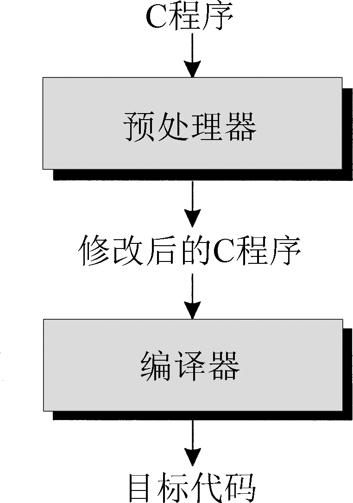

# Preprocessor


<!-- TOC -->

- [Preprocessor](#preprocessor)
    - [预处理器的工作原理](#预处理器的工作原理)
        - [基本原理](#基本原理)
        - [一例](#一例)
    - [预处理指令](#预处理指令)
        - [几条适用于所有指令的规则。](#几条适用于所有指令的规则)
    - [宏定义](#宏定义)
        - [简单的宏](#简单的宏)
            - [使用 `#define` 来为常量命名的优点](#使用-define-来为常量命名的优点)
            - [宏的其他应用](#宏的其他应用)
        - [带参数的宏](#带参数的宏)
            - [带参数的宏替代真正的函数有两个优点](#带参数的宏替代真正的函数有两个优点)
            - [带参数的宏的一些缺点](#带参数的宏的一些缺点)
                - [编译后的代码通常会变大](#编译后的代码通常会变大)
                - [宏参数没有类型检查](#宏参数没有类型检查)
                - [无法用一个指针来指向一个宏](#无法用一个指针来指向一个宏)
                - [宏可能会不止一次地计算它的参数](#宏可能会不止一次地计算它的参数)
        - [`#` 运算符](#-运算符)
        - [`##` 运算符](#-运算符)
            - [嵌套问题](#嵌套问题)
        - [宏的通用属性](#宏的通用属性)
            - [宏的替换列表可以包含对其他宏的调用](#宏的替换列表可以包含对其他宏的调用)
            - [预处理器只会替换完整的记号，而不会替换记号的片断](#预处理器只会替换完整的记号而不会替换记号的片断)
            - [宏定义的作用范围通常到出现这个宏的文件末尾](#宏定义的作用范围通常到出现这个宏的文件末尾)
            - [宏不可以被定义两遍，除非新的定义与旧的定义是一样的](#宏不可以被定义两遍除非新的定义与旧的定义是一样的)
            - [宏可以使用 `#undef` 指令 “取消定义”](#宏可以使用-undef-指令-取消定义)
        - [宏定义中的圆括号](#宏定义中的圆括号)
        - [创建较长的宏](#创建较长的宏)
        - [预定义宏](#预定义宏)
        - [C99 中新增的预定义宏](#c99-中新增的预定义宏)
            - [`__STDC_HOSTED__`](#__stdc_hosted__)
            - [`__STDC_VERSION__`](#__stdc_version__)
            - [有条件定义的宏](#有条件定义的宏)
        - [空的宏参数](#空的宏参数)
        - [参数个数可变的宏](#参数个数可变的宏)
        - [`__func__` 标识符](#__func__-标识符)
    - [条件编译](#条件编译)
        - [`#if` 指令和 `#endif` 指令](#if-指令和-endif-指令)
        - [`defined` 运算符](#defined-运算符)
        - [`#ifdef` 指令和 `#ifndef` 指令](#ifdef-指令和-ifndef-指令)
        - [`#elif` 指令和 `#else` 指令](#elif-指令和-else-指令)
        - [使用条件编译](#使用条件编译)
            - [编写在多台机器或多种操作系统之间可移植的程序](#编写在多台机器或多种操作系统之间可移植的程序)
            - [编写可以用不同的编译器编译的程序](#编写可以用不同的编译器编译的程序)
            - [为宏提供默认定义](#为宏提供默认定义)
            - [临时屏蔽包含注释的代码](#临时屏蔽包含注释的代码)
            - [保护头文件以避免重复包含](#保护头文件以避免重复包含)
    - [其他指令](#其他指令)
        - [`#error` 指令](#error-指令)
    - [练习](#练习)
    - [References](#references)

<!-- /TOC -->


## 预处理器的工作原理
### 基本原理
1. 预处理器的行为是由 **预处理指令**（由 `#` 字符开头的一些命令）控制的。我们已经在前面的章节中遇见过其中两种指令，即 `#define` 和 `#include`。
2. `#define` 指令定义了一个 **宏**——用来代表其他东西的一个名字，例如常量或常用的表达式。预处理器会通过将宏的名字和它的定义存储在一起来响应 `#define` 指令。当这个宏在后面的程序中使用到时，预处理器 “扩展” 宏，将宏替换为其定义值。
3. `#include` 指令告诉预处理器打开一个特定的文件，将它的内容作为正在编译的文件的一部分 “包含” 进来。例如，代码行
    ```cpp
    #include <stdio.h>
    ```
    指示预处理器打开一个名字为 `stdio.h` 的文件，并将它的内容加到当前的程序中。
4. 下图说明了预处理器在编译过程中的作用
    
5. 预处理器的输入是一个 C 语言程序，程序可能包含指令。预处理器会执行这些指令，并在处理过程中删除这些指令。
6. 预处理器的输出是另一个 C 程序：原程序编辑后的版本，不再包含指令。
7. 预处理器的输出被直接交给编译器，编译器检查程序是否有错误，并将程序翻译为目标代码（机器指令）。
8. 在 C 语言较早的时期，预处理器是一个单独的程序，它的输出提供给编译器。如今，预处理器通常和编译器集成在一起，而且其输出也不一定全是 C 代码（例如，包含 `<stdio.h>` 之类的标准头使得我们可以在程序中使用相应头中的函数，而不需要把头的内容复制到程序的源代码中）。
9. 然而，将预处理器和编译器认为是不同的程序仍然是有用的。实际上，大部分 C 编译器都提供了一种方法，使用户可以看到预处理器的输出。在指定某个特定的选项（GCC 编译器用的是 `-E`）时编译器会产生预处理器的输出。其他一些编译器会提供一个类似于集成的预处理器的独立程序。
10. 注意，预处理器仅知道少量 C 语言的规则。因此，它在执行指令时非常有可能产生非法的程序。经常是原始程序看起来没问题，使错误查找起来很难。对于较复杂的程序，检查预处理器的输出可能是找到这类错误的有效途径。

### 一例
1. 考虑一下原程序
    ```cpp
    /* Converts a Fahrenheit temperature to Celsius */

    #include <stdio.h>

    #define FREEZING_PT 32.0f
    #define SCALE_FACTOR (5.0f / 9.0f)

    int main(void)
    {
        float fahrenheit, celsius;

        printf("Enter Fahrenheit temperature: ");
        scanf("%f", &fahrenheit);

        celsius = (fahrenheit - FREEZING_PT) * SCALE_FACTOR;

        printf("Celsius equivalent is: %.1f\n", celsius);

        return 0;
    }
    ```
2. 预处理结束后，程序是下面的样子：
    ```cpp
    空行
    空行
    从stdio.h中引入的行
    空行
    空行
    空行
    空行
    int main(void)
    {
        float fahrenheit, celsius;

        printf("Enter Fahrenheit temperature:  ");
        scanf("%f", &fahrenheit);

        celsius = (fahrenheit - 32.0f) * (5.0f / 9.0f);

        printf("Celsius equivalent is: %.1f\n", celsius);

        return 0;
    }
    ```
3. 预处理器通过引入 `stdio.h` 的内容来响应 `#include` 指令。预处理器也删除了 `#define` 指令，并且替换了该文件中稍后出现在任何位置上的 `FREEZING_PT` 和 `SCALE_FACTOR`。
4. 请注意预处理器并没有删除包含指令的行，而是简单地将它们替换为空。
5. 正如这个例子所展示的那样，预处理器不仅仅是执行了指令，还做了一些其他的事情。特别值得注意的是，它将每一处注释都替换为一个空格字符。有一些预处理器还会进一步删除不必要的空白字符，包括每一行开始用于缩进的空格符和制表符。


## 预处理指令
1. 大多数预处理指令都属于下面 3 种类型之一
    * **宏定义**。`#define` 指令定义一个宏，`#undef` 指令删除一个宏定义。
    * **文件包含**。`#include` 指令导致一个指定文件的内容被包含到程序中。
    * **条件编译**。`#if`、`#ifdef`、`#ifndef`、`#elif`、`#else` 和 `#endif` 指令可以根据预处理器可以测试的条件来确定是将一段文本块包含到程序中还是将其排除在程序之外。
2. 剩下的 `#error`、`#line` 和 `#pragma` 指令是更特殊的指令，较少用到。

### 几条适用于所有指令的规则。
* **指令都以 `#` 开始**。`#` 不需要在一行的行首，只要它之前只有空白字符就行。在 `#` 后是指令名，接着是指令所需要的其他信息。
* **在指令的符号之间可以插入任意数量的空格或水平制表符**。例如，下面的指令是合法的：
    ```cpp
    #     define     N     100
    ```
* **指令总是在第一个换行符处结束，除非明确地指明要延续**。如果想在下一行延续指令，我们必须在当前行的末尾使用 `\` 字符。例如，下面的指令定义了一个宏来表示硬盘的容量，按字节计算：
    ```cpp
    #define DISK_CAPACITY (SIDES *              \
                        TRACKS_PER_SIDE *    \
                        SECTORS_PER_TRACK *  \
                        BYTES_PER_SECTOR)
    ```
* **指令可以出现在程序中的任何地方**。但我们通常将 `#define` 和 `#include` 指令放在文件的开始，其他指令则放在后面，甚至可以放在函数定义的中间。
* **注释可以与指令放在同一行**。实际上，在宏定义的后面加一个注释来解释宏的含义是一种比较好的习惯：
    ```cpp
    #define FREEZING_PT 32.0f     /* freezing point of water */
    ```


## 宏定义
### 简单的宏
1. **简单的宏**（C 标准中称为 **对象式宏**）的定义有如下格式：
    ```cpp
    #define 标识符 替换列表
    ```
    **替换列表** 是一系列的预处理记号。
2. 宏的替换列表可以包括标识符、关键字、数值常量、字符常量、字符串字面量、操作符和排列。
3. 当预处理器遇到一个宏定义时，会做一个 “标识符” 代表 “替换列表” 的记录。在文件后面的内容中，不管标识符在哪里出现，预处理器都会用替换列表代替它。
4. 不要在宏定义中放置任何额外的符号，否则它们会被作为替换列表的一部分。一种常见的错误是在宏定义中使用 `=` ：
    ```cpp
    #define N = 100   /*** WRONG ***/
    ...
    int a[N];         /* becomes int a[= 100]; */
    ```
    在宏定义的末尾使用分号结尾是另一个常见错误：
    ```cpp
    #define N 100;    /*** WRONG ***/
    ...
    int a[N];         /* becomes int a[100;]; */
    ```
5. 编译器可以检测到宏定义中绝大多数由多余符号所导致的错误。但是，编译器只会将每一个使用这个宏的地方标为错误，而不会直接找到错误的根源——宏定义本身，因为宏定义已经被预处理器删除了。
6. 简单的宏主要用来定义那些被 Kernighan 和 Ritchie 称为 “明示常量”（manifest constant）的东西。 我们可以使用宏给数值、字符值和字符串值命名
    ```cpp
    #define STE_LEN 80
    #define TRUE    1
    #define FALSE   0
    #define PI      3.14159
    #define CR      '\r'
    #define EOS     '\0'
    #define MEM_ERR "Error: not enough memory"
    ```

#### 使用 `#define` 来为常量命名的优点
* **程序会更易读**。一个认真选择的名字可以帮助读者理解常量的意义。否则，程序将包含大量的 “魔法数”，很容易迷惑读者。
* **程序会更易于修改**。我们仅需要改变一个宏定义，就可以改变整个程序中出现的所有该常量的值。
* **可以帮助避免前后不一致或键盘输入错误**。假如数值常量 `3.14159` 在程序中大量出现，它可能会被意外地写成 `3.1416` 或 `3.14195`。

#### 宏的其他应用
* **可以对 C 语法做小的修改**。我们可以通过定义宏的方式给 C 语言符号添加别名，从而改变 C 语言的语法。例如，对于习惯使用 Pascal 的 `begin` 和 `end`（而不是 C 语言的 `{` 和 `}`）的程序员，可以定义下面的宏：
    ```cpp
    #define BEGIN {
    #define END   }
    ```
    我们甚至可以发明自己的语言。例如，我们可以创建一个 `LOOP` “语句”，来实现一个无限循环：
    ```cpp
    #define LOOP for (;;)
    ```
    当然，改变 C 语言的语法通常不是个好主意，因为它会使程序很难被其他程序员理解。
* **对类型重命名**。我们可以通过重命名 `int` 创建一个布尔类型：
    ```cpp
    #define BOOL int
    ```
    虽然有些程序员会使用宏定义的方式来实现此目的，但类型定义仍然是定义新类型的最佳方法。
* **控制条件编译**。宏在控制条件编译中起重要的作用。例如，在程序中出现的下面这行宏定义可能表明需要将程序在 “调试模式” 下进行编译，并使用额外的语句输出调试信息：
    ```cpp
    #define DEBUG
    ```
    这里顺便提一下，如上面的例子所示，宏定义中的替换列表为空是合法的。

### 带参数的宏
1. **带参数的宏**（也称为 **函数式宏**）的定义有如下格式：
    ```cpp
    #define 标识符(x1, x2,..., xn)替换列表
    ```
2. 其中 $x_1,x_2,\cdots,x_n$ 是标识符（宏的 **参数**）。这些参数可以在替换列表中根据需要出现任意次。
3. 在宏的名字和左括号之间必须 **没有空格**。如果有空格，预处理器会认为是在定义一个简单的宏，其中 $(x_1,x_2,\cdots,x_n)$ 是替换列表的一部分。
4. 当预处理器遇到带参数的宏时，会将宏定义存储起来以便后面使用。在后面的程序中，如果任何地方出现了标识符 $(y_1,y_2,\cdots,y_n)$ 格式的宏调用（其中 $y_1,y_2,\cdots,y_n$ 是一系列记号），预处理器会使用替换列表替代——使用 $y_1$ 替换 $x_1$，$y_2$ 替换 $x_2$，依此类推。
5. 例如，假定我们定义了如下的宏：
    ```cpp
    #define MAX(x,y)    ((x)>(y)?(x):(y))
    #define IS_EVEN(n)  ((n)%2==0)
    ```
6. 现在如果后面的程序中有如下语句：
    ```cpp
    i = MAX(j+k, m-n);
    if (IS_EVEN(i)) i++;
    ```
    预处理器会将这些行替换为
    ```cpp
    i = ((j+k)>(m-n)?(j+k):(m-n));
    if (((i)%2==0)) i++;
    ```
7. 带参数的宏可以包含空的参数列表，如下例所示：
    ```cpp
    #define getchar()  getc(stdin)
    ```
    空的参数列表不是必需的，但这样可以使 `getchar` 更像一个函数。
8. 带参数的宏不仅适用于模拟函数调用，还经常用作需要重复书写的代码段模式。如果我们已经写烦了语句
    ```cpp
    printf("%d\n", i);
    ```
    因为每次要显示一个整数i都要使用它，我们可以定义下面的宏，使显示整数变得简单些：
    ```cpp
    #define PRINT_INT(n)    printf("%d\n", n)
    ```
    一旦定义了 `PRINT_INT`，预处理器会将这行
    ```cpp
    PRINT_INT(i/j);
    ```
    转换为
    ```cpp
    printf("%d\n", i/j);
    ```
    
#### 带参数的宏替代真正的函数有两个优点
* **程序可能会稍微快些**。程序执行时调用函数通常会有些额外开销——存储上下文信息、复制参数的值等，而调用宏则没有这些运行开销。C99 的内联函数为我们提供了一种不使用宏而避免这一开销的办法。
* **宏更 “通用”**。与函数的参数不同，宏的参数没有类型。因此，只要预处理后的程序依然是合法的，宏可以接受任何类型的参数。例如，我们可以使用 `MAX` 宏从两个数中选出较大的一个，数的类型可以是 `int`、`long`、`float`、`double` 等。

#### 带参数的宏的一些缺点
##### 编译后的代码通常会变大
1. 每一处宏调用都会导致插入宏的替换列表，由此导致程序的源代码增加（因此编译后的代码变大）。宏使用得越频繁，这种效果就越明显。
2. 当宏调用嵌套时，这个问题会相互叠加从而使程序更加复杂。思考一下，如果我们用 `MAX` 宏来找出 3 个数中最大的数会怎样：
    ```cpp
    n = MAX(i, MAX(j, k));
    ```
3. 下面是预处理后的语句：
    ```cpp
    n = ((i)>(((j)>(k)?(j):(k)))?(i):(((j)>(k)?(j):(k))));
    ```

##### 宏参数没有类型检查
1. 当一个函数被调用时，编译器会检查每一个参数来确认它们是否是正确的类型。如果不是，要么将参数转换成正确的类型，要么由编译器产生一条出错消息。
2. 预处理器不会检查宏参数的类型，也不会进行类型转换。

##### 无法用一个指针来指向一个宏
1. C 语言允许指针指向函数，这在特定的编程条件下非常有用。
2. 宏会在预处理过程中被删除，所以不存在类似的 “指向宏的指针”。

##### 宏可能会不止一次地计算它的参数
1. 函数对它的参数只会计算一次，而宏可能会计算两次甚至更多次。如果参数有副作用，多次计算参数的值可能会产生不可预知的结果。
2. 考虑下面的例子，其中 `MAX` 的一个参数有副作用：
    ```cpp
    n = MAX(i++, j);
    ```
3. 下面是这条语句在预处理之后的结果：
    ```cpp
    n = ((i++)>(j)?(i++):(j));
    ```
4. 如果 `i` 大于 `j`，那么 `i` 可能会被（错误地）增加两次，同时 `n` 可能被赋予错误的值。
5. 由于多次计算宏的参数而导致的错误可能非常难于发现，因为宏调用和函数调用看起来是一样的。更糟糕的是，这类宏可能在大多数情况下可以正常工作，仅在特定参数有副作用时失效。为了自我保护，最好避免使用带有副作用的参数。

### `#` 运算符
1. 宏定义可以包含两个专用的运算符：`#` 和 `##`。编译器不会识别这两种运算符，它们会在预处理时被执行。
2. `#` 运算符将宏的一个参数转换为字符串字面量。它仅允许出现在带参数的宏的替换列表中。
3. `#` 运算符有许多用途，这里只来讨论其中的一种。假设我们决定在调试过程中使用 `PRINT_INT` 宏作为一个便捷的方法来输出整型变量或表达式的值。`#` 运算符可以使 `PRINT_INT` 为每个输出的值添加标签。
4. 下面是改进后的 `PRINT_INT`：
    ```cpp
    #define PRINT_INT(n) printf(#n " = %d\n", n)
    ```
5. `n` 之前的 `#` 运算符通知预处理器根据 `PRINT_INT` 的参数创建一个字符串字面量。因此，调用
    ```cpp
    PRINT_INT(i/j);
    ```
    会变为
    ```cpp
    printf("i/j" " = %d\n", i/j);
    ```
6. C 语言中相邻的字符串字面量会被合并。因此上边的语句等价于：
    ```cpp
    printf("i/j = %d\n", i/j);
    ```
7. 当程序执行时，`printf` 函数会同时显示表达式 `i/j` 和它的值。例如，如果 `i` 是 11，`j` 是 2 的话，输出为
    ```sh
    i/j = 5
    ```

### `##` 运算符
1. `##` 运算符被称为 “记号粘合”，可以将两个记号（如标识符）“粘合” 在一起，成为一个记号。
2. 如果其中一个操作数是宏参数，“粘合”会在形式参数被相应的实际参数替换后发生。
3. 考虑下面的宏：
    ```cpp
    #define MK_ID(n) i##n
    ```
4. 当 `MK_ID` 被调用时（比如 `MK_ID(1)`），预处理器首先使用实际参数（这个例子中是 `1`）替换形式参数 `n`。接着，预处理器将 `i` 和 `1` 合并成为一个记号（`i1`）。下面的声明使用MK_ID创建了3个标识符：
    ```cpp
    int MK_ID(1), MK_ID(2), MK_ID(3);
    ```
    预处理后这一声明变为：
    ```cpp
    int i1, i2, i3;
    ```
5. 为了找到一个有实际意义的 `##` 的应用，我们来重新思考前面提到过的 `MAX` 宏。如我们所见，当 `MAX` 的参数有副作用时会无法正常工作。
6. 一种解决方法是用 `MAX` 宏来写一个 `max` 函数。遗憾的是，仅一个 `max` 函数是不够的，我们可能需要一个实际参数是 `int` 值的 `max` 函数、一个实际参数为 `float` 值的 `max` 函数，等等。
7. 除了实际参数的类型和返回值的类型之外，这些函数都一样。因此，这样定义每一个函数似乎是个很蠢的做法。
8. 解决的办法是定义一个宏，并使它展开后成为 `max` 函数的定义。宏只有一个参数 `type`，表示实际参数和返回值的类型。
9. 这里还有个问题，如果我们用宏来创建多个 `max` 函数，程序将无法编译，C 语言不允许在同一文件中出现两个同名的函数。
10. 为了解决这个问题，我们用 `##` 运算符为每个版本的 `max` 函数构造不同的名字。下面是宏的形式：
    ```cpp
    #define GENERIC_MAX(type)         \
    type type##_max(type x, type y)   \
    {                                 \
        return x > y ? x : y;           \
    }
    ```
11. 现在，假如我们需要一个针对 `float` 值的 `max` 函数。下面是使用 `GENERIC_MAX` 宏来定义这一函数的方法：
    ```cpp
    GENERIC_MAX(float)
    ```
12. 预处理器会将这行展开为下面的代码：
    ```cpp
    float float_max(float x, float y) { return x > y ? x : y; }
    ```
#### 嵌套问题
1. 下面这个嵌套的例子
    ```cpp
    #define CONCAT(x,y) x##y

    int main(int argc, char *argv[])
    {
        char *ab = "hello";
        char *bc = "world";
        char *abc = "hello world";
        
        puts(CONCAT(a, b)); // "hello"
        puts(CONCAT(b, c)); // "world"
        puts( CONCAT(a, CONCAT(b, c)) ); // 期望输出 "hello world" 但出错

        return 0;
    }
    ```
2. 因为 `CONCAT(a, CONCAT(b, c))` 会被扩展为 `aCONCAT(b, c)`。而没有 `aCONCAT` 这个宏，所以就会出错。可以试试加上这个宏
    ```cpp
    #define CONCAT(x,y) x##y
    #define aCONCAT(x,y) x##y // 


    int main(int argc, char *argv[])
    {
        char *ab = "hello";
        char *bc = "world";
        char *abc = "hello world";
        puts(CONCAT(a, b)); // "hello"
        puts(CONCAT(b, c)); // "world"
        puts( CONCAT(a, CONCAT(b, c)) ); // "world"

        return 0;
    }
    ```
    虽然不会出错了，但是也不是预期的效果。
3. 有一种办法可以解决这个问题，但不太好看。技巧是再定义一个宏来调用第一个宏：
    ```cpp
    #define CONCAT2(x,y) CONCAT(x,y)
    ``` 
4. 用 `CONCAT2(a, CONCAT2(b,c))` 就会得到我们期望的结果。在扩展外面的 `CONCAT2` 调用时，预处理器将会同时扩展 `CONCAT2(b,c)`
    ```cpp
    #define CONCAT(x,y) x##y
    #define CONCAT2(x,y) CONCAT(x,y)

    int main(int argc, char *argv[])
    {
        char *abc = "hello world";
        puts( CONCAT2(a, CONCAT2(b, c)) ); // "hello world"

        return 0;
    }
    ```
5. 感觉 `CONCAT2(a, CONCAT(b, c))` 这样的调用更好理解一些？

### 宏的通用属性
现在我们已经讨论过了简单的宏和带参数的宏，我们来看一下它们都需要遵守的规则。

#### 宏的替换列表可以包含对其他宏的调用
1. 例如，我们可以用宏 `PI` 来定义宏 `TWO_PI`：
    ```cpp
    #define PI      3.14159
    #define TWO_PI  (2*PI)
    ```
2. 当预处理器在后面的程序中遇到 `TWO_PI` 时，会将它替换成 `(2*PI)`。接着，预处理器会重新检查替换列表，看它是否包含其他宏的调用（在这个例子中，调用了宏 `PI`）。预处理器会不断重新检查替换列表，直到将所有的宏名字都替换掉为止。

#### 预处理器只会替换完整的记号，而不会替换记号的片断
因此，预处理器会忽略嵌在标识符、字符常量、字符串字面量之中的宏名。例如，假设程序含有如下代码行：
```cpp
#define SIZE 256

int BUFFER_SIZE;

if (BUFFER_SIZE > SIZE)
puts("Error ： SIZE exceeded");
```
预处理后这些代码行会变为
```cpp
int BUFFER_SIZE;

if (BUFFER_SIZE > 256)
  puts("Error: SIZE exceeded");
```

#### 宏定义的作用范围通常到出现这个宏的文件末尾
由于宏是由预处理器处理的，它们不遵从通常的作用域规则。定义在函数中的宏并不是仅在函数内起作用，而是作用到文件末尾。

#### 宏不可以被定义两遍，除非新的定义与旧的定义是一样的
小的间隔上的差异是允许的，但是宏的替换列表（和参数，如果有的话）中的记号都必须一致。

#### 宏可以使用 `#undef` 指令 “取消定义”
1. #undef指令有如下形式：
    ```cpp
    #undef  标识符
    ```
2. 其中标识符是一个宏名。例如，指令
    ```cpp
    #undef N
    ```
    会删除宏 `N` 当前的定义。
3. 如果 `N` 没有被定义成一个宏，`#undef` 指令没有任何作用。
4. `#undef` 指令的一个用途是取消宏的现有定义，以便于重新给出新的定义。

### 宏定义中的圆括号
1. 在前面定义的宏的替换列表中有大量的圆括号，它们是必须的，否则可能得到错误的结果。
2. 对于在一个宏定义中哪里要加圆括号有两条规则要遵守
    * 如果宏的替换列表中有运算符，那么始终要将替换列表放在括号中：
    ```
    #define TWO_PI (2*3.14159)
    ```
    * 如果宏有参数，每个参数每次在替换列表中出现时都要放在圆括号中：
    ```cpp
    #define SCALE(x)  ((x)*10)
    ```
3. 没有括号的话，我们将无法确保编译器会将替换列表和参数作为完整的表达式。编译器可能会不按我们期望的方式应用运算符的优先级和结合性规则。
4. 为了展示为替换列表添加圆括号的重要性，考虑下面的宏定义，其中的替换列表没有添加圆括号：
    ```cpp
    #define TWO_PI 2*3.14159
    /* 需要给替换列表加圆括号 */
    ```
5. 在预处理时，语句
    ```cpp
    conversion_factor = 360/TWO_PI;
    ```
    变为
    ```cpp
    conversion_factor = 360/2*3.14159;
    ```
    除法会在乘法之前执行，产生的结果并不是期望的结果。  
6. 当宏有参数时，仅给替换列表添加圆括号是不够的。参数的每一次出现都要添加圆括号。例如，假设 `SCALE` 定义如下：
    ```cpp
    #define SCALE(x) (x*10)   /* 需要给x添加括号 */
    ```
    在预处理过程中，语句
    ```cpp
    j = SCALE(i+1);
    ```
    变为
    ```cpp
    j = (i+1*10);
    ```

### 创建较长的宏
1. 在创建较长的宏时，逗号运算符会十分有用。特别是可以使用逗号运算符来使替换列表包含一系列表达式。
2. 例如，下面的宏会读入一个字符串，再把字符串显示出来：
    ```cpp
    #define ECHO(s) (gets(s), puts(s))
    ```
    `gets` 函数和 `puts` 函数的调用都是表达式，因此使用逗号运算符连接它们是合法的。
3. 我们甚至可以把 `ECHO` 宏当作一个函数来使用：
    ```cpp
    ECHO(str);   /* 替换为 (gets(str), puts(str)); */
    ```
4. 如果不想在 `ECHO` 的定义中使用逗号运算符，我们还可以将 `gets` 函数和 `puts` 函数的调用放在花括号中形成复合语句：
    ```cpp
    #define ECHO(s)  { gets(s);  puts(s);  }
    ```
5. 不过在这种情况下，如果是下面的使用方法，则会出现问题
    ```cpp
    if (echo_flag)
        ECHO(str); // 这里加了分号，看起来很合理
    else
        gets(str);
    ```
6. 将 `ECHO` 宏替换会得到下面的结果：
    ```cpp
    if (echo_flag)
        { gets(str);  puts(str);  }; // 现在这个分号就不合理了
    else
        gets(str);
    ```
7. 逗号运算符可以解决 `ECHO` 宏的问题，但并不能解决所有宏的问题。假如一个宏需要包含一系列的语句，而不仅仅是一系列的表达式，这时逗号运算符就起不了作用了，因为它只能连接表达式，不能连接语句。
8. 解决的方法是将语句放在 `do` 循环中，并将条件设置为假（因此语句只会执行一次）：
    ```cpp
    #define ECHO(s)      \
            do {         \
            gets(s);   \
            puts(s);   \
            } while (0)
    ```
9. 注意，这个 `do` 语句是不完整的——后面还缺一个分号，当使用 `ECHO` 宏时，一定要加分号以使 `do` 语句完整：
    ```cpp
    ECHO(str); /* becomes do { gets(str); puts(str); } while (0);  */
    ```

### 预定义宏
1. C 语言有一些预定义宏，每个宏表示一个整数常量或字符串字面量。如下表所示，这些宏提供了当前编译或编译器本身的信息
    名字 | 描述
    --|--
    `__LINE__` | 被编译的文件中的行号
    `__FILE__` | 被编译的文件名
    `__DATE__` | 编译的日期（格式 `"mm dd yyyy"`）
    `__TIME__` | 编译的时间（格式 `"hh:mm:ss"`）
    `__STDC__` | 如果编译器符合 C 标准（C89 或 C99），那么值为 1
2. `__DATE__` 宏和 `__TIME__` 宏指明程序编译的时间。例如，假设程序以下面的语句开始：
    ```cpp
    printf("Wacky Windows (c) 2010 Wacky Software, Inc.\n");
    printf("Compiled on %s at %s\n", __DATE__, __TIME__);
    ```
    每次程序开始执行时，程序都会显示类似下面的两行：
    ```cpp
    Wacky Windows (c) 2010 Wacky Software, Inc.
    Compiled on Dec 23 2010 at 22:18:48
    ```
    这样的信息可以帮助区分同一个程序的不同版本。
3. 我们可以使用 `__LINE__` 宏和 `__FILE__` 宏来找到错误。考虑被零除的定位问题。当 C 程序因为被零除而导致终止时，通常没有信息指明哪条除法运算导致错误。下面的宏可以帮助我们查明错误的根源：
    ```cpp
    #define CHECK_ZERO(divisor)  \
    if (divisor == 0) \
        printf("*** Attempt to divide by zero on line %d  "  \
            "of file %s  ***\n", __LINE__, __FILE__)
    ```
    `CHECK_ZERO` 宏应该在除法运算前被调用：
    ```cpp
    CHECK_ZERO(j);
    k = i / j;
    ```
    如果 `j` 是 0，会显示出如下形式的信息：
    ```sh
    *** Attempt to divide by zero on line 9 of file foo.c ***
    ```
    类似这样的错误检测的宏非常有用。实际上，C 语言库提供了一个通用的、用于错误检测的宏—— `assert` 宏。
4. 如果编译器符合 C 标准（C89 或 C99），`__STDC__` 宏存在且值为 1。通过让预处理器测试这个宏，程序可以在早于 C89 标准的编译器下编译通过。

### C99 中新增的预定义宏
名字 | 描述
--|--
`__STDC_HOSTED__` | 如果是托管式实现，值为 1；如果是独立式实现，值为 0
`__STDC_VERSION__` | 支持的C标准版本
`__STDC_IEC_559__` | 如果支持 IEC 60559 浮点算术运算，则值为 1
`__STDC_IEC_559_COMPLEX__` | 如果支持 IEC 60559 复数算术运算，则值为 1
`__STDC_ISO_10646__` | 如果 `wchar_t` 的值与指定年月的 ISO 10646 标准相匹配，则值为 yyyymm`L`

#### `__STDC_HOSTED__`
1. C 的实现（implementation）包括编译器和执行 C 程序所需要的其他软件。
2. C99 将实现分为两种：托管式（hosted）和独立式（freestanding）。
3. **托管式实现**（hosted implementation）能够接受任何符合 C99 标准的程序，而 **独立式实现**（freestanding implementation）除了几个最基本的以外，不一定要能够编译使用复数类型或标准头的程序。特别是，独立式实现不需要支持 `<stdio.h>` 头。
4. 如果编译器是托管式实现，`__STDC_HOSTED__` 宏代表常数 1，否则值为 0。

#### `__STDC_VERSION__`
1. `__STDC_VERSION__` 宏为我们提供了一种查看编译器所识别出的 C 标准版本的方法。
2. 这个宏第一次出现在 C89 标准的 Amendment 1 中，该文档指明宏的值为长整数常量 `199409L`（代表修订的年月）。如果编译器符合 C99 标准，其值为 `199901L`。
3. 对于标准的每一个后续版本（以及每一次后续修订），宏的值都有所变化。

#### 有条件定义的宏
* 如果编译器根据 IEC 60559 标准（IEEE 754 标准的别名）执行浮点算术运算，则定义 `__STDC_IEC_559__` 宏，且其值为1。
* 如果编译器根据 IEC 60559 标准执行复数算术运算，则定义 `__STDC_IEC_559_COMPLEX__` 宏，且其值为 1。
* `__STDC_ISO_10646__` 定义为 yyyymm`L` 格式（如 `199712L`）的整数常量，前提是 `wchar_t` 类型的值由 ISO/IEC 10646 标准中的码值表示（表示格式中指明了修订的年月）。

### 空的宏参数 
1. C99 允许宏调用中的任意或所有参数为空。当然这样的调用需要有和一般调用一样多的逗号（这样容易看出哪些参数被省略了）。
2. 在大多数情况下，实际参数为空的效果是显而易见的。如果替换列表中出现相应的形式参数名，那么只要在替换列表中不出现实际参数即可，不需要作替换。
3. 例如：
    ```cpp
    #define ADD(x,y) (x+y)
    ``` 
    经过预处理之后，语句
    ```cpp
    i = ADD(j,k);
    ```
    变成
    ```cpp
    i = (j+k);
    ```
    而赋值语句
    ```cp
    i = ADD(,k);
    ```
    则变为
    ```cpp
    i = (+k);
    ```
4. 如果空的实际参数被 `#` 运算符 “字符串化”，则结果为 `""`（空字符串）：
    ```cpp
    #define MK_STR(x) #x
    ...
    char empty_string[] = MK_STR();
    ```
    预处理之后，上面的声明变成：
    ```cpp
    char empty_string[] = "";
    ```
5. 如果 `##` 运算符之后的一个实际参数为空，它将会被不可见的 “位置标记” 记号代替。把原始的记号与位置标记记号相连接，得到的还是原始的记号（位置标记记号消失了）。如果连接两个位置标记记号，得到的是一个位置标记记号。宏扩展完成后，位置标记记号从程序中消失。考虑下面的例子：
    ```cpp
    #define JOIN(x,y,z) x##y##z
    ...
    int JOIN(a,b,c), JOIN(a,b,), JOIN(a,,c), JOIN(,,c);
    ```
    预处理之后，声明变成：
    ```cpp
    int abc, ab, ac, c;
    ```
    漏掉的参数由位置标记记号代替，这些记号在与非空参数相连接之后消失。`JOIN` 宏的 3 个参数可以同时为空，这样得到的结果为空。

### 参数个数可变的宏
1. 在 C89 中，如果宏有参数，那么参数的个数是固定的。在C99中，这个条件被适当放宽了，允许宏具有可变长度的参数列表。
2. 宏具有可变参数个数的主要原因是：它可以将参数传递给具有可变参数个数的函数，如 `printf` 和 `scanf`。例如
    ```cpp
    #define TEST(condition, ...) ((condition)? \
        printf("Passed test: %s\n", #condition): \
        printf(__VA_ARGS__))
    ```
3. `...`记号出现在宏参数列表的最后，前面是普通参数。
4. `__VA_ARGS__` 是一个专用的标识符，只能出现在具有可变参数个数的宏的替换列表中，代表所有与省略号相对应的参数。至少有一个与省略号相对应的参数，但该参数可以为空。为空的意思应该是说虽然传了更多的参数，但可以不适用 `__VA_ARGS__` 来引用。比如
    ```cpp
    #define TEST(condition, ...) ((condition)? \
        printf("Passed test: %s\n", #condition): \
        printf("condition is false"))
    ```
5. 宏 `TEST` 至少要有两个参数，第一个参数匹配 `condition`，剩下的参数匹配省略号。
6. `TEST` 的使用方法：
    ```cpp
    TEST(voltage <= max_voltage,
        "Voltage %d exceeds %d\n", voltage, max_voltage);
    ```
    预处理器将会产生如下的输出（重排格式以增强可读性）：
    ```cpp
    ((voltage <= max_voltage)?
        printf("Passed test: %s\n", "voltage <= max_voltage"):
        printf("Voltage %d exceeds %d\n", voltage, max_voltage));
    ```
7. 如果 `voltage` 不大于 `max_voltage`，程序执行时将显示如下消息：
    ```cpp
    Passed test: voltage <= max_voltage
    ```
    否则，将分别显示 `voltage` 和 `max_voltage`的值：
    ```cpp
    voltage 125 exceeds 120
    ```

### `__func__` 标识符 
1. C99 的另一个新特性是 `__func__` 标识符。`__func__` 与预处理器无关，所以实际上与本章内容不相关。但是，与许多预处理特性一样，它也有助于调试，所以在这里一并讨论。
2. 每一个函数都可以访问 `__func__` 标识符，它的行为很像一个存储当前正在执行的函数的名字的字符串变量。其作用相当于在函数体的一开始包含如下声明：
    ```cpp
    static const char __func__[] = "function-name";
    ```
    其中 `function-name` 是函数名。
3. 这个标识符的存在使得我们可以写出如下的调试宏：
    ```cpp
    #define FUNCTION_CALLED() printf("%s called\n", __func__);
    #define FUNCTION_RETURNS() printf("%s returns\n", __func__);
    ```
4. 对这些宏的调用可以放在函数体中，以跟踪函数的调用：
    ```cpp
    void f(void)
    {
        FUNCTION_CALLED();    /* displays "f called" */
        ...
        FUNCTION_RETURNS();   /* displays "f returns" */
    }
    ```
5. `__func__` 的另一个用法：作为参数传递给函数，让函数知道调用它的函数的名字。


## 条件编译
C 语言的预处理器可以识别大量用于支持条件编译的指令。**条件编译** 是指根据预处理器所执行的测试结果来包含或排除程序的片断。

### `#if` 指令和 `#endif` 指令
1. 假如我们正在调试一个程序。我们想要程序显示出特定变量的值，因此将 `printf` 函数调用添加到程序中重要的部分。
2. 一旦找到错误，经常需要保留这些 `printf` 函数调用，以备以后使用。条件编译允许我们保留这些调用，但是让编译器忽略它们。
3. 下面是我们需要采取的方式。首先定义一个宏，并给它一个非零的值：
    ```cpp
    #define DEBUG 1
    ```
    宏的名字并不重要。
4. 接下来，我们要在每组 `printf` 函数调用的前后加上 `#if` 和 `#endif`：
    ```cpp
    #if DEBUG
    printf("Value of i: %d\n", i);
    printf("Value of j: %d\n", j);
    #endif
    ```
5. 在预处理过程中，`#if` 指令会测试 `DEBUG` 的值。由于 `DEBUG` 的值不是 0，因此预处理器会将这两个 `printf` 函数调用保留在程序中（但` #if` 和 `#endif` 行会消失）。
6. 如果我们将 `DEBUG` 的值改为 0 并重新编译程序，预处理器则会将这 4 行代码都删除。编译器不会看到这些 `printf` 函数调用，所以这些调用就不会在目标代码中占用空间，也不会在程序运行时消耗时间。
7. 我们可以将 `#if-#endif` 保留在最终的程序中，这样如果程序在运行时出现问题，可以（通过将 `DEBUG` 改为 1 并重新编译来）继续产生诊断信息。
8. 测试值为假时，预处理器并不是完全忽略 `#if-#endif` 中间的代码。在执行预处理指令前，先处理注释，并把源代码分为多个预处理记号。因此，`#if` 和 `#endif` 之间的未终止的注释会引起错误消息。此外，不成对的单引号或双引号字符也可能导致未定义的行为。
9. 值得注意的是，`#if` 指令会把没有定义过的标识符当作是值为 0 的宏对待。因此，如果省略 `DEBUG` 的定义，测试
    ```cpp
    #if DEBUG
    ````
    会失败（但不会产生出错消息），而测试  
    ```cpp
    #if !DEBUG
    ```
    会成功。

### `defined` 运算符
1. 当 `defined` 应用于标识符时，如果标识符是一个定义过的宏则返回 1，否则返回 0。
2. `defined` 运算符通常与 `#if` 指令结合使用，可以这样写
    ```cpp
    #if defined(DEBUG)
    ...
    #endif
    ```
    仅当 `DEBUG` 被定义成宏时，`#if` 和 `#endif` 之间的代码会被保留在程序中。
3. `DEBUG` 两侧的括号不是必需的，因此可以简单写成
    ```cpp
    #if defined DEBUG
    ```
4. 由于 `defined` 运算符仅检测 `DEBUG` 是否有定义，所以不需要给 `DEBUG` 赋值：
    ```cpp
    #define DEBUG
    ```

### `#ifdef` 指令和 `#ifndef` 指令
1. `#ifdef` 指令测试一个标识符是否已经定义为宏：
    ```cpp
    #ifdef  标识符
    ```
2. 严格地说， 并不需要 `#ifdef`，因为可以结合 `#if` 指令和 `defined` 运算符来得到相同的效果。换言之，指令
    ```cpp
    #ifdef 标识符
    ```
    等价于
    ```cpp
    #if defined(标识符)
    ```
3. `#ifndef` 指令与 `#ifdef` 指令类似，但测试的是标识符是否没有被定义为宏：
    ```cpp
    #ifndef  标识符
    ```
4. 指令
    ```cpp
    #ifndef 标识符
    ```
    等价于指令
    ```cpp
    #if !defined(标识符)
    ```
5. 相比于 `#ifdef`，`defined` 增加了灵活性。我们现在可以使用 `#if` 和 `defined` 运算符来测试任意数量的宏，而不再是只能使用 `#ifdef` 和 `#ifndef` 对一个宏进行测试。例如，下面的指令检查是否 `FOO` 和 `BAR` 被定义了而 `BAZ` 没有被定义：
    ```cpp
    #if defined(FOO) && defined(BAR) && !defined(BAZ)
    ```

### `#elif` 指令和 `#else` 指令
1. `#if` 指令、`#ifdef` 指令和 `#ifndef` 指令可以像普通的 `if` 语句那样嵌套使用。当发生嵌套时，最好随着嵌套层次的增加而增加缩进。
2. 一些程序员对每一个 `#endif` 都加注释，来指明对应的 `#if`指令测试哪个条件：
    ```cpp
    #if DEBUG
    ...
    #endif /* DEBUG */
    ```
    这种方法有助于更方便地找到 `#if` 指令的起始位置。
3. 为了提供更多的便利，预处理器还支持 `#elif` 和 `#else` 指令。`#elif` 指令和 `#else` 指令可以与 `#if` 指令、`#ifdef` 指令和 `#ifndef` 指令结合使用，来测试一系列条件。

### 使用条件编译
条件编译对于调试是非常方便的，但它的应用并不仅限于此。下面是其他一些常见的应用：

#### 编写在多台机器或多种操作系统之间可移植的程序
1. 下面的例子中会根据 `WIN32`、`MAC_OS` 或 `LINUX` 是否被定义为宏，而将三组代码之一包含到程序中：
    ```cpp
    #if defined(WIN32)
    ...
    #elif defined(MAC_OS)
    ...
    #elif defined(LINUX)
    ...
    #endif
    ```
2. 在程序的开头会定义这些宏之一（而且只有一个），由此选择了一个特定的操作系统。例如，定义 `LINUX` 宏可以指明程序将运行在 Linux 操作系统下。

#### 编写可以用不同的编译器编译的程序
1. 不同的编译器可以用于识别不同的 C 语言版本，这些版本之间会有一些差异。一些会接受标准 C，另外一些则不会。一些版本会提供针对特定机器的语言扩展；有些版本则没有，或者提供不同的扩展集。
2. 条件编译可以使程序适应于不同的编译器。考虑一下为以前的非标准编译器编写程序的问题。`__STDC__ `宏允许预处理器检测编译器是否支持标准（C89 或 C99）；如果不支持，我们可能必须修改程序的某些方面，尤其是有可能必须用老式的函数声明替代函数原型。
3. 对于每一处函数声明，我们可以使用下面的代码：
    ```cpp
    #if __STDC__
    函数原型
    #else
    老式的函数声明
    #endif
    ```

#### 为宏提供默认定义
1. 条件编译使我们可以检测一个宏当前是否已经被定义了，如果没有，则提供一个默认的定义。
2. 例如，如果宏 `BUFFER_SIZE` 此前没有被定义的话，下面的代码会给出定义：
    ```cpp
    #ifndef BUFFER_SIZE
    #define BUFFER_SIZE 256
    #endif
    ```

#### 临时屏蔽包含注释的代码
1. 我们不能用 `/*...*/` 直接 “注释掉” 已经包含 `/*...*/` 注释的代码。然而，我们可以使用 `#if` 指令来实现：
    ```cpp
    #if 0
    包含注释的代码行
    #endif
    ```
2. 将代码以这种方式屏蔽掉经常称为 “条件屏蔽”。

#### 保护头文件以避免重复包含


## 其他指令
### `#error` 指令
1. `#error` 指令有如下格式：
    ```cpp
    #error 消息
    ```
2. 其中，**消息** 是任意的记号序列。如果预处理器遇到` #error` 指令，它会显示一条包含消息的出错消息。
3. 对于不同的编译器，出错消息的具体形式也可能会不一样。格式可能类似：
    ```sh
    Error directive: 消息
    ```
    或者
    ```sh
    #error 消息
    ```
4. 遇到 `#error` 指令预示着程序中出现了严重的错误，有些编译器会立即终止编译而不再检查其他错误。
4. `#error` 指令通常与条件编译指令一起用于检测正常编译过程中不应出现的情况。例如，假定我们需要确保一个程序无法在一台 `int` 类型不能存储 100 000 的机器上编译。最大允许的 `int` 值用` INT_MAX` 宏表示，所以我们需要做的就是当 `INT_MAX` 宏小于 100 000 时调用 `#error` 指令：
    ```cpp
    #if INT_MAX < 100000
    #error int type is too small
    #endif
    ```
    如果试图在一台以 16 位存储整数的机器上编译这个程序，将产生一条出错消息：
    ```sh
    Error directive: int type is too small
    ```
5. `#error` 指令通常会出现在 `#if-#elif-#else` 序列中的 `#else` 部分：
    ```cpp
    #if defined(WIN32)
    ...
    #elif defined(MAC_OS)
    ...
    #elif defined(LINUX)
    ...
    #else
    #error No operating system specified
    #endif
    ```


## 练习
* 练习题 6
    ```cpp
    #include <stdio.h>
    #include <math.h>

    #define DISP(f, x) ( printf(#f "(%g) = %g\n", x, f(x)) )
    #define DISP2(f,x,y) ( printf(#f "(%g, %g) = %g\n", x, y, f(x, y)) )

    float foo (float x, float y) {
        return x + y;
    }
    int main(int argc, char *argv[])
    {
        DISP(sqrt, 3.0); // sqrt(3) = 1.73205
        DISP2(foo, 3.14, 0.618); // foo(3.14, 0.618) = 3.758

        return 0;
    }
    ```

* 练习题 7(c)
    ```cpp
    typedef unsigned long unsigned_long;
    GENERIC_MAX(unsigned_long);
    ```

* 练习题 8
    1. 刚开始直接这样定义了
        ```cpp
        #define LINE_FILE "Line " __LINE__ " of file " __FILE__
        ```
    2. 但是，虽然 `__FILE__` 是字符串常量，可以拼接；但 `__LINE__` 确实整型常量，所以不能直接和字符串拼接。
    3. 然后想到了 `#` 操作符，结果这样定义了
        ```cpp
        #define INT_TO_STR(n) #n
        #define LINE_FILE "Line " INT_TO_STR(__LINE__) " of file " __FILE__
        ```
    4. 但是 `#` 操作符不会对 `n` 的实参求值，而是直接用该实参的名字。所以 `LINE_FILE` 会转换为 `Line __LINE__ of file pun.c`。
    5. 参考 [这篇](https://blog.csdn.net/pdcxs007/article/details/8581969) 后，如下定义宏
        ```cpp
        #define TO_STR(n) #n
        #define INT_TO_STR(n) TO_STR(n)
        #define LINE_FILE "Line " INT_TO_STR(__LINE__) " of file " __FILE__
        ```
    6. 没看明白文章里说的原因，但我自己分析：`__LINE__` 传给 `INT_TO_STR` 的时候，`__LINE__` 就被转换求值为当前的行数了，所以再调用 `TO_STR` 时，传进去的就是整型了。也就是用，借用中间宏 `INT_TO_STR` 对 `__LINE__` 就行求值，获得它的的整数值。


## References
* [C语言程序设计](https://book.douban.com/subject/4279678/)