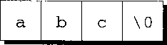
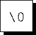
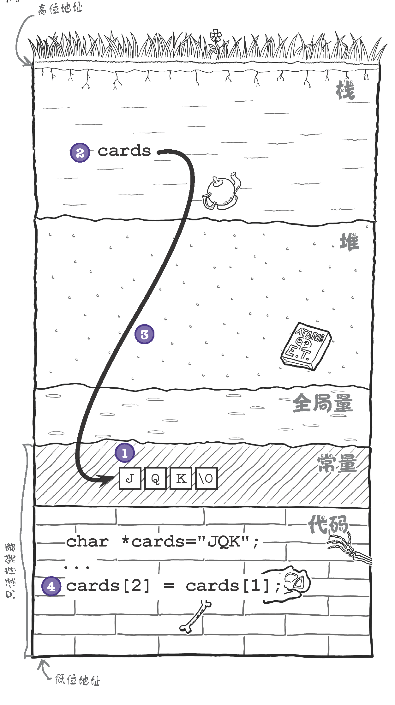
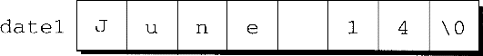
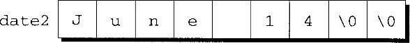
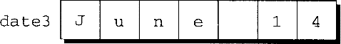
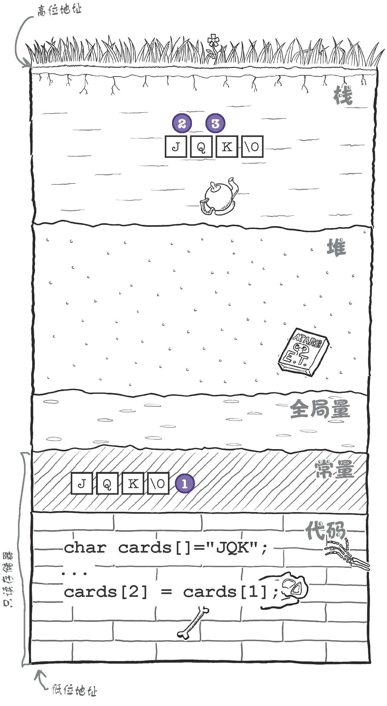
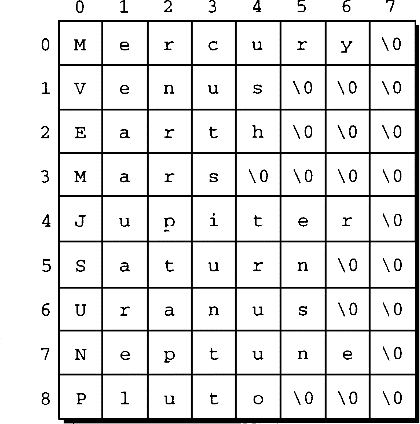
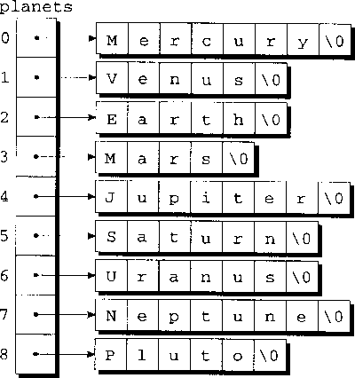

# Strings


<!-- TOC -->

- [Strings](#strings)
    - [TODO](#todo)
    - [字符串字面量](#字符串字面量)
        - [字符串字面量中的转义序列](#字符串字面量中的转义序列)
        - [延续字符串字面量](#延续字符串字面量)
        - [如何存储字符串字面量](#如何存储字符串字面量)
        - [字符串字面量的操作](#字符串字面量的操作)
            - [试图改变字符串字面量会导致未定义的行为](#试图改变字符串字面量会导致未定义的行为)
        - [字符串字面量与字符常量](#字符串字面量与字符常量)
    - [字符串变量](#字符串变量)
        - [初始化字符串变量](#初始化字符串变量)
        - [初始化字符串变量的复制过程](#初始化字符串变量的复制过程)
        - [字符数组与字符指针](#字符数组与字符指针)
    - [字符串的读和写](#字符串的读和写)
        - [用 `printf` 函数和 `puts` 函数写字符串](#用-printf-函数和-puts-函数写字符串)
        - [用 `scanf` 函数和 `gets` 函数读字符串](#用-scanf-函数和-gets-函数读字符串)
        - [`scanf` 缓冲区溢出问题](#scanf-缓冲区溢出问题)
        - [逐个字符读字符串](#逐个字符读字符串)
    - [访问字符串中的字符](#访问字符串中的字符)
    - [使用 C 语言的字符串库](#使用-c-语言的字符串库)
        - [`strcpy` 函数和 `strncpy` 函数](#strcpy-函数和-strncpy-函数)
            - [`strcpy`](#strcpy)
            - [`strncpy`](#strncpy)
            - [`strcpy` 和 `strdup`](#strcpy-和-strdup)
        - [`strlen` 函数](#strlen-函数)
        - [`strcat` 函数和 `strncat` 函数](#strcat-函数和-strncat-函数)
            - [`strcat`](#strcat)
            - [`strncat`](#strncat)
        - [`strcmp` 函数](#strcmp-函数)
        - [示例](#示例)
    - [字符串惯用法](#字符串惯用法)
        - [搜索字符串的结尾](#搜索字符串的结尾)
        - [复制字符串](#复制字符串)
    - [字符串数组](#字符串数组)
        - [命令行参数](#命令行参数)
            - [`argv` 形参](#argv-形参)
            - [例子 核对行星的名字](#例子-核对行星的名字)
    - [练习](#练习)
    - [References](#references)

<!-- /TOC -->


## TODO
1. 下面的输出
    ```cpp
    printf("[%c]", "\n");
    printf("[%d]", "\n");
    printf("[%c]", '\n');
    // [d][4214884][
    // ]
    ```

    

## 字符串字面量
1. **字符串字面量**（string literal）是用一对双引号括起来的字符序列。
2. 按照 C89 标准，编译器必须最少支持 509 个字符长的字符串字面量。C99 把最小长度增加到了 4095 个字符。

### 字符串字面量中的转义序列
TODO，八进制数和十六进制数的转义序列

### 延续字符串字面量
1. 如果发现字符串字面量太长而无法放置在单独一行以内，只要把第一行用字符 `\` 结尾，那么 C 语言就允许在下一行延续字符串字面量。
    ```cpp
    printf("When you come to a fork in the road, take it.   \
    --Yogi Berra");
    ```
2. 除了（看不到的）末尾的换行符，在同一行不可以有其他字符跟在 `\` 后面。
3. 使用 `\` 有一个缺陷：字符串字面量必须从下一行的起始位置继续。因此，这就破坏了程序的缩进结构
    ```cpp
    int main(void)
    {
        printf("abcd\
        efg");           // abcd    efg

        printf("abcd\
    efg");               // abcdefg
        return 0;
    }
    ```
4. 处理长字符串字面量有一种更好的方法：当两条或更多条字符串字面量相邻时（仅用空白字符分割），编译器会把它们合并成一条字符串。这条规则允许把字符串分割放在两行或者更多行中
    ```cpp
    int main(void)
    {
        printf("abcd"
                "efg"); // abcdefg
        return 0;
    }
    ```

### 如何存储字符串字面量
1. 从本质而言，C 语言把字符串字面量作为字符数组来处理。
2. 当 C 语言编译器在程序中遇到长度为 $n$ 的字符串字面量时，它会为字符串字面量分配长度为 $n+1$ 的内存空间。这块内存空间将用来存储字符串字面量中的字符，以及一个用来标志字符串末尾的额外字符（空字符）。
3. 空字符是一个所有位都为 `0` 的字节，因此用转义序列 `\0` 来表示。
4. 例如，字符串字面量 `"abc"` 是作为有 4 个字符的数组来存储的（`a`、`b`、`c` 和 `\0`）：
    
5. 字符串字面量可以为空。字符串 `""` 作为单独一个空字符来存储：
    
6. 既然字符串字面量是作为数组来存储的，那么编译器会把它看作是 `char *` 类型的指针。例如，`printf` 函数和 `scanf` 函数都接收 `char *` 类型的值作为它们的第一个参数。思考下面的例子：
    ```cpp
    printf("abc");
    ```
    当调用 `printf` 函数时，会传递 `"abc"` 的地址，即指向存储字母 `a` 的内存单元的指针。

### 字符串字面量的操作
1. 通常情况下可以在任何 C 语言允许使用 `char *` 指针的地方使用字符串字面量。例如，字符串字面量可以出现在赋值运算符的右边：
    ```cpp
    char *p;

    p = "abc";
    ```
    这个赋值操作不是复制 `"abc"` 中的字符，而是使p指向字符串的第一个字符。
2. C 语言允许对指针取下标，因此可以对字符串字面量取下标。下面将字符串中的一个字符保存到 `ch`
    ```cpp
    char ch = "abc"[1];

    putchar(ch); // b
    ```
3. 也可以使用指针来访问字符串中的字符
    ```cpp
    char *str = "abf";


    putchar(*str); // a
    putchar(*str+2); // c
    putchar(*(str+2)); // f
    ```
4. 因为保存字符串的数组是字符长度加一，所以下标还可以取到最后的空字符
    ```cpp
    char ch = "abc"[3];
    printf("[%c]", ch); // [ ]
    ```
5. 字符串字面量的这种特性并不常用，但有时也比较方便。思考下面的函数，这个函数把 0~15 的数转换成等价的十六进制的字符形式：
    ```cpp
    char digit_to_hex_char(int digit)
    {
        return "0123456789ABCDEF"[digit];
    }
    ```
#### 试图改变字符串字面量会导致未定义的行为
1. 示例
    ```cpp
    char *p = "abc";

    *p = 'd';   /*** WRONG ***/
    ```
2. 一些编译器试图通过只为相同的字符串字面量存储一份副本来节约内存。考虑下面的例子：
    ```cpp
    char *p = "abc", *q = "abc";
    ```
    编译器可能只存储 `"abc"` 一次，并且把 `p` 和 `q` 都指向此字符串字面量。如果试图通过指针 `p` 改变 `"abc"`，那么 `q` 所指向的字符串也会受到影响。
3. 另一个潜在的问题是，字符串字面量可能存储在内存中的 “只读” 区域，试图修改这种字符串字面量的程序会崩溃。以 `char *cards = "JQK"` 为例，看看会发生什么
    
    1. 计算机加载字符串字面值。当计算机把程序载入存储器时，会把所有常数值（如字符串常量 `"JQK"`）放到常量存储区，这部分存储器是只读的。
    2. 程序在栈上创建 `cards` 变量。栈是存储器中计算机用来保存局部变量的部分，局部变量也就是位于函数内部的变量，`cards` 变量就在这个地方。
    3. `cards` 变量设为 `"JQK"` 的地址。`cards` 变量将会保存字符串字面值 `"JQK"` 的地址。为了防止修改，字符串字面值通常保存在只读存储器中。
    4. 计算机试图修改字符串。程序试图修改 `cards` 变量指向的字符串中的内容时就会失败，因为字符串是只读的。

### 字符串字面量与字符常量
1. 只包含一个字符的字符串字面量不同于字符常量。字符串字面量 `"a"` 是用 **指针** 来表示的，这个指针指向存放字符 `"a"`（后面紧跟空字符）的内存单元。字符常量 `'a'` 是用 **整数**（字符集的数值码）来表示的。
2. 不要在需要字符串的时候使用字符（反之亦然）。函数调用
    ```cpp
    printf("\n");
    ```
    是合法的，因为 `printf` 函数期望指针作为它的第一个参数。然而，下面的调用却是非法的：
    ```cpp
    printf('\n');    /*** WRONG ***/
    ```
    同样这样也是错误的
    ```cpp
    char ch = "a"; // warning: initialization makes integer from pointer without a cast
    ```


## 字符串变量
1. 一些编程语言为声明字符串变量提供了专门的 `string` 类型。C 语言采取了不同的方式：只要保证字符串是以空字符结尾的，任何一维的字符数组都可以用来存储字符串。
2. 假设需要用一个变量来存储最多有 80 个字符的字符串。由于字符串在末尾处需要有空字符，我们把变量声明为含有 81 个字符的数组：
    ```cpp
    #define STR_LEN 80
    ...
    char str[STR_LEN+1];
    ```
3. 这里把 `STR_LEN` 定义为 80 而不是 81，强调的是 `str` 可以存储最多有 80 个字符的字符串；然后才在 `str` 的声明中对 `STR_LEN` 加 1。这是 C 程序员常用的方式。
4. 声明长度为 `STR_LEN+1` 的字符数组并不意味着它总是用于存放长度为 `STR_LEN` 的字符串。字符串的长度取决于空字符的位置，而不是取决于用于存放字符串的字符数组的长度。有 `STR_LEN+1` 个字符的数组可以存放多种长度的字符串，范围是从空字符串到长度为 `STR_LEN` 的字符串。

### 初始化字符串变量
1. 字符串变量可以在声明时进行初始化：
    ```cpp
    char date1[8] = "June 14";
    ```
2. 编译器将把字符串 `"June 14"` 中的字符 **复制** 到数组 `date1` 中，然后追加一个空字符从而使 `date1` 可以作为字符串使用。date1将如下所示
    
3. `"June 14"` 看起来是字符串字面量，但其实不然。C 编译器会把它看成是数组初始化式的缩写形式。实际上，我们可以写成：
    ```cpp
    char date1[8] = {'J', 'u', 'n', 'e', ' ', '1', '4', '\0'};
    ```
4. 如果初始化式太短以致不能填满字符串变量将会如何呢？在这种情况下，编译器会添加空字符。因此，在声明
    ```cpp
    char date2[9] = "June 14";
    ```
    之后，`date2` 将如下所示：
    
5. 如果初始化式比字符串变量长，这对字符串而言是非法的，就如同对数组是非法的一样。
6. 然而，C 语言允许初始化式（不包括空字符）与变量有完全相同的长度：
    ```cpp
    char date3[7] = "June 14";
    ```
    由于没有给空字符留空间，所以编译器不会试图存储空字符，这将使得数组无法作为字符串使用
    
7. 字符串变量的声明中可以省略它的长度。这种情况下，编译器会自动计算长度：
    ```cpp
    char date4[] = "June 14";
    ```
    编译器为 `date4` 分配 8 个字符的空间。
8. 不指定 `date4` 的长度并不意味着以后可以改变数组的长度。一旦编译了程序，`date4` 的长度就固定是 8 了。

### 初始化字符串变量的复制过程
1. 上面说到初始化字符串变量时强调了 **复制** 这个词，因为这个过程并不是直接创建一个字符数组然后写入若干字符。而是先有一个字符串字面量，再创建字符数组，然后再把字符串字面量中的字符复制到数组里。
2. 以 `char cards[] = "JQK"` 看一下这个过程
    
    1. 计算机载入字符串字面值。当计算机把程序载入存储器时，会把常量值（如字符串 `"JQK"`）保存到只读存储器。
    2. 程序在栈上新建了一个数组。我们声明了数组，所以程序会创建一个足够大的数组来保存字符串 `"JQK"`，在这个例子中 4 个字符足矣。
    3. 程序初始化数组。除了为数组分配空间，程序还会把字符串字面值 `"JQK"` 的内容复制到栈上。


### 字符数组与字符指针
1. 一起来比较一下下面这两个看起来很相似的声明：
    ```cpp
    char date[] = "June 14";
    char *date = "June 14";
    ```
2. 前者声明 `date` 是一个数组，后者声明 `date` 是一个指针。正因为有了数组和指针之间的紧密关系，才使上面这两个声明中的 `date` 都可以用作字符串。尤其是，任何期望传递字符数组或字符指针的函数都能够接收这两种声明的 `date` 作为参数。
3. 然而，需要注意，不能错误地认为上面这两种 `date` 可以互换。两者之间有很大的差异：
    * 在声明为数组时，就像任意数组元素一样，可以修改存储在 `date` 中的字符。在声明为指针时，`date` 指向字符串字面量，字符串字面量是不可以修改的。
        ```cpp
        char date[] = "June 14";
        date[0] = 'j';
        printf("%c", date[0]); // 'j'
        ```
        ```cpp
        char *date = "June 14";
        date[0] = 'j'; // 错误
        ```
    * 在声明为数组时，`date` 是数组名。在声明为指针时，`date` 是变量，这个变量可以在程序执行期间指向其他字符串。
        ```cpp
        char hello[] = "hello";
        char date[] = "June 14";
        date = hello;  // error: assignment to expression with array type
        ```
        ```cpp
        char hello[] = "hello";
        char *date = "June 14";
        printf("%c", date[0]); // 'h'
        ```
4. 如果希望可以修改字符串，那么就要建立字符数组来复制字符串字面量，声明指针变量就不够的。下面的声明使编译器为指针变量分配了足够的内存空间：
    ```cpp
    char *p;
    ```
    可惜的是，它不能为字符串分配空间。因为我们没有指明字符串的长度。
5. 在使用 `p` 作为字符串之前，必须把 `p` 指向字符数组。
    * 一种方法是把 `p` 指向已经存在的字符串变量：
        ```cpp
        char str[STR_LEN+1], *p;

        p = str;
        ```
        现在 `p` 指向了 `str` 的第一个字符，所以可以把 `p`作为字符串使用了。
    * 另一种方法是让 `p` 指向一个动态分配的字符串。


## 字符串的读和写
### 用 `printf` 函数和 `puts` 函数写字符串
1. 转换说明 `%`s`` 允许 `printf` 函数写字符串。考虑下面的例子：
    ```cpp
    char str[] = "Are we having fun yet?";

    printf("%s\n", str);
    ```
2. `printf` 函数会逐个写字符串中的字符，直到遇到空字符才停止。如果空字符丢失，`printf` 函数会越过字符串的末尾继续写，直到最终在内存的某个地方找到空字符为止。
3. 如果只想显示字符串的一部分，可以使用转换说明 $\%.p$`s`，这里 $p$ 是要显示的字符数量
    ```cpp
    printf("%.6s\n", str);
    ```
4. 字符串跟数一样，可以在指定字段内显示。转换说明 $\%m$`s` 会在大小为 $m$ 的字段内显示字符串
    ```cpp
    char str[] = "hello";

    printf("[%10s]\n", str); // [     hello]
    ```
5. 对于超过 $m$ 个字符的字符串，`printf` 函数会显示出整个字符串，而不会截断
    ```cpp
    char str[] = "hello";

    printf("[%2s]\n", str); // [hello]
    ```
6. 如果字符串少于 $m$ 个字符，则会在字段内右对齐输出。如果要强制左对齐，可以在 $m$ 前加一个减号
    ```cpp
    char str[] = "hello";

    printf("[%-10s]\n", str); // [hello     ]
    ```
7. $m$ 值和 $p$ 值可以组合使用：转换说明 $\%m.p$`s` 会使字符串的前 $p$ 个字符在大小为 $m$ 的字段内显示。
8. C 函数库还提供了 `puts` 函数，此函数可以按如下方式使用：
    ```cpp
    puts(str);
    ```
9. `puts` 函数只有一个参数，即需要显示的字符串。在写完字符串后，`puts` 函数总会添加一个额外的换行符，从而前进到下一个输出行的开始处。

### 用 `scanf` 函数和 `gets` 函数读字符串
1. 转换说明 `%s` 允许 `scanf` 函数把字符串读入字符数组：
    ```cpp
    scanf("%s", str);
    ```
2. 在 `scanf` 函数调用中，不需要在 `str` 前添加运算符 `&`，因为 `str` 是数组名，编译器在把它传递给函数时会把它当作指针来处理。
3. 调用时，`scanf` 函数会跳过空白字符，然后读入字符并存储到 `str` 中，直到遇到空白字符为止
    ```cpp
    scanf("%s", str); // 如果输入 hello world，只会录入 hello，后面的内容会被下次录入
    ```
    ```cpp
    int i, j;
    char s[20];

    // 输入 "12abc34  56def78"
    scanf("%d%s%d", &i, s, &j);

    printf("%d %s %d", i, s, j); // 12 abc34 56
    ```
4. `scanf` 函数始终会在字符串末尾存储一个空字符。
5. 用 `scanf` 函数读入字符串永远不会包含空白字符。因此，`scanf` 函数通常不会读入一整行输入。换行符会使 `scanf` 函数停止读入，空格符或制表符也会产生同样的结果。
6. 为了一次读入一整行输入，可以使用 `gets` 函数。`gets` 函数有些不同于 `scanf` 函数
    * `gets` 函数不会在开始读字符串之前跳过空白字符（`scanf` 函数会跳过）。
    * `gets` 函数会持续读入直到找到换行符才停止（`scanf` 函数会在任意空白字符处停止）。
    * `gets` 函数会忽略掉换行符，不会把它存储到数组中，用空字符代替换行符。
7. 在把字符读入数组时， `scanf` 函数和 `gets` 函数都无法检测数组何时被填满。因此，它们存储字符时可能越过数组的边界，这会导致未定义的行为。通过用转换说明 $\%n$`s` 代替 `%s` 可以使 `scanf` 函数更安全。这里的数字 $n$ 指出可以存储的最多字符数。可惜的是，`gets` 函数天生就是不安全的，`fgets` 函数则是一种好得多的选择。

### `scanf` 缓冲区溢出问题
1. 上面的例子我们声明了长度为 20 的字符数组，输入时也没有超过这个长度，所以并没有导致问题。
2. 如果忘了限制 `scanf()` 读取字符串的长度，用户就可以输入远远超出程序空间的数据，多余的数据会写到计算机还没有分配好的存储器中。
3. 如果运气好，数据不但能保存，而且不会有任何问题。但缓冲区溢出很有可能会导致程序出错，这种情况通常被称为段错误或 abort trap，不管出现什么错误消息，程序都会崩溃。下面的例子中，如果输入字符串超出不多，一般不会有什么问题，但如果超出比较多了，那就会导致崩溃
    ```js   
    char food[5];
    printf("Enter favorite food: ");
    scanf("%s", food);
    printf("Favorite food: %s\n", food);
    ```
4. 为了防止这种问题，应该对用户输入的长度进行限制
    ```js
    char food[5];
    printf("Enter favorite food: ");
    scanf("%4s", food);
    ```
5. 或者，如果你只想把输入作为字符串，而不需要 `scanf` 那样把输入转换为比如数值的格式化功能，那么可以直接使用更安全的 `fgets` 方法
    ```js
    char food[5];
    printf("Enter favorite food: ");
    fgets(food, sizeof(food), stdin);
    ```

### 逐个字符读字符串
1. 因为对许多程序而言，`scanf` 函数和 `gets` 函数都有风险且不够灵活，C 程序员经常会自己编写输入函数。通过每次一个字符的方式来读入字符串，这类函数可以提供比标准输入函数更大程度的控制。
2. 如果决定设计自己的输入函数，那么就需要考虑下面这些问题。
    * 在开始存储字符串之前，函数应该跳过空白字符吗？
    * 什么字符会导致函数停止读取：换行符、任意空白字符还是其他某种字符？需要存储这类字符还是忽略掉？
    * 如果输入的字符串太长以致无法存储，那么函数应该做些什么：忽略额外的字符还是把它们留给下一次输入操作？
3. 假定我们所需要的函数不会跳过空白字符，在第一个换行符（不存储到字符串中）处停止读取，并且忽略额外的字符。函数将有如下原型：
    ```cpp
    int read_line(char str[], int n);
    ```
4. `str` 表示用来存储输入的数组，而 `n` 是读入字符的最大数量。如果输入行包含多于 `n` 个的字符，`read_line` 函数将忽略多余的字符。
5. `read_line` 函数会返回实际存储在 `str` 中的字符数量（0 到 `n` 之间的任意数）
6. `read_line` 函数主要由一个循环构成。只要 `str` 中还有空间，此循环就会调用 `getchar` 函数逐个读入字符并把它们存储到 `str` 中。在读入换行符时循环终止。
7. 严格地说，如果 `getchar` 函数读入字符失败，也应该终止循环，但是这里暂时忽略这种复杂情况。
8. 下面是 `read_line` 函数的完整定义： 
    ```cpp
    int read_line(char str[],  int n)
    {
        int ch, i = 0;

        while ((ch = getchar()) != '\n')
            if (i < n)
                str[i++] = ch;
        str[i] = '\0';        /* terminates string */
        return i;             /* number of characters stored */
    }
    ```
9. 注意，`ch` 的类型为 `int` 而不是 `char`，这是因为 `getchar` 把它读取的字符作为 `int` 类型的值返回。
10. 返回之前，`read_line` 函数在字符串的末尾放置一个空字符。`scanf` 和 `gets` 等标准函数会自动在输入字符串的末尾放置一个空字符；然而，如果要自己写输入函数，必须手工加上空字符。
11. `read_line` 函数现在不具备检测 `getchar` 函数读入字符是否失败的功能。如果因为错误或到达文件尾而不能读入字符，`getchar` 函数会返回 `int` 类型的值 `EOF`。下面是改进后的
    ```cpp
    int read_line(char str[], int n)
    {
        int ch, i = 0;

        while ((ch = getchar()) != '\n' && ch != EOF)
            if (i < n)
                str[i++] = ch;
        str[i] = '\0';
        return i;
    }
    ```
12. TODO，长度超过数组指定的长度依然可以使用，使用到了数组外面的内存
    ```cpp
    char str[10];
    int n = 15; // 可以读取 15 个字符，使用了 16 个字节的内存，包括最后的空白字符
    ```


## 访问字符串中的字符
1. 字符串是以数组的方式存储的，因此可以使用下标来访问字符串中的字符。例如，为了对字符串 `s` 中的每个字符进行处理，可以设定一个循环来对计数器 `i` 进行自增操作，并通过表达式 `s[i]` 来选择字符
    ```cpp
    int count_spaces(const char s[])
    {
        int count = 0, i;

        for (i = 0; s[i] != '\0';  i++)
            if (s[i] == ' ')
                count++;
        return count;
    }
    ```
2. 在 `s` 的声明中加上 `const` 表明 `count_spaces` 函数不会改变数组。
3. 如果 `s` 不是字符串，`count_spaces` 将需要第 2 个参数来指明数组的长度。然而，因为 `s` 是字符串，所以 `count_spaces` 可以通过测试空字符来定位 `s` 的末尾。
4. 下面用指针算术运算代替数组取下标来重新编写 `count_spaces` 函数。这次不再需要变量 `i`，而是利用 `s` 自身来跟踪字符串中的位置。通过对 `s` 反复进行自增操作，`count_spaces` 函数可以逐个访问字符串中的字符：
    ```cpp
    int count_spaces(const char *s)
    {
        int count = 0;

        for (; *s != '\0'; s++)
            if (*s == ' ')
                count++;
        return count;
    }
    ```
5. 注意，`const` 没有阻止 `count_spaces` 函数对 `s` 的修改，它的作用是阻止函数改变 `s` 所指向的字符。而且，因为 `s` 是传递给 `count_spaces` 函数的指针的副本，所以对 `s` 进行自增操作不会影响原始的指针。


## 使用 C 语言的字符串库
1. 一些编程语言提供的运算符可以对字符串进行复制、比较、拼接、选择子串等操作，但 C 语言的运算符根本无法操作字符串。在 C 语言中把字符串当作数组来处理，因此对字符串的限制方式和对数组的一样，特别是，它们都不能用 C 语言的运算符进行复制和比较操作。
2. 假定 `str1` 和 `str2` 有如下声明：
    ```cpp
    char str1[10], str2[10];
    ```
3. 利用 `=` 运算符来把字符串复制到字符数组中是不可能的：
    ```cpp
    str1 = "abc";     /*** WRONG ***/
    str2 = str1;      /*** WRONG ***/
    ```
    因为把数组名用作 `=` 的左操作数是非法的。
4. 但是，使用 `=` 初始化字符数组是合法的：
    ```cpp
    char str1[10] = "abc";
    ```
    这是因为在声明中，`=` 不是赋值运算符。
5. 试图使用关系运算符或判等运算符来比较字符串是合法的，但不会产生预期的结果：
    ```cpp
    if (str1 == str2) ...    /*** WRONG ***/
    ```
    这条语句把 `str1` 和 `str2` 作为指针来进行比较，而不是比较两个数组的内容。因为 `str1` 和 `str2` 有不同的地址，所以表达式`str1 == str2` 的值一定为 `0`。
6. 不过，C 语言的函数库为完成对字符串的操作提供了丰富的函数集。这些函数的原型驻留在 `<string.h>` 头中，所以需要字符串操作的程序应该包含下列内容：
    ```cpp
    #include <string.h>
    ```
7. 在 `<string.h>` 中声明的每个函数至少需要一个字符串作为实际参数。字符串形式参数声明为 `char *` 类型，这使得实际参数可以是字符数组、`char *` 类型的变量或者字符串字面量——上述这些都适合作为字符串。
8. 然而，要注意那些没有声明为 `const` 的字符串形式参数。这些形式参数可能会在调用函数时发生改变，所以对应的实际参数不应该是字符串字面量。

### `strcpy` 函数和 `strncpy` 函数
#### `strcpy`
1. `strcpy`函数在 `<string.h>` 中的原型如下：
    ```cpp
    char *strcpy(char *s1, const char *s2);
    ```
2. `strcpy` 函数把字符串 `s2` 复制给字符串 `s1`。准确地讲，应该说成是 `strcpy` 函数把 `s2` 指向的字符串复制到 `s1` 指向的数组中。
3. 也就是说，`strcpy` 函数把 `s2` 中的字符复制到 `s1` 中直到遇到 `s2` 中的第一个空字符为止（该空字符也需要复制）
    ```cpp
    int main(void)
    {

        char str1[STR_SIZE+1];
        char str2[] = "hello";

        printf("%d\n\n", sizeof(str2)); // 6

        strcpy(str1, str2);

        puts(str1); // hello
        puts(str2); // hello

        printf("\nstr1: ");
        for ( int i = 0; i < STR_SIZE+1; i++ ) {
            printf("[%c] ", str1[i]);
        }
        // str1: [h] [e] [l] [l] [o] [ ] 

        printf("\nstr2: ");
        for ( int i = 0; i < STR_SIZE+1; i++ ) {
            printf("[%c] ", str2[i]);
        }
        // str2: [h] [e] [l] [l] [o] [ ]

        return 0;
    }
    ```
4. `strcpy` 函数返回 `s1`（即指向目标字符串的指针）。
5. 这一过程不会改变 `s2` 指向的字符串，因此将其声明为 `const`。
6. 在 `strcpy(str1, str2)` 的调用中，`strcpy` 函数无法检查 `str2` 指向的字符串的大小是否真的适合 `str1` 指向的数组。假设 `str1` 指向的字符串长度为 `n`，如果 `str2` 指向的字符串中的字符数不超过 `n-1`，那么复制操作可以完成
    ```cpp
    #define STR_SIZE 5

    int main(void)
    {

        char str1[STR_SIZE+1];
        char str2[] = "abc";

        printf("%d\n\n", sizeof(str2)); // 4

        strcpy(str1, str2);

        puts(str1); // abc
        puts(str2); // abc

        printf("\nstr1: ");
        for ( int i = 0; i < STR_SIZE+1; i++ ) {
            printf("[%c] ", str1[i]);
        }
        // str1: [a] [b] [c] [ ] [ ] [ ] 
        // str1 是 6 项数组，但只拷贝进来了 3 个有效字符，所以后面全是空白字符

        printf("\nstr2: ");
        for ( int i = 0; i < STR_SIZE+1; i++ ) {
            printf("[%c] ", str2[i]);
        }
        // str2: [a] [b] [c] [ ] [a] [b] 
        // str2 是 4 项数组，后面的位置看起来是 str1 的

        return 0;
    }
    ```
7. 但是，如果 `str2` 指向更长的字符串，那么结果就无法预料了。因为 `strcpy` 函数会一直复制到第一个空字符为止，所以它会越过 `str1` 指向的数组的边界继续复制
    ```cpp
    #define STR_SIZE 5

    int main(void)
    {

        char str1[STR_SIZE+1];
        char str2[] = "hello world";

        printf("%d\n\n", sizeof(str2)); // 12

        strcpy(str1, str2);

        puts(str1); // hello world
        puts(str2); // hello world

        printf("\n%d\n", sizeof(str1)); // 6

        printf("\nstr1: ");
        for ( int i = 0; i < STR_SIZE + 7; i++ ) {
            printf("[%c] ", str1[i]);
        }
        // str1: [h] [e] [l] [l] [o] [ ] [w] [o] [r] [l] [
        // ] [ ]

        printf("\nstr2: ");
        for ( int i = 0; i < STR_SIZE + 7; i++ ) {
            printf("[%c] ", str2[i]);
        }
        // str2: [h] [e] [l] [l] [o] [ ] [w] [o] [r] [l] [d] [ ]

        return 0;
    }
    ```

#### `strncpy`
1. 尽管执行会慢一点，但是调用 `strncpy` 函数仍是一种更安全的复制字符串的方法。
2. `strncpy` 类似于 `strcpy`，但它还有第三个参数可以用于限制所复制的字符数。为了将 `str2` 复制到 `str1`，可以使用如下的 `strncpy` 调用：
    ```cpp
    strncpy(str1, str2, sizeof(str1));
    ```
    只要 `str1` 足够装下存储在 `str2` 中的字符串（包括空字符），复制就能正确完成。
3. 当然，`strncpy` 本身也不是没有风险。如果 `str2` 中存储的字符串的长度大于 `str1` 数组的长度，`strncpy` 会导致 `str1` 中的字符串没有终止的空字符。
4. 下面是一种更安全的用法：
    ```cpp
    strncpy(str1, str2, sizeof(str1) - 1);
    str1[sizeof(str1)-1] = '\0';
    ```
    第二条语句确保 `str1` 总是以空字符结束，即使 `strncpy` 没能从 `str2` 中复制到空字符。

#### `strcpy` 和 `strdup`
1. 前面说到，`strcpy` 函数把 `s2` 指向的字符串复制到 `s1` 指向的数组中。`strcpy(ptr2, ptr1)` is equivalent to `while(*ptr2++ = *ptr1++)`。所以前提是，`s1` 必须是个数组才行，下面的使用方法就会导致程序出错
    ```cpp
    char* s1 = "hello";
    char s2[] = "world";
    strcpy(s1, s2);
    ```
    因为 `s1` 是指针而不是数组，就导致 `s2` 中的字符串无处安放。
2. 为了使复制可以成功，可以给 `s1` 分配内存，然后把 `s2` 复制过来
    ```cpp
    char s2[] = "world";
    char* s1 = malloc(sizeof(s2));
    strcpy(s1, s2);
    ```
3. 或者可以使用 `strdup` 函数，它会自动分配内存
    ```cpp
    char* s1 = strdup(s2);
    ```
    `strdup` 相当于
    ```cpp
    ptr2 = malloc(strlen(ptr1)+1);
    strcpy(ptr2,ptr1);
    ```
4. 因为 `strdup()` 把新字符串放在堆上，所以千万记得要用 `free()` 函数释放空间。
5. 这里也能看出自字符数组和字符指针的区别。So if you want the string which you have copied to be used in another function (as it is created in heap section) you can use `strdup`, else `strcpy` is enough.

### `strlen` 函数
1. `strlen`函数的原型如下：
    ```cpp
    size_t strlen (const char *s);
    ```
2. 定义在 C 函数库中的 `size_t` 类型是一个 `typedef` 名字，表示 C 语言中的一种无符号整型。除非是处理极长的字符串，否则不需要关心其技术细节。我们可以简单地把 `strlen` 的返回值作为整数处理。
3. `strlen` 函数返回字符串 `s` 的长度：`s` 中第一个空字符之前的字符个数（不包括空字符）。下面是几个示例：
    ```cpp
    int len;

    len = strlen("abc");        /* len is now 3 */
    len = strlen("");           /* len is now 0 */
    strcpy(strl, "abc");
    len = strlen(strl);         /* len is now 3 */
    ```
4. 最后一个例子说明了很重要的一点：当用数组作为实际参数时，`strlen` 不会测量数组本身的长度，而是返回存储在数组中的字符串的长度。
5. 注意换行符造成的计算错误。例如使用 `fgets` 读取用户输入，因为这个函数会记录最后的换行符，所以保存的字符串比实际的有效字符多一个换行符。`strlen` 虽然不记录空字符，但是会记录换行符
    ```cpp
    char name[8];
    fgets(name, 8, stdin); // 输入 “abc” 并回车
    printf("%d\n", strlen(name)); // 4
    ```

### `strcat` 函数和 `strncat` 函数
#### `strcat`
1. `strcat`函数的原型如下：
    ```cpp
    char *strcat(char *s1, const char *s2);
    ```
2. `strcat` 函数把字符串 `s2` 的内容追加到字符串 `s1` 的末尾，并且返回字符串 `s1`（指向结果字符串的指针）。
3. 下面列举了一些使用 `strcat` 函数的例子：
    ```cpp
    strcpy(str1, "abc");
    strcat(str1, "def");   /* str1 now contains "abcdef" */
    strcpy(str1, "abc");
    strcpy(str2, "def");
    strcat(str1, str2);    /* str1 now contains "abcdef" */
    ```
4. 如果 `str1` 指向的数组没有大到足以容纳 `str2` 指向的字符串中的字符，那么调用 `strcat(str1, str2)` 的结果将是不可预测的。考虑下面的例子：
    ```cpp
    char str1[6] = "abc";

    strcat(str1, "def");    /*** WRONG ***/
    ```
    `strcat` 函数会试图把字符 `d`、`e`、`f` 和 `\0` 添加到 `str1` 中已存储的字符串的末尾。不幸的是，`str1` 仅限于 6 个字符，这导致 `strcat` 函数写到了数组末尾的后面。

#### `strncat`
1. `strncat` 函数函数比 `strcat` 更安全，但速度也慢一些。与 `strncpy` 一样，它有第三个参数来限制所复制的字符数。下面是调用的形式：
    ```cpp
    strncat(str1,  str2, sizeof(str1) - strlen(str1) - 1) ;
    ```
2. `strncat` 函数会在遇到空字符时终止 `str1`，第三个参数（待复制的字符数）没有考虑该空字符。
3. 在上面的例子中，第三个参数计算 `str1` 中的剩余空间，然后减去 `1` 以确保为空字符留下空间。

### `strcmp` 函数
1. `strcmp`函数的原型如下：
    ```cpp
    int strcmp(const char *s1, const char *s2);
    ```
2. `strcmp` 函数比较字符串 `s1` 和字符串 `s2`，然后根据 `s1` 是小于、等于或大于 `s2`， 函数返回一个小于、等于或大于 0 的值。
    ```cpp
    if (strcmp(str1, str2) < 0)    /* is str1 < str2? */
        ...
    ```
3. 类似于字典中单词的编排方式，`strcmp` 函数利用字典顺序进行字符串比较。更精确地说，只要满足下列两个条件之一，那么 `strcmp` 函数就认为 `s1` 是小于 `s2` 的
    * `s1` 与 `s2` 的前 `i` 个字符一致，但是 `s1` 的第 `i+1` 个字符小于 `s2` 的第 `i+1` 个字符。
    * `s1` 的所有字符与 `s2` 的字符一致，但是 `s1` 比 `s2` 短。例如，`"abc"` 小于 `"abcd"`。

### 示例
1. [C语言程序设计 第 13 章](https://www.ituring.com.cn/book/tupubarticle/31023) 显示一个月的提醒列表
    ```cpp
    /* Prints a one-month reminder list */

    #include <stdio.h>
    #include <string.h>

    #define MAX_REMIND 50     /* maximum number of reminders */
    #define MSG_LEN 60        /* max length of reminder message */

    int read_line(char str[], int n);

    int main(void)
    {
        // 一行对应一条提醒，每条除了提醒 MSG_LEN 个提醒字符外还有前面的两个日期字符和一个空格
        char reminders[MAX_REMIND][MSG_LEN+3];
        char day_str[3], msg_str[MSG_LEN+1];

        int day, i, j, num_remind = 0;

        for (;;) {
            if (num_remind == MAX_REMIND) {
                printf("-- No space left --\n");
                break;
            }

            printf("Enter day and reminder: ");

            // 读取日期
            scanf("%2d", &day); // 只读取两位数字
            if (day == 0)
                break;
            sprintf(day_str, "%2d", day); // 转换为字符串

            // 读取提醒
            read_line(msg_str, MSG_LEN);

            // 找到这条提醒的日期的合适位置
            // 从最小的日期开始比较，直到出现一个大于当前日期的
            for (i = 0; i < num_remind; i++)
                if (strcmp(day_str, reminders[i]) < 0)
                    break;
            // 把 i 及以后的所有条目向后移动一个位置
            for (j = num_remind; j > i; j--)
                strcpy(reminders[j], reminders[j-1]); // j-1 等于 i
            // 把当前条目放到 i 的位置
            strcpy(reminders[i], day_str);
            strcat(reminders[i], msg_str);

            num_remind++;
        }

        printf("\nDay Reminder\n");
        for (i = 0; i < num_remind; i++)
            printf(" %s\n", reminders[i]);

        return 0;
    }

    int read_line(char str[], int n)
    {
        int ch, i = 0;

        while ((ch = getchar()) != '\n')
            if (i < n)
                str[i++] = ch;
        str[i] = '\0';
        return i;
    }
    ```
2. 输入和输出
    ```sh
    Enter day and reminder:  24 Susan's birthday
    Enter day and reminder:  5 6:00 - Dinner with Marge and Russ
    Enter day and reminder:  26 Movie - "Chinatown"
    Enter day and reminder:  7 10:30 - Dental appointment
    Enter day and reminder:  12 Movie - "Dazed and Confused"
    Enter day and reminder:  5 Saturday class
    Enter day and remlnder:  12 Saturday class
    Enter day and reminder:  0
    Day  Reminder
      5  Saturday class
      5  6:00 - Dinner with Marge and Russ
      7  10:30 - Dental appointment
     12  Saturday class
     12  Movie - "Dazed and Confused"
     24  Susan's birthday
     26  Movie - "Chinatown"
    ```


## 字符串惯用法
我们不可以编写与库函数同名的函数，即使不包含该函数所属的头也不行。事实上，所有以 `str` 和一个小写字母开头的名字都是保留的（以便在未来的 C 标准版本中往 `<string.h>` 头里加入函数）。

### 搜索字符串的结尾
1. 下面的 `my_strlen` 函数搜索字符串参数的结尾，并且使用一个变量来跟踪字符串的长度：
    ```cpp
    size_t my_strlen(const char *s)
    {
        size_t n;

        for (n = 0;  *s != '\0'; s++)
            n++;
            
        return n;
    }
    ```
2. 指针 `s` 从左至右扫描整个字符串，变量 `n` 记录当前已经扫描的字符数量。当 `s` 最终指向一个空字符时，`n` 所包含的值就是字符串的长度。
3. 现在看看是否能精简 `my_strlen` 函数的定义。首先，把 `n` 的初始化移到它的声明中
    ```cpp
    size_t my_strlen(const char *s)
    {
        size_t n = 0;

        for (;  *s != '\0'; s++)
            n++;

        return n;
    }
    ```
4. 接下来注意到，条件 `*s != '\0'`与 `*s != 0` 是一样的，因为空字符的整数值就是 `0`。而测试 `*s != 0` 与测试 `*s` 是一样的，两者都在 `*s` 不为 `0` 时结果为真
    ```cpp
    size_t my_strlen(const char *s)
    {
        size_t n = 0;

        for (;  *s; s++)
            n++;

        return n;
    }
    ```
5. 在同一个表达式中对 `s` 进行自增操作并且测试 `*s` 是可行的
    ```cpp
    size_t my_strlen(const char *s)
    {
        size_t n = 0;

        for (;  *s++;)
            n++;

        return n;
    }
    ```
6. 用 `while` 语句替换 `for` 语句
    ```cpp
    size_t my_strlen(const char *s)
    {
        size_t n = 0;

        while (*s++)
            n++;

        return n;
    }
    ```
7. 对于一些编译器来说下面的版本确实会运行得更快一些
    ```cpp
    size_t my_strlen(const char *s)
    {
        const char *p = s;

        while (*s)
            s++;
        return s - p;
    }
    ```
    运行速度的提升得益于不需要在 `while` 循环内部对 `n` 进行自增操作。
8. 请注意，在 `p` 的声明中出现了单词 `const`，如果没有它，编译器会注意到把 `s` 赋值给 `p` 会给 `s` 指向的字符串造成一定风险。不懂
9. 语句
    ```cpp
    while (*s)
        s++;
    ```
    和相关的
    ```cpp
    while (*s++)
        ;
    ```
    都是惯用法。第一个版本最终使 `s` 指向了空字符。第二个版本更加简洁，但是最后使 `s` 正好指向空字符后面的位置。

### 复制字符串
1. 首先从直接但有些冗长的 `my_strcat` 函数写法开始
    ```cpp
    char *my_strcat(char *s1,  const char *s2)
    {
        char *p = s1;

        while ( *p != '\0' )
            p++;
        while ( *s2 != '\0' ) {
            *p = *s2;
            p++;
            s2++;
        }
        *p =  '\0';
        return s1;
    }
    ```
2. 简化为下面的写法
    ```cpp
    char *my_strcat(char *s1,  const char *s2)
    {
        char *p = s1;

        while ( *p != '\0' )
            p++;
        while ( *p++ = *s2++ ) {
            ;
        }
        return s1;
    }
    ```
    * 合并自增
    * 合并赋值
    * 由于合并了赋值，最后单独的空字符赋值也省略了


## 字符串数组
1. 现在来看一个在使用字符串时经常遇到的问题：存储字符串数组的最佳方式是什么？最明显的解决方案是创建二维的字符数组，然后按照每行一个字符串的方式把字符串存储到数组中
    ```cpp
    char planets[][8] = {"Mercury", "Venus", "Earth",
                        "Mars", "Jupiter", "Saturn",
                        "Uranus", "Neptune", "Pluto"};
    ```
2. 下面给出了 `planets` 数组的可能形式
    
3. 并非所有的字符串都足以填满数组的一整行，所以 C 语言用空字符来填补。因为只有 3 个行星的名字需要用满 8 个字符（包括末尾的空字符），所以这样的数组有一点浪费空间。
4. 因为大部分字符串集都是长字符串和短字符串的混合，所以这种低效性是在处理字符串时经常遇到的问题。我们需要的是 **参差不齐的数组**（ragged array），即每一行有不同长度的二维数组。
5. C 语言本身不提供这种 “参差不齐的数组类型”，但它提供了模拟这种数组类型的工具。秘诀就是建立一个特殊的数组，这个数组的元素都是指向字符串的指针。
6. 下面是 `planets` 数组的另外一种写法，这次把它看成是指向字符串的指针的数组：
    ```cpp
    char *planets[] = {"Mercury", "Venus", "Earth",
                    "Mars", "Jupiter", "Saturn",
                    "Uranus", "Neptune", "Pluto"};
    ```
7. 看上去改动不是很大，只是去掉了一对方括号，并且在 `planets` 前加了一个星号。但是，这对 `planets` 存储方式产生的影响却很大：
    
8. `planets` 的每一个元素都是指向以空字符结尾的字符串的指针。虽然必须为 `planets` 数组中的指针分配空间，但是字符串中不再有任何浪费的字符。
9. 为了访问其中一个行星名字，只需要对 `planets` 数组取下标。由于指针和数组之间的紧密关系，访问行星名字中的字符的方式和访问二维数组元素的方式相同。例如，为了在 `planets` 数组中搜寻以字母 M 开头的字符串，可以使用下面的循环：
    ```cpp
    for (i = 0; i < 9;  i++)
        if (planets[i][0] == 'M')
            printf("%s begins with M\n", planets[i]);
    ```
10. 两种数组功能类似，但是有着本质的区别。字符串数组的数组项是字符串
    ```cpp
    char str_arr[5][11];
    printf("%d", sizeof(str_arr[0])); // 11
    ```
    而字符串指针数组的数组项是指针
    ```cpp
    char *str_ptr_arr[5] = {"helloworld"};
    printf("%d", sizeof(str_ptr_arr[0])); // 4
    ```
    
### 命令行参数
1. 命令行信息不仅对操作系统命令可用，它对所有程序都是可用的。 为了能够访问这些命令行参数（C 标准中称为程序参数），必须把 `main` 函数定义为含有两个参数的函数， 这两个参数通常命名（习惯上）为 `argc` 和 `argv`：
    ```cpp
    int main(int argc, char *argv[])
    {
        ...
    }
    ```
2. `argc`（“参数计数”）是命令行参数的数量（包括程序名本身），`argv`（“参数向量”）是指向命令行参数的指针数组，这些命令行参数以字符串的形式存储。`argv[0]` 指向程序名，而从 `argv[1]` 到 `argv[argc-1]` 则指向余下的命令行参数。如果程序名不可用，那么 `argv[0]` 会指向空字符串。
3. `argv` 有一个附加元素，即 `argv[argc]`，这个元素始终是一个空指针。空指针是一种不指向任何地方的特殊指针，宏 `NULL` 代表空指针。
4. 如果用户输入命令行
    ```sh
    ls -l remind.c
    ```
    那么 `argc` 将为 3，`argv[0]` 将指向含有程序名的字符串，`argv[1]` 将指向字符串 `"-l"`，`argv[2]` 将指向字符串 `"remind.c"`，而 `argv[3]` 将为空指针。
    
5. 因为 `argv` 是指针数组，所以访问命令行参数非常容易。常见的做法是，期望有命令行参数的程序将会设置循环来按顺序检查每一个参数。
6. 设定这种循环的方法之一就是使用整型变量作为 `argv` 数组的下标。例如，下面的循环每行一条地显示命令行参数：
    ```cpp
    int i;

    for (i = 1; i < argc; i++)
        printf("%s\n", argv[i]);
    ```
7. 另一种方法是构造一个指向 `argv[1]` 的指针，然后对指针重复进行自增操作来逐个访问数组余下的元素。因为 `argv` 数组的最后一个元素始终是空指针，所以循环可以在找到数组中一个空指针时停止：
    ```cpp
    char** p;

    for (p = &argv[1]; *p != NULL; p++)
        printf("%s\n", *p);
    ```
8. 因为 `argv` 是指针数组，它的数组项是指向字符串的指针，所以 `p` 如果指向 `argv[1]`，那就是指向字符的指针的指针，所以声明的类型就是 `char**`。
9. `p` 不能直接指向第一个字符串，也就是说不能声明为 `char* p = argv[1]`，因为指向字符串的指针实际上是指向字符串第一个字符的，所以自增只会到第二个字符。所以其实我们一般说的 “指向字符串的指针”，实际上准确的应该说是 “指向字符串第一个字符的指针”。
10. 现在 `p` 是指向指针的指针，有些复杂，要小心使用
    * 设置 `p` 等于 `&argv[1]` 是有意义的，因为 `argv[1]` 是一个指向字符的指针，所以` &argv[1]` 就是指向指针的指针。
    * 因为 `*p` 和 `NULL` 都是指针，所以测试 `*p!= NULL` 是没有问题的。
    * 对 `p` 进行自增操作看起来也是对的——因为 `p` 指向数组元素，所以对它进行自增操作将使 `p` 指向下一个元素。
    * 显示 `*p` 的语句也是合理的，因为 `*p` 指向字符串中的第一个字符，也就是一般意义上所说的 “指向字符串的指针”。

#### `argv` 形参
1. 注意到，这里的形参是 `char *argv[]`。
2. `[]` 说明形参是一个数组，而 `char *` 说明数组项是指向字符串（第一个字符）的指针。
3. 这个形参还可以声明为 `char **argv`。
4. `char *` 说明声明的变量（`*argv`）是指向字符串的指针，而 `*argv` 说明这个指针本身也是一个指针。也就是说，`argv` 是 “指向字符串的指针” 的指针。

#### 例子 核对行星的名字
1. 设计此程序的目的是为了检查一系列字符串，从而找出哪些字符串是行星的名字。程序执行时，用户将把待测试的字符串放置在命令行中：
    ```sh
    planet Jupiter venus Earth fred
    ```
2. 程序会指出每个字符串是否是行星的名字。如果是，程序还将显示行星的编号（把最靠近太阳的行星编号为 1）：
    ```sh
    Jupiter is planet 5
    venus is not a planet
    Earth is planet 3
    fred is not a planet
    ```
3. 注意，除非字符串的首字母大写并且其余字母小写，否则程序不会认为字符串是行星的名字。
4. 实现
    ```cpp
    /* Checks planet names */

    #include <stdio.h>
    #include <string.h>

    #define NUM_PLANETS 9

    int main(int argc, char *argv[])
    {
        char *planets[] = {"Mercury", "Venus", "Earth",
                            "Mars", "Jupiter", "Saturn",
                            "Uranus", "Neptune", "Pluto"};
        int i, j;

        for ( i = 1; i < argc; i++ ) {
            for ( j = 0; j < NUM_PLANETS; j++ )
                if ( strcmp(argv[i], planets[j]) == 0 ) {
                    printf("%s is planet %d\n", argv[i], j + 1);
                    break;
                }
            if ( j == NUM_PLANETS )
                printf("%s is not a planet\n", argv[i]);
        }

        return 0;
    }
    ```
5. TODO，怎么看效果


## 练习
* 练习题 4(d)
    ```cpp
    #include <stdio.h>
    #include <string.h>
    #include <ctype.h>

    #define SIZE 10

    int read_line(char str[], int n, char r[], int m);


    int main(int argc, char *argv[])
    {
        char s[SIZE+1];
        char r[SIZE+1];

        // 输入 "abcdefghijklmnopqrstu"
        read_line(s, SIZE, r, SIZE);

        puts(s);
        puts(r);
        // abcdefghij
        // klmnopqrst

        return 0;
    }


    int read_line(char str[], int n, char r[], int m)
    {
        int ch, i = 0, j = 0;

        while ((ch = getchar()) != '\n' && ch != EOF) {
            if (i < n) {
                str[i++] = ch;
            }
            else if (j < m) {
                r[j++] = ch;
            }
        } 

        str[i] = '\0';
        r[j] = '\0';

        return i;
    }
    ```

* 练习题 5(b)
    ```cpp
    #include <stdio.h>
    #include <string.h>

    #define SIZE 20

    void capitalize(char str[], int len);


    int main(int argc, char *argv[])
    {
        char s[] = "abc7 80D ef";

        capitalize(s, strlen(s));

        puts(s);

        return 0;
    }


    void capitalize(char str[], int len)
    {
        int i = len-1;
        char *q = str + i;

        while ( i >= 0) {
            if ( *q >= 97 && *q <= 122 ) {
                str[i] = *q - 32;
            }
            i--;
            q--;
        }
    }
    ```

* 练习题 12
    ```cpp
    void get_extension(const char *file_name, char *extension) {

        const char *p = file_name;
        int len = strlen(file_name), i = 0;

        while ( p++ != file_name + len ) {
            if ( *p == '.' ) {
                i = p - file_name;
            }
        }
        
        if ( i > 0 && i < len - 1 ) {
            strcpy(extension, &file_name[i+1]);
        }
        else {
            strcpy(extension, "\0");
        }
    }
    ```

* 练习题 17
    ```cpp
    bool test_extension(const char *file_name, const char *extension) {
        int len = strlen(file_name);
        int dotIndex = len - 1;
        const char *p = file_name + len - 1;
        char temp[10];

        while ( p >= file_name ) {
            if ( *p-- == '.' ) {
                break;
            }
            dotIndex--;
        }

        if ( dotIndex > -1 && dotIndex < len - 1 ) {
            strcpy(temp, &file_name[dotIndex+1]);
        }

        if ( strlen(temp) != strlen(extension) ) {
            return false;
        }

        char *m = temp;
        const char *n = extension;

        while ( *m ) {
            if ( toupper(*m++) != toupper(*n++) ) {
                return false;
            }
        }

        return true;
    }
    ```

* 编程题 1
    ```cpp
    void foo (char *smallest_word, char *largest_word) {
        char word[20];

        printf("Enter word:  ");
        gets(word);
        
        while ( strlen(word) != 4 ) {
            if ( !strlen(largest_word) ) {
                strcpy(largest_word, word);
            }
            else if ( !strlen(smallest_word) ) {
                if ( strcmp(word, largest_word) <= 0 ) {
                    strcpy(smallest_word, word);
                }
                else {
                    strcpy(smallest_word, largest_word);
                    strcpy(largest_word, word);
                }
            }
            else {
                if ( strcmp(word, smallest_word) < 0 ) {
                    strcpy(smallest_word, word);
                }
                else if ( strcmp(largest_word, word) < 0 ) {
                    strcpy(largest_word, word);
                }
            }

            printf("Enter word:  ");
            gets(word);
        }
    }
    ```

* 编程题 18
    ```cpp
    void bar (char *str);


    int main(int argc, char *argv[])
    {
        char str[20];
        printf("Enter a date (mm/dd/yyyy): ");

        bar(str);

        printf("You entered the date %s", str);

        return 0;
    }

    void bar (char *str) {
        
        char *monthes[] = {
                            "January",
                            "February",
                            "March",
                            "April",
                            "May",
                            "June",
                            "July",
                            "August",
                            "September",
                            "October",
                            "November",
                            "December"
                        };

        
        int m;
        char dy[20], d[3], y[5];

        scanf("%d", &m);
        scanf("/%s", &dy);

        int i = 0;
        char *p = dy;

        while ( *p ) {
            if ( *p == '/' ) {
                dy[i] = '\0';
                break;
            }
            p++;
            i++;
        }

        strcpy(d, dy);
        strcpy(y, ++p);

        strcpy(str, monthes[m-1]);
        strcat(str, " ");
        strcat(str, d);
        strcat(str, ", ");
        strcat(str, y);
    }
    ```


## References
* [C语言程序设计](https://book.douban.com/subject/4279678/)
* [嗨翻C语言](https://book.douban.com/subject/25703412/)
* [strcpy vs strdup](https://stackoverflow.com/questions/14020380/strcpy-vs-strdup)