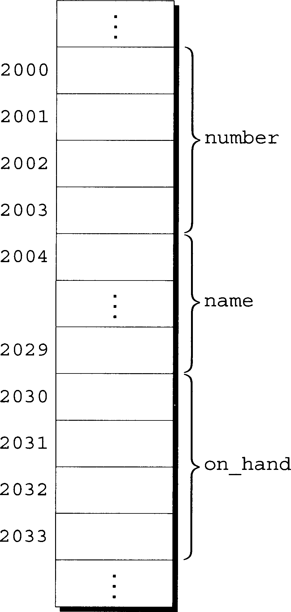

# Structures, Unions, and Enumerations


<!-- TOC -->

- [Structures, Unions, and Enumerations](#structures-unions-and-enumerations)
    - [结构变量](#结构变量)
        - [结构变量的声明](#结构变量的声明)
        - [结构变量的初始化](#结构变量的初始化)
        - [指定初始化（C99）](#指定初始化c99)
        - [对结构的操作](#对结构的操作)
    - [结构类型](#结构类型)
        - [结构标记的声明](#结构标记的声明)
        - [结构类型的定义](#结构类型的定义)
    - [References](#references)

<!-- /TOC -->


## 结构变量
1. 到目前为止介绍的唯一一种数据结构就是数组。数组有两个重要特性
    * 首先，数组的所有元素具有相同的类型；
    * 其次，为了选择数组元素需要指明元素的位置（作为整数下标）。
2. 结构所具有的特性与数组很不相同
    * 结构的元素（在 C 语言中的说法是结构的 **成员**）可能具有不同的类型。
    * 而且，每个结构成员都有名字，所以为了选择特定的结构成员需要指明结构成员的名字而不是它的位置。
3. 由于大多数编程语言都提供类似的特性，所以结构可能听起来很熟悉。在其他一些语言中，经常把结构称为 **记录**（record），把结构的成员称为 **字段**（field）。

### 结构变量的声明
1. 例如，假设需要记录存储在仓库中的零件。用来存储每种零件的信息可能包括零件的编号（整数）、零件的名称（字符串）以及现有零件的数量（整数）。为了产生一个可以存储全部3种数据项的变量，可以使用类似下面这样的声明：
    ```cpp
    struct {
        int number;
        char name[NAME_LEN+1];
        int on_hand;
    } part1, part2;
    ```
2. 每个结构变量都有 3 个成员：`number`（零件的编号）、`name`（零件的名称）和 `on_hand`（现有数量）。
3. 注意，这里的声明格式和 C 语言中其他变量的声明格式一样：`struct{...}` 指明了类型，而 `part1` 和 `part2` 则是具有这种类型的变量。
4. 结构的成员在内存中是按照声明的顺序存储的。为了说明 `part1` 在内存中存储的形式，现在假设：
    * `part1` 存储在地址为 2000 的内存单元中
    * 每个整数在内存中占 4 个字节
    * `NAME_LEN` 的值为 25
    * 成员之间没有间隙
5. 根据这些假设，`part1` 在内存中的样子如下所示
    
6. 每个结构代表一种新的作用域。任何声明在此作用域内的名字都不会和程序中的其他名字冲突。用 C 语言的术语可表述为，每个结构都为它的成员设置了独立的 **名字空间**（name space）。例如，下列声明可以出现在同一程序中：
    ```cpp
    struct {
        int number;
        char name[NAME_LEN+1];
        int on_hand;
    } part1, part2;

    struct {
        char name[NAME_LEN+1];
        int number;
        char sex;
    } employee1, employee2;
    ```

### 结构变量的初始化
1. 和数组一样，结构变量也可以在声明的同时进行初始化。为了对结构进行初始化，要把待存储到结构中的值的列表准备好并用花括号把它括起来：
    ```cpp
    struct  {
        int number;
        char name[NAME_LEN+1];
        int on_hand;
    }   part1 = {528, "Disk drive", 10},
        part2 = {914, "Printer cable", 5};
    ```
    初始化式中的值必须按照结构成员的顺序进行显示。
2. 用于结构初始化式的表达式必须是常量。例如，不能用变量来初始化结构 `part1` 的成员 `on_hand`。这一限制在 C99 中放宽了。
3. 初始化式中的成员数可以少于它所初始化的结构，就像数组那样，任何 “剩余的” 成员都用 0 作为它的初始值。特别地，剩余的字符数组中的字节数为 0，表示空字符串。

### 指定初始化（C99）
1. 考虑前面这个例子中 `part1` 的初始化式：
    ```cpp
    {528， "Disk drive", 10}
    ```
2. 指定初始化式与之相类似，但是在初始化时需要对每个元素名赋值：
    ```cpp
    {.number = 528, .name = "Disk drive", .on_hand = 10}
    ```
3. 将点号和成员名称的组合称为 **指示符**。
4. 指定初始化式有几个优点
    * 其一，易读且容易进行验证，因为读者可以清楚地看出结构中的成员和初始化式中的值之间的对应关系。
    * 其二，初始化式中的值的顺序不需要与结构中成员的顺序一致。以上这个例子可以写为：
        ```cpp
        {.on_hand = 10, .name = "Disk drive", .number = 528}
        ```
        因为顺序不是问题，所以程序员不必记住原始声明时成员的顺序。而且成员的顺序在之后还可以改变，不会影响指定初始化式。
5. 指定初始化式中列出来的值的前面不一定要有指示符。考虑下面的例子：
    ```cpp
    {.number = 528, "Disk drive", .on_hand = 10}
    ```
    值 `"Disk drive"` 的前面并没有指示符，所以编译器会认为它用于初始化结构中位于 `number` 之后的成员。

### 对结构的操作
1. 为了访问结构内的成员，首先写出结构的名字，然后写一个句点，再写出成员的名字。例如，下列语句将显示结构 `part1` 的成员的值：
    ```cpp
    printf("Part number: %d\n", part1.number);
    printf("Part name: %s\n", part1.name);
    printf("Quantity on hand: %d\n", part1.on_hand);
    ```
2. 结构的成员是左值，所以它们可以出现在赋值运算的左侧，也可以作为自增或自减表达式的操作数：
    ```cpp
    Part1.number = 258;          /* changes part1's part number */
    Part1.on_hand++;     /* increments part1's quantity on hand */
    ```
3. 用于访问结构成员的句点实际上就是一个 C 语言的运算符。它的运算优先级与后缀 `++` 和后缀 `--` 运算符一样，所以句点运算符的优先级几乎高于所有其他运算符。
4. 结构的另一种主要操作是赋值运算：
    ```cpp
    part2 = part1;
    ```
    这一语句的效果是把 `part1.number` 复制到 `part2.number`，把 `part1.name` 复制到 `part2.name`，依此类推。
5. 独立的数组不能直接复制，但是对结构进行复制时，嵌在结构内的数组也能得到复制。一些程序员利用这种性质来产生 “空” 结构，以封装稍候将进行复制的数组：
    ```cpp
    struct { int a[10]; } a1, a2;

    a1 = a2;   /* legal, since a1 and a2 are structures */
    ```
6. 运算符 `=` 仅仅用于类型兼容的结构。两个同时声明的结构是兼容的，使用同样的 “结构标记” 或同样的类型名声明的结构也是兼容的。
7. 除了赋值运算，C 语言没有提供其他用于整个结构的操作。 特别是不能使用运算符 `==` 和 `!=` 来判定两个结构相等还是不等。


## 结构类型
1. 前面说明了声明结构 **变量** 的方法，但是没有讨论命名结构 **类型**。
2. 假设程序需要声明几个具有相同成员的结构变量，如果一次可以声明全部变量，那么没有什么问题。但是，如果需要在程序中的不同位置声明变量，那么问题就复杂了。如果在某处编写了
    ```cpp
    struct {
        int number;
        char name[NAME_LEN+1];
        int on_hand;
    } part1;
    ```
    并且在另一处编写了
    ```cpp
    struct {
        int number;
        char name[NAME_LEN+1];
        int on_hand;
    } part2;
    ```
    那么立刻就会出现问题：重复的结构信息会使程序膨胀；因为难以确保这些声明会保持一致，将来修改程序会有风险。
3. 但是这些还都不是最大的问题。根据 C 语言的规则，`part1` 和 `part2` 不具有兼容的类型，因此不能把 `part1` 赋值给 `part2`，反之亦然。
4. 而且，因为 `part1 `和 `part2` 的类型都没有名字，所以也就不能把它们用作函数调用的参数。
5. 为了克服这些困难，需要定义表示结构 **类型**（而不是特定的结构 **变量**）的名字。 C 语言提供了两种命名结构的方法：可以声明 “结构标记”，也可以使用 `typedef` 来定义类型名。

### 结构标记的声明
1. **结构标记**（structure tag）是用于标识某种特定结构的名字。下面的例子声明了名为 `part 的结构标记：
    ```cpp
    struct part {
        int number;
        char name[NAME_LEN+1];
        int on_hand;
    };
    ```
2. 注意，右花括号后的分号是必不可少的，它表示声明结束。如果无意间忽略了结构声明结尾的分号，可能会导致奇怪的错误。考虑下面的例子：
    ```cpp
    struct part {
        int number;
        char name[NAME_LEN+1];
        int on_hand;
    }              /*** WRONG: semicolon missing *** /

    f(void)
    {
        ...
        return 0;    /* error detected at this line */
    }
    ```
    程序员没有指定函数 `f` 的返回类型。由于前面的结构声明没有正常终止，所以编译器会假设函数 `f` 的返回值是 `struct part` 类型的。编译器直到执行函数中第一条 `return` 语句时才会发现错误。
3. 一旦创建了标记 `part`，就可以用它来声明变量了：
    ```cpp
    struct part part1, part2;
    ```
3. 但是，不能通过漏掉单词 `struct` 来缩写这个声明：
    ```cpp
    part part1, part2;     /*** WRONG ***/
    ```
    `part` 不是类型名。如果没有单词 `struct` 的话，它没有任何意义。
4. 因为结构标记只有在前面放置了单词 `struct` 才会有意义，所以它们不会和程序中用到的其他名字发生冲突。程序拥有名为 `part` 的变量是完全合法的，虽然有点容易混淆。
5. 结构标记的声明可以和结构变量的声明合并在一起：
    ```cpp
    struct part {
        int number;
        char name[NAME_LEN+1];
        int on_hand;
    } part1,  part2;
    ```
6. 所有声明为 `struct part` 类型的结构彼此之间是兼容的：
    ```cpp
    struct part part1 = {528, "Disk drive", 10};
    struct part part2;

    part2 = part1;    /* legal; both parts have the same type */
    ```

### 结构类型的定义
1. 除了声明结构标记，还可以用 `typedef` 来定义真实的类型名。例如，可以按照如下方式定义名为 `Part` 的类型：
    ```cpp
    typedef struct  {
        int number;
        char name[NAME_LEN+1];
        int on_hand;
    } Part;
    ```
2. 可以像内置类型那样使用 `Part`。例如，可以用它声明变量：
    ```cpp
    Part part1, part2;
    ```
3. 因为类型 `Part` 是 `typedef` 的名字，所以不允许书写 `struct Part`。
4. 需要命名结构时， 通常既可以选择声明结构标记也可以使用 `typedef`。但是，结构用于链表时，强制使用声明结构标记。


## References
* [C语言程序设计](https://book.douban.com/subject/4279678/)