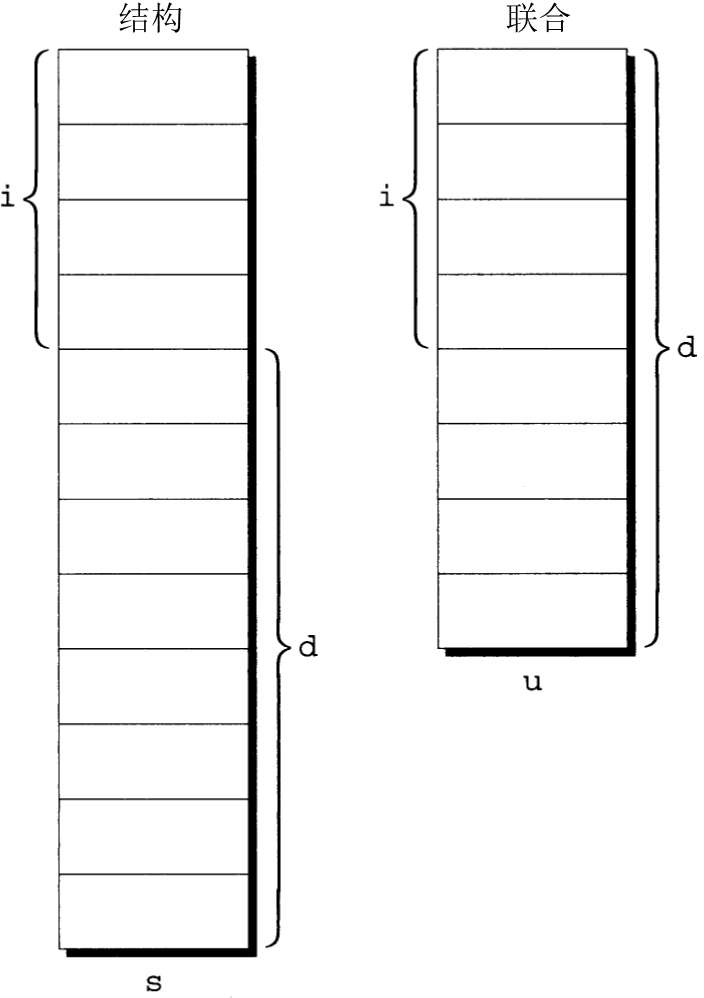

# Structures, Unions, and Enumerations


<!-- TOC -->

- [Structures, Unions, and Enumerations](#structures-unions-and-enumerations)
    - [结构变量](#结构变量)
        - [结构变量的声明](#结构变量的声明)
        - [结构变量的初始化](#结构变量的初始化)
        - [指定初始化（C99）](#指定初始化c99)
        - [对结构的操作](#对结构的操作)
        - [结构占用的字节数](#结构占用的字节数)
    - [结构类型](#结构类型)
        - [结构标记的声明](#结构标记的声明)
        - [结构类型的定义](#结构类型的定义)
        - [重复声明](#重复声明)
        - [结构作为参数和返回值](#结构作为参数和返回值)
        - [复合字面量](#复合字面量)
    - [嵌套的数组和结构](#嵌套的数组和结构)
        - [嵌套的结构](#嵌套的结构)
        - [结构数组](#结构数组)
        - [结构数组的初始化](#结构数组的初始化)
        - [示例程序——维护零件数据库](#示例程序维护零件数据库)
            - [`inventory.c`](#inventoryc)
            - [`read_line`](#read_line)
    - [联合](#联合)
        - [用联合来节省空间](#用联合来节省空间)
        - [用联合来构造混合的数据结构](#用联合来构造混合的数据结构)
        - [为联合添加 “标记字段”](#为联合添加-标记字段)
    - [枚举](#枚举)
        - [枚举标记和类型名](#枚举标记和类型名)
        - [枚举作为整数](#枚举作为整数)
        - [用枚举声明 “标记字段”](#用枚举声明-标记字段)
    - [练习](#练习)
    - [References](#references)

<!-- /TOC -->


## 结构变量
1. 到目前为止介绍的唯一一种数据结构就是数组。数组有两个重要特性
    * 首先，数组的所有元素具有相同的类型；
    * 其次，为了选择数组元素需要指明元素的位置（作为整数下标）。
2. 结构所具有的特性与数组很不相同
    * 结构的元素（在 C 语言中的说法是结构的 **成员**）可能具有不同的类型。
    * 而且，每个结构成员都有名字，所以为了选择特定的结构成员需要指明结构成员的名字而不是它的位置。
3. 由于大多数编程语言都提供类似的特性，所以结构可能听起来很熟悉。在其他一些语言中，经常把结构称为 **记录**（record），把结构的成员称为 **字段**（field）。

### 结构变量的声明
1. 例如，假设需要记录存储在仓库中的零件。用来存储每种零件的信息可能包括零件的编号（整数）、零件的名称（字符串）以及现有零件的数量（整数）。为了产生一个可以存储全部 3 种数据项的变量，可以使用类似下面这样的声明：
    ```cpp
    struct {
        int number;
        char name[NAME_LEN+1];
        int on_hand;
    } part1, part2;
    ```
2. 每个结构变量都有 3 个成员：`number`（零件的编号）、`name`（零件的名称）和 `on_hand`（现有数量）。
3. 注意，这里的声明格式和 C 语言中其他变量的声明格式一样：`struct{...}` 指明了类型，而 `part1` 和 `part2` 则是具有这种类型的变量。
4. 结构的成员在内存中是按照声明的顺序存储的。为了说明 `part1` 在内存中存储的形式，现在假设：
    * `part1` 存储在地址为 2000 的内存单元中
    * 每个整数在内存中占 4 个字节
    * `NAME_LEN` 的值为 25
    * 成员之间没有间隙
5. 根据这些假设，`part1` 在内存中的样子如下所示
    
6. 每个结构代表一种新的作用域。任何声明在此作用域内的名字都不会和程序中的其他名字冲突。用 C 语言的术语可表述为，每个结构都为它的成员设置了独立的 **名字空间**（name space）。例如，下列声明可以出现在同一程序中：
    ```cpp
    struct {
        int number;
        char name[NAME_LEN+1];
        int on_hand;
    } part1, part2;

    struct {
        char name[NAME_LEN+1];
        int number;
        char sex;
    } employee1, employee2;
    ```

### 结构变量的初始化
1. 和数组一样，结构变量也可以在声明的同时进行初始化。为了对结构进行初始化，要把待存储到结构中的值的列表准备好并用花括号把它括起来：
    ```cpp
    struct  {
        int number;
        char name[NAME_LEN+1];
        int on_hand;
    }   part1 = {528, "Disk drive", 10},
        part2 = {914, "Printer cable", 5};
    ```
    初始化式中的值必须按照结构成员的顺序进行显示。
2. 用于结构初始化式的表达式必须是常量。例如，不能用变量来初始化结构 `part1` 的成员 `on_hand`。这一限制在 C99 中放宽了。
3. 初始化式中的成员数可以少于它所初始化的结构，就像数组那样，任何 “剩余的” 成员都用 0 作为它的初始值。特别地，剩余的字符数组中的字节数为 0，表示空字符串。

### 指定初始化（C99）
1. 考虑前面这个例子中 `part1` 的初始化式：
    ```cpp
    {528， "Disk drive", 10}
    ```
2. 指定初始化式与之相类似，但是在初始化时需要对每个元素名赋值：
    ```cpp
    {.number = 528, .name = "Disk drive", .on_hand = 10}
    ```
3. 将点号和成员名称的组合称为 **指示符**。
4. 指定初始化式有几个优点
    * 其一，易读且容易进行验证，因为读者可以清楚地看出结构中的成员和初始化式中的值之间的对应关系。
    * 其二，初始化式中的值的顺序不需要与结构中成员的顺序一致。以上这个例子可以写为：
        ```cpp
        {.on_hand = 10, .name = "Disk drive", .number = 528}
        ```
        因为顺序不是问题，所以程序员不必记住原始声明时成员的顺序。而且成员的顺序在之后还可以改变，不会影响指定初始化式。
5. 指定初始化式中列出来的值的前面不一定要有指示符。考虑下面的例子：
    ```cpp
    {.number = 528, "Disk drive", .on_hand = 10}
    ```
    值 `"Disk drive"` 的前面并没有指示符，所以编译器会认为它用于初始化结构中位于 `number` 之后的成员。

### 对结构的操作
1. 为了访问结构内的成员，首先写出结构的名字，然后写一个句点，再写出成员的名字。例如，下列语句将显示结构 `part1` 的成员的值：
    ```cpp
    printf("Part number: %d\n", part1.number);
    printf("Part name: %s\n", part1.name);
    printf("Quantity on hand: %d\n", part1.on_hand);
    ```
2. 结构的成员是左值，所以它们可以出现在赋值运算的左侧，也可以作为自增或自减表达式的操作数：
    ```cpp
    Part1.number = 258;          /* changes part1's part number */
    Part1.on_hand++;     /* increments part1's quantity on hand */
    ```
3. 用于访问结构成员的句点实际上就是一个 C 语言的运算符。它的运算优先级与后缀 `++` 和后缀 `--` 运算符一样，所以句点运算符的优先级几乎高于所有其他运算符。
4. 结构的另一种主要操作是赋值运算：
    ```cpp
    part2 = part1;
    ```
    这一语句的效果是把 `part1.number` 复制到 `part2.number`，把 `part1.name` 复制到 `part2.name`，依此类推。
5. 独立的数组不能直接复制，但是对结构进行复制时，嵌在结构内的数组也能得到复制。一些程序员利用这种性质来产生 “空” 结构，以封装稍候将进行复制的数组：
    ```cpp
    struct { int a[10]; } a1, a2;

    a1 = a2;   /* legal, since a1 and a2 are structures */
    ```
6. 运算符 `=` 仅仅用于类型兼容的结构。两个同时声明的结构是兼容的，使用同样的 “结构标记” 或同样的类型名声明的结构也是兼容的。
7. 除了赋值运算，C 语言没有提供其他用于整个结构的操作。 特别是不能使用运算符 `==` 和 `!=` 来判定两个结构相等还是不等。

### 结构占用的字节数
1. 当试图使用 `sizeof` 运算符来确定结构中的字节数量时，获得的数大于成员加在一起后的数
    ```cpp
    struct {
        char a;
        int b;
    } s;

    printf("%d", sizeof(s)); // 8
    ```
2. 一些计算机要求特定数据项的地址是某个字节数（一般是 2 个、4 个或 8 个字节，由数据项的类型决定）的倍数。为了满足这一要求，编译器会在邻近的成员之间留 “空洞”（即不使用的字节），从而使结构的成员 “对齐”。
3. 如果假设数据项必须从 4 个字节的倍数开始，那么结构 `s` 的成员 `a` 后面将有 3 个字节的空洞，从而 `sizeof(s)` 为 8。
4. 就像在成员间有空洞一样，结构也可以在末尾有空洞。例如，结构
    ```cpp
    struct {
        int a;
        char b;
    } s;
    ```
    可能在成员 `b` 的后边有 3 个字节的空洞。
5. 但是，结构的开始处不会有 “空洞”。因此可以确保指向结构第一个成员的指针就是指向整个结构的指针。注意这两个指针的类型不同。


## 结构类型
1. 前面说明了声明结构 **变量** 的方法，但是没有讨论命名结构 **类型**。
2. 假设程序需要声明几个具有相同成员的结构变量，如果一次可以声明全部变量，那么没有什么问题。但是，如果需要在程序中的不同位置声明变量，那么问题就复杂了。如果在某处编写了
    ```cpp
    struct {
        int number;
        char name[NAME_LEN+1];
        int on_hand;
    } part1;
    ```
    并且在另一处编写了
    ```cpp
    struct {
        int number;
        char name[NAME_LEN+1];
        int on_hand;
    } part2;
    ```
    那么立刻就会出现问题：重复的结构信息会使程序膨胀；因为难以确保这些声明会保持一致，将来修改程序会有风险。
3. 但是这些还都不是最大的问题。根据 C 语言的规则，`part1` 和 `part2` 不具有兼容的类型，因此不能把 `part1` 赋值给 `part2`，反之亦然。
4. 而且，因为 `part1 `和 `part2` 的类型都没有名字，所以也就不能把它们用作函数调用的参数。
5. 为了克服这些困难，需要定义表示结构 **类型**（而不是特定的结构 **变量**）的名字。 C 语言提供了两种命名结构的方法：可以声明 “结构标记”，也可以使用 `typedef` 来定义类型名。

### 结构标记的声明
1. **结构标记**（structure tag）是用于标识某种特定结构的名字。下面的例子声明了名为 `part` 的结构标记：
    ```cpp
    struct part {
        int number;
        char name[NAME_LEN+1];
        int on_hand;
    };
    ```
2. 注意，右花括号后的分号是必不可少的，它表示声明结束。如果无意间忽略了结构声明结尾的分号，可能会导致奇怪的错误。考虑下面的例子：
    ```cpp
    struct part {
        int number;
        char name[NAME_LEN+1];
        int on_hand;
    }              /*** WRONG: semicolon missing *** /

    f(void)
    {
        ...
        return 0;    /* error detected at this line */
    }
    ```
    程序员没有指定函数 `f` 的返回类型。由于前面的结构声明没有正常终止，所以编译器会假设函数 `f` 的返回值是 `struct part` 类型的。编译器直到执行函数中第一条 `return` 语句时才会发现错误。
3. 一旦创建了标记 `part`，就可以用它来声明变量了：
    ```cpp
    struct part part1, part2;
    ```
3. 但是，不能通过漏掉单词 `struct` 来缩写这个声明：
    ```cpp
    part part1, part2;     /*** WRONG ***/
    ```
    `part` 不是类型名。如果没有单词 `struct` 的话，它没有任何意义。
4. 因为结构标记只有在前面放置了单词 `struct` 才会有意义，所以它们不会和程序中用到的其他名字发生冲突。程序拥有名为 `part` 的变量是完全合法的，虽然有点容易混淆。
5. 结构标记的声明可以和结构变量的声明合并在一起：
    ```cpp
    struct part {
        int number;
        char name[NAME_LEN+1];
        int on_hand;
    } part1,  part2;
    ```
6. 所有声明为 `struct part` 类型的结构彼此之间是兼容的：
    ```cpp
    struct part part1 = {528, "Disk drive", 10};
    struct part part2;

    part2 = part1;    /* legal; both parts have the same type */
    ```

### 结构类型的定义
1. 除了声明结构标记，还可以用 `typedef` 来定义真实的类型名。例如，可以按照如下方式定义名为 `Part` 的类型：
    ```cpp
    typedef struct  {
        int number;
        char name[NAME_LEN+1];
        int on_hand;
    } Part;
    ```
2. 可以像内置类型那样使用 `Part`。例如，可以用它声明变量：
    ```cpp
    Part part1, part2;
    ```
3. 因为类型 `Part` 是 `typedef` 的名字，所以不允许书写 `struct Part`。
4. 需要命名结构时， 通常既可以选择声明结构标记也可以使用 `typedef`。但是，结构用于链表时，强制使用声明结构标记。

### 重复声明
1. 如果在两个不同的文件中包含了结构 `part` 的声明，那么一个文件中的 `part` 类型变量和另一个文件中的` part` 类型变量是否一样呢？
2. 技术上来说，不一样。但是，C 标准提到，一个文件中的 `part` 类型变量所具有的类型和另一个文件中的 `part` 类型变量所具有的类型是兼容的。
3. 具有兼容类型的变量可以互相赋值，所以在实际中 “兼容的” 类型和 “相同的” 类型之间几乎没有差异。
4. C89 和 C99 中有关结构兼容性的法则稍有不同。在 C89 中，对于在不同文件中定义的结构来说，如果它们的成员具有同样的名字并且顺序一样，那么它们是兼容的，相应的成员类型也是兼容的。C99 则更进一步，它要求两个结构要么具有相同的标记，要么都没有标记。
5. 类似的兼容性法则也适用于联合和枚举（在 C89 和 C99 标准之间的差异也一样）。

### 结构作为参数和返回值
1. 函数可以有结构类型的实际参数和返回值。例如，当把 `part` 结构用作实际参数时，下面的 `print_part` 函数显示出结构的成员：
    ```cpp
    void print_part(struct part p)
    {
        printf("Part number: %d\n", p.number);
        printf("Part name: %s\n", p.name);
        printf("Quantity on hand: %d\n", p.on_hand);
    }
    ```
2. 下面是 `print_part` 可能的调用方法：
    ```cpp
    print_part(part1);
    ```
3. 下面的 `build_part` 函数返回 `part` 结构，此结构由函数的实际参数构成：
    ```cpp
    struct part build_part(int number, const char * name, int on_hand)
    {
        struct part p;

        p.number = number;
        strcpy (p.name, name);
        p.on_hand = on_hand;
        return p;
    }
    ```
    函数 `build_part` 的形式参数名和结构 `part` 的成员名相同是合法的，因为结构拥有自己的名字空间。
4. 下面是 `build_part` 可能的调用方法：
    ```cpp
    part1 = build_part(528, "Disk drive", 10);
    ```
5. 给函数传递结构和从函数返回结构都要求生成结构中所有成员的副本。这样的结果是，这些操作对程序强加了一定数量的系统开销，特别是结构很大的时候。
6. 为了避免这类系统开销，有时用传递指向结构的指针来代替传递结构本身是很明智的做法。类似地，可以使函数返回指向结构的指针来代替返回实际的结构。
7. 除了效率方面的考虑之外，避免创建结构的副本还有其他原因。例如，`<stdio.h>` 定义了一个名为 `FILE` 的类型，它通常是结构。每个 `FILE` 结构存储的都是已打开文件的状态信息，因此在程序中必须是唯一的。`<stdio.h>` 中每个用于打开文件的函数都返回一个指向 `FILE` 结构的指针，每个对已打开文件执行操作的函数都需要用 `FILE` 指针作为参数。
8. 有时，可能希望在函数内部初始化结构变量来匹配其他结构（可能作为函数的形式参数）。在下面的例子中，`part2` 的初始化式是传递给函数 `f` 的形式参数：
    ```cpp
    void f(struct part part1)
    {
        struct part part2 = part1;
        ...
    }
    ```
9. C 语言允许这类初始化式，因为初始化的结构（此例中的 `part2`）具有自动存储期限，也就是说它局部于函数并且没有声明为 `static`。
10. 初始化式可以是适当类型的任意表达式，包括返回结构的函数调用。


### 复合字面量
1. 数组的复合字面量被用于创建没有名字的数组，这样做的目的通常是将数组作为参数传递给函数。复合字面量同样也可以用于 “实时” 创建一个结构，而不需要先将其存储在变量中。
2. 生成的结构可以像参数一样传递，可以被函数返回，也可以赋值给变量。接下来看两个例子。
3. 首先，使用复合字面量创建一个结构，这个结构将传递给函数。例如，可以按如下方式调用 `print_part` 函数：
    ```cpp
    print_part((struct part) {528, "Disk drive", 10});
    ```
4. 下面的语句把复合字面量赋值给变量：
    ```cpp
    part1 = (struct part) {528, "Disk drive", 10};
    ```
    这一语句类似于包含初始化式的声明，但不完全一样——初始化式只能出现在声明中，不能出现在这样的赋值语句中。
5. 一般，复合字面量包括圆括号里的类型名和后续花括号里的一组值。如果复合字面量代表一个结构，类型名可以是结构标签的前面加上 `struct` 或者 `typedef`。
6. 一个复合字面量可以包括指示符，就像指定初始化式一样：
    ```cpp
    print_part((struct part) {.on_hand = 10,
                            .name = "Disk drive",
                            .number = 528});
    ```
7. 复合字面量不会提供完全的初始化，所以任何未初始化的成员默认值为 0。


## 嵌套的数组和结构
### 嵌套的结构
1. 例如，假设声明了如下的结构，此结构用来存储一个人的名、中名和姓：
    ```cpp
    struct person_name {
        char first[FIRST_NAME_LEN+1];
        char middle_initial;
        char last[LAST_NAME_LEN+1];
    };
    ```
2. 可以用结构 `person_name` 作为更大结构的一部分内容：
    ```cpp
    struct student {
        struct person_name name;
        int_id, age;
        char sex;
    } student1, student2;
    ```
3. 访问 `student1` 的名、中名或姓需要两次应用 `.` 运算符。
    ```cpp
    strcpy(student1.name.first, "Fred");
    ```

### 结构数组
1. 数组和结构最常见的组合之一就是其元素为结构的数组。这类数组可以用作简单的数据库。例如，下列结构 `part` 数组能够存储 100 种零件的信息：
    ```cpp
    struct part inventory[100];
    ```
2. 为了访问数组中的某种零件，可以使用取下标方式
    ```cpp
    print_part(inventory[`i`]);
    ```
3. 访问结构 `part` 内的成员要求结合使用取下标和成员选择。为了给 `inventory[i]` 中的成员 `number` 赋值 883，可以写成
    ```cpp
    inventory[i].number = 883;
    ```
4. 为了使存储在 `inventory[i]` 中的名字变为空字符串，可以写成
    ```cpp
    inventory[i].name[0] = '\0';
    ```

### 结构数组的初始化
1. 初始化结构数组与初始化多维数组的方法非常相似。每个结构都拥有自己的花括号括起来的初始化式，数组的初始化式简单地在结构初始化式的外围括上另一对花括号。
2. 初始化结构数组的原因之一是，我们打算把它作为程序执行期间不改变的信息的数据库。例如，假设程序在打国际长途电话时会需要访问国家（地区）代码。
3. 首先，将设置结构用来存储国家（地区）名和相应代码：
    ```cpp
    struct dialing_code {
        char *country;
        int code;
    };
    ```
    注意，`country` 是指针而不是字符数组。如果计划用 `dialing_code` 结构作为变量可能有问题，但是这里没这样做。当初始化 `dialing_code` 结构时，`country` 会指向字符串字面量。
4. 接下来，声明这类结构的数组并对其进行初始化，从而使此数组包含一些世界上人口最多的国家的代码：
    ```cpp
    const struct dialing_code country_codes[] = {
        {"Argentina",            54}, {"Bangladesh",          880},
        {"Brazi1",               55}, {"Burma (Myanmar)",      95},
        {"China",                86}, {"Colombia",             57},
        {"Congo, Dem. Rep. of", 243}, {"Egypt",                20},
        {"Ethiopia",            251}, {"France",               33},
        {"Germany",              49}, {"India ",               91},
        {"Indonesia",            62}, {"Iran",                 98},
        {"Italy",                39}, {"Japan",                81},
        {"Mexico",               52}, {"Nigeria",             234},
        {"Pakistan",             92}, {"Philippines",          63},
        {"Poland",               48}, {"Russia",                7},
        {"South Africa",         27}, {"Korea",                82},
        {"Spain",                34}, {"Sudan",               249},
        {"Thailand",             66}, {"Turkey",               90},
        {"Ukraine",             380}, {"United Kingdom",       44},
        {"United States",         1}, {"Vietnam",             84}
    };
    ```
5. 每个结构值两边的内层花括号是可选的。然而，基于书写风格的考虑，最好不要省略它们
    ```cpp
    const struct dialing_code country_codes[] = {
        "Argentina",54, "Bangladesh",880,
        "Brazi1",55, "Burma (Myanmar)",95,
        "China",86, "Colombia",57,
        "Congo, Dem. Rep. of",243, "Egypt",20,
        "Ethiopia",251, "France",33,
        "Germany",49, "India ",91,
        "Indonesia",62, "Iran",98,
        "Italy",39, "Japan",81,
        "Mexico",52, "Nigeria",234,
        "Pakistan",92, "Philippines",63,
        "Poland",48, "Russia",7,
        "South Africa",27, "Korea",82,
        "Spain",34, "Sudan",249,
        "Thailand",66, "Turkey",90,
        "Ukraine",380, "United Kingdom",44,
        "United States",1, "Vietnam",84
    };
    ```
6. 由于结构数组（以及包含数组的结构）很常见，因此 C99 的指定初始化式允许每一项具有多个指示符。假定我们想初始化 `inventory` 数组使其只包含一个零件，零件编号为 528，现货数量为 10，名字暂时为空：
    ```cpp
    struct part inventory[100] =
        {
            [0].number = 528, [0].on_hand = 10, [0].name[0] = '\0'
        };
    ```
7. 列表中的前两项使用了两个指示符（一个用于选择数组元素 0——`part` 结构，另一个用于选择结构中的成员）。最后一项试用了 3 个指示符：一个用于选择数组元素，一个用于选择该元素的 `name` 成员，另一个用于选择 `name` 的元素 0。

### 示例程序——维护零件数据库
1. 此程序用来维护仓库存储的零件的信息的数据库。程序围绕一个结构数组构建，且每个结构包含以下信息：零件的编号、名称以及数量。
2. 程序将支持下列操作
    * 添加新零件编号、名称和初始的现货数量。如果零件已经在数据库中，或者数据库已满，那么程序必须显示出错信息。
    * 给定零件编号，显示出零件的名称和当前的现货数量。如果零件编号不在数据库中，那么程序必须显示出错信息。
    * 给定零件编号，改变现有的零件数量。如果零件编号不在数据库中，那么程序必须显示出错信息。
    * 显示列出数组库中全部信息的表格。零件必须按照录入的顺序显示出来。
    * 终止程序的执行。
3. 使用 `i`（插入）、`s`（搜索）、`u`（更新）、`p`（显示）和 `q`（退出）分别表示这些操作。与程序的会话可能如下：
    ```sh
    Enter operation code: i
    Enter part number: 528
    Enter part name: Disk drive
    Enter quantity on hand: 10

    Enter operation code: s
    Enter part number: 528
    Part name: Disk drive
    Quantity on hand: 10

    Enter operation code: s
    Enter part number: 914
    Part not found.

    Enter operation code: i
    Enter part number: 914
    Enter part name: Printer cable
    Enter quantity on hand: 5

    Enter operation code: u
    Enter part number: 528
    Enter change in quantity on hand: -2

    Enter operation code: s
    Enter part number: 528
    Part name: Disk drive
    Quantity on hand: 8

    Enter operation code: p
    Part Number   Part Name              Quantity on Hand
        528       Disk drive                     8
        914       Printer cable                  5

    Enter operation code: q
    ```
4. 程序将在结构中存储每种零件的信息。这里限制数据库的大小为 100 种零件，这使得用数组来存储结构成为可能，这里称此数组为 `inventory`。为了记录当前存储在数组中的零件数，使用名为 `num_parts` 的变量。
5. 主循环结构：
    ```cpp
    for (;;) {
        提示用户输入操作码
        读操作码
        switch（操作码）{
            case 'i': 执行插入操作; break;
            case 's': 执行搜索操作; break;
            case 'u': 执行更新操作; break;
            case 'p': 执行显示操作; break;
            case 'q': 终止程序;
            default: 显示出错信息;
        }
    }
    ```
6. 为了方便起见，将分别设置不同的函数执行插入、搜索、更新和显示操作。
7. 因为这些函数都需要访问 `inventory` 和 `num_parts`，所以可以把这些变量设置为外部变量。或者把变量声明在 `main` 函数内，然后把它们作为实际参数传递给函数。
8. 从设计角度来说，使变量局部于函数通常比把它们外部化更好。然而，在此程序中，把 `inventory` 和 `num_parts` 放在 `main` 函数中只会使程序复杂化。
9. 这里决定把程序分割为三个文件：`inventory.c` 文件，它包含程序的大部分内容；`readline.h` 文件，它包含 `read_line` 函数的原型； `readline.c` 文件，它包含 `read_line` 函数的定义。

#### `inventory.c`
1. 实现如下
    ```cpp
    /* Maintains a parts database (array version) */

    #include <stdio.h>
    #include "readline.h"

    #define NAME_LEN 25
    #define MAX_PARTS 100

    struct part {
        int number;
        char name[NAME_LEN+1];
        int on_hand;
    } inventory[MAX_PARTS];

    int num_parts = 0;   /* number of parts currently stored */

    int find_part(int number);
    void insert(void);
    void search(void);
    void update(void);
    void print(void);

    /**********************************************************
     * main: Prompts the user to enter an operation code,     *
     *       then calls a function to perform the requested   *
     *       action. Repeats until the user enters the        *
     *       command 'q'. Prints an error message if the user *
     *       enters an illegal code.                          *
     **********************************************************/
    int main(void)
    {
        char code;

        for (;;) {
            printf("Enter operation code: ");
            scanf(" %c", &code);
            while (getchar() != '\n')   /* skips to end of line */
                ;
            switch (code) {
                case 'i': insert(); break;
                case 's': search(); break;
                case 'u': update(); break;
                case 'p': print();  break;
                case 'q':           return 0;
                default:  printf("Illegal code\n");
            }
            printf("\n");
        }
    }

    /**********************************************************
     * find_part: Looks up a part number in the inventory     *
     *            array. Returns the array index if the part  *
     *            number is found; otherwise, returns -1.     *
     **********************************************************/
    int find_part(int number)
    {
        int i;

        for (i = 0; i < num_parts; i++)
            if ( inventory[i].number == number )
                return i;
        return -1;
    }

    /**********************************************************
     * insert: Prompts the user for information about a new   *
     *         part and then inserts the part into the        *
     *         database. Prints an error message and returns  *
     *         prematurely if the part already exists or the  *
     *         database is full.                              *
     **********************************************************/
    void insert(void)
    {
        int part_number;

        if ( num_parts == MAX_PARTS ) {
            printf("Database is full; can't add more parts.\n");
            return;
        }

        printf("Enter part number: ");
        scanf("%d", &part_number);

        if ( find_part(part_number) >= 0 ) {
            printf("Part already exists.\n");
            return;
        }

        inventory[num_parts].number = part_number;
        printf("Enter part name: ");
        read_line(inventory[num_parts].name, NAME_LEN);
        printf("Enter quantity on hand: ");
        scanf("%d", &inventory[num_parts].on_hand);
        num_parts++;
    }

    /**********************************************************
     * search: Prompts the user to enter a part number, then  *
     *         looks up the part in the database. If the part *
     *         exists, prints the name and quantity on hand;  *
     *         if not, prints an error message.               *
     **********************************************************/
    void search(void)
    {
        int i, number;

        printf("Enter part number: ");
        scanf("%d", &number);
        i = find_part(number);
        if (i >= 0) {
            printf("Part name: %s\n", inventory[i].name);
            printf("Quantity on hand: %d\n", inventory[i].on_hand);
        } 
        else {
            printf("Part not found.\n");
        }
    }

    /**********************************************************
     * update: Prompts the user to enter a part number.       *
     *         Prints an error message if the part doesn't    *
     *         exist; otherwise, prompts the user to enter    *
     *         change in quantity on hand and updates the     *
     *         database.                                      *
     **********************************************************/
    void update(void)
    {
        int i, number, change;

        printf("Enter part number: ");
        scanf("%d", &number);
        i = find_part(number);
        if (i >= 0) {
            printf("Enter change in quantity on hand: ");
            scanf("%d", &change);
            inventory[i].on_hand += change;
        } 
        else {
            printf("Part not found.\n");
        }
    }

    /**********************************************************
     * print: Prints a listing of all parts in the database,  *
     *        showing the part number, part name, and         *
     *        quantity on hand. Parts are printed in the      *
     *        order in which they were entered into the       *
     *        database.                                       *
     **********************************************************/
    void print(void)
    {
        int i;

        printf("Part Number   Part Name                  "
                "Quantity on Hand\n");
        for (i = 0; i < num_parts; i++)
            printf("%7d       %-25s%11d\n", inventory[i].number,
                inventory[i].name, inventory[i].on_hand);
    }
    ```
2. 在 `main` 函数中，格式串 `" %c"` 允许 `scanf` 函数在读入操作码之前跳过空白字符。格式串中的空格是至关重要的，如果没有它，`scanf` 函数有时会读入前一输入行末尾的换行符。

#### `read_line`
1. 这个函数用来读零件的名字。思考当用户插入零件时会发生什么：
    ```sh
    Enter part number: 528
    Enter part name: Disk drive
    ```
2. 在录入完零件的编号后，用户按回车键，录入零件的名字后再次按了回车键，这样每次都无形中给程序留下一个必须读取的换行符。为了讨论方便，现在假装这些字符都是可见的：
    ```sh
    Enter part number: 528¤
    Enter part name: Disk drive¤
    ```
3. 当调用 `scanf` 函数来读零件编号时，函数吸收了 `5`、`2` 和 `8`，但是留下了字符 `¤` 未读。之后在读取时，那么函数将会立刻遇到字符 `¤`，并且停止读入。
4. 解决办法就是让 `read_line` 函数在开始往字符串中存储字符之前跳过空白字符。这不仅解决了换行符的问题，而且可以避免存储用户在零件名称的开始处录入的任何空白。
5. 由于 `read_line` 函数与 `inventory.c` 文件中的其他函数无关，而且它在其他程序中有复用的可能，所以我们决定把此函数从 `inventory.c` 中独立出来。
6. `readline.h`
    ```cpp
    #ifndef READLINE_H
    #define READLINE_H

    /**********************************************************
     * read_line: Skips leading white-space characters, then  *
     *            reads the remainder of the input line and   *
     *            stores it in str. Truncates the line if its *
     *            length exceeds n. Returns the number of     *
     *            characters stored.                          *
     **********************************************************/
    int read_line(char str[], int n);

    #endif
    ```
7. `readline.c`
    ```cpp
    #include <ctype.h>
    #include <stdio.h>
    #include "readline.h"

    int read_line(char str[], int n)
    {
        int ch, i = 0;

        while (isspace(ch = getchar()))
            ;
        while ( ch != '\n' && ch != EOF ) {
            if (i < n) {
                str[i++] = ch;
            }
            ch = getchar();
        }
        str[i] = '\0';
        return i;
    }
    ```


## 联合
1. 像结构一样，**联合**（union）也是由一个或多个成员构成的，而且这些成员可能具有不同的类型。
2. 但是，编译器只为联合中最大的成员分配足够的内存空间。联合的成员在这个空间内彼此覆盖。这样的结果是，给一个成员赋予新值也会改变其他成员的值。
3. 为了说明联合的基本性质，现在声明一个联合变量 `u`，且这个联合变量有两个成员：
    ```cpp
    union {
        int i;
        double d;
    } u;
    ```
4. 联合的声明方式非常类似于结构的声明方式
    ```cpp
    struct {
        int i;
        double d;
    } s;
    ```
5. 事实上，结构变量 `s` 和联合变量 `u` 只有一处不同：`s` 的成员存储在 **不同** 的内存地址中，而 `u` 的成员存储在 **同一** 内存地址中。
6. 下面是 `s `和 `u` 在内存中的存储情况（假设 `int` 类型的值要占 4 个字节内存，而 `double` 类型的值占用 8 个字节）：
    
7. 在结构变量 `s `中，成员 `i` 和 `d` 占有不同的内存单元。`s` 总共占用了 12 个字节。在联合变量 `u` 中，成员 `i` 和 `d` 互相交迭，`i` 实际上是 `d` 的前 4 个字节，所以 `u` 只占用了 8 个字节。
8. 此外，`i` 和 `d` 具有相同的地址。
9. 访问联合成员的方法和访问结构成员的方法相同。为了把数 82 存储到 `u` 的成员 `i` 中，可以写成
    ```cpp
    u.i = 82;
    ```
    为了把值 74.8 存储到成员 `d` 中，可以写成
    ```cpp
    u.d = 74.8;
    ```
10. 因为编译器把联合的成员重叠存储，所以改变一个成员就会使之前存储在任何其他成员中的值发生改变。因此，如果把一个值存储到 `u.d` 中，那么先前存储在 `u.i` 中的值将会丢失。如果测试 `u.i` 的值，那么它会显示出无意义的内容
    ```cpp
    union {
        int i;
        double d;
    } u;

    int main(void)
    {
        u.i = 82;
        printf("%d\n", u.i); // 82

        u.d = 74.8;
        printf("%lf\n", u.d); // 74.800000
        printf("%d\n", u.i); // 858993459
        
        return 0;
    }
    ```
11. 联合的性质和结构的性质几乎一样，所以可以用声明结构标记和类型的方法来声明联合的标记和类型。像结构一样，联合可以使用运算符 `=` 进行复制，也可以传递给函数，还可以由函数返回。
12. 联合的初始化方式甚至也和结构的初始化很类似。但是，只有联合的第一个成员可以获得初始值。例如，可以用下列方式初始化联合 `u` 的成员 `i` 为 0：
    ```cpp
    union {
        int i;
        double d;
    } u = {0};
    ```
    注意，花括号是必需的。花括号内的表达式必须是常量。（在C99中规则稍有不同）
13. 指定初始化式也可以用在联合中。指定初始化式允许我们指定需要对联合中的哪个成员进行初始化。例如，可以像下面这样初始化 `u` 的成员 `d`：
    ```cpp
    union {
        int i;
        double d;
    } u = {.d = 10.0};
    ```
    只能初始化一个成员，但不一定是第一个。

### 用联合来节省空间
1. 在结构中经常使用联合作为节省空间的一种方法。假设打算设计的结构包含三种商品的信息：书籍、杯子和衬衫。每种商品都含有库存量和价格，另外三个商品还是各自的其他信息：
    * 书籍：书名、作者、页数。
    * 杯子：设计。
    * 衬衫：设计、可选颜色、可选尺寸。
2. 最初的设计可能会得到如下结构：
    ```cpp
    struct catalog_item {
        int stock_number;
        double price;
        int item_type;
        char title[TITLE_LEN+1];
        char author[AUTHOR_LEN+1];
        int num_pages;
        char design[DESIGN_LEN+1];
        int colors;
        int sizes;
    };
    ```
    成员 `item_type` 的值将是 `BOOK`、`MUG` 或 `SHIRT` 之一。
3. 虽然上述结构十分好用，但是它很浪费空间，因为对礼品册中的所有商品来说只有结构中的部分信息是常用的。
4. 通过在结构 `catalog_item` 内部放置一个联合，可以减少结构所要求的内存空间。联合的成员将是一些特殊的结构，每种结构都包含特定类型的商品所需要的数据：
    ```cpp
    #define TITLE_LEN 20
    #define AUTHOR_LEN 20
    #define DESIGN_LEN 20

    struct catalog_item {
        int stock_number;
        double price;
        int item_type;
        union {
            struct {
                char title[TITLE_LEN+1];
                char author[AUTHOR_LEN+1];
                int num_pages;
            } book;
            struct {
                char design[DESIGN_LEN+1];
            } mug;
            struct {
                char design[DESIGN_LEN+1];
                int colors;
                int sizes;
            } shirt;
        } item;
    };
    ```
    联合 `item` 是结构 `catalog_item` 的成员，而结构 `book`、`mug` 和 `shirt` 则是联合 `item` 的成员。
5. 示例
    ```cpp
    #include <stdio.h>
    #include <string.h>

    #define TITLE_LEN 20
    #define AUTHOR_LEN 20
    #define DESIGN_LEN 20

    #define BOOK 0
    #define MUG 1
    #define SHIRT 2


    struct catalog_item {
        int stock_number;
        double price;
        int item_type;
        union {
            struct {
                char title[TITLE_LEN+1];
                char author[AUTHOR_LEN+1];
                int num_pages;
            } book;
            struct {
                char design[DESIGN_LEN+1];
            } mug;
            struct {
                char design[DESIGN_LEN+1];
                int colors;
                int sizes;
            } shirt;
        } item;
    };

    void setBook (struct catalog_item *item, 
                    int stock_number, 
                    double price,
                    char title[],
                    char author[],
                    int num_pages) 
    {
        (*item).stock_number = stock_number;
        (*item).price = price;
        (*item).item_type = BOOK;
        strcpy((*item).item.book.title, title);
        strcpy((*item).item.book.author, author);
        (*item).item.book.num_pages = num_pages;
    }
    void setMug (struct catalog_item *item, 
                    int stock_number, 
                    double price,
                    char design[]) 
    {
        (*item).stock_number = stock_number;
        (*item).price = price;
        (*item).item_type = MUG;
        strcpy((*item).item.mug.design, design);
    }
    void setShirt (struct catalog_item *item, 
                    int stock_number, 
                    double price,
                    char design[],
                    int colors,
                    int sizes) 
    {
        (*item).stock_number = stock_number;
        (*item).price = price;
        (*item).item_type = SHIRT;
        strcpy((*item).item.shirt.design, design);
        (*item).item.shirt.colors = colors;
        (*item).item.shirt.sizes = sizes;
    }


    void printItem (struct catalog_item item) {
        
        switch (item.item_type) {
            case 0: {
                printf("BOOK--------\n");
                printf("stock_number:  %d\n", item.stock_number);
                printf("       price:  %.2lf\n", item.price);
                printf("   num_pages:  %d\n", item.item.book.num_pages);
                printf("       title:  %s\n", item.item.book.title);
                printf("      author:  %s\n", item.item.book.author);
                break;
            }
            case 1: {
                printf("MUG--------\n");
                printf("stock_number:  %d\n", item.stock_number);
                printf("       price:  %.2lf\n", item.price);
                printf("         mug:  %s\n", item.item.mug.design);
                break;
            }
            case 2: {
                printf("SHIRT--------\n");
                printf("stock_number:  %d\n", item.stock_number);
                printf("       price:  %.2lf\n", item.price);
                printf("         mug:  %s\n", item.item.shirt.design);
                printf("         mug:  %d\n", item.item.shirt.colors);
                printf("         mug:  %d\n", item.item.shirt.sizes);
                break;
            }
        }
        printf("\n\n");
    }


    int main(void)
    {

        struct catalog_item item1;

        setBook(&item1, 5, 12.3, "tiiiiiiitle", "auuuuuthor", 99);
        
        printItem(item1);

        setMug(&item1, 6, 4.3, "mug design");

        printItem(item1);

        setShirt(&item1, 7, 8.3, "shirt design", 22, 33);

        printItem(item1);

        return 0;
    }
    ```

### 用联合来构造混合的数据结构
1. 联合还有一个重要的应用：创建含有不同类型的混合数据的数据结构。现在假设需要数组的元素是 `int` 值和 `double` 值的混合。因为数组的元素必须是相同的类型，所以好像不可能产生如此类型的数组。但是，利用联合这件事就相对容易了。
2. 首先，定义一种联合类型，它所包含的成员分别表示要存储在数组中的不同数据类型：
    ```cpp
    typedef union {
        int i;
        double d;
    } Number;
    ```
2. 接下来，创建一个数组，使数组的元素是 `Number` 类型的值：
    ```cpp
    Number number_array[1000];
    ```
3. 例如，假设需要用数组 `number_array` 的 0 号元素来存储 5，而用 1 号元素来存储 8.395。下列赋值语句可以达到期望的效果：
    ```cpp
    number_array[0].i = 5;
    number_array[1].d = 8.395;
    ```

### 为联合添加 “标记字段”
1. 联合所面临的主要问题是：不容易确定联合最后改变的成员，因此所包含的值可能是无意义的。
2. 请思考下面这个问题：编写了一个函数，用来显示当前存储在联合 `Number` 中的值。这个函数可能有下列框架：
    ```cpp
    void print_number(Number n)
    {
    if (n包含一个整数)
        printf("%d", n.i);
    else
        printf("%g", n.d);
    }
    ```
    但是，没有方法可以帮助函数 `print_number` 来确定 `n` 包含的是整数还是浮点数。
3. 为了记录此信息，可以把联合嵌入一个结构中，且此结构还含有另一个成员：“标记字段” 或者 “判别式”，它是用来提示当前存储在联合中的内容的。前面讨论的结构 `catalog_item` 中，`item_type` 就是用于此目的的
    ```cpp
    #define INT_KIND 0
    #define DOUBLE_KIND 1

    typedef struct {
        int kind;   /* tag field */
        union{
            int i;
            double d;
        } u;
    } Number;
    ```
    `Number` 有两个成员 `kind` 和 `u`。`kind` 的值可能是 `INT_KIND` 或 `DOUBLE_KIND`。
4. 每次给 `u` 的成员赋值时，也会改变 `kind`，从而提示出修改的是 `u` 的哪个成员
    ```cpp
    n.kind = INT_KIND;
    n.u.i = 82;
    ```
5. 当需要找回存储在 `Number` 型变量中的数时，`kind` 将表明联合的哪个成员是最后被赋值的。函数 `print_number` 可以利用这种能力：
    ```cpp
    void print_number(Number n)
    {
    if (n.kind == INT_KIND)
        printf("%d", n.u.i);
    else
        printf("%g", n.u.d);
    }
    ```
6. 例如
    ```cpp
    #define INT_KIND 0
    #define DOUBLE_KIND 1

    typedef struct {
        int kind;
        union{
            int i;
            double d;
        } u;
    } Number;


    void print_number(Number n)
    {
        if (n.kind == INT_KIND)
            printf("%d", n.u.i);
        else
            printf("%g", n.u.d);
    }
    void number_setInt ( Number *n, int i ) {
        (*n).u.i = i;
        (*n).kind = INT_KIND;
    }
    void number_setDouble ( Number *n, double d ) {
        (*n).u.d = d;
        (*n).kind = DOUBLE_KIND;
    }


    int main(void)
    {
        Number sn;

        number_setInt(&sn, 9);
        print_number(sn); // 9
        printf("\n");
        number_setDouble(&sn, 3.14);
        print_number(sn); // 3.14
        
        return 0;
    }
    ```


## 枚举
1. 在许多程序中，我们会需要变量只具有少量有意义的值。例如，布尔变量应该只有 2 种可能的值：“真” 和 “假”；用来存储扑克牌花色的变量应该只有 4 种可能的值。
2. 显然可以用声明成整数的方法来处理此类变量，并且用一组编码来表示变量的可能值：
    ```cpp
    int s;     /* s will store a suit */
    ...
    s = 2;     /* 2 represents "hearts" */
    ```
3. 虽然这种方法可行，但是也遗留了许多问题。某些人读程序时可能不会意识到 `s` 只有 4 个可能的值，而且不会知道 `2` 的特殊含义。
4. 使用宏来定义牌的花色 “类型” 和不同花色的名字是一种正确的措施：
    ```cpp
    #define SUIT       int
    #define CLUBS      0
    #define DIAMONDS   1
    #define HEARTS     2
    #define SPADES     3
    ```
    那么前面的示例现在可以变得更加容易阅读：
    ```cpp
    SUIT s;
    ...
    s = HEARTS;
    ```
5. 这种方法是一种改进，但是它仍然不是最好的解决方案，因为这样做没有为阅读程序的人指出宏表示具有相同 “类型” 的值。如果可能值的数量很多，那么为每个值定义一个宏是很麻烦的。而且，由于预处理器会删除我们定义的 `CLUBS`、`DIAMONDS`、`HEARTS` 和 `SPADES` 这些名字，所以在调试期间没法使用这些名字。
6. C 语言为具有可能值较少的变量提供了一种专用类型。**枚举类型**（enumeration type）是一种值由程序员列出（“枚举”）的类型，而且程序员必须为每个值命名（**枚举常量**）。
7. 下列示例枚举的值（`CLUBS`、`DIAMONDS`、`HEARTS` 和 `SPADES`）可以赋值给变量 `s1` 和 `s2`：
    ```cpp
    enum {CLUBS, DIAMONDS, HEARTS, SPADES} s1, s2;
    ```
8. 与结构或联合的成员不同，枚举常量的名字必须不同于作用域范围内声明的其他标识符。
9. 枚举常量类似于用 `#define` 指令创建的常量，但是两者又不完全一样。特别地，枚举常量遵循 C 语言的作用域规则：如果枚举声明在函数体内，那么它的常量对外部函数来说是不可见的。

### 枚举标记和类型名
1. 与命名结构和联合的原因相同，我们也常常需要创建枚举的名字。与结构和联合一样，可以用两种方法命名枚举：通过声明标记的方法，或者使用 `typedef` 来创建独一无二的类型名。
2. 枚举标记类似于结构和联合的标记。例如，为了定义标记 `suit`，可以写成
    ```cpp
    enum suit {CLUBS, DIAMONDS, HEARTS, SPADES};
    ```
    变量 `suit` 可以按照下列方法来声明：
    ```cpp
    enum suit s1, s2;
    ```
3. 还可以用 `typedef` 把 `Suit` 定义为类型名：
    ```cpp
    typedef enum {CLUBS, DIAMONDS, HEARTS, SPADES} Suit;
    Suit s1, s2;
    ```
4. 在 C89 中，利用 `typedef` 来命名枚举是创建布尔类型的一种非常好的方法：
    ```cpp
    typedef enum {FALSE, TRUE} Bool;
    ```

### 枚举作为整数
1. 在系统内部，C 语言会把枚举变量和常量作为整数来处理。默认情况下，编译器会把整数 0, 1, 2, … 赋给特定枚举中的常量。例如，在枚举 `suit` 的例子中，`CLUBS`、`DIAMONDS`、`HEARTS` 和 `SPADES` 分别表示 0、1、2 和 3。
2. 我们可以为枚举常量自由选择不同的值。现在假设希望 `CLUBS`、`DIAMONDS`、`HEARTS` 和 `SPADES` 分别表示 1、2、3 和 4，可以在声明枚举时指明这些数：
    ```cpp
    enum suit {CLUBS = 1, DIAMONDS = 2, HEARTS = 3, SPADES = 4};
    ```
3. 枚举常量的值可以是任意整数，列出也可以不用按照特定的顺序：
    ```cpp
    enum dept {RESEARCH = 20, PRODUCTION = 10, SALES = 25};
    ```
4. 两个或多个枚举常量具有相同的值甚至也是合法的。
5. 当没有为枚举常量指定值时，它的值比前一个常量的值大 1。在下列枚举中，`BLACK` 的值为 0，`LT_GRAY` 为 7，`DK_GRAY` 为 8，而 `WHITE` 为 15：
    ```cpp
    enum EGA_colors {BLACK, LT_GRAY = 7, DK_GRAY, WHITE = 15};
    ```
6. 枚举的值只不过是一些稀疏分布的整数，所以 C 语言允许把它们与普通整数进行混合：
    ```cpp
    int i;
    enum {CLUBS, DIAMONDS, HEARTS, SPADES} s;

    s = 0;
    printf("%d\n", s); // 0

    i = DIAMONDS;
    printf("%d\n", i); // 1

    s++;
    printf("%d\n", s); // 1

    i = s + 2;
    printf("%d\n", i); // 3
    ```
7. 编译器会把 `s` 作为整型变量来处理，而 `CLUBS`、`DIAMONDS`、`HEARTS` 和 `SPADES` 只是数 0、1、2 和 3 的名字而已。
    ```cpp
    enum {CLUBS, DIAMONDS, HEARTS, SPADES} s;

    printf("%d\n", HEARTS); // 2
    printf("%d\n", s); // 4194432

    s = 3;
    printf("%d\n", HEARTS); // 2
    printf("%d\n", s); // 3

    s = 4;
    printf("%d\n", s); // 4
    printf("%d\n", SPADES); // 3
    ``` 
8. 虽然把枚举的值作为整数使用非常方便，但是把整数用作枚举的值却是非常危险的。例如，我们可能会不小心把 4 存储到 `s` 中，而 4 不能跟任何花色相对应。

### 用枚举声明 “标记字段”
1. 枚举用来确定联合中最后一个被赋值的成员是非常合适的。例如，在结构 `Number` 中，可以把成员 `kind` 声明为枚举而不是 `int`：
    ```cpp
    typedef struct {
        enum {INT_KIND, DOUBLE_KIND} kind;
        union {
            int i;
            double d;
        } u;
    } Number;
    ```
2. 这种新结构和旧结构的用法完全一样。这样做的好处是不仅远离了宏 `INT_KIND` 和 `DOUBLE_KIND`（它们现在是枚举常量），而且阐明了 `kind` 的含义，现在 `kind` 显然应该只有两种可能的值：`INT_KIND` 和 `DOUBLE_KIND`。


## 练习
* 练习题 3
    ```cpp
    struct complex {
        double real;
        double imaginary;
    };

    struct complex make_complex( double real, double imaginary ) {
        struct complex c;
        c.real = real;
        c.imaginary = imaginary; 
        return c;
    }

    struct complex add_complex ( struct complex c1, struct complex c2 ) {
        struct complex c;
        c.real = c1.real + c2.real;
        c.imaginary = c1.imaginary + c2.imaginary;
        return c;
    }

    int main(void)
    {
        struct complex c1 = make_complex(0.0, 1.0); 
        struct complex c2 = make_complex(1.0, 0.0);
        struct complex c3 = add_complex(c1, c2);

        printf("%lf\n", c1.real);
        printf("%lf\n", c1.imaginary);
        printf("%lf\n", c2.real);
        printf("%lf\n", c2.imaginary);
        printf("%lf\n", c3.real);
        printf("%lf\n", c3.imaginary);

        return 0;
    }
    ```
* 练习题 7
    ```cpp
    struct fraction {
        int numerator;
        int denominator;
    };

    int gcd(int p, int q) {
        if ( q == 0 ) {
            return p;
        }
        return gcd(q, p%q);
    }

    void reduceFrac (struct fraction *f) {
        int n = gcd((*f).numerator, (*f).denominator);
        (*f).numerator /= n;
        (*f).denominator /= n;
    }

    struct fraction addFrac (struct fraction f1, struct fraction f2) {
        int n = f1.numerator * f2.denominator + f2.numerator * f1.denominator;
        int d = f1.denominator * f2.denominator;
        struct fraction f = {n, d};
        reduceFrac(&f);
        return f;
    }

    struct fraction subFrac (struct fraction f1, struct fraction f2) {
        int n = f1.numerator * f2.denominator - f2.numerator * f1.denominator;
        int d = f1.denominator * f2.denominator;
        struct fraction f = {n, d};
        reduceFrac(&f);
        return f;
    }

    void printFrac (struct fraction f) {
        printf("%d / %d\n", f.numerator, f.denominator);
    }

    int main(void)
    {
        struct fraction f = {16, 40};
        reduceFrac(&f);
        printFrac(f); // 2 / 5
        
        struct fraction f1 = {16, 40};
        struct fraction f2 = {12, 20};

        struct fraction sum = addFrac(f1, f2);
        printFrac(sum); // 1 / 1

        struct fraction diff = subFrac(f1, f2);
        printFrac(diff); // 1 / -5

        return 0;
    }
    ```
* 练习题 9
    ```cpp
    struct color {
        int red;
        int green;
        int blue;
    };

    struct color make_color(int red, int green, int blue);
    struct color brighter(struct color c);
    void printColor (struct color c);


    int main(void)
    {
        printColor( make_color(123, 321, -123) ); // (123, 255, 0)
        printColor( brighter(make_color(0, 0, 0)) ); // (123, 255, 0)
        printColor( brighter(make_color(140, 140, 140)) ); // (200, 200, 200)
        printColor( brighter(make_color(200, 200, 200)) ); // (255, 255, 255)

        return 0;
    }

    struct color make_color(int red, int green, int blue) {
        if ( red < 0 ) {
            red = 0;
        }
        if ( red > 255 ) {
            red = 255;
        }
        if ( green < 0 ) {
            green = 0;
        }
        if ( green > 255 ) {
            green = 255;
        }
        if ( blue < 0 ) {
            blue = 0;
        }
        if ( blue > 255 ) {
            blue = 255;
        }

        struct color c = {red, green, blue};
        return c;
    }
    struct color brighter(struct color c) {
        int r, g, b;
        r = c.red / 0.7;
        g = c.green / 0.7;
        b = c.blue / 0.7;

        if ( r == 0 && g == 0 && b == 0 ) {
            return (struct color){3, 3, 3};
        }

        r = r > 255 ? 255 : r;
        g = g > 255 ? 255 : g;
        b = b > 255 ? 255 : b;

        return (struct color){r, g, b};
    }
    void printColor (struct color c) {
        printf("(%d, %d, %d)\n", c.red, c.green, c.blue);
    }
    ```
* 练习题 10
    ```cpp
    #include <stdio.h>
    #include <stdbool.h>

    struct point { int x,  y; };
    struct rectangle { struct point upper_left, lower_right; };

    int area (struct rectangle r);
    struct point center (struct rectangle r);
    struct rectangle move (struct rectangle r, int x, int y);
    bool isInRec (struct rectangle, struct point);


    int main(void)
    {
        struct rectangle r = {
            .upper_left = (struct point) {5, 20},
            .lower_right = (struct point) {30, 10},
        };

        printf("%d\n", area(r)); // 250
        printf("(%d, %d)\n", center(r)); // (17, 15)
        printf("(%d, %d)\n", center(move(r, 10, 5))); // (27, 20)

        struct point p = {6, 12};
        printf("%d\n", isInRec(r, p)); // 1

        p.x = 5;
        printf("%d\n", isInRec(r, p)); // 0

        return 0;
    }


    int area (struct rectangle r) {
        int w = r.lower_right.x - r.upper_left.x;
        int h = r.upper_left.y - r.lower_right.y;
        return w * h;
    }

    struct point center (struct rectangle r) {
        int x = (r.lower_right.x + r.upper_left.x) / 2;
        int y = (r.lower_right.y + r.upper_left.y) / 2;
        return (struct point) {x, y};
    }

    struct rectangle move (struct rectangle r, int x, int y) {
        int lx = r.lower_right.x + x;
        int ux = r.upper_left.x + x;
        int ly = r.lower_right.y + y;
        int uy = r.upper_left.y + y;
        return (struct rectangle) {
            .upper_left = (struct point) {ux, uy},
            .lower_right = (struct point) {lx, ly},
        };
    }

    bool isInRec (struct rectangle r, struct point p) {
        int lx = r.lower_right.x;
        int ux = r.upper_left.x;
        int ly = r.lower_right.y;
        int uy = r.upper_left.y;

        int x = p.x;
        int y = p.y;

        return x > ux && x < lx && y > ly && y < uy;
    }
    ```
* 练习题 14
    ```cpp
    #include <stdio.h>
    #include <stdbool.h>

    #define PI 3.1415926

    enum {RECTANGLE, CIRCLE} shape_kind;

    struct point { int x,  y; };

    struct shape {
        int shape_kind;        /* RECTANGLE or CIRCLE    */
        struct point center;   /* coordinates of center  */
        union {
            struct {
                int height, width;
            } rectangle;
            struct {
                int radius;
            } circle;
        } u;
    } s;


    struct shape getRectangle (int height, int width, struct point center);
    struct shape getCircle (int radius, struct point center);
    float area(struct shape s);
    struct shape move(struct shape s, int x, int y);
    struct shape scale(struct shape s, double times);

    int main(void)
    {

        struct point center = {0, 0};

        struct shape r = getRectangle(5, 6, center);
        printf("%.0f\n", area(r)); // 30

        struct shape c = getCircle(5, center);
        printf("%.2f\n", area(c)); // 78.54

        struct shape movedC = move(c, 2, 4);
        printf("(%d, %d)\n", movedC.center.x, movedC.center.y); // (2, 4)

        struct shape scaledC = scale(c, 2);
        printf("%.2f\n", area(scaledC)); // 314.16
        
        return 0;
    }


    struct shape getRectangle (int height, int width, struct point center) {
        struct shape s;
        s.shape_kind = RECTANGLE;
        s.center = center;
        s.u.rectangle.height = height;
        s.u.rectangle.width = width;
        return s;
    }
    struct shape getCircle (int radius, struct point center) {
        struct shape s;
        s.shape_kind = CIRCLE;
        s.center = center;
        s.u.circle.radius = radius;
        return s;
    }
    float area(struct shape s) {
        if ( s.shape_kind == RECTANGLE ) {
            return s.u.rectangle.height * s.u.rectangle.width;
        }
        else {
            return PI * s.u.circle.radius * s.u.circle.radius;
        }
    }
    struct shape move(struct shape s, int x, int y) {
        s.center.x += x;
        s.center.y += y;
        return s;
    }
    struct shape scale(struct shape s, double times) {
        s.u.circle.radius *= times;
        return s;
    }
    ```
* 练习题 18
    ```cpp
    #include <stdio.h>

    #define SIZE 8

    typedef enum {EMPTY, PAWN, KNIGHT, BISHOP, ROOK, QUEEN, KING} Piece;
    typedef enum {BLACK, WHITE} Color;

    typedef struct {
        Piece p;
        Color c;
    } Square;

    void printSquare (Square s);
    void printBoard (Square b[8][8]);

    int main(void)
    {

        Square board[8][8] = {
            {(Square){ROOK, BLACK},  (Square){KNIGHT, BLACK}, (Square){BISHOP, BLACK}, (Square){QUEEN, BLACK},
                (Square){KING, BLACK},(Square){BISHOP, BLACK}, (Square){KNIGHT, BLACK}, (Square){ROOK, BLACK}
            },
            {(Square){PAWN, BLACK}, (Square){PAWN, BLACK}, (Square){PAWN, BLACK}, (Square){PAWN, BLACK}, 
                (Square){PAWN, BLACK}, (Square){PAWN, BLACK}, (Square){PAWN, BLACK}, (Square){PAWN, BLACK}
            },
            {(Square){EMPTY, BLACK}, (Square){EMPTY, BLACK}, (Square){EMPTY, BLACK}, (Square){EMPTY, BLACK}, 
                (Square){EMPTY, BLACK}, (Square){EMPTY, BLACK}, (Square){EMPTY, BLACK}, (Square){EMPTY, BLACK}
            },
            {(Square){EMPTY, BLACK}, (Square){EMPTY, BLACK}, (Square){EMPTY, BLACK}, (Square){EMPTY, BLACK}, 
                (Square){EMPTY, BLACK}, (Square){EMPTY, BLACK}, (Square){EMPTY, BLACK}, (Square){EMPTY, BLACK}
            },
            {(Square){EMPTY, BLACK}, (Square){EMPTY, BLACK}, (Square){EMPTY, BLACK}, (Square){EMPTY, BLACK}, 
                (Square){EMPTY, BLACK}, (Square){EMPTY, BLACK}, (Square){EMPTY, BLACK}, (Square){EMPTY, BLACK}
            },
            {(Square){EMPTY, BLACK}, (Square){EMPTY, BLACK}, (Square){EMPTY, BLACK}, (Square){EMPTY, BLACK}, 
                (Square){EMPTY, BLACK}, (Square){EMPTY, BLACK}, (Square){EMPTY, BLACK}, (Square){EMPTY, BLACK}
            },
            {(Square){PAWN, WHITE}, (Square){PAWN, WHITE}, (Square){PAWN, WHITE}, (Square){PAWN, WHITE}, 
                (Square){PAWN, WHITE}, (Square){PAWN, WHITE}, (Square){PAWN, WHITE}, (Square){PAWN, WHITE}
            },
            {(Square){ROOK, WHITE},  (Square){KNIGHT, WHITE}, (Square){BISHOP, WHITE}, (Square){QUEEN, WHITE},
                (Square){KING, WHITE},(Square){BISHOP, WHITE}, (Square){KNIGHT, WHITE}, (Square){ROOK, WHITE}
            },
        };

        printBoard(board);

        return 0;
    }


    void printSquare (Square s) {
        if ( s.p != 0 ) {
            switch (s.c) {
                case 0: 
                    printf("[BLACK ");
                    break;
                case 1: 
                    printf("[WHITE ");
                    break;
            }
        }
        switch (s.p) {
            case 0: 
                printf("[   EMPTY    ]   ");
                break;
            case 1:  
                printf("  PAWN]   ");
                break;
            case 2: 
                printf("KNIGHT]   ");
                break;
            case 3: 
                printf("BISHOP]   ");
                break;
            case 4: 
                printf("  ROOK]   ");
                break;
            case 5: 
                printf(" QUEEN]   ");
                break;
            case 6: 
                printf("  KING]   ");
                break;
        }
    }

    void printBoard (Square b[8][8]) {
        for (int i=0; i<SIZE; i++) {
            for (int j=0; j<SIZE; j++) {
                printSquare(b[i][j]);
            }
            printf("\n");
        }
    }
    ```


## References
* [C语言程序设计](https://book.douban.com/subject/4279678/)