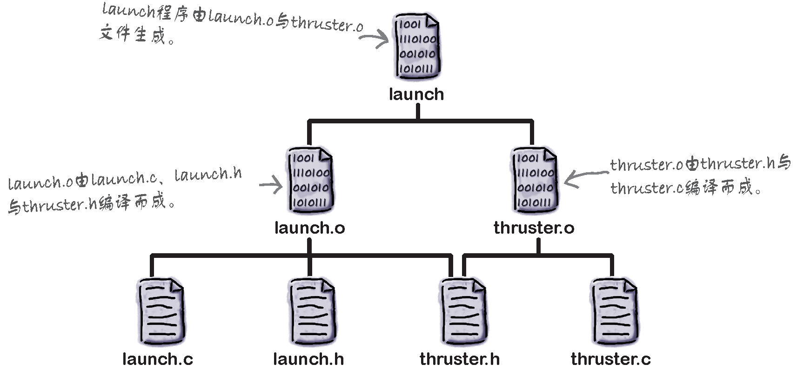
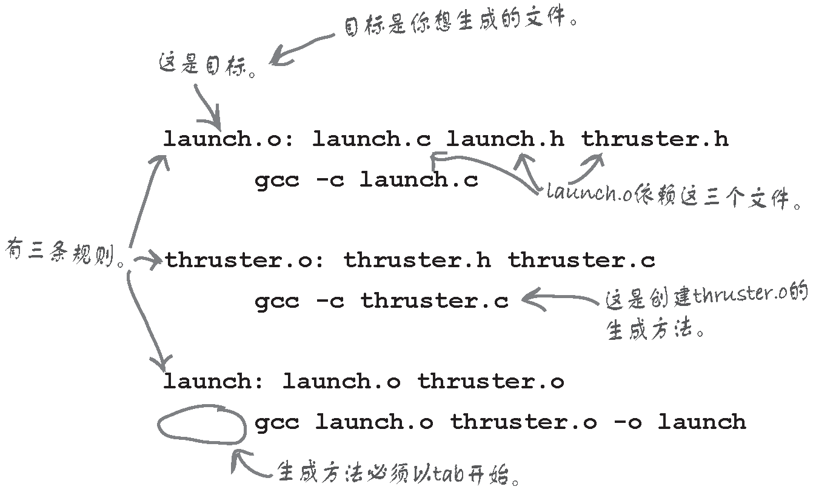

# Writing Large Programs


<!-- TOC -->

- [Writing Large Programs](#writing-large-programs)
    - [源文件](#%E6%BA%90%E6%96%87%E4%BB%B6)
    - [头文件](#%E5%A4%B4%E6%96%87%E4%BB%B6)
        - [#include 指令](#include-%E6%8C%87%E4%BB%A4)
            - [可移植性技巧](#%E5%8F%AF%E7%A7%BB%E6%A4%8D%E6%80%A7%E6%8A%80%E5%B7%A7)
        - [共享宏定义和类型定义](#%E5%85%B1%E4%BA%AB%E5%AE%8F%E5%AE%9A%E4%B9%89%E5%92%8C%E7%B1%BB%E5%9E%8B%E5%AE%9A%E4%B9%89)
        - [共享函数原型](#%E5%85%B1%E4%BA%AB%E5%87%BD%E6%95%B0%E5%8E%9F%E5%9E%8B)
            - [引用源文件而不引用头文件的问题](#%E5%BC%95%E7%94%A8%E6%BA%90%E6%96%87%E4%BB%B6%E8%80%8C%E4%B8%8D%E5%BC%95%E7%94%A8%E5%A4%B4%E6%96%87%E4%BB%B6%E7%9A%84%E9%97%AE%E9%A2%98)
        - [Difference between a definition and a declaration](#difference-between-a-definition-and-a-declaration)
        - [共享变量声明](#%E5%85%B1%E4%BA%AB%E5%8F%98%E9%87%8F%E5%A3%B0%E6%98%8E)
        - [保护头文件](#%E4%BF%9D%E6%8A%A4%E5%A4%B4%E6%96%87%E4%BB%B6)
        - [头文件中的 #error 指令](#%E5%A4%B4%E6%96%87%E4%BB%B6%E4%B8%AD%E7%9A%84-error-%E6%8C%87%E4%BB%A4)
    - [文本格式化程序示例程序划分成多个文件](#%E6%96%87%E6%9C%AC%E6%A0%BC%E5%BC%8F%E5%8C%96%E7%A8%8B%E5%BA%8F%E7%A4%BA%E4%BE%8B%E7%A8%8B%E5%BA%8F%E5%88%92%E5%88%86%E6%88%90%E5%A4%9A%E4%B8%AA%E6%96%87%E4%BB%B6)
        - [通用流程](#%E9%80%9A%E7%94%A8%E6%B5%81%E7%A8%8B)
        - [justify 程序的调整规则](#justify-%E7%A8%8B%E5%BA%8F%E7%9A%84%E8%B0%83%E6%95%B4%E8%A7%84%E5%88%99)
        - [程序设计](#%E7%A8%8B%E5%BA%8F%E8%AE%BE%E8%AE%A1)
        - [程序划分](#%E7%A8%8B%E5%BA%8F%E5%88%92%E5%88%86)
        - [word.h 和 word.c](#wordh-%E5%92%8C-wordc)
            - [word.h](#wordh)
            - [word.c 中的辅助函数 read_char](#wordc-%E4%B8%AD%E7%9A%84%E8%BE%85%E5%8A%A9%E5%87%BD%E6%95%B0-read_char)
            - [word.c 中的 read_word 函数](#wordc-%E4%B8%AD%E7%9A%84-read_word-%E5%87%BD%E6%95%B0)
        - [line.h 和 line.c](#lineh-%E5%92%8C-linec)
            - [line.h](#lineh)
            - [line.c](#linec)
        - [完整源码](#%E5%AE%8C%E6%95%B4%E6%BA%90%E7%A0%81)
        - [输入重定向和输出重定向](#%E8%BE%93%E5%85%A5%E9%87%8D%E5%AE%9A%E5%90%91%E5%92%8C%E8%BE%93%E5%87%BA%E9%87%8D%E5%AE%9A%E5%90%91)
        - [运行方式](#%E8%BF%90%E8%A1%8C%E6%96%B9%E5%BC%8F)
    - [构建多文件程序](#%E6%9E%84%E5%BB%BA%E5%A4%9A%E6%96%87%E4%BB%B6%E7%A8%8B%E5%BA%8F)
        - [只编译不链接](#%E5%8F%AA%E7%BC%96%E8%AF%91%E4%B8%8D%E9%93%BE%E6%8E%A5)
        - [makefile](#makefile)
            - [规则](#%E8%A7%84%E5%88%99)
            - [用 makefile 向 make 描述代码](#%E7%94%A8-makefile-%E5%90%91-make-%E6%8F%8F%E8%BF%B0%E4%BB%A3%E7%A0%81)
            - [使用 makefile](#%E4%BD%BF%E7%94%A8-makefile)
        - [链接期间的错误](#%E9%93%BE%E6%8E%A5%E6%9C%9F%E9%97%B4%E7%9A%84%E9%94%99%E8%AF%AF)
        - [重新构建程序](#%E9%87%8D%E6%96%B0%E6%9E%84%E5%BB%BA%E7%A8%8B%E5%BA%8F)
            - [第一种可能性是修改只影响一个源文件](#%E7%AC%AC%E4%B8%80%E7%A7%8D%E5%8F%AF%E8%83%BD%E6%80%A7%E6%98%AF%E4%BF%AE%E6%94%B9%E5%8F%AA%E5%BD%B1%E5%93%8D%E4%B8%80%E4%B8%AA%E6%BA%90%E6%96%87%E4%BB%B6)
            - [第二种可能性是修改会影响头文件](#%E7%AC%AC%E4%BA%8C%E7%A7%8D%E5%8F%AF%E8%83%BD%E6%80%A7%E6%98%AF%E4%BF%AE%E6%94%B9%E4%BC%9A%E5%BD%B1%E5%93%8D%E5%A4%B4%E6%96%87%E4%BB%B6)
            - [make 实用程序的流程](#make-%E5%AE%9E%E7%94%A8%E7%A8%8B%E5%BA%8F%E7%9A%84%E6%B5%81%E7%A8%8B)
        - [在程序外定义宏](#%E5%9C%A8%E7%A8%8B%E5%BA%8F%E5%A4%96%E5%AE%9A%E4%B9%89%E5%AE%8F)
    - [练习](#%E7%BB%83%E4%B9%A0)
    - [References](#references)

<!-- /TOC -->


常见的程序由多个 **源文件**（source file）组成，通常还有一些 **头文件**（header file）。源文件包含函数的定义和外部变量，而头文件包含可以在源文件之间共享的信息。


## 源文件
1. 可以把程序分割成任意数量的源文件。根据惯例，源文件的扩展名为 `.c`。其中一个源文件必须包含一个名为 `main` 的函数，此函数作为程序的起始点。
2. 把程序分成多个源文件有许多显著的优点。
    * 把相关的函数和变量分组放在同一个文件中可以使程序的结构清晰。
    * 可以分别对每一个源文件进行编译。如果程序规模很大而且需要频繁改变（这一点在程序开发过程中是非常普遍的）的话，这种方法可以极大地节约时间。
    * 把函数分组放在不同的源文件中更利于复用。


## 头文件
1. `#include` 指令告诉预处理器打开指定的文件，并且把此文件的内容插入到当前文件中。
2. 因此，如果想让几个源文件可以访问相同的信息，可以把此信息放入一个文件中，然后利用 `#include` 指令把该文件的内容带进每个源文件中。
3. 把按照此种方式包含的文件称为 **头文件**（有时称为 **包含文件**）。根据惯例，头文件的扩展名为 `.h`。
4. C 标准使用术语 “源文件” 来指示程序员编写的全部文件，包括 `.c` 文件和 `.h` 文件。这里的 “源文件” 只是指 `.c` 文件。

### `#include` 指令
1. `#include` 指令主要有两种书写格式。第一种格式用于属于 C 语言自身库的头文件：
    ```cpp
    #include <文件名>
    ```
    第二种格式用于所有其他头文件，也包含任何自己编写的文件：
    ```cpp
    #include "文件名"
    ```
2. 这两种格式间的细微差异在于编译器定位头文件的方式。 下面是大多数编译器遵循的规则。
    * `#include <文件名>`：搜寻系统头文件所在的目录（或多个目录）。（例如，在 UNIX 系统中，通常把系统头文件保存在目录 `/usr/include` 中。）
    * `#include "文件名"`：先搜寻当前目录，然后搜寻系统头文件所在的目录（或多个目录）。所以其实 `#include "stdio.h"` 也可以，但是不应该这样。
3. 通常可以改变搜寻头文件的位置，这种改变经常利用诸如 `-I` 路径这样的命令行选项来实现。
4. 不要在包含自己编写的头文件时使用尖括号：
    ```cpp
    #include <myheader.h>  /*** WRONG ***/
    ```
    因为预处理器可能在保存系统头文件的地方寻找 `myheader.h`，显然是找不到的。
5. 在 `#include` 指令中的文件名可以含有帮助定位文件的信息，比如目录的路径或驱动器号：
    ```cpp
    #include "c:\cprogs\utils.h"     /* Windows path */
    #include "/cprogs/utils.h"       /* UNIX path */
    ```
6. 虽然 `#include` 指令中的双引号使得文件名看起来像字符串字面量，但是预处理器不会把它们作为字符串字面量来处理。这是幸运的，因为在上面的 Windows 例子中，字符串字面量中出现的 `\c` 和 `\u` 将会被作为转义序列处理。
7. `#include` 指令还有一种不太常用的格式：
    ```cpp
    #include 记号
    ```
8. 其中 **记号** 是任意预处理记号序列。预处理器会扫描这些记号，并替换遇到的宏。宏替换完成以后，`#include` 指令的格式一定与前面两种之一相匹配。
9. 这种 `#include` 指令的优点是可以用宏来定义文件名，而不需要把文件名 “硬拷贝” 到指令里面去，如下所示：
    ```cpp
    #if defined(IA32)
        #define CPU_FILE "ia32.h"
    #elif defined(IA64)
        #define CPU_FILE "ia64.h"
    #elif defined(AMD64)
        #define CPU_FILE "amd64.h"
    #endif

    #include CPU_FILE
    ```

#### 可移植性技巧
1. 通常最好的做法是在 `#include` 指令中不包含路径或驱动器的信息。当把程序转移到其他机器上，或者更糟的情况是转移到其他操作系统上时，这类信息会使编译变得很困难。
2. 例如，下面的这些 `#include` 指令指定了驱动器或路径信息，而这些信息不可能一直是有效的：
    ```cpp
    #include "d:utils.h"
    #include "\cprogs\include\utils.h"
    #include "d:\cprogs\include\utils.h"
    ```
3. 下列这些指令相对好一些。它们没有指定驱动器，而且使用的是相对路径而不是绝对路径：
    ```cpp
    #include "utils.h"
    #include "..\include\utils.h"
    ```

### 共享宏定义和类型定义
1. 大多数大型程序包含需要由几个源文件（或者，最极端的情况是用于全部源文件）共享的宏定义和类型定义。这些定义应该放在头文件中。
2. 例如，假设正在编写的程序使用名为 `BOOL`、`TRUE` 和 `FALSE` 的宏。（C99 中不需要这么做，因为 `<stdbool.h>` 头中定义了类似的宏。）我们把这些定义放在一个名为 `boolean.h` 的头文件中
    ```cpp
    #define BOOL int
    #define TRUE 1
    #define FALSE 0
    ```
3. 任何需要这些宏的源文件只需简单包含下面这一行：
    ```cpp
    #include "boolean.h"
    ```
4. 类型定义在头文件中也是很普遍的。例如，不用定义 `BOOL` 宏，而是可以用 `typedef` 创建一个 `Bool` 类型。如果这样做，`boolean.h` 文件将有下列显示：
    ```cpp
    #define TRUE 1
    #define FALSE 0
    typedef int Bool;
    ```

### 共享函数原型
1. 假设源文件包含函数 `f` 的调用，而函数 `f` 是定义在另一个文件 `foo.c` 中的。调用没有声明的函数 `f` 是非常危险的。
2. 如果没有函数原型可依赖，编译器会假定函数 `f` 的返回类型是 `int` 类型的，并假定形式参数的数量和函数 `f` 的调用中的实际参数的数量是匹配的。通过默认的实际参数提升，实际参数自身自动转化为 “标准格式”。
3. 编译器的假定很可能是错误的，但是，因为一次只能编译一个文件，所以是没有办法进行检查的。如果这些假定是错误的，那么程序很可能无法工作，而且没有线索可以用来查找原因。基于这个原因，C99 禁止在编译器看到函数声明或定义之前对函数进行调用。
4. 当调用在其他文件中定义的函数 `f` 时，要始终确保编译器在调用之前已看到函数 `f` 的原型。
5. 我们的第一个想法是在调用函数 `f` 的文件中声明它。这样可以解决问题，但是可能产生维护方面的 “噩梦”。假设有 50 个源文件要调用函数 `f`，如何能确保函数 `f` 的原型在所有文件中都一样呢？如何能保证这些原型和 `foo.c` 文件中函数 `f` 的定义相匹配呢？
6. 解决办法是显而易见的：把函数 `f` 的原型放进一个头文件中，然后在所有调用函数 `f` 的地方包含这个头文件。
7. 既然在文件 `foo.c` 中定义了函数 `f`，我们把头文件命名为 `foo.h`。除了在调用函数 `f` 的源文件中包含 `foo.h`，还需要在 `foo.c` 中包含它，从而使编译器可以验证 `foo.h` 中函数 `f` 的原型和 `foo.c` 中 `f` 的函数定义相匹配。
8. 在调用 `f` 的文件只需要引用 `foo.h` 就行了，不需要引用 `foo.c`。但是在 VSCode 调试的时候，是只会编译当前文件
    ```sh
    gcc pun.c -o pun
    ```
    并没有编译 `foo.c`，所以要修改一下命令的参数，把 `foo.c` 也一同编译
    ```sh
    gcc pun.c foo.c -o pun
    ```
9. 在含有函数 `f` 定义的源文件中始终包含声明函数 `f` 的头文件。如果不这样做可能导致难以发现的错误，因为在程序别处对函数 `f` 的调用可能会和函数 `f` 的定义不匹配。
10. 如果文件 `foo.c` 包含其他函数，大多数函数都应该在包含函数 `f` 的声明的那个头文件中声明。毕竟，文件 `foo.c` 中的其他函数大概会与函数 `f` 有关。任何含有函数 `f` 调用的文件可能会需要文件 `foo.c` 中的其他一些函数。然而，仅用于文件 `foo.c` 的函数不需要在头文件中声明，如果声明了容易造成误解。
11. 包含一个头文件并不代表其中所有的函数都将和程序链接。在任何情况下，大多数链接器都只会链接程序实际需要的函数。

#### 引用源文件而不引用头文件的问题
1. 直接引用源文件(`.c`)而不引用头文件这是合法的，但不是个好习惯。这里给出一个出问题的例子。
2. 假设 `foo.c` 中定义了一个在 `bar.c` 和 `baz.c` 中需要用到的函数 `f`，我们在 `bar.c` 和 `baz.c` 中都加上了如下指令：
    ```cpp
    #include "foo.c"
    ```
3. 这些文件都会很好地被编译。但当链接器发现函数 `f` 的目标代码有两个副本时，问题就出现了。
4. 当然，如果只是 `bar.c` 包含此函数，而 `baz.c` 没有，那么将没有问题。为了避免出现问题，最好只用 `#include` 包含头文件而非源文件。

### Difference between a definition and a declaration
1. A **declaration** introduces an identifier and describes its type, be it a type, object, or function. A declaration is **what the compiler** needs to accept references to that identifier. These are declarations:
    ```cpp
    extern int bar;
    extern int g(int, int);
    double f(int, double); // extern can be omitted for function declarations
    class foo; // no extern allowed for type declarations
    ```
2. A **definition** actually instantiates/implements this identifier. It's **what the linker needs** in order to link references to those entities. These are definitions corresponding to the above declarations:
    ```cpp
    int bar;
    int g(int lhs, int rhs) {return lhs*rhs;}
    double f(int i, double d) {return i+d;}
    class foo {};
    ```
3. A definition can be used in the place of a declaration.
4. An identifier can be declared as often as you want. Thus, the following is legal in C and C++:
    ```cpp
    double f(int, double);
    double f(int, double);
    extern double f(int, double); // the same as the two above
    extern double f(int, double);
    ```
5. However, it must be defined exactly once. If you forget to define something that's been declared and referenced somewhere, then the linker doesn't know what to link references to and complains about a missing symbols. If you define something more than once, then the linker doesn't know which of the definitions to link references to and complains about duplicated symbols.

### 共享变量声明
1. 为了共享函数，要把函数的定义放在一个源文件中，然后在需要调用此函数的其他文件中放置声明。共享外部变量的方法和此方式非常类似。
2. 目前不需要区别变量的声明和它的定义。为了声明变量 `i`，可以这样写：
    ```cpp
    int i;               /* declares i and defines it as well */
    ```
3. 这样不仅声明 `i` 是 `int` 类型的变量，而且也对 `i` 进行了定义，从而使编译器为 `i` 留出了空间。
4. 为了声明变量 `i` 而不是定义它，需要在变量声明的开始处放置 `extern` 关键字：
    ```cpp
    extern int i;        /* declares i without defining it */
    ```
5. `extern` 告诉编译器，变量 `i` 是在程序中的其他位置定义的（很可能是在不同的源文件中），因此不需要为 `i` 分配空间。
6. 顺便说一句，`extern` 可以用于所有类型的变量。在数组的声明中使用 `extern` 时，可以省略数组的长度：
    ```cpp
    extern int a[];
    ```
    因为此刻编译器不用为数组 `a` 分配空间，所以也就不需要知道数组 `a` 的长度了。
7. 为了在几个源文件中共享变量 `i`，首先把变量 `i` 的定义放置在一个文件中：
    ```cpp
    int i;
    ```
8. 如果需要对变量 `i` 初始化，可以把初始化式放在这里。
9. 在编译这个文件时，编译器会为变量 `i` 分配内存空间，而其他文件将包含变量 `i` 的声明：
    ```cpp
    extern int i;
    ```
10. 通过在每个文件中声明变量 `i`，使得在这些文件中可以访问/或修改变量 `i`。然而，由于关键字 `extern` 的存在，编译器不会在每次编译这些文件时为变量 `i` 分配额外的内存空间。
11. 当在文件中共享变量时，会面临和共享函数时相似的挑战：确保变量的所有声明和变量的定义一致。当同一个变量的声明出现在不同文件中时，编译器无法检查声明是否和变量定义相匹配。例如，一个文件可以包含定义
    ```cpp
    int i;
    ```
    同时另一个文件包含声明
    ```cpp
    extern long i;
    ```
    这类错误可能导致程序的行为异常。
12. 为了避免不一致，通常把共享变量的声明放置在头文件中。需要访问特定变量的源文件可以包含相应的头文件。此外，含有变量定义的源文件需要包含含有相应变量声明的头文件，这样编译器就可以检查声明与定义是否匹配。
13. 例子
    ```cpp
    // variables.h

    extern int i;
    ```
    ```cpp
    // variables.c

    #include "variables.h"
    int i = 6;
    ```
    ```cpp
    // test.c

    #include <stdio.h>
    #include "variables.h"

    int main(int argc, char *argv[])
    {
        printf("%d", i); // 6
        i = 7;
        printf("%d", i); // 7

        return 0;
    }
    ```
14. 虽然在文件中共享变量是 C 语言界中的长期惯例，但是它有重大的缺点。

### 保护头文件
1. 如果源文件包含同一个头文件两次，那么可能产生编译错误。
2. 当头文件包含其他头文件时，这种问题十分普遍。例如，假设 `file1.h` 包含 `file3.h`，`file2.h` 包含 `file3.h`，而 `prog.c` 同时包含 `file1.h` 和 `file2.h`，那么在编译 `prog.c` 时，`file3.h` 就会被编译两次。
3. 两次包含同一个头文件不总是会导致编译错误。如果文件只包含宏定义、函数原型和/或变量声明，那么将不会有任何困难。然而，如果文件包含类型定义，则会带来编译错误。
4. 安全起见，保护全部头文件避免多次包含可能是个好主意，那样的话可以在稍候添加类型定义而不用冒可能因忘记保护文件而产生的风险。
5. 此外，在程序开发期间，避免同一个头文件的不必要重复编译可以节省一些时间。
6. 为了防止头文件多次包含，用 `#ifndef` 和 `#endif` 指令来封闭文件的内容。例如，可以用如下方式保护文件 `boolean.h`：
    ```cpp
    #ifndef BOOLEAN_H
    #define BOOLEAN_H

    #define TRUE 1
    #define FALSE 0
    typedef int Bool;

    #endif
    ```
7. 在首次包含这个文件时，没有定义宏 `BOOLEAN_H`，所以预处理器允许保留 `#ifndef` 和 `#endif` 之间的多行内容。但是如果再次包含此文件，那么预处理器将把 `#ifndef` 和 `#endif` 之间的多行内容删除。
8. 宏的名字（`BOOLEAN_H`）并不重要，但是，给它取类似于头文件名的名字是避免和其他的宏冲突的好方法。由于不能把宏命名为 `BOOLEAN.H` （标识符不能含有句点），所以像 `BOOLEAN_H` 这样的名字是个很好的选择。

### 头文件中的 `#error` 指令
1. `#error` 指令经常放置在头文件中，用来检查不应该包含头文件的条件。
2. 例如，如果头文件中用到了一个在最初的 C89 标准之前不存在的特性，为了避免把头文件用于旧的非标准编译器，可以在头文件中包含 `#ifdef` 指令来检查 `__STDC__` 宏是否存在：
    ```cpp
    #ifndef __STDC__
    #error This header requires a Standard C compiler
    #endif
    ```


## 文本格式化程序示例程序划分成多个文件
### 通用流程
1. 现在应用我们已经知道的关于头文件和源文件的知识来开发一种把一个程序划分成多个文件的简单方法。假设已经设计好程序，换句话说，已经决定程序需要什么函数以及如何把函数分为逻辑相关的组。下面是处理的方法。
2. 把每个函数集合放入一个不同的源文件中（比如用名字 `foo.c` 来表示一个这样的文件）。
3. 另外，创建和源文件同名的头文件，只是扩展名为 `.h`（在此例中，头文件是 `foo.h`）。
4. 在 `foo.h` 文件中放置 `foo.c`中定义的函数的函数原型。在 `foo.h` 文件中不需要也不应该声明只在 `foo.c` 内部使用的函数。下面的 `read_char` 函数就是一个这样的例子。
5. 每个需要调用定义在 `foo.c` 文件中的函数的源文件都应包含 `foo.h` 文件。此外，`foo.c` 文件也应包含 `foo.h` 文件，这是为了编译器可以检查 `foo.h` 文件中的函数原型是否与 `foo.c` 文件中的函数定义相一致。
6. `main` 函数将出现在某个文件中，这个文件的名字与程序的名字相匹配。如果希望称程序为 `bar`，那么 `main` 函数就应该在文件 `bar.c` 中。`main` 函数所在的文件中也可以有其他函数，前提是程序中的其他文件不会调用这些函数。

### `justify` 程序的调整规则
1. 通常情况下，`justify` 的输出应该和输入一样，区别仅在于删除了额外的空格和空行，并对代码行做了填充和调整。
2. “填充” 行意味着添加单词直到再多加一个单词就会导致行溢出时才停止，“调整” 行意味着在单词间添加额外的空格以便于每行有完全相同的长度（60个字符）。
3. 必须进行调整，只有这样一行内单词间的间隔才是相等的（或者几乎是相等的）。
4. 对输出的最后一行不进行调整。
5. 另外这里假设没有单词的长度超过 20 个字符（把与单词相邻的标点符号看成是单词的一部分）。如果程序遇到较长的单词，它需要忽略前 20 个字符后的所有字符，用一个星号替换它们。例如，单词 `antidisestablishmentarianism` 将会显示成 `antidisestablishment*`。

### 程序设计
1. 程序不能像读单词一样一个一个地写单词，而必须把单词存储在一个 “行缓冲区” 中，直到足够填满一行后，输出该行，然后继续读入单词。
2. 程序的核心将是如下所示的循环
    ```cpp
    for (; ;) {
        读单词;
        if (不能读单词) {
            输出行缓冲区的内容，不进行调整;
            终止程序;
        }

        if (行缓冲区已经填满){
            输出行缓冲区的内容，进行调整;
            清除行缓冲区;
        }
        往行缓冲区中添加单词;
    }
    ```

### 程序划分
1. 因为我们需要函数处理单词，并且还需要函数处理行缓冲区，所以把程序划分为 3 个源文件。
2. 把所有和单词相关的函数放在一个文件（`word.c`）中，把所有和行缓冲区相关的函数放在另一个文件（`line.c`）中，第 3 个文件将包含 `main` 函数。
3. 除了上述这些文件，还需要两个头文件 `word.h` 和 `line.h`。头文件 `word.h` 将包含 `word.c` 文件中函数的原型，而头文件 `line.h` 将包含 `line.c` 文件中函数的原型。

### `word.h` 和 `word.c`
#### `word.h`
1. `read_word` 负责读取一个单词。
2. 如果读取到了文件末尾，会返回一个空字符串给主循环，提示主循环退出程序。
3. 如果读取的单词超过了指定的长度，则会进行截断。
4. 代码如下
    ```cpp
    #ifndef WORD_H
    #define WORD_H

    /*********************************************************** *
     * read_word: Reads the next word from the input and         *
     *            stores it in word. Makes word empty if no      *
     *            word could be read because of end-of-file.     *
     *            Truncates the word if its length exceeds       *
     *            len.                                           *
     *********************************************************** */
    void read_word(char *word, int len);

    #endif
    ```

#### `word.c` 中的辅助函数 `read_char`
1. `read_char` 负责读取字符并处理特殊字符。
2. 实现
    ```cpp
    int read_char(void)
    {
        int ch = getchar();
        
        if (ch == '\n' || ch == '\t')
            return ' ';
        return ch;
    }
    ```
3. `read_char` 会把换行符和制表符统一转换为空格，因为 `read_word` 中会统一使用空格来跳过这些空白字符。
4. `getchar` 函数实际上返回的是 `int` 类型值而不是 `char` 类型值，因此 `read_char` 函数中把变量 `ch` 声明为 `int` 类型并且 `read_char` 函数的返回类型也是 `int`。
5. 当不能继续读入时（通常因为读到了输入文件的末尾），`getchar` 的返回值为 `EOF`。

#### `word.c` 中的 `read_word` 函数
1. 读取一个单词
2. 实现
    ```cpp
    void read_word(char *word, int len)
    {
        int ch, pos = 0;

        while ( (ch = read_char()) == ' ' )
            ;
        while ( ch != ' ' && ch != EOF ) {
            if ( pos < len )
                word[pos++] = ch;
            ch = read_char();
        }

        word[pos] = '\0';
    }
    ```
3. `read_word` 函数由两个循环构成。第一个循环跳过空格、换行和制表符（但不会跳过 `EOF`），在遇到第一个非空白字符时停止。第二个循环读字符直到遇到空格、换行和制表符或 `EOF` 时停止。
4. 第二个循环体把字符存储到 `word` 中直到达到 `len` 的限制时停止。超出长度限制之后的字母仍然会被读入，但是不会被写入 `word` 中。
5. 读完了一个单词，然后在后面加上 `'\0'` 构成字符串。
6. 如果 `read_word` 在找到非空白字符前遇到 `EOF`，`pos` 将为 0，从而使得 `word` 为空字符串。
7. 如果这个单词正好处在文件结尾，也就是说它后面没有空白字符。那么第二个 `while` 结束的时候，`word` 的长度不为 0。这时从主循环的逻辑看来，这种情况下不会退出程序。但是主循环会进入下一轮，而下一轮的 `read_word` 就会让 `word` 变成一个空字符串，从而退出程序。

### `line.h` 和 `line.c` 
#### `line.h`
```cpp
#ifndef LINE_H
#define LINE_H

/**********************************************************
 * clear_line: Clears the current line.                   *
 **********************************************************/
void clear_line(void);

/**********************************************************
 * add_word: Adds word to the end of the current line.    *
 *           If this is not the first word on the line,   *
 *           puts one space before word.                  *
 **********************************************************/
void add_word(const char *word);

/**********************************************************
 * space_remaining: Returns the number of characters left *
 *                  in the current line.                  *
 **********************************************************/
int space_remaining(void);

/**********************************************************
 * write_line: Writes the current line with               *
 *             justification.                             *
 **********************************************************/
void write_line(void);

/**********************************************************
 * flush_line: Writes the current line without            *
 *             justification. If the line is empty, does  *
 *             nothing.                                   *
 **********************************************************/
void flush_line(void);

#endif
```

#### `line.c`
```cpp
#include <stdio.h>
#include <string.h>
#include "line.h"

#define MAX_LINE_LEN 60    // 一行总长

char line[MAX_LINE_LEN+1]; // 该行字符串
int line_len = 0;          // 当前行的已经使用的字符数量
int num_words = 0;         // 当前行的单词数量

void clear_line(void)
{
    line[0] = '\0';
    line_len = 0;
    num_words = 0;
}

void add_word(const char *word)
{
    // 如果该行现在就存在单词，则需要空一格
    if ( num_words > 0 ) {
        // line[line_len] 之前是 \0，现在替换为空格
        line[line_len] = ' ';
        // 添加重新添加 \0
        line[line_len+1] = '\0';
        line_len++;
    }

    // 把单词填进去（最后会自动生成一个 \0）
    strcat(line, word);
    line_len += strlen(word);
    num_words++;
}

int space_remaining(void)
{
    return MAX_LINE_LEN - line_len;
}

void write_line(void)
{
    int extra_spaces, spaces_to_insert, i, j;

    // 为了保持每行长度相等而需要额外添加的空格
    // 这些额外的空格需要添加在现有的单词之间
    extra_spaces = MAX_LINE_LEN - line_len; 

    // 遍历所有已有的字符
    for ( i = 0; i < line_len; i++ ) {
        if ( line[i] != ' ' ) {
            // 如果是非空的有效字符则直接输出
            putchar(line[i]);
        }
        else {
            // 如果是单词间的空格，则插入额外补齐用的空格
            // 为了在单词之间添加空格，需要计算每个单词间添加几个空格
            spaces_to_insert = extra_spaces / (num_words - 1);
            // 插入空格
            for ( j = 1; j <= spaces_to_insert + 1; j++ ) {
                putchar(' ');
            }

            // 每次插入几个空格（spaces_to_insert）要动态计算
            // 例如本例中输出的一行如下
            // need for a system implementation language  efficient  enough
            // 开始 5 次的 spaces_to_insert 计算都是 0.x 向下取整，
            // 最后两次 spaces_to_insert 都是 1。
            extra_spaces -= spaces_to_insert; 
            num_words--;
        }
    }
    putchar('\n');
}

void flush_line(void)
{
    if (line_len > 0)
        puts(line);
}
```

### 完整源码
路径 `./examples/justify/`

### 输入重定向和输出重定向
1. 为了在 UNIX 或 Windows 的命令行环境下运行这个程序，录入命令
    ```sh
    justify <quote
    ```
2. 符号 `<` 告诉操作系统，程序 `justify` 将从文件 `quote` 而不是从键盘读取输入。由 UNIX、Windows 和其他操作系统支持的这种特性称为 **输入重定向**（input redirection）。
3. 程序 `justify` 的输出通常显示在屏幕上，但是也可以利用 **输出重定向**（output redirection）把结果保存到文件中：
    ```sh
    justify <quote >newquote
    ```
    程序 `justify` 的输出将放入到文件 `newquote` 中。

### 运行方式
1. 在测试目录里，包含以下文件。其中 `quote` 里面是等待被格式化的文本
    * `justify.c`
    * `line.c`
    * `line.h`
    * `quote`
    * `word.c`
    * `word.h`
2. 在 bash 命令行里 cd 到该测试目录里，然后输入如下命令进行编译
    ```sh
    gcc justify.c line.c word.c -o justify
    ```
    之后会在当前目录生成可执行文件 `justify.exe`
3. 然后输入如下命令运行该可执行文件，使用 `quote` 里面的文本运行程序，然后自动生成 `newquote` 文件并写入输出
    ```sh
    ./justify.exe <quote >newquote
    ```


## 构建多文件程序
1. 我们研究过对单个文件的程序进行编译和链接的过程。现在将把这种讨论扩展到由多个文件构成的程序中。构建大型程序和构建小程序所需的基本步骤相同。
2. **编译**
    * 必须对程序中的每个源文件分别进行编译。
    * 不需要编译头文件。编译包含头文件的源文件时会自动编译头文件的内容。
    * 对于每个源文件，编译器会产生一个包含目标代码的文件。这些文件称为 **目标文件**（object file），在 UNIX 系统中的扩展名为 `.o`，在 Windows 系统中的扩展名为 `.obj`（我在 Windows 中看到也是 `.o`）。
3. **链接**
    * 链接器把上一步产生的目标文件和库函数的代码结合在一起生成可执行的程序。
    * 链接器的一个职责是要解决编译器遗留的外部引用问题。外部引用发生在一个文件中的函数调用另一个文件中定义的函数或者访问另一个文件中定义的变量时。
4. 大多数编译器允许一步构建程序。例如，对于 GCC 编译器来说，可以使用下列命令行来构建：
    ```cpp
    gcc -o justify justify.c line.c word.c
    ```
    首先把三个源文件编译成目标代码，然后自动把这些目标文件传递给链接器，链接器会把它们结合成一个文件。选项 `-o` 表明我们希望可执行文件的名字是 `justify`。

### 只编译不链接
1. 每次都整体编译并链接的问题是，对于多文件系统，如果每次都只修改了一两个文件，整体编译并链接会把大多数没有改变的文件都重复的编译一遍，生成一模一样的目标文件。
2. 理想的情况是保存之前编译生成的目标文件，如果某些源文件发生了改变，只重新编译修改的源文件并生成新的目标文件。然后重新链接所有的目标文件。
3. 虽然每次修改都会链接所有的目标文件来创建程序，但只需要编译其中有修改的源文件。
4. 为了得到所有源文件的目标代码，可以输入以下命令：
    ```
    gcc *.c -c
    ```
    `*.c` 会匹配当前目录下所有的 C 源文件， `-c` 告诉编译器你想为所有源文件创建目标文件，但不想把目标文件链接成完整的可执行程序。
5. 既然你有了一批目标文件，就可以用一条简单的编译命令把它们链接起来。这次要把目标文件的名字给编译器，而不是 C 源文件的名字
    ```
    gcc *.o -o launch
    ```
    编译器能够识别这些文件是目标文件，而非源文件，因此它会跳过大部分编译步骤，直接把目标文件链接为一个叫 `launch` 的可执行程序。
6. 和以前一样，现在你有了一个编译好的程序，同时你也得到了一批目标文件，可以在需要时随时把它们链接起来。如果要修改其中一个文件，只需要重新编译这一个文件，然后重新链接程序即可。
7. 没错，局部的编译加快了，但你不得不三思而后行，以确保该编译的文件都编译了。如果只改了一个源文件，没什么问题，但如果你改了很多文件，就很容易忘记重新编译其中的某些文件。使用下面的 makefile 工具可以实现自动化构建。

### makefile
1. 想象有一个文件，这个文件是由另一个文件生成的，比如从源文件 `thruster.c` 编译过来的目标文件 `thruster.o`。怎么知道 `thruster.o` 文件是否需要重新编译呢？
2. 只要看一下这两个文件的时间戳就行了，如果 `thruster.o` 文件比 `thruster.c` 文件旧，就需要重新创建 `thruster.o`；否则就说明 `thruster.o` 已经是最新的了。
3. make 是一个可以替你运行编译命令的工具。它会检查源文件和目标文件的时间戳，如果目标文件过期，make 就会重新编译它。

#### 规则
1. 但是做到所有这些事情前，需要告诉 make 源代码的一些情况。make 需要知道文件之间的依赖关系，同时还需要告诉它你具体想如何构建代码。
2. make 编译的文件叫 **目标**（target）。严格意义上讲，make 不仅仅可以用来编译文件。目标可以是任何用其他文件生成的文件，也就是说目标可以是一批文件压缩而成的压缩文档。
3. 对每个目标，makefile 需要知道两件事：
    * 依赖项：生成目标需要用哪些文件。
    * 生成方法：生成该文件时要用哪些指令。
4. 依赖项和生成方法合在一起构成了一条 **规则**。有了规则，make 就知道如何生成目标。
5. 假设你想要把 `thruster.c` 编译成目标代码 `thruster.o`，依赖项和生成方法分别是什么？
    * `thruster.o` 就叫目标，因为你想生成这个文件。
    * `thruster.c` 是依赖项，因为编译器在创建 `thruster.o` 时需要它。
    * 生成方法就是将 `thruster.c` 转化为 `thruster.o` 的编译命令：`gcc -c thruster.c`。
6. 你可以做得更多。一旦创建了 `thruster.o` 文件，接下来就要用它来创建 `launch` 程序，`launch` 文件也可以设为目标，因为你想生成它，`launch` 的依赖项是所有 `.o` 目标文件，生成方法如下：`gcc *.o -o launch`。
7. 一旦 make 得到了所有的依赖项和生成方法，那么只要让它创建 `launch` 程序就行了，make 会处理细节。
8. 虽然 make 一般用来编译代码，但你也可以用它充当命令行下的安装程序或源代码控制工具。事实上，任何可以在命令行中执行的任务，你都可以用 make 来做。

#### 用 makefile 向 make 描述代码
1. 所有目标、依赖项和生成方法的细节信息需要保存在一个叫 makefile 或 Makefile 的文件中，为了弄明白它是怎么工作的，下面假设要用一对源文件创建 `launch` 程序
    
2. 你将在 makefile 中这样描述构建过程
    
    生成方法都必须以 tab 开头。如果尝试用空格缩进，就无法生成程序。

#### 使用 makefile
1. 我们使用如下测试代码
    ```cpp
    // launch.h
    #ifndef LAUNCH_H
    #define LAUNCH_H


    void launch(void);


    #endif
    ```
    ```cpp
    // launch.c
    #include <stdio.h>
    #include "launch.h"
    #include "thruster.h"


    int main (int argc, char *argv[]) {
        launch();
        getchar();
    }


    void launch(void)
    {   
        fire("first stage");
        fireThruster();
        printf("Launch");
    }
    ```
    ```cpp
    // thruster.h
    #ifndef THRUSTER_H
    #define THRUSTER_H


    void fire(char* unit);
    void fireThruster(void);


    #endif
    ```
    ```cpp
    // thruster.c
    #include <stdio.h>
    #include "thruster.h"


    void fire(char* unit)
    {   
        printf("Fire %s\n", unit);
    }
    void fireThruster()
    {   
        fire("thruster");
    }
    ```
2. 在同一个目录项创建 makefile 并使用如下规则，注意和上面图片中不同，把最后一条规则移到了最前面
    ```
    launch: launch.o thruster.o 
        gcc launch.o thruster.o -o launch
        
    launch.o: launch.c launch.h thruster.h
        gcc -c launch.c

    thruster.o: thruster.c thruster.h
        gcc -c thruster.c
    ```
3. 用下面的命令调用 `make`：
    ```sh
    make 目标
    ```
    其中目标是列在 makefile 中的目标文件之一。为了用我们的 makefile 构建 `launch` 可执行程序，可以使用命令
    ```sh
    make launch
    ```
4. 注意在 windows 中，`make` 程序位于 MinGW/bin/mingw32-make.exe，所以可以使用命令
    ```sh
    mingw32-make launch
    ```
5. 第一次执行后，可以看到如下输出
    ```sh
    gcc -c launch.c
    gcc -c thruster.c
    gcc launch.o thruster.o -o launch
    ```
    make 编译了两个源文件，然后再进行了链接而创建了 launch 程序。
6. 如果修改了 `thruster.c` 文件，再运行一次 `make launch`，输出如下
    ```sh
    gcc -c thruster.c
    gcc launch.o thruster.o -o launch
    ```
    现在只编译了发生变化的 `thruster.c`。
7. 如果在调用 `make` 时没有指定目标文件，将构建第一条规则中的目标文件。例如上面特别把目标 launch 的规则写在最前面，所以执行如下命令也可以得到同样的效果
    ```sh
    make
    ```

### 链接期间的错误
1. 一些在编译期间无法发现的错误将会在链接期间被发现。特别地，如果程序中丢失了函数定义或变量定义，那么链接器将无法解析外部引用，从而导致出现类似 “`undefined symbol`” 或 “`undefined reference`” 的消息。
2. 链接器检查到的错误通常很容易修改。下面是一些最常见的错误起因
    * **拼写错误**。如果变量名或函数名拼写错误，那么链接器将进行缺失报告。例如，如果在程序中定义了函数 `read_char`，但调用时却把它写为 `read_cahr`，那么链接器将报告说缺失` read_cahr` 函数。
    * **缺失文件**。如果链接器不能找到文件 `foo.c` 中的函数，那么它可能不会知道此文件。这时就要检查 makefile 或工程文件来确保 `foo.c` 文件是列出了的。
    * **缺失库**。链接器不可能找到程序中用到的全部库函数。UNIX 系统中有一个使用了 `<math.h>` 的经典例子。在程序中简单地包含该头可能是不够的，很多 UNIX 版本要求在链接程序时指明选项 `-lm`，这会导致链接器去搜索一个包含 `<math.h>` 函数的编译版本的系统文件。不使用这个选项可能会在链接时导致 “`undefined reference`” 消息。

### 重新构建程序
1. 在程序开发期间，极少需要编译全部文件。大多数时候，我们会测试程序，进行修改，然后再次构建程序。为了节约时间，重新构建的过程应该只对那些可能受到上一次修改影响的文件进行重新编译。
2. 为了判断修改后需要重新编译的文件的数量，我们需要考虑两种可能性。

#### 第一种可能性是修改只影响一个源文件
1. 这种情况下，只有此文件需要重新编译。当然，在此之后整个程序将需要重新链接。
2. 思考程序 `justify`。假设要精简 `word.c` 中的函数 `read_char`
    ```cpp
    int read_char (void)
    {
        int ch = getchar();

        return (ch == '\n'  || ch == '\t') ? '  '  : ch;
    }
    ```
3. 这种改变没有影响word.h，所以只需要重新编译word.c并且重新链接程序就行了。

#### 第二种可能性是修改会影响头文件
1. 这种情况下，应该重新编译包含此头文件的所有文件，因为它们都可能潜在地受到这种修改的影响。有些文件可能不会受到影响，但是保守一点是值得的。
2. 作为示例，思考一下程序 `justify` 中的函数 `read_word`。之前，为了确定刚读入的单词的长度，`main` 函数在调用 `read_word` 函数后立刻调用 `strlen`。因为 `read_word` 函数已经知道了单词的长度，所以使用 `strlen` 就显得多余了。修改 `read_word` 函数来返回单词的长度是很容易的。
3. 首先，改变 `word.h` 文件中的 `read_word` 函数的原型：
    ```cpp
    / ***********************************************************
      * read_word: Reads the next word from the input and       *
      *            stores it in word. Makes word empty if no    *
      *            word could be read because of end-of-file.   *
      *            Truncates the word if its length exceeds     *
      *            len. Returns the number of characters        *
      *            stored.                                      *
      ***********************************************************/
    int read_word(char *word, int len);
    ```
4. 接下来，修改 `word.c` 文件中 `read_word` 函数的定义：
    ```cpp
    int read_word(char *word, int len)
    {
        int ch, pos = 0;

        while ((ch = read_char()) == ' ')
            ;
        while (ch != ' ' && ch != EOF)  {
            if (pos < len)
                word[pos++] = ch;
            ch = read_char();
        }
        word[pos] = '\0';
        return pos;
    }
    ```
5. 最后，再来修改 `justify.c`，方法是删除对 `<string.h>` 的包含，并按如下方式修改 `main` 函数：
    ```cpp
    int main(void)
    {
        char word[MAX_WORD_LEN+2];
        int word_len;

        clear_line();
        for (;;) {
            word_len = read_word (word, MAX_WORD_LEN+1);
            if (word_len == 0)  {
                flush_line();
                return 0;
            }
            if (word_len > MAX_WORD_LEN)
                word[MAX WORD LEN] = '*';
            if (word_len + 1 > space_remaining())  {
                write_line();
                clear_line();
            }
            add_word(word);
        }
    }
    ``
6. 一旦做了上述这些修改，将需要重新构建程序 `justify`，方法是重新编译 `word.c` 和 `justify.c`，然后再重新进行链接。不需要重新编译 `line.c`，因为它不包含 `word.h`，所以也就不会受到` word.h`改变的影响。
7. 对于 GCC 编译器，可以使用下列命令来重新构建程序：
    ```cpp
    gcc -o justify justify.c word.c line.o
    ```
    TODO，这里的 `line.o` 是重新链接？

#### `make` 实用程序的流程
1. 使用 makefile 的好处之一就是可以自动进行重新构建。通过检查每个文件的日期，`make` 实用程序可以确定程序上一次构建之后哪些文件发生了改变。然后，它会把那些改变的文件和直接或间接依赖于它们的全部文件一起进行重新编译。
2. 例如，如果我们对` word.h`、`word.c` 和 `justify.c` 进行了修改，并重新构建了 `justify` 程序，那么 `make` 将执行如下操作。
    1. 编译 `justify.c` 以构建 `justify.o`。因为修改了 `justify.c` 和 `word.c`。
    2. 编译 `word.c` 以构建 `word.o`。因为修改了 `word.c` 和 `word.h`。
    3. 链接 `justify.o`、`word.o` 和 `line.o` 以构建 `justify`。因为修改了 `justify.o` 和 `word.o`。

### 在程序外定义宏
1. 在编译程序时，C 语言编译器通常会提供一种指定宏的值的方法。这种能力使我们很容易对宏的值进行修改，而不需要编辑程序的任何文件。当利用 makefile 自动构建程序时这种能力尤其有价值。
2. 大多数编译器（包括 GCC）支持 `-D` 选项，此选项允许用命令行来指定宏的值：
    ```sh
    gcc -DDEBUG=1 foo.c
    ```
    `-D` 和后面有没有空格都行
3. 在这个例子中，定义宏 `DEBUG` 在程序 `foo.c` 中的值为 1，其效果相当于在 `foo.c` 的开始处这样写：
    ```cpp
    #define DEBUG 1
    ```
4. 如果 `-D` 选项命名的宏没有指定值，那么这个值被设为 1。但如果文件里已经有指定，那么这样会导致错误：`warning: "DEBUG" redefined`。
5. 许多编译器也支持 `-U` 选项，这个选项用于删除宏的定义，效果相当于 `#undef`。我们可以使用 `-U`选项来删除预定义的宏或之前在命令行方式下用 `-D` 选项定义的宏。TODO，没试出效果。


## 练习
* 编程题 1
    1. 在计算空格时，间隔的向上取整和向下取整
        ```cpp
        if ( num_words % 2 ) {
            spaces_to_insert = extra_spaces / (num_words - 1);
        }
        else {
            spaces_to_insert = (extra_spaces + num_words - 2) / (num_words - 1);
        }
        ```
    2. 对比一下，之前的输出是
        ```
        C is quirky,  flawed,  and  an  enormous  success.  Although
        accidents of history surely helped, it evidently satisfied a
        need for a system implementation language  efficient  enough
        to displace assembly language, yet sufficiently abstract and
        fluent to describe algorithms and  interactions  in  a  wide
        variety of environments. -- Dennis M. Ritchie
        ```
        现在的输出是
        ```
        C is  quirky, flawed,  and  an  enormous  success.  Although
        accidents of history surely helped, it evidently satisfied a
        need  for a  system implementation language efficient enough
        to displace assembly language, yet sufficiently abstract and
        fluent to  describe algorithms  and interactions  in a  wide
        variety of environments. -- Dennis M. Ritchie
        ```


## References
* [C语言程序设计](https://book.douban.com/subject/4279678/)
* [What is the difference between a definition and a declaration?](https://stackoverflow.com/questions/1410563/what-is-the-difference-between-a-definition-and-a-declaration)
* [嗨翻C语言](https://book.douban.com/subject/25703412/)