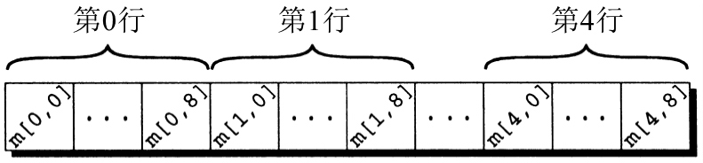

# Arrays


<!-- TOC -->

- [Arrays](#arrays)
    - [一维数组](#一维数组)
        - [数组初始化](#数组初始化)
        - [`sizeof`](#sizeof)
    - [多维数组](#多维数组)
        - [多维数组初始化](#多维数组初始化)
    - [常量数组](#常量数组)
    - [C99中的变长数组](#c99中的变长数组)
    - [复制数组](#复制数组)
    - [Misc](#misc)
        - [为什么数组下标从 0 开始而不是从 1 开始？](#为什么数组下标从-0-开始而不是从-1-开始)
        - [使用字符作为数组的下标是否可行呢](#使用字符作为数组的下标是否可行呢)
        - [指定初始化式可能会对同一个数组元素进行多次初始化操作](#指定初始化式可能会对同一个数组元素进行多次初始化操作)
    - [习题](#习题)
    - [References](#references)

<!-- /TOC -->


## 一维数组
1. 数组是含有多个数据值的数据结构，并且每个数据值具有相同的数据类型。
2. 为了声明数组，需要指明数组元素的类型和数量。例如，为了声明数组 `a `有 10 个 `int` 类型的元素，可以写成
    ```cpp
    int a[10];
    ```
3. 数组的长度可以用任何（整数）常量表达式指定。因为程序以后改变时可能需要调整数组的长度，所以较好的方法是用宏来定义数组的长度：
    ```cpp
    #define N 10
    ...
    int a[N];
    ```
4. C 语言不要求检查下标的范围。当下标超出范围时，程序可能执行不可预知的行为。对于某些编译器来说，下面的 `for` 语句可能产生一个无限循环
    ```cpp
    int a[10], i;

    for (i = 1; i <= 10; i++)
        a[i] = 0;
    ```
    当变量 `i` 的值变为 `10` 时，程序将数值 `0` 存储在 `a[10]` 中。但是 `a[10]` 这个元素并不存在，所以在元素 `a[9]` 后数值 `0` 立刻进入内存。如果内存中变量 `i` 放置在 `a[9]` 的后边（这是有可能的），那么变量 `i` 将会被重置为 `0`，进而导致循环重新开始。

### 数组初始化
1. **数组初始化式**（array initializer）最常见的格式是一个用大括号括起来的常量表达式列表，常量表达式之间用逗号进行分隔：
    ```cpp
    int a[10] = {1, 2, 3, 4, 5, 6, 7, 8, 9, 10};
    ```
2. 如果初始化式比数组短，那么数组中剩余的元素赋值为0：
    ```cpp
    int a[10] = {1, 2, 3, 4, 5, 6};
      /* initial value of a is {1, 2, 3, 4, 5, 6, 0, 0, 0, 0} */
    ```
    利用这一特性，可以很容易地把数组初始化为全0：
    ```cpp
    int a[10] = {0};
    ```
3. 初始化式完全为空是非法的。初始化式比要初始化的数组长也是非法的。
4. 如果给定了初始化式，可以省略掉数组的长度：
    ```cpp
    int a[] = {1, 2, 3, 4, 5, 6, 7, 8, 9, 10};
    ```
5. 经常有这样的情况：数组中只有相对较少的元素需要进行显式的初始化，而其他元素可以进行默认赋值。考虑下面这个例子：
    ```cpp
    int a[15] = {0, 0, 29, 0, 0, 0, 0, 0, 0, 7, 0, 0, 0, 0, 48};
    ```
  我们希望数组元素 `2` 为 `29`，元素 `9` 为 `7`，元素 `14` 为 `48`，而其他元素为 `0`。对于大数组，如果使用这种方式赋值，将是冗长和容易出错的
6. C99 中的指定初始化式可以用于解决这一问题。上面的例子可以使用指定初始化式写为：
    ```cpp
    int a[15] = {[2] = 29, [9] = 7, [14] = 48};
    ```
    括号中的数字称为 **指示符**。
7. 除了可以使赋值变得更简短、更易读之外，指定初始化式还有一个优点：赋值的顺序不再是一个问题，我们也可以将先前的例子重新写为：
    ```cpp
    int a[15] = {[14] = 48 , [9] = 7, [2] = 29};
    ```
8. 指示符必须是整型常量表达式。如果待初始化的数组长度为 `n`，则每个指示符的值都必须在 `0` 和 `n-1` 之间。但是，如果数组的长度是省略的，指示符可以是任意非负整数。
9. 对于后一种情况，编译器将根据最大的指示符推断出数组的长度。在接下来的这个例子中，指示符的最大值为 `23`，因此数组的长度为 `24`：
    ```cpp
    int b[] = {[5] = 10 , [23] = 13, [11] = 36, [15] = 29};
    ```
10. 初始化式中可以同时使用老方法（逐个元素初始化）和新方法（指定初始化式）：
    ```cpp
    int c[10] = {5, 1, [4] = 3, 7, 2, [8] = 6};
    // 5 1 0 0 3 7 2 0 6 0
    ```

### `sizeof`
1. 运算符 `sizeof` 可以确定数组的大小（字节数）。如果数组 `a` 有 10 个整数，那么 `sizeof(a)` 通常为 40（假定每个整数占 4 个字节）。
2. 还可以用 `sizeof` 来计算数组元素（如 `a[0]`）的大小。进而用数组的大小除以数组元素的大小可以得到数组元素的数量：
    ```cpp
    int a[] = {3, 4};

    int size = sizeof(a);
    int count = sizeof(a) / sizeof(a[0]);

    printf("%d %d", size, count); // 8 2
    ```
3. 可以通过这种方法来遍历数组
    ```cpp
    for (i = 0; i < sizeof(a) / sizeof(a[0]); i++)
        a[i] = 0;
    ```
4. 有些编译器会对表达式 `i < sizeof(a) / sizeof(a[0])` 给出一条警告消息，这稍微有点烦人。变量 `i` 的类型可能是 `int`（有符号类型），而` sizeof` 返回的值类型为 `size_t`（一种无符号类型）。把有符号整数与无符号整数相比较是很危险的，尽管在本例中这样做没问题（因为 `i` 和 `sizeof(a) / sizeof(a[0])` 都是非负值）。为了避免出现这一警告，可以把 `sizeof(a) / sizeof(a[0])` 强制转换为有符号整数：
    ```cpp
    for (i = 0; i < (int) (sizeof(a) / sizeof(a[0])); i++)
        a[i] = 0;
    ```
5. 表达式 `(int) (sizeof(a) / sizeof(a[0]))` 写起来不太方便，定义一个宏来表示它常常是很有帮助的：
    ```cpp
    #define SIZE ((int) (sizeof(a) / sizeof(a[0])))

    for (i = 0; i < SIZE; i++)
        a[i] = 0;
    ```


## 多维数组
1. 数组可以有任意维数。例如，下面的声明产生一个二维数组：
    ```cpp
    int m[5][9];
    ```
2. 虽然我们习惯以表格形式显示二维数组，但是实际上它们在计算机的内存中不是这样存储的。C 语言是按照 **行主序** 存储数组的，也就是从第 0 行开始，接着第 1 行，依次类推。例如，下面显示了数组 `m` 的存储：
    
3.和其他编程语言中的多维数组相比，C 语言中的多维数组扮演的角色相对较弱，这主要是因为 C 语言为存储多维数据提供了更加灵活的方法：指针数组。

### 多维数组初始化
1. 通过嵌套一维初始化式的方法可以产生二维数组的初始化式：
    ```cpp
    int m[5][9] = {
                    {1, 1, 1, 1, 1, 0, 1, 1, 1},
                    {0, 1, 0, 1, 0, 1, 0, 1, 0},
                    {0, 1, 0, 1, 1, 0, 0, 1, 0},
                    {1, 1, 0, 1, 0, 0, 0, 1, 0},
                    {1, 1, 0, 1, 0, 0, 1, 1, 1}
                };
    ```
2. C 语言为多维数组提供了多种方法来缩写初始化式。
    * 如果初始化式没有大到足以填满整个多维数组，那么把数组中剩余的元素赋值为 `0`。例如，下面的初始化式只填充了数组 `m` 的前三行，后边的两行将赋值为 `0`：
        ```cpp
        int m[5][9] = {
                        {1, 1, 1, 1, 1, 0, 1, 1, 1},
                        {0, 1, 0, 1, 0, 1, 0, 1, 0},
                        {0, 1, 0, 1, 1, 0, 0, 1, 0}
                    };
        ```
    * 如果内层的列表没有大到足以填满数组的一行，那么把此行剩余的元素初始化为0：
        ```cpp
        int m[5][9] = {
                        {1, 1, 1, 1, 1, 0, 1, 1, 1},
                        {0, 1, 0, 1, 0, 1, 0, 1},
                        {0, 1, 0, 1, 1, 0, 0, 1},
                        {1, 1, 0, 1, 0, 0, 0, 1},
                        {1, 1, 0, 1, 0, 0, 1, 1, 1}
                    };
        ```
    * 甚至可以省略掉内层的花括号：
        ```cpp
        int m[5][9] = {
                        1, 1, 1, 1, 1, 0, 1, 1, 1,
                        0, 1, 0, 1, 0, 1, 0, 1, 0,
                        0, 1, 0, 1, 1, 0, 0, 1, 0,
                        1, 1, 0, 1, 0, 0, 0, 1, 0,
                        1, 1, 0, 1, 0, 0, 1, 1, 1
                    };
        ```
        因为一旦编译器发现数值足以填满一行，它就开始填充下一行。
3. 在多维数组中省略掉内层的花括号可能是很危险的，因为额外的元素（更糟的情况是丢失的元素）将会影响剩下的初始化式。省略花括号会引起某些编译器产生类似 “missing braces around initializer” 这样的警告消息。
4. C99 的指定初始化式对多维数组也有效。例如，可以这样创建2×2的单位矩阵：
    ```cpp
    double ident[2][2] = {
                            [0][0] = 1.0, 
                            [1][1] = 1.0
                        };
    ```
    像通常一样，没有指定值的元素都默认置为 0。
5. 多维数组也可以只使用一个一个值来初始化
    ```cpp
    bool in_hand[4][4] = {false};
    ```
    由于我们在初始化式中只给出了一个值，编译器会把其他数组元素填充为值 `0`（假）。


## 常量数组
1. 无论一维数组还是多维数组，都可以通过在声明的最开始处加上单词 `const` 而成为 “常量”：
    ```cpp
    const char hex_chars[] =
    {'0', '1', '2', '3', '4', '5', '6', '7', '8', '9',
    'A', 'B', 'C', 'D', 'E', 'F'};
    ```
2. 程序不应该对声明为 `const` 的数组进行修改，编译器能够检测到直接修改某个元素的意图。
3. 把数组声明为 `const` 有两个主要的好处。它表明程序不会改变数组，这对于以后阅读程序的人可能是有价值的信息。它还有助于编译器发现错误——`const` 会告诉编译器我们不打算修改数组。
4. `const` 类型限定符不限于数组，但是在数组声明中特别有用，因为数组经常含有一些在程序执行过程中不会发生改变的参考信息。


## C99中的变长数组 
1. 前面说到，数组变量的长度必须用常量表达式进行定义。但是在 C99 中，有时候也可以使用非常量表达式
    ```cpp
    int n;

    scanf("%d", &n);

    int a[n];  /* C99 only - length of array depends on n */
    ```
2. 上面程序中的数组 `a` 是一个 **变长数组**（variable-length array，简称VLA）。变长数组的长度是在程序执行时计算的，而不是在程序编译时计算的。
3. 变长数组的主要优点是程序员不必在构造数组时随便给定一个长度，程序在执行时可以准确地计算出所需的元素个数。如果让程序员来指定长度，数组可能过长（浪费内存）或过短（导致程序出错）。
4. 变长数组的长度不一定要用变量来指定，任意表达式（可以含有运算符）都可以。例如：
    ```cpp
    int a[3*i+5];
    int b[j+k];
    ```
5. 像其他数组一样，变长数组也可以是多维的：
    ```cpp
    int c[m][n];
    ```
6. 变长数组的主要限制是它们没有静态存储期限（目前我们还没有发现具有这一特性的数组），另一个限制是变长数组没有初始化式。
7. 变长数组常见于除 `main` 函数以外的其他函数。对于函数 `f` 而言，变长数组的最大优势就是每次调用 `f` 时长度可以不同。
8. 之前在说 `goto` 时说道不允许 `goto` 语句绕过变长数组的声明。因为在程序执行过程中，遇到变长数组声明时通常就为该变长数组分配内存空间了。用 `goto` 语句绕过变长数组的声明可能会导致程序对未分配空间的数组中的元素进行访问。


## 复制数组
1. 如果试图用赋值运算符把一个数组复制到另一个数组中，编译器将给出出错消息
    ```cpp
    a = b;   /* a and b are arrays */
    ```
2. 看似合理，但它确实是非法的。非法的理由不是显而易见的，这需要用到 C 语言中数组和指针之间的特殊关系。
3. 把一个数组复制到另一个数组中的最简单的实现方法是利用循环对数组元素逐个进行复制：
    ```cpp
    for (i = 0; i < N; i++)
        a[i] = b[i];
    ```
4. 另一种可行的方法是使用来自 `<string.h>` 头的函数 `memcpy`（意思是 “内存复制”）。`memcpy` 函数是一个底层函数，它把字节从一个地方简单复制到另一个地方。为了把数组 `b` 复制到数组 `a` 中，使用函数 `memcpy` 的格式如下：
    ```cpp
    memcpy(a, b, sizeof(a));
    ```
5. 许多程序员倾向于使用 `memcpy` 函数（特别是处理大型数组时），因为它潜在的速度比普通循环更快。


## Misc
### 为什么数组下标从 0 开始而不是从 1 开始？
让下标从 0 开始可以使编译器简单一点。而且，这样也可以使得数组取下标运算的速度有少量的提高。

### 使用字符作为数组的下标是否可行呢
1. 是可以的，因为 C 语言把字符作为整数来处理。但是，在使用字符作为下标前，可能需要对字符进行 “缩放”。
2. 举个例子，假设希望数组 `letter_count` 对字母表中的每个字母进行跟踪计数。这个数组将需要 26 个元素，所以可采用下列方式对其进行声明：
    ```cpp
    int letter_count[26];
    ```
3. 然而，不能直接使用字母作为数组 `letter_count` 的下标，因为字母的整数值不是落在 0～25 的区间内的。
4. 为了把小写字母缩放到合适的范围内，可以简单采用减去 `'a'` 的方法；为了缩放大写字母，则可以减去 `'A'`。
5. 说明一下，这种方法不一定可移植，因为它假定字母的代码是连续的。不过，对大多数字符集（包括 ASCII）来说，这样做都是没问题的。

### 指定初始化式可能会对同一个数组元素进行多次初始化操作
1. 考虑下面的数组声明：
    ```cpp
    int a[] = {4, 9, 1, 8, [0] = 5, 7};
    ```
2. 编译器在处理初始化式列表时，会记录下一个待初始化的数组元素的位置。正常情况下，下一个元素是刚被初始化的元素后面的那个。
3. 但是，当列表中出现初始化式时，下一个元素会被强制为指示符对应的元素，即使该元素已经被初始化了。
4. 下面逐步分析编译器处理数组a的初始化式的操作：
    1. 用 `4` 初始化元素 0，下一个待初始化的是元素 1；
    2. 用 `9` 初始化元素 1，下一个待初始化的是元素 2；
    3. 用 `1` 初始化元素 2，下一个待初始化的是元素 3；
    4. 用 `8` 初始化元素 3，下一个待初始化的是元素 4；
    5. `[0]` 指示符导致下一个元素是元素 0，所以用 `5` 初始化元素 0（替换先前存储的 `4`）。
    6. 下一个待初始化的是元素 1，用 `7` 初始化元素 1（替换先前存储的 `9`）。
    7. 下一个待初始化的是元素 2（跟本例不相关，因为已经到达列表的末尾）。
5. 最终效果跟下面的声明一样：
    ```cpp
    int a[] = {5, 7, 1, 8};
    ```
    因此，数组的长度为 4。


## 习题
* 编程题 9
    ```cpp
    #include <stdbool.h>   /* C99 only */
    #include <stdio.h>
    #include <stdlib.h>
    #include <time.h>


    #define MATRIX_SIZE 10

    int main(void)
    {
        int direction; // 下一步的移动方向
        
        bool canMove = true; // 能否继续移动，不能则结束

        int currX=0, currY=0;

        char a[MATRIX_SIZE][MATRIX_SIZE];


        for ( int i=0; i<MATRIX_SIZE; i++ ) {
            for ( int j=0; j<MATRIX_SIZE; j++ ) {
                a[i][j] = '.';
            }
        }

        srand((unsigned) time(NULL));

        int lastChar = a[0][0] = 'A';
        int index = 1;


        while (index<26 && canMove) {
            
            direction = rand() % 4;
            canMove = false;

            for ( int i=0; i<4; i++ ) {

                direction = (direction + i) % 4;

                if ( direction == 0 ) { // 上
                    if ( currY > 0 && a[currX][currY-1] == '.' ) {
                        currY--; 
                        canMove = true;
                        break;
                    }
                }
                if ( direction == 1 ) { // 右
                    if ( currX < MATRIX_SIZE-1 && a[currX+1][currY] == '.' ) {
                        currX++; 
                        canMove = true;
                        break;
                    }
                }
                if ( direction == 2 ) { // 下
                    if ( currY < MATRIX_SIZE-1 && a[currX][currY+1] == '.' ) {
                        currY++; 
                        canMove = true;
                        break;
                    }
                }
                if ( direction == 3 ) { // 左
                    if ( currX > 0 && a[currX-1][currY] == '.' ) {
                        currX--; 
                        canMove = true;
                        break;
                    }
                }
            }

            if (!canMove) {
                break;
            }
            else {
                a[currX][currY] = ++lastChar;
            }

            index++;
        }


        for ( int i=0; i<MATRIX_SIZE; i++ ) {
            for ( int j=0; j<MATRIX_SIZE; j++ ) {
                printf("%c  ", a[i][j]);
            }
            printf("\n");
        }

        return 0;
    }
    ```
* 编程题 9
    ```cpp
    #include <stdio.h>


    int main(void)
    {
        
        printf("Enter a sentence: ");

        char ch = getchar();
        char chs[100];
        int index = 0;
        char endChar;

        int endIndex, startIndex;

        while ( ch != '.' && ch != '?' && ch != '!' ) {
            chs[index] = ch;
            ch = getchar();
            index++;
        }
        endChar = ch;


        printf("Reversal of sentence: ");

        index--;
        endIndex = index;
        while ( index > -1 ) {
            if ( chs[index] == ' ' ) {
                startIndex = index+1;
                for ( int i=startIndex; i<= endIndex; i++ ) {
                    printf("%c", chs[i]);
                }
                printf(" ");
                endIndex = startIndex-2;
            }

            index--;
        }

        // 第一个单词
        for ( int i=0; i<=endIndex; i++ ) {
            printf("%c", chs[i]);
        }
        
        printf("%c", endChar);

        return 0;
    }
    ```

* 编程题 15
    ```cpp
    #include <stdio.h>

    int main(void)
    {
        char ch;
        char encryptedChar;
        char chs[80];
        int index = 0;
        int shiftAmount;


        printf("Enter message to be encrypted: ");

        while ( (ch=getchar()) != '\n' ) {
            chs[index++] = ch;
        }


        printf("Enter shift amount (1-25): ");
        scanf("%d", &shiftAmount);

        for ( int i=0; i<index; i++ ) {

            if ( chs[i] >= 'A' && chs[i] <= 'Z' ) {
                encryptedChar = (chs[i] - 'A' + shiftAmount) % 26 + 'A';
                printf("%c", encryptedChar);
            }
            else if ( chs[i] >= 'a' && chs[i] <= 'z' ) {
                encryptedChar = (chs[i] - 'a' + shiftAmount) % 26 + 'a';
                printf("%c", encryptedChar);
            }
            else {
                printf("%c", chs[i]);
            }
        }


        return 0;
    }
    ```
* 编程题 16
    ```cpp
    #include <stdio.h>

    int main(void)
    {

        char letters[26] = {0};
        char ch;

        printf("Enter first word: ");
        while ( (ch = getchar()) != '\n' ) {
            letters[ch-'a']++;
        }

        printf("Enter second word: ");
        while ( (ch = getchar()) != '\n' ) {
            letters[ch-'a']--;
        }

        for ( int i=0; i<26; i++ ) {
            if ( letters[i] != 0 ) {
                printf("The words are not anagrams.");
                return 0;
            }
        }

        printf("The words are anagrams.");

        return 0;
    }
    ```


## References
* [C语言程序设计](https://book.douban.com/subject/4279678/)