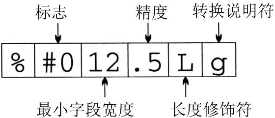

# Input/Output


<!-- TOC -->

- [Input/Output](#inputoutput)
    - [流](#流)
        - [文件指针](#文件指针)
        - [标准流和重定向](#标准流和重定向)
        - [文本文件与二进制文件](#文本文件与二进制文件)
            - [内容的区别](#内容的区别)
            - [读写数据的区别](#读写数据的区别)
    - [文件操作](#文件操作)
        - [打开文件](#打开文件)
            - [Windows 的注意点](#windows-的注意点)
        - [模式](#模式)
        - [关闭文件](#关闭文件)
        - [为打开的流附加文件](#为打开的流附加文件)
        - [从命令行获取文件名](#从命令行获取文件名)
            - [程序　检查文件是否可以打开](#程序　检查文件是否可以打开)
        - [临时文件](#临时文件)
        - [文件缓冲](#文件缓冲)
            - [`fflush`](#fflush)
            - [`setvbuf`](#setvbuf)
            - [`setbuf`](#setbuf)
        - [其他文件操作](#其他文件操作)
    - [格式化的输入/输出](#格式化的输入输出)
        - [`…printf` 函数](#printf-函数)
        - [`…printf` 转换说明](#printf-转换说明)
            - [标志（可选项，允许多于一个）](#标志可选项允许多于一个)
            - [最小字段宽度（可选项）](#最小字段宽度可选项)
            - [精度（可选项）](#精度可选项)
            - [长度修饰符（可选项）](#长度修饰符可选项)
            - [转换说明符](#转换说明符)
            - [`*` 的示例](#-的示例)
            - [不常用的两个转换说明的示例](#不常用的两个转换说明的示例)
        - [C99 对 `…printf` 转换说明的修改](#c99-对-printf-转换说明的修改)
        - [`…scanf` 函数](#scanf-函数)
        - [`…scanf` 格式串](#scanf-格式串)
        - [`…scanf` 转换说明](#scanf-转换说明)
        - [C99 对 `…scanf` 转换说明的改变](#c99-对-scanf-转换说明的改变)
        - [`scanf` 示例](#scanf-示例)
        - [检测文件末尾和错误条件](#检测文件末尾和错误条件)
    - [字符的输入/输出](#字符的输入输出)
        - [输出函数](#输出函数)
        - [输入函数](#输入函数)
        - [程序　复制文件](#程序　复制文件)
    - [行的输入/输出](#行的输入输出)
        - [输出函数](#输出函数-1)
        - [输入函数](#输入函数-1)
    - [块的输入/输出](#块的输入输出)
    - [文件定位](#文件定位)
        - [`fseek`](#fseek)
        - [`ftell`](#ftell)
        - [`rewind`](#rewind)
        - [`fgetpos` 和 `fsetpos`](#fgetpos-和-fsetpos)
        - [程序　修改零件记录文件](#程序　修改零件记录文件)
    - [字符串的输入/输出](#字符串的输入输出)
        - [输出函数](#输出函数-2)
            - [`sprintf`](#sprintf)
            - [`snprintf`](#snprintf)
        - [输入函数](#输入函数-2)
    - [References](#references)

<!-- /TOC -->


## 流
1. 在 C 语言中，术语 **流**（stream）表示任意输入的源或任意输出的目的地。
2. 许多小型程序（就像前面章节中介绍的那些）都是通过一个流（通常和键盘相关）获得全部的输入，并且通过另一个流（通常和屏幕相关）写出全部的输出。
3. 较大规模的程序可能会需要额外的流。这些流常常表示存储在不同介质（如硬盘驱动器、CD、DVD 和闪存）上的文件，但也很容易和不存储文件的设备（网络端口、打印机等）相关联。
4. 这里将集中讨论文件，因为它们常见且容易理解。在应该说流的时候，有时会使用术语 **文件**。）但是请记住一点，`<stdio.h>` 中的许多函数可以处理各种形式的流，而不仅仅可以处理表示文件的流。

### 文件指针
1. C 程序中对流的访问是通过 **文件指针**（file pointer）实现的。此指针的类型为 `FILE *`（`FILE` 类型在 `<stdio.h>` 中声明）。
2. 用文件指针表示的特定流具有标准的名字；如果需要，还可以声明另外一些文件指针。例如，如果程序除了标准流之外还需要两个流，则可以包含如下声明：
    ```cpp
    FILE *fp1, *fp2;
    ```
3. 虽然操作系统通常会限制可以同时打开的流的数量，但程序可以声明任意数量的 `FILE *` 类型变量。

### 标准流和重定向
1. `<stdio.h>` 提供了 3 个标准流。这 3 个标准流可以直接使用——我们不需要对其进行声明，也不用打开或关闭它们。
    文件指针 | 流 | 默认的含义
    --|--|--
    `stdin`  | 标准输入 | 键盘
    `stdout` | 标准输出 | 屏幕
    `stderr` | 标准错误 | 屏幕
2. 前面章节使用过的函数（`printf`、`scanf`、`putchar`、`getchar`、`puts` 和 `gets`）都是通过 `stdin` 获得输入，并且用 `stdout` 进行输出的。
3. 默认情况下，`stdin` 表示键盘，而 `stdout` 和 `stderr` 则表示屏幕。 然而，许多操作系统允许通过一种称为 **重定向**（redirection）的机制来改变这些默认的含义。
4. 通常，我们可以强制程序从文件而不是从键盘获得输入，方法是在命令行中放上文件的名字，并在前面加上字符 `<`：
    ```
    demo <in.dat
    ```
5. 这种方法称为 **输入重定向**（input redirection），它本质上是使 `stdin` 流表示文件（此例中为文件 `in.dat`）而非键盘。
6. 重定向的绝妙之处在于，`demo` 程序不会意识到正在从文件 `in.dat` 中读取数据，它会认为从 `stdin` 获得的任何数据都是从键盘上录入的。
7. **输出重定向**（output redirection）也是类似的。对 `stdout` 流的重定向通常是通过在命令行中放置文件名，并在前面加上字符 `>` 实现的：
    ```
    demo >out.dat
    ```
    现在所有写入 `stdout` 的数据都将进入 `out.dat` 文件中，而不是出现在屏幕上了。
8. 顺便说一下，我们还可以把输出重定向和输入重定向结合使用：
    ```
    demo <in.dat >out.dat
    ```
9. 字符 `<` 和 `>` 不需要与文件名相邻，重定向文件的顺序也是无关紧要的，所以下面的例子效果一样：
    ```
    demo < in.dat > out.dat
    demo >out.dat <in.dat
    ```
10. 输出重定向的一个问题是会把写入 `stdout` 的 **所有内容** 都放入到文件中。如果程序运行失常并且开始写出错消息，那么我们只能在看文件的时候才会知道。而这些应该是出现在 `stderr` 中的。
11. 通过把出错消息写到 `stderr` 而不是 `stdout` 中，我们可以保证即使在对 `stdout` 进行重定向时这些出错消息仍能出现在屏幕上。（不过，操作系统通常也允许对 `stderr` 进行重定向。）

### 文本文件与二进制文件
1. `<stdio.h>` 支持两种类型的文件：文本文件和二进制文件。
2. 在 **文本文件**（text file）中，字节表示字符，这使人们可以检查或编辑文件。例如，C 程序的源代码是存储在文本文件中的。
3. 另一方面，在 **二进制文件**（binary file）中，字节不一定表示字符；字节组还可以表示其他类型的数据，比如整数和浮点数。如果试图查看可执行 C 程序的内容，你会立刻意识到它是存储在二进制文件中的。

#### 内容的区别
* 文本文件分为若干行
    1. 文本文件的每一行通常以一两个特殊字符结尾， 特殊字符的选择与操作系统有关。
    2. 在 Windows 中，行末的标记是回车符（`'\x0d'`）与一个紧跟其后的回行符（`'\x0a'`）。在 UNIX 和 Macintosh 操作系统（Mac OS）的较新版本中，行末的标记是一个单独的回行符。旧版本的 Mac OS 使用一个单独的回车符。
* 文本文件可以包含一个特殊的 “文件末尾” 标记
    1. 一些操作系统允许在文本文件的末尾使用一个特殊的字节作为标记。
    2. 在 Windows 中，标记为 `'\x1a'`（Ctrl+Z）。Ctrl+Z 不是必需的，但如果存在，它就标志着文件的结束，其后的所有字节都会被忽略。使用 Ctrl+Z 的这一习惯继承自 DOS，而 DOS 中的这一习惯又是从 CP/M（早期用于个人电脑的一种操作系统）来的。
    3. 大多数其他操作系统（包括 UNIX）没有专门的文件末尾字符。
* 二进制文件不分行，也没有行末标记和文件末尾标记，所有字节都是平等对待的。

#### 读写数据的区别
1. 向文件写入数据时，我们需要考虑是按文本格式存储还是按二进制格式进行存储。为了搞清楚其中的差别，考虑在文件中存储数32 767的情况。
2. 一种选择是以文本的形式把该数按字符 `3`、`2`、`7`、`6`、`7` 写入。假设字符集为 ASCII，那么就可以得到下列 5 个字节
    
3. 另一种选择是以二进制的形式存储此数，这种方法只会占用两个字节
    
    （在按小端顺序存储数据的系统中，这两个字节的顺序相反。）
4. 从上述示例可以看出，用二进制形式存储数可以节省相当大的空间。
5. 编写用来读写文件的程序时，需要考虑该文件是文本文件还是二进制文件。在屏幕上显示文件内容的程序可能要把文件视为文本文件。但是，文件复制程序就不能认为要复制的文件为文本文件。如果那样做，就不能完全复制含有文件末尾字符的二进制文件了。
6. 在无法确定文件是文本形式还是二进制形式时，安全的做法是把文件假定为二进制文件。


## 文件操作
1. 简单性是输入和输出重定向的魅力之一：不需要打开文件、关闭文件或者执行任何其他的显式文件操作。
2. 可惜的是，重定向在许多应用中受到限制。当程序依赖重定向时，它无法控制自己的文件，甚至无法知道这些文件的名字。更糟糕的是，如果程序需要在同一时间读入两个文件或者写出两个文件，重定向都无法做到。
3. 当重定向无法满足需要时，我们将使用 `<stdio.h>` 提供的文件操作。包括打开文件、关闭文件、改变缓冲文件的方式、删除文件以及重命名文件。

### 打开文件
```cpp
FILE *fopen(const char * restrict filename, const char * restrict mode);
```

1. 如果要把文件用作流，打开时需要调用 `fopen` 函数。
2. `fopen` 函数的第一个参数是含有要打开文件名的字符串。“文件名” 可能包含关于文件位置的信息，如驱动器符或路径。
3. 第二个参数是 “模式字符串”，它用来指定打算对文件执行的操作。例如，字符串 `"r"` 表明将从文件读入数据，但是不会向文件写入数据。
4. 注意，在 `fopen` 函数的原型中，`restrict` 关键字出现了两次。`restrict` 是 C99 关键字，表明 `filename` 和 `mode` 所指向的字符串的内存单元不共享。C89 中的 `fopen` 原型不包含 `restrict`，但也有这样的要求。`restrict` 对 `fopen` 的行为没有影响，所以通常可以忽略。
5. `fopen` 函数返回一个文件指针。程序可以（且通常将）把此指针存储在一个变量中，稍后在需要对文件进行操作时使用它。
6. `fopen` 函数的常见调用形式如下所示，其中 `fp` 是 `FILE *` 类型的变量：
    ```cpp
    fp = fopen("in.dat", "r");        /* opens in.dat for reading */
    ```
    当程序稍后调用输入函数从文件 `in.dat` 中读数据时，将会把 `fp` 作为一个实际参数。
7. 当无法打开文件时，`fopen` 函数会返回空指针。这可能是因为文件不存在，也可能是因为文件的位置不对，还可能是因为我们没有打开文件的权限。
8. 永远不要假设可以打开文件，每次都要测试 `fopen` 函数的返回值以确保不是空指针。

#### Windows 的注意点
1. 在 `fopen` 函数调用的文件名中含有字符 `\` 时，一定要小心。因为 C 语言会把字符 `\` 看成是转义序列的开始标志。
    ```cpp
    fopen("c:\project\test1.dat", "r")
    ```
2. 这个调用会失败，因为编译器会把 `\t` 看成是转义字符。`\p` 不是有效的转义字符，但看上去像。根据 C 标准，`\p` 的含义是未定义的。
3. 有两种方法可以避免这一问题。一种方法是用 `\\` 代替 `\`：
    ```cpp
    fopen("c:\\project\\test1.dat", "r")
    ```
4. 另一种方法更简单——只要用 `/` 代替 `\` 就可以了：
    ```cpp
    fopen("c:/project/test1.dat", "r")
    ```
    Windows 会把 `/` 接受为目录分隔符。

### 模式
1. 给 `fopen` 函数传递哪种模式字符串不仅依赖于稍后将要对文件采取的操作，还取决于文件中的数据是文本形式还是二进制形式。
2. 为了打开一个文本文件，可以采用下表中的一种模式字符串。
    字符串 | 含义
    --|--
    `"r"` | 打开文件用于读
    `"w"` | 打开文件用于写（文件不需要存在）
    `"a"` | 打开文件用于追加（文件不需要存在）
    `"r+"` | 打开文件用于读和写，从文件头开始
    `"w+"` | 打开文件用于读和写（如果文件存在就截去）
    `"a+"` | 打开文件用于读和写（如果文件存在就追加）
3. 当使用 `fopen` 打开二进制文件时， 需要在模式字符串中包含字母 `b`。下表列出了用于二进制文件的模式字符串
    字符串 | 含义
    --|--
    `"rb"` | 打开文件用于读
    `"wb"` | 打开文件用于写（文件不需要存在）
    `"ab"` | 打开文件用于追加（文件不需要存在）
    `"r+b"` 或者 `"rb+"` | 打开文件用于读和写，从文件头开始
    `"w+b"` 或者 `"wb+"` | 打开文件用于读和写（如果文件存在就截去）
    `"a+b"` 或者 `"ab+"` | 打开文件用于读和写（如果文件存在就追加）
4. 顺便说一下，当打开文件用于读和写时，有一些特殊的规则。如果没有先调用一个文件定位函数，那么就不能从读模式转换成写模式，除非读操作遇到了文件的末尾。类似地，如果既没有调用 `fflush` 函数也没有调用文件定位函数，那么就不能从写模式转换成读模式。

### 关闭文件
    ```cpp
    int fclose(FILE *stream);
    ```

1. `fclose` 函数允许程序关闭不再使用的文件。`fclose` 函数的参数必须是文件指针，此指针来自 `fopen` 函数或 `freopen` 函数的调用。
2. 如果成功关闭了文件，`fclose` 函数会返回零；否则，它将会返回错误代码 `EOF`。
3. 为了说明如何在实践中使用 `fopen` 函数和 `fclose` 函数，下面给出了一个程序的框架。此程序打开文件 `example.dat` 进行读操作，并要检查打开是否成功，然后在程序终止前再把文件关闭：
    ```cpp
    #include <stdio.h>
    #include <stdlib.h>

    #define FILE_NAME "example.dat"

    int main(void)
    {
        FILE *fp;

        fp = fopen(FILE_NAME, "r");
        if (fp == NULL) {
            printf("Can't open %s\n", FILE_NAME);
            exit(EXIT_FAILURE);
        }
        ...
        fclose(fp);
        return 0;
    }
    ```
4. 当然，按照 C 程序员的编写习惯，通常也可以把 `fopen` 函数的调用和 `fp` 的声明结合在一起使用：
    ```cpp
    FILE *fp = fopen(FILE_NAME, "r");
    ```
    还可以把函数调用与 `NULL` 判定相结合：
    ```cpp
    if ((fp = fopen(FILE_NAME, "r")) == NULL) ...
    ```

### 为打开的流附加文件
```cpp
FILE *freopen(const char * restrict filename,
              const char * restrict mode,
              FILE * restrict stream);
```

1. `freopen` 函数为已经打开的流附加上一个不同的文件。最常见的用法是把文件和一个标准流（`stdin`、`stdout` 或 `stderr`）相关联。例如，为了使程序开始往文件 `foo` 中写数据，可以使用下列形式的 `freopen` 函数调用：
    ```cpp
    if (freopen("foo","w", stdout) == NULL) {
    /* error; foo can't be opened */
    }
    ```
2. 在关闭了先前（通过命令行重定向或者之前的 `freopen` 函数调用）与 `stdout` 相关联的所有文件之后，`freopen` 函数将打开文件 `foo`，并将其与 `stdout` 相关联。
3. `freopen` 函数的返回值通常是它的第三个参数（一个文件指针）。
4. 如果无法打开新文件，那么 `freopen` 函数会返回空指针。如果无法关闭旧的文件，那么 `freopen` 函数会忽略掉错误。
5. C99 新增了一种机制。如果 `filename` 是空指针，`freopen` 会试图把流的模式修改为 `mode` 参数指定的模式。不过，具体的实现可以不支持这种特性；如果支持，可以限定能进行哪些模式改变。

### 从命令行获取文件名
1. 当正在编写的程序需要打开文件时，马上会出现一个问题：如何把文件名提供给程序呢？把文件名嵌入程序自身的做法不太灵活，而提示用户录入文件名的做法也很笨拙。
2. 通常，最好的解决方案是让程序从命令行获取文件的名字。例如，当执行名为 `demo` 的程序时，可以通过把文件名放入命令行的方法为程序提供文件名：
    ```
    demo names.dat dates.dat
    ```
3. 之前了解到如何通过定义带有两个形式参数的 `main` 函数来访问命令行参数：
    ```cpp
    int main(int argc, char *argv[])
    {
    ...
    }
    ```
4. `argc` 是命令行参数的数量，而 `argv` 是指向参数字符串的指针数组。
5. `argv[0]` 指向程序的名字，从 `argv[1]` 到 `argv[argc-1]` 都指向剩余的实际参数，而 `argv[argc]` 是空指针。
6. 在上述例子中，`argc` 是 3，`argv[0]` 指向含有程序名的字符串，`argv[1]` 指向字符串 `"names.dat"`，而 `argv[2]` 则指向字符串 `"dates.dat"`：

#### 程序　检查文件是否可以打开
1. 下面的程序判断文件是否存在，如果存在是否可以打开进行读入。
2. 在运行程序时，用户将给出要检查的文件的名字：
    ```
    canopen file
    ```
3. 然后程序将显示出 file `can be opened` 或者显示出 file `can't be opened`。如果在命令行中录入的实际参数的数量不对，那么程序将显示出消息 `usage: canopen filename` 来提醒用户 `canopen` 需要一个文件名。
4. canopen.c
    ```cpp
    /* Checks whether a file can be opened for reading */

    #include <stdio.h>
    #include <stdlib.h>

    int main(int argc, char *argv[])
    {
        FILE *fp;

        if (argc != 2) {
            printf("usage: canopen filename\n");
            exit (EXIT_FAILURE);
        }


        if ((fp = fopen(argv[1], "r")) == NULL) {
            printf("%s can't be opened\n", argv[1]);
            exit (EXIT_FAILURE);
        }

        printf("%s can be opened\n", argv[1]);
        fclose(fp);
        return 0;
    }
    ```
    注意，可以使用重定向来丢弃 `canopen` 的输出，并简单地测试它返回的状态值。

### 临时文件
    ```cpp
    FILE *tmpfile(void);
    char *tmpnam(char *s);
    ```

1. 现实世界中的程序经常需要产生临时文件，即只在程序运行时存在的文件。例如，C 编译器就常常产生临时文件。编译器可能先把 C 程序翻译成一些存储在文件中的中间形式，然后在稍后把程序翻译成目标代码时编译器会读取这些文件。一旦程序完全通过了编译，就不再需要保留那些含有程序中间形式的文件了。
2. `<stdio.h>` 提供了两个函数用来处理临时文件，即 `tmpfile` 函数和 `tmpnam` 函数。
3. `tmpfile` 函数创建一个临时文件（用 `"wb+"` 模式打开），该临时文件将一直存在，除非关闭它或程序终止。
4. `tmpfile` 函数的调用会返回文件指针，此指针可以用于稍后访问该文件：
    ```cpp
    FILE *tempptr;
    ...
    tempptr = tmpfile();   /* creates a temporary file */
    ```
5. 如果创建文件失败，`tmpfile` 函数会返回空指针。
6. 虽然 `tmpfile` 函数很易于使用，但是它有两个缺点：
    * 无法知道 `tmpfile` 函数创建的文件名是什么
    * 无法在以后决定使文件成为永久性的。
7. 如果这些限制产生了问题，可以替换的解决方案就是用 `fopen` 函数产生临时文件。当然，我们不希望此文件拥有和前面已经存在的文件相同的名字，所以就需要一种方法来产生新的文件名。这也就是 `tmpnam` 函数出现的原因。
8. `tmpnam` 函数为临时文件产生名字。如果它的实际参数是空指针，那么 `tmpnam` 函数会把文件名存储到一个静态变量中，并且返回指向此变量的指针：
    ```cpp
    char *filename;
    ...
    filename = tmpnam(NULL);   /* creates a temporary file name */
    ```
9. 否则，`tmpnam` 函数会把文件名复制到程序员提供的字符数组中：
    ```cpp
    char filename[L_tmpnam];
    ...
    tmpnam(filename);          /* creates a temporary file name */
    ```
10. 在后一种情况下，`tmpnam` 函数也会返回指向数组第一个字符的指针。
11. `L_tmpnam` 是 `<stdio.h>` 中的一个宏，它指明了保存临时文件名的字符数组的长度。
12. 确保 `tmpnam` 函数所指向的数组至少有 `L_tmpnam` 个字符。此外，还要当心不能过于频繁地调用 `tmpnam` 函数。
13. 宏 `TMP_MAX`（在 `<stdio.h>` 中定义）指明了程序执行期间由 `tmpnam` 函数产生的临时文件名的最大数量
    ```cpp
    printf("%d %d", L_tmpnam, TMP_MAX); // 16 32767    
    ```      
14. 如果生成文件名失败，`tmpnam` 返回空指针。

### 文件缓冲
```cpp
int fflush(FILE *stream);
void setbuf(FILE * restrict stream, char * restrict buf);
int setvbuf(FILE * restrict stream, char * restrict buf, int mode, size_t size);
```

1. 向磁盘驱动器传入数据或者从磁盘驱动器传出数据都是相对较慢的操作。因此，在每次程序想读或写字符时都直接访问磁盘文件是不可行的。
2. 获得较好性能的诀窍就是 **缓冲**（buffering）：把写入流的数据存储在内存的缓冲区域内；当缓冲区满了（或者关闭流）时，对缓冲区进行 “清洗”（写入实际的输出设备）。
3. 输入流可以用类似的方法进行缓冲：缓冲区包含来自输入设备的数据，从缓冲区读数据而不是从设备本身读数据。
4. 缓冲在效率上可以取得巨大的收益，因为从缓冲区读字符或者在缓冲区内存储字符几乎不花什么时间。当然，把缓冲区的内容传递给磁盘，或者从磁盘传递给缓冲区是需要花时间的，但是一次大的 “块移动” 比多次小字节移动要快很多。
5. `<stdio.h>` 中的函数会在缓冲有用时自动进行缓冲操作。缓冲是在后台发生的，我们通常不需要关心它的操作。然而，极少的情况下可能需要我们起到更主动的作用。如果真是如此，可以使用 `fflush` 函数、`setbuf` 函数和 `setvbuf` 函数。

#### `fflush`
1. 当程序向文件中写输出时，数据通常先放入缓冲区中。当缓冲区满了或者关闭文件时，缓冲区会自动清洗。然而，通过调用 `fflush` 函数，程序可以按我们所希望的频率来清洗文件的缓冲区。
2. 调用
    ```cpp
    fflush(fp);        /* flushes buffer for fp */
    ```
    为和 `fp` 相关联的文件清洗了缓冲区。
3. 调用
    ```cpp
    fflush(NULL);      /* flushes all buffers */
    ```
    清洗了全部输出流。
4. 如果调用成功，`fflush` 函数会返回零；如果发生错误，则返回 `EOF`。

#### `setvbuf`
1. `setvbuf` 函数允许改变缓冲流的方法，并且允许控制缓冲区的大小和位置。函数的第三个实际参数指明了期望的缓冲类型，该参数应为以下三个宏之一
    * `_IOFBF`（满缓冲）。当缓冲区为空时，从流读入数据；当缓冲区满时，向流写入数据。
    * `_IOLBF`（行缓冲）。每次从流读入一行数据或者向流写入一行数据。
    * `_IONBF`（无缓冲）。直接从流读入数据或者直接向流写入数据，而没有缓冲区。
2. 所有这三种宏都在 `<stdio.h>` 中进行了定义。对于没有与交互式设备相连的流来说，满缓冲是默认设置。
3. `setvbuf` 函数的第二个参数（如果它不是空指针的话）是期望缓冲区的地址。
4. 缓冲区可以有静态存储期限、自动存储期限，甚至可以是动态分配的。使缓冲区具有自动存储期限可以在块退出时自动为其重新申请空间。动态分配缓冲区可以在不需要时释放缓冲区。
5. `setvbuf` 函数的最后一个参数是缓冲区内字节的数量。较大的缓冲区可以提供更好的性能，而较小的缓冲区可以节省空间。
6. 例如，下面这个 `setvbuf` 函数的调用利用 `buffer` 数组中的 `N` 个字节作为缓冲区，而把 `stream` 的缓冲变成了满缓冲：
    ```cpp
    char buffer[N];
    ...
    setvbuf(stream, buffer, _IOFBF, N);
    ```
7. `setvbuf` 函数的调用必须在打开 stream 之后、在对其执行任何其他操作之前。
8. 用空指针作为第二个参数来调用 `setvbuf` 也是合法的，这样做就要求 `setvbuf` 创建一个指定大小的缓冲区。
9. 如果调用成功，`setvbuf` 函数返回零。如果 `mode` 参数无效或者要求无法满足，那么 `setvbuf` 函数会返回非零值。
10. 使用 `setvbuf` 函数或者 `setbuf` 函数时，一定要确保在释放缓冲区之前已经关闭了流。特别是，如果缓冲区是局部于函数的，并且具有自动存储期限，一定要确保在函数返回之前关闭流。

#### `setbuf`
1. `setbuf` 函数是一个较早期的函数，它设定了缓冲模式和缓冲区大小的默认值。
2. 如果 `buf` 是空指针，那么 `setbuf(stream, buf)` 调用就等价于
    ```cpp
    (void) setvbuf(stream, NULL, _IONBF, 0);
    ```
    否则的话，它就等价于
    ```cpp
    (void) setvbuf(stream, buf, _IOFBF, BUFSIZ);
    ```
    这里的 `BUFSIZ` 是在 `<stdio.h>` 中定义的宏。
3. 我们把 `setbuf` 函数看成是陈旧的内容，不建议大家在新程序中使用。

### 其他文件操作
```cpp
int remove(const char *filename);
int rename(const char *old, const char *new);
```

1. `remove` 函数和 `rename` 函数允许程序执行基本的文件管理操作。不同于本节中大多数其他函数，`remove` 函数和 `rename` 函数对文件名而不是文件指针进行处理。
2. 如果调用成功，这两个函数都返回零；否则，都返回非零值。
3. `remove` 函数删除文件：
    ```cpp
    remove("foo");         /* deletes the file named "foo" */
    ```
4. 如果程序使用 `fopen` 函数（而不是 `tmpfile` 函数）来创建临时文件，那么它可以使用 `remove` 函数在程序终止前删除此文件。
5. 一定要确保已经关闭了要移除的文件，因为对于当前打开的文件，移除文件的效果是由实现定义的。
6. `rename` 函数改变文件的名字：
    ```cpp
    rename("foo", "bar");  /* renames "foo" to "bar" */
    ```
7. 对于用 `fopen` 函数创建的临时文件，如果程序需要决定使文件变为永久的，那么用 `rename` 函数改名是很方便的。
8. 如果具有新名字的文件已经存在了，改名的效果会由实现定义。
9. 如果打开了要改名的文件，那么一定要确保在调用 `rename` 函数之前关闭此文件。对打开的文件执行改名操作会失败。


## 格式化的输入/输出
### `…printf` 函数
```cpp
int fprintf(FILE * restrict stream, const char * restrict format, ...);
int printf(const char * restrict format, ...);
```

1. `fprintf` 函数和 `printf` 函数向输出流中写入可变数量的数据项，并且利用格式串来控制输出的形式。
2. 这两个函数的原型都是以 `...` 符号结尾的，表明后面还有可变数量的实际参数。
3. 这两个函数的返回值是写入的字符数，若出错则返回一个负值。
4. `fprintf` 函数和 `printf` 函数唯一的不同就是 `printf` 函数始终向 `stdout`（标准输出流）写入内容，而 `fprintf` 函数则向它自己的第一个实际参数指定的流中写入内容：
    ```cpp
    printf("Total: %d\n", total);         /* writes to stdout */
    fprintf(fp, "Total: %d\n", total);    /* writes to fp */
    ```
5. `printf` 函数的调用等价于 `fprintf` 函数把 `stdout` 作为第一个实际参数而进行的调用。
6. 但是，不要以为 `fprintf` 函数只是把数据写入磁盘文件的函数。和 `<stdio.h>` 中的许多函数一样，`fprintf` 函数可以用于任何输出流。
7. 事实上，`fprintf` 函数最常见的应用之一（向标准错误流 `stderr` 写入出错消息）和磁盘文件是没有任何关系的。下面就是这类调用的一个示例：
    ```cpp
    fprintf(stderr, "Error: data file can't be opened.\n");
    ```
    向 `stderr` 写入消息可以保证消息能出现在屏幕上，即使用户重定向 `stdout` 也没关系。
8. 在 `<stdio.h>` 中还有另外两个函数也可以向流写入格式化的输出。这两个函数很不常见，一个是 `vfprintf` 函数，另一个是 `vprintf` 函数。它们都依赖于 `<stdarg.h>` 中定义的 `va_list` 类型，因此将和 `<stdarg.h>` 一起讨论。

### `…printf` 转换说明
1. `printf` 函数和 `fprintf` 函数都要求格式串包含普通字符或转换说明。普通字符将会原样输出，而转换说明则描述了如何把剩余的实参转换为字符格式显示出来。
2. `…printf` 函数的转换说明由字符 `%` 和跟随其后的最多 5 个不同的选项构成
    
    下面对上述这些选项进行详细的描述，选项的顺序必须与上面一致。

#### 标志（可选项，允许多于一个）
1. 表格
    标志 | 含义
    --|--
    `-` | 在字段内左对齐（默认右对齐）
    `+` | 显示有符号数的符号`+` 或 `-`，所以其实只对正数有实际意义
    空格 | 有符号转换得到的非负数前面加空格（`+` 标志优先于空格标志）
    `#` | 以 `0` 开头的八进制数，增加前缀 `0`；以 `0x` 或 `0X` 开头的十六进制非零数增加前缀 `0x` 或 `0X`；`g` 或 `G` 转换输出的数的尾部零始终保留。对于八进制和十六进制来说，就是增加进制类型的前导字符。
    `0` | 用前导零在数的字段宽度内进行填充。如果转换是 `d`、 `i`、 `o`、 `u`、 `x` 或 `X`，而且指定了精度，那么可以忽略标志 `0`（ `-` 标志优先于 `0` 标志）
2. 对十进制整数的示例
    * `-`
        ```cpp
        printf("[%-8d]\n", 5);   // [5       ]
        printf("[%-8d]\n", -5);  // [-5      ]
        ```
    * `+`
        ```cpp
        int d = -5, e = 5;
        printf("[%+8d]\n", d);  // [      -5]
        printf("[%+8d]\n", e);  // [      +5]
        ```
    * `+` 和 `-` 结合
        ```cpp
        int d = -5, e = 5;
        printf("[%-+8d]\n", d);  // [-5      ]
        printf("[%-+8d]\n", e);  // [+5      ]
        printf("[%+-8d]\n", d);  // [-5      ]
        printf("[%+-8d]\n", e);  // [+5      ]
        ```
    * 空格
        ```cpp
        int d = -5, e = 5;
        printf("[%d]\n", d);   // [-5]
        printf("[%d]\n", e);   // [5]
        printf("[% d]\n", d);  // [-5]
        printf("[% d]\n", e);  // [ 5] // 多了个空格
        ``` 
    * `-` 和空格的结合
        ```cpp
        int d = -5, e = 5;
        printf("[% 8d]\n", d);   // [      -5]
        printf("[% 8d]\n", e);   // [       5] // 看不出效果，因为前面本来就要凑 8 位的空格
        printf("[%-8d]\n", d);   // [-5      ]
        printf("[%-8d]\n", e);   // [5       ]
        printf("[%- 8d]\n", d);  // [-5      ]
        printf("[%- 8d]\n", e);  // [ 5      ] // 左对齐，但因为有空格所以前面加一个空格
        ```
    * `0`
        ```cpp
        int d = -5, e = 5;
        printf("[%08d]\n", d);  // [-0000005]
        printf("[%08d]\n", e);  // [00000005]
        ```
    * `+` 和 `0` 结合
        ```cpp
        int d = -5, e = 5;
        printf("[%+08d]\n", d);  // [-0000005]
        printf("[%+08d]\n", e);  // [+0000005]
        ```
    * 空格和 `0` 结合
        ```cpp
        int d = -5, e = 5;
        printf("[% 08d]\n", d);  // [-0000005]
        printf("[% 08d]\n", e);  // [ 0000005]
        ```
3. 对 `o`、`x`、`X`、`g` 和 `G` 的示例
    * 转换为八进制和十六机制
        ```cpp
        unsigned int o = 16;
        unsigned int x = 31;
        
        printf("[%8o]\n", o);   // [      20]
        printf("[%8x]\n", x);   // [      1f]
        printf("[%8X]\n", x);   // [      1F]
        ```
    * 八进制和十六机制增加进制类型前导
        ```cpp
        unsigned int o = 16;
        unsigned int x = 31;

        printf("[%#8o]\n", o);   // [     020]
        printf("[%#8x]\n", x);   // [    0x1f]
        printf("[%#8X]\n", x);   // [    0X1F]
        ```
    * `g` 和 `G` 的转换
        ```cpp
        double g = 3.14;

        printf("[%8g]\n", g);    // [    3.14]
        printf("[%8G]\n", g);    // [    3.14]
        printf("[%#8g]\n", g);   // [ 3.14000]
        printf("[%#8G]\n", g);   // [ 3.14000]
        ```
4. 对 `s` 的示例
    ```cpp
    char *s1 = "bogus";
    char *s2 = "buzzword";

    printf("[%6s]\n", s1);    // [ bogus]
    printf("[%6s]\n", s2);    // [buzzword]

    printf("[%-6s]\n", s1);   // [bogus ]
    printf("[%-6s]\n", s2);   // [buzzword]
    ```

#### 最小字段宽度（可选项）
1. 如果数据项太小以至于无法达到这一宽度，那么会对字段进行填充。默认情况下会在数据项的左侧添加空格，从而使其在字段宽度内右对齐。
2. 如果数据项过大以至于超过了这个宽度，那么会完整地显示数据项。
3. 字段宽度既可以是整数也可以是字符 `*`。如果是字符 `*`，那么字段宽度由下一个参数决定。如果这个参数为负，它会被视为前面带 `-` 标志的正数。

#### 精度（可选项）
1. 精度的含义依赖于转换说明符：如果转换说明符是 `d`、`i`、`o`、`u`、`x`、`X`，那么精度表示最少位数（如果位数不够，则添加前导零）；
2. 如果转换说明符是 `a`、`A`、`e`、`E`、`f`、`F`，那么精度表示小数点后的位数；
3. 如果转换说明符是 `g`、`G`，那么精度表示有效数字的个数
    ```cpp
    printf("[%.4g]\n", 123456.);        // [1.235e+005]
    printf("[%.4g]\n", 12345.6);        // [1.235e+004]
    printf("[%.4g]\n", 1234.56);        // [1235]
    printf("[%.4g]\n", 123.456);        // [123.5]
    printf("[%.4g]\n", 12.3456);        // [12.35]
    printf("[%.4g]\n", 1.23456);        // [1.235]
    printf("[%.4g]\n", 0.123456);       // [0.1235]
    printf("[%.4g]\n", 0.0123456);      // [0.01235]
    printf("[%.4g]\n", 0.00123456);     // [0.001235]
    printf("[%.4g]\n", 0.000123456);    // [0.0001235]
    printf("[%.4g]\n", 0.0000123456);   // [1.235e-005]
    printf("[%.4g]\n", 0.00000123456);  // [1.235e-006]
    ```
4. 如果转换说明符是 `s`，那么精度表示最大字节数
    ```cpp
    char *s1 = "bogus";
    char *s2 = "buzzword";

    printf("[%.4s]\n", s1);     // [bogu]
    printf("[%.4s]\n", s2);     // [buzz]

    // 输出长度是 6，但有效字节数是 4
    printf("[%6.4s]\n", s1);    // [  bogu]
    printf("[%6.4s]\n", s2);    // [  buzz]

    printf("[%-6.4s]\n", s1);   // [bogu  ]
    printf("[%-6.4s]\n", s2);   // [buzz  ]
    ```
5. 精度是由小数点（`.`）后跟一个整数或字符 `*` 构成的。如果出现字符 `*`，那么精度由下一个参数决定。如果这个参数为负，效果与不指定精度一样。
6. 如果只有小数点，那么精度为零。
    ```cpp
    printf("[%.g]\n", 12345.6);        // [1e+004]
    printf("[%.g]\n", 0.00000123456);  // [1e-006]
    ```

#### 长度修饰符（可选项）
1. 图表书上。
2. 没有给出的长度修饰符和转换说明符的结合会引起未定义的行为。

#### 转换说明符
1. 图表书上。
2. 注意 `f`、`F`、`e`、`E`、`g`、`G`、`a` 和 `A` 全部设计用来输出 `double` 类型的值，但是把它们用于 `float` 类型的值也可以：由于有默认的实际参数提升，`float` 类型实参在传递给带有可变数量实参的函数时会自动转换为 `double` 类型。
3. 类似地，传递给 `…printf` 函数的字符也会自动转换为 `int` 类型，所以可以正常使用转换说明符 `c`。
4. `%g` 转换的示例

#### `*` 的示例
1. 过去，我们假设最小字段宽度和精度都是嵌在格式串中的常量。用字符 `*` 取代最小字段宽度或精度通常可以把它们作为格式串之后的实际参数加以指定。
2. 例如，下列 `printf` 函数的调用都产生相同的输出：
    ```cpp
    printf("%6.4d", i);
    printf("%*.4d", 6, i);
    printf("%6.*d", 4, i);
    printf("%*.*d", 6, 4, i);
    ```
3. 顺便说一句，字符 `*` 的主要优势就是它允许使用宏来指定字段宽度或精度：
    ```cpp
    printf("%*d", WIDTH, i);
    ```
4. 我们甚至可以在程序执行期间计算字段宽度或精度：
    ```cpp
    printf("%*d", page_width / num_cols, i);
    ```

####  不常用的两个转换说明的示例
`%n` 和 `%p` （左边这两个如果出现在标题 markdown TOC 就不更新了……）

### C99 对 `…printf` 转换说明的修改
书上  

### `…scanf` 函数
```cpp
int fscanf(FILE * restrict stream, const char * restrict format, ...);
int scanf(const char * restrict format, ...);
```

1. `fscanf` 函数和 `scanf` 函数从输入流读入数据，并且使用格式串来指明输入的格式。格式串的后边可以有任意数量的指针（每个指针指向一个对象）作为额外的实际参数。输入的数据项（根据格式串中的转换说明）进行转换并且存储在指针指向的对象中。
2. `scanf` 函数始终从标准输入流 `stdin` 中读入内容，而 `fscanf` 函数则从它的第一个参数所指定的流中读入内容：
    ```cpp
    scanf("%d%d", &i, &j);       /* reads from stdin */
    fscanf(fp, "%d%d", &i, &j);  /* reads from fp */
    ```
    `scanf` 函数的调用等价于以 `stdin` 作为第一个实际参数的 `fscanf` 函数调用。
3. 如果发生输入失败（即没有输入字符可以读）或者匹配失败（即输入字符和格式串不匹配），那么 `…scanf` 函数会提前返回。在 C99 中，输入失败还可能由编码错误导致。编码错误意味着我们试图按多字节字符的方式读取输入，但输入字符却不是有效的多字节字符。
4. 这两个函数都返回读入并且赋值给对象的数据项的数量。如果在读取任何数据项之前发生输入失败，那么会返回 `EOF`。
5. 在 C 程序中测试 `scanf` 函数的返回值的循环很普遍。例如，下列循环逐个读取一串整数，在首个遇到问题的符号处停止：
    ```cpp
    while (scanf("%d", &i) == 1) {
    ...
    }
    ```

### `…scanf` 格式串
1. `…scanf` 函数的调用类似于 `…printf` 函数的调用。然而，这种相似可能会产生误导，实际上 `…scanf` 函数的工作原理完全不同于 `…printf` 函数。
2. 我们应该把 `scanf` 函数和 `fscanf` 函数看成是 “模式匹配” 函数。格式串表示的就是 `…scanf` 函数在读取输入时试图匹配的模式。如果输入和格式串不匹配，那么一旦发现不匹配函数就会返回。不匹配的输入字符将被 “放回” 留待以后读取。
3. `…scanf` 函数的格式串可能含有三种信息 TODO

### `…scanf` 转换说明
TODO

### C99 对 `…scanf` 转换说明的改变
TODO

### `scanf` 示例
TODO

### 检测文件末尾和错误条件
```cpp
void clearerr(FILE *stream);
int feof(FILE *stream);
int ferror(FILE *stream);
```

1. 如果要求 `…scanf` 函数读入并存储 n 个数据项，那么希望它的返回值就是 n。如果返回值小于 n，那么一定是出错了。一共有三种可能情况。
    * **文件末尾**。函数在完全匹配格式串之前遇到了文件末尾。
    * **读取错误**。函数不能从流中读取字符。
    * **匹配失败**。数据项的格式是错误的。例如，函数可能在搜索整数的第一个数字时遇到了一个字母。
2. 每个流都有与之相关的两个指示器：**错误指示器**（error indicator）和 **文件末尾指示器**（end-of-file indicator），当打开流时会清除这些指示器。遇到文件末尾就设置文件末尾指示器，遇到读错误就设置错误指示器。（输出流上发生写错误时也会设置错误指示器。）匹配失败不会改变任何一个指示器。
3. 一旦设置了错误指示器或者文件末尾指示器，它就会保持这种状态直到被显式清除（可能通过 `clearerr` 函数的调用）。`clearerr` 会同时清除文件末尾指示器和错误指示器：
    ```cpp
    clearerr(fp);        /* clears eof and error indicators for fp */
    ```
4. 某些其他库函数因为副作用可以清除某种指示器或两种都可以清除，所以不需要经常使用 `clearerr` 函数。
5. 我们可以调用 `feof` 函数和 `ferror` 函数来测试流的指示器，从而确定出先前在流上的操作失败的原因。如果为与 `fp` 相关的流设置了文件末尾指示器，那么 `feof(fp)` 函数调用就会返回非零值。如果设置了错误指示器，那么 `ferror(fp)` 函数的调用也会返回非零值。而其他情况下，这两个函数都会返回零。
6. 当 `scanf` 函数返回小于预期的值时，可以使用 `feof` 函数和 `ferror` 函数来确定原因：
    * 如果 `feof` 函数返回了非零的值，那么就说明已经到达了输入文件的末尾；
    * 如果 `ferror` 函数返回了非零的值，那么就表示在输入过程中产生了读错误；
    * 如果两个函数都没有返回非零值，那么一定是发生了匹配失败。
7. 不管问题是什么，`scanf` 函数的返回值都会告诉我们在问题产生前所读入的数据项的数量。


## 字符的输入/输出
1. 在本节中，我们将讨论用于读和写单个字符的库函数。这些函数可以处理文本流和二进制流。
2. 请注意，本节中的函数把字符作为 `int` 型而非 `char` 类型的值来处理。这样做的原因之一就是输入函数是通过返回 `EOF` 来说明文件末尾（或错误）情况的，而 `EOF` 又是一个负的整数常量。

### 输出函数
```cpp
int fputc(int c, FILE *stream);
int putc(int c, FILE *stream);
int putchar(int c);
```

1. putchar函数向标准输出流stdout写一个字符：
    ```cpp
    putchar(ch);        /* writes ch to stdout */
    ```
2. `fputc` 函数和 `putc` 函数是 `putchar` 函数向任意流写字符的更通用的版本：
    ```cpp
    fputc(ch, fp);      /* writes ch to fp */
    putc(ch, fp);       /* writes ch to fp */
    ```
3. 虽然 `putc` 函数和 `fputc` 函数做的工作相同，但是 `putc` 通常作为宏来实现（也有函数实现），而 `fputc` 函数则只作为函数实现。`putchar` 本身通常也定义为宏：
    ```cpp
    #define putchar(c) putc((c), stdout)
    ```
4. 标准库既提供 `putc` 又提供 `fputc` 看起来很奇怪。但是，正如介绍宏时看到的那样，宏有几个潜在的问题。C 标准允许 `putc` 宏对 `stream` 参数多次求值，而 `fputc` 则不可以。 虽然程序员通常偏好使用 `putc`，因为它的速度较快，但是 `fputc` 作为备选也是可用的。
5. 如果出现了写错误，那么上述这 3 个函数都会为流设置错误指示器并且返回 `EOF`。否则，它们都会返回写入的字符
    ```cpp
    printf("%c", putchar('b')); // bb
    ```

### 输入函数
```cpp
int fgetc(FILE *stream);
int getc(FILE *stream);
int getchar(void);
int ungetc(int c, FILE *stream);
```

1. `getchar` 函数从标准输入流 `stdin` 中读入一个字符：
    ```cpp
    ch = getchar();    /* reads a character from stdin */
    ```
2. `fgetc` 函数和 `getc` 函数从任意流中读入一个字符：
    ```cpp
    ch = fgetc(fp);    /* reads a character from fp */
    ch = getc(fp);     /* reads a character from fp */
    ```
3. 这三个函数都把字符看成 `unsigned char` 类型的值，返回之前转换成 `int` 类型。因此，它们不会返回 `EOF` 之外的负值。
4. `getc` 和 `fgetc` 之间的关系类似于 `putc` 和 `fputc` 之间的关系。`getc` 通常作为宏来实现（也有函数实现），而 `fgetc` 则只作为函数实现。`getchar` 本身通常也定义为宏：
    ```cpp
    #define getchar() getc(stdin)
    ```
5. 对于从文件中读取字符来说，程序员通常喜欢用 `getc` 胜过用 `fgetc`。因为 `getc` 一般是宏的形式，所以它执行起来的速度较快。如果 `getc` 不合适，那么可以用 `fgetc` 作为备选。标准允许 `getc` 宏对参数多次求值，这可能会有问题。
6. 如果出现问题，那么这三个函数的行为是一样的。如果遇到了文件末尾，那么这三个函数都会设置流的文件末尾指示器，并且返回 `EOF`。如果产生了读错误，它们则都会设置流的错误指示器，并且返回 `EOF`。为了区分这两种情况，可以调用 `feof` 函数或者 `ferror` 函数。
7. `fgetc` 函数、`getc` 函数和 `getchar` 函数最常见的用法之一就是从文件中逐个读入字符直到遇到文件末尾。一般习惯使用下列 `while` 循环来实现此目的：
    ```cpp
    while ((ch = getc(fp)) != EOF){
    ...
    }
    ```
8. 始终要把 `fgetc`、`getc` 或 `getchar` 函数的返回值存储在 `int` 型的变量中，而不是 `char` 类型的变量中。 把 `char` 类型变量与 `EOF` 进行比较可能会得到错误的结果。
9. 还有另外一种字符输入函数，即 `ungetc` 函数。此函数把从流中读入的字符 “放回” 并清除流的文件末尾指示器。
10. 如果在输入过程中需要往前多看一个字符，那么这种能力可能会非常有效。比如，为了读入一系列数字，并且在遇到首个非数字时停止操作，可以写成
    ```cpp
    while (isdigit(ch = getc(fp))) {
    ...
    }
    ungetc(ch, fp);    /* pushes back last character read */
    ```
11. 通过持续调用 `ungetc` 函数而放回的字符数量（不干涉读操作）依赖于实现和所含的流类型。只有第一次的 `ungetc` 函数调用是保证会成功的。调用文件定位函数（即 `fseek`、`fsetpos` 或 `rewind`）会导致放回的字符丢失。
12. `ungetc` 返回要求放回的字符。如果试图放回 `EOF` 或者试图放回超过最大允许数量的字符数，`ungetc` 会返回 `EOF`。

### 程序　复制文件
1. 下面的程序用来进行文件的复制操作。当程序执行时，会在命令行上指定原始文件名和新文件名。例如，为了把文件 `f1.c` 复制给文件 `f2.c`，可以使用命令
    ```cpp
    fcopy f1.c f2.c
    ```
2. 如果命令行上的文件名不是两个，或者至少有一个文件无法打开，那么程序 `fcopy` 都将产生出错消息。
3. 采用 `"rb"` 和 `"wb"` 作为文件模式使 `fcopy` 程序既可以复制文本文件也可以复制二进制文件。如果用 `"r"` 和 `"w"` 来代替，那么程序将无法复制二进制文件。
4. fcopy.c
    ```cpp
    /* Copies a file */

    #include <stdio.h>
    #include <stdlib.h>

    int main(int argc, char *argv[])
    {
        FILE *source_fp, *dest_fp;
        int ch;

        if (argc != 3) {
            fprintf(stderr, "usage: fcopy source dest\n");
            exit(EXIT_FAILURE);
        }

        if ((source_fp = fopen(argv[1], "rb")) == NULL) {
            fprintf (stderr, "Can't open %s\n", argv[1]);
            exit(EXIT_FAILURE);
        }

        if ((dest_fp = fopen(argv[2], "wb")) == NULL) {
            fprintf (stderr, "Can't open %s\n", argv[2]);
            fclose(source_fp);
            exit(EXIT_FAILURE);
        }

        while ((ch = getc(source_fp)) != EOF) {
            putc (ch, dest_fp);
        }

        fclose(source_fp);
        fclose(dest_fp);
        
        return 0;
    }
    ```


## 行的输入/输出
### 输出函数
```cpp
int fputs(const char * restrict s, FILE * restrict stream);
int puts(const char *s);
```

1. `puts` 函数用来向标准输出流 `stdout` 写入字符串的：
2. 在写入字符串中的字符以后，`puts` 函数总会添加一个换行符。
3. `fputs` 函数是 `puts` 函数的更通用版本。此函数的第二个实参指明了输出要写入的流：
    ```cpp
    fputs("Hi, there!", fp)     /* writes to fp */
    ```
4. 不同于 `puts` 函数，`fputs` 函数不会自己写入换行符，除非字符串中本身含有换行符。
5. 当出现写错误时，上面这两种函数都会返回 `EOF`。否则，它们都会返回一个非负的数（在我当前环境试了下返回了 0）。

### 输入函数
```cpp
char *fgets(char * restrict s, int n, FILE * restrict stream);
char *gets(char *s);
```

1. `gets` 函数用来从标准输入流 `stdin` 中读取一行的：
2. `gets` 函数逐个读取字符，并且把它们存储在 `str` 所指向的数组中，直到它读到换行符时停止（丢弃换行符）。
3. `fgets` 函数是 `gets` 函数的更通用版本，它可以从任意流中读取信息。
4. `fgets` 函数也比 `gets` 函数更安全，因为它会限制将要存储的字符的数量。
5. 下面是使用 `fgets` 函数的方法，假设 `str` 是字符数组的名字：
    ```cpp
    fgets(str, sizeof(str), fp);     /* reads a line from fp */
    ```
5. 此调用将导致 `fgets` 函数逐个读入字符，直到遇到首个换行符时或者已经读入了 `sizeof(str)-1` 个字符时结束操作，这两种情况哪种先发生都可以。
6. 如果 `fgets` 函数读入了换行符，那么它会把换行符和其他字符一起存储。因此，`gets` 函数从来不存储换行符，而 `fgets` 函数有时会存储换行符。
7. 如果出现了读错误，或者是在存储任何字符之前达到了输入流的末尾，那么 `gets` 函数和 `fgets` 函数都会返回空指针。（通常，可以使用 `feof` 函数或 `ferror` 函数来确定出现的是哪种情况。）否则，两个函数都会返回自己的第一个实参（指向保存输入的数组的指针）。
8. 与预期一样，两个函数都会在字符串的末尾存储空字符。
9. 建议在大多数情况下用 `fgets` 函数来代替 `gets` 函数来使用。对于 `gets` 函数而言，接收数组的下标总有可能越界，所以只有在保证读入的字符串正好适合数组大小时使用 `gets` 函数才是安全的。在没有保证的时候（通常是没有的），使用 `fgets` 函数要安全得多。
10. 注意，如果把 `stdin` 作为第三个实参进行传递，那么 `fgets` 函数就会从标准输入流中读取：
    ```cpp
    fgets(str, sizeof(str), stdin);
    ```


## 块的输入/输出
```cpp
size_t fread(void * restrict ptr,
             size_t size, 
             size_t nmemb,
             FILE * restrict stream);
size_t fwrite(const void * restrict ptr,
              size_t size, 
              size_t nmemb,
              FILE * restrict stream);
```

1. `fread` 函数和 `fwrite` 函数允许程序在单步中读和写大的数据块。 如果小心使用，`fread` 函数和 `fwrite` 函数可以用于文本流，但是它们主要还是用于二进制的流。
2. `fwrite` 函数被设计用来把内存中的数组复制给流。`fwrite` 函数调用中第一个参数就是数组的地址，第二个参数是每个数组元素的大小（以字节为单位），而第三个参数则是要写的元素数量，第四个参数是文件指针，此指针说明了要写的数据位置。
3. 例如，为了写整个数组 `a` 的内容，就可以使用下列 `fwirte` 函数调用：
    ```cpp
    fwrite(a, sizeof(a[0]), sizeof(a) / sizeof(a[0]), fp);
    ```
4. `fwrite` 函数返回实际写入的元素（不是字节）的数量。如果出现写入错误，那么此数就会小于第三个实参。
5. `fread` 函数将从流读入数组的元素。`fread` 函数的参数类似于 `fwrite` 函数的参数：数组的地址、每个元素的大小（以字节为单位）、要读的元素数量以及文件指针。
6. 为了把文件的内容读入数组 `a`，可以使用下列 `fread` 函数调用：
    ```cpp
    n = fread(a, sizeof(a[0]), sizeof(a) / sizeof(a[0]), fp);
    ```
7. 检查 `fread` 函数的返回值是非常重要的。此返回值说明了实际读的元素（不是字节）的数量。此数应该等于第三个参数，除非达到了输入文件末尾或者出现了错误。可以用 `feof` 函数和 `ferror` 函数来确定出问题的原因。
8. 不考虑形式，数据不一定要是数组格式的。`fread` 函数和 `fwrite` 函数都可以用于所有类型的变量。特别是可以用 `fread` 函数读结构，或者用 `fwrite` 函数写结构。例如，为了把结构变量 `s` 写入文件，可以使用下列形式的 `fwrite` 函数调用：
    ```cpp
    fwrite(&s, sizeof(s), 1, fp);
    ```
9. 使用 `fwrite` 输出包含指针值的结构时需要小心。读回时不能保证这些值一定有效。


## 文件定位
```cpp
int fgetpos(FILE * restrict stream, fpos_t * restrict pos);
int fseek(FILE *stream, long int offset, int whence);
int fsetpos(FILE *stream, const fpos_t *pos);
long int ftell(FILE *stream);
void rewind(FILE *stream);
```

1. 每个流都有相关联的 **文件位置**（file position）。打开文件时，会将文件位置设置在文件的起始处。但如果文件按“追加”模式打开，初始的文件位置可以在文件起始处也可以在文件末尾，这依赖于具体的实现。然后，在执行读或写操作时，文件位置会自动推进，并且允许按照顺序贯穿整个文件。
2. 虽然对许多应用来说顺序访问是很好的，但是某些程序需要具有在文件中跳跃的能力，即可以在这里访问一些数据又可以到那里访问其他数据。例如，如果文件包含一系列记录，我们可能希望直接跳到特定的记录处，并对其进行读或更新。
3. `<stdio.h>` 通过提供 5 个函数来支持这种形式的访问，这些函数允许程序确定当前的文件位置或者改变文件的位置。

### `fseek`
1. `fseek` 函数改变与第一个参数（即文件指针）相关的文件位置。
2. 第三个参数说明新位置是根据文件的起始处、当前位置还是文件末尾来计算。`<stdio.h>` 为此定义了三种宏
    * `SEEK_SET`：文件的起始处。
    * `SEEK_CUR`：文件的当前位置。
    * `SEEK_END`：文件的末尾处。
3. 第二个参数是个（可能为负的）字节计数。
4. 例如，为了移动到文件的起始处，搜索的方向将为 `SEEK_SET`，而且字节计数为零：
    ```cpp
    fseek(fp, 0L, SEEK_SET);          /* moves to beginning of file */
    ```
    为了移动到文件的末尾，搜索的方向则应该是 `SEEK_END`：
    ```cpp
    fseek(fp, 0L, SEEK_END);          /* moves to end of file */
    ```
    为了往回移动 10 个字节，搜索的方向应该为 `SEEK_CUR`，并且字节计数要为 -10：
    ```cpp
    fseek(fp, -10L, SEEK_CUR);        /* moves back 10 bytes */
    ```
5. 注意，字节计数是 `long int` 类型的，所以这里用 `0L` 和 `-10L` 作为实参。当然，用 `0` 和 `-10` 也可以，因为参数会自动转化为正确的类型。
6. 通常情况下，`fseek` 函数返回零。如果产生错误（例如，要求的位置不存在），那么 `fseek` 函数就会返回非零值。
7. 不懂。顺便提一句，文件定位函数最适合用于二进制流。C 语言不禁止程序对文本流使用这些定位函数，但是由于操作系统的差异要小心使用。`fseek` 函数对流是文本的还是二进制的很敏感。对于文本流而言，要么 `offset`必须为零，要么 `whence`必须是 `SEEK_SET`，且 `offset` 的值通过前面的 `ftell` 函数调用获得。换句话说，我们只可以利用 `fseek` 函数移动到文件的起始处或者文件的末尾处，或者返回前面访问过的位置。对于二进制流而言，`fseek` 函数不要求支持 `whence` 是 `SEEK_END` 的调用。

### `ftell`
1. `ftell` 函数以长整数返回当前文件位置。
2. 如果发生错误，`ftell` 函数会返回 `-1L`，并且把错误码存储到 `errno`中。
3. `ftell` 可能会存储返回的值并且稍后将其提供给 `fseek` 函数调用，这也使返回前面的文件位置成为可能：
    ```cpp
    long file_pos;
    ...
    file_pos = ftell(fp);            /* saves current position */
    ...
    fseek (fp, file_pos, SEEK_SET);  /* returns to old position */
    ```
4. 如果 `fp` 是二进制流，那么 `ftell(fp)` 调用会以字节计数来返回当前文件位置，其中零表示文件的起始处。但是，如果 `fp` 是文本流，`ftell(fp)` 返回的值不一定是字节计数，因此最好不要对 `ftell` 函数返回的值进行算术运算。例如，为了查看两个文件位置的距离而把 `ftell` 返回的值相减不是个好做法。

### `rewind`
`rewind` 函数会把文件位置设置在起始处。调用 `rewind(fp)` 几乎等价于 `fseek(fp, 0L, SEEK_SET)`，两者的差异是 `rewind` 函数不返回值，但是会为 `fp` 清除错误指示器。

### `fgetpos` 和 `fsetpos`
1. `fseek` 函数和 `ftell` 函数都有一个问题：它们只能用于文件位置可以存储在长整数中的文件。为了用于非常大的文件，C 语言提供了另外两个函数：`fgetpos` 函数和 `fsetpos` 函数。
2. 这两个函数可以用于处理大型文件，因为它们用 `fpos_t` 类型的值来表示文件位置。`fpos_t` 类型值不一定就是整数，比如，它可以是结构。
3. 调用 `fgetpos(fp, &file_pos)` 会把与 `fp` 相关的文件位置存储到 `file_pos` 变量中。调用 `fsetpos(fp, &file_pos)` 会为 `fp` 设置文件的位置，此位置是存储在 `file_pos` 中的值（此值必须通过前面的 `fgetpos` 调用获得）。
4. 如果 `fgetpos` 函数或者 `fsetpos` 函数调用失败，那么都会把错误码存储到 `errno` 中。当调用成功时，这两个函数都会返回零；否则，都会返回非零值。
5. 下面是使用 `fgetpos` 函数和 `fsetpos` 函数保存文件位置并且稍后返回该位置的方法：
    ```cpp
    fpos_t file_pos;
    ...
    fgetpos(fp, &file_pos);  /* saves current position */
    ...
    fsetpos(fp, &file_pos);  /* returns to old position */
    ```

### 程序　修改零件记录文件
1. 下面这个程序打开包含 `part` 结构的二进制文件，把结构读到数组中，把每个结构的成员 `on_hand` 置为 0，然后再把此结构写回到文件中。
2. 注意，程序用 `"rb+"` 模式打开文件，因此既可读又可写
    ```cpp
    /* Modifies a file of part records by setting the quantity
    on hand to zero for all records*/

    #include <stdio.h>
    #include <stdlib.h>

    #define NAME_LEN 25
    #define MAX_PARTS 100

    struct part {
        int number;
        char name[NAME_LEN+1];
        int on_hand;
    } inventory[MAX_PARTS];

    int num_parts;

    int main(void)
    {
        FILE *fp;
        int i;

        if ((fp = fopen("inventory.dat", "rb+")) == NULL) {
            fprintf(stderr,"Can't open inventory file\n");
            exit(EXIT_FAILURE);
        }

        num_parts = fread(inventory, sizeof (struct part),
                            MAX_PARTS, fp);

        for (i = 0; i < num_parts; i++)
            inventory[i].on_hand = 0;

        rewind(fp);
        fwrite(inventory, sizeof(struct part), num_parts, fp);
        fclose(fp);

        return 0;
    }
    ```
3. 这里调用 `rewind` 函数是很关键的。在调用完 `fread` 函数之后，文件位置是在文件的末尾。如果不先调用 `rewind` 函数就调用 `fwrite` 函数，那么 `fwrite` 函数将会在文件末尾添加新数据，而不会覆盖旧数据。


## 字符串的输入/输出
1. 本节里描述的函数有一点不同，因为它们与数据流或文件并没有什么关系。相反，它们允许我们使用字符串作为流读写数据。
2. `sprintf` 和 `snprintf` 函数将按写到数据流一样的方式写字符到字符串，`sscanf` 函数从字符串中读出数据就像从数据流中读数据一样。
3. `sprintf` 和 `snprintf` 函数可以让我们使用 `printf` 的格式化能力，不需要真的往流中写入数据。类似地，`sscanf` 函数也可以让我们使用 `scanf` 函数的强大的模式匹配能力。
4. 下面将详细讲解 `sprintf`、`snprintf` 和 `sscanf` 函数。三个相似的函数（`vsprintf`、`vsnprintf` 和 `vsscanf`）也属于 `<stdio.h>`，但这些函数依赖于在 `<stdarg.h>` 中声明的 `va_list` 类型。

### 输出函数
```cpp
int sprintf(char * restrict s, const char * restrict format, ...);
int snprintf(char *restrict s, size_t n, const char * restrict format, ...);
```

#### `sprintf`
1. `sprintf` 函数类似于 `printf` 函数和 `fprintf` 函数，唯一的不同就是 `sprintf` 函数把输出写入第一个实参指向的字符数组而不是流中。
2. `sprintf` 函数的第二个参数是格式串，这与 `printf` 函数和 `fprintf` 函数所用的一样。例如，函数调用
    ```cpp
    sprintf(date, "%d/%d/%d", 9, 20, 2010);
    ```
    会把 `"9/20/2010"` 复制到 `date` 中。
3. 当完成向字符串写入的时候，`sprintf` 函数会添加一个空字符，并且返回所存储字符的数量（不计空字符）。
4. 如果遇到错误（宽字符不能转换成有效的多字节字符），`sprintf` 返回负值。
5. `sprintf` 函数有着广泛的应用。例如，有些时候可能希望对输出数据进行格式化，但不是真的要把数据写出。这时就可以使用 `sprintf` 函数来实现格式化，然后把结果存储在字符串中直到需要产生输出的时候再写出。
6. `sprintf` 函数还可以用于把数转换成字符格式。

#### `snprintf`
1. `snprintf` 函数与` sprintf` 一样，但多了一个参数 `n`。写入字符串的字符不会超过 `n-1`，结尾的空字符不算。或者说，`snprintf` 最多向字符串中写入 `n` 个字符，最后一个是空字符。
2. 例如，函数调用
    ```cpp
    snprintf(name, 13, "%s, %s", "Einstein", "Albert");
    ```
    会把 `"Einstein, Al"` 写入到 `name` 中。
3. 如果没有长度限制（没有被长度限制截断？），`snprintf` 函数返回需要写入的字符数（不包括空字符）。如果出现编码错误，`snprintf` 函数返回负值。
4. 为了查看 `snprintf` 函数是否有空间写入所有要求的字符，可以测试其返回值是否非负且小于 `n`。

### 输入函数
```cpp
int sscanf(const char * restrict s, const char * restrict format, ... );
```

1. `sscanf` 函数与 `scanf` 函数和 `fscanf` 函数都很类似，唯一的不同就是 `sscanf` 函数是从第一个参数指向的字符串而不是流中读取数据。
2. `sscanf` 函数的第二个参数是格式串，这与 `scanf` 函数和 `fscanf` 函数所用的一样。
3. `sscanf` 函数对于从由其他输入函数读入的字符串中提取数据非常方便。例如，可以使用 `fgets` 函数来获取一行输入，然后把此行数据传递给 `sscanf` 函数进一步处理：
    ```cpp
    fgets(str, sizeof(str), stdin);       /* reads a line of input */
    sscanf(str, "%d%d", &i, &j);          /* extracts two integers */
    ```
4. 用 `sscanf` 函数代替 `scanf` 函数或者 `fscanf` 函数的好处之一就是，可以按需要多次检测输入行，而不再只是一次，这样使识别替换的输入格式和从错误中恢复都变得更加容易了。
5. 下面思考一下读取日期的问题。读取的日期既可以是 *月/日/年* 的格式，也可以是 *月-日-年* 的格式。假设 `str` 包含一行输入，那么可以按如下方法提取出月、日和年的信息：
    ```cpp
    if (sscanf(str, "%d /%d /%d", &month, &day, &year) == 3)
        printf("Month: %d, day: %d, year: %d\n", month, day, year);
    else if (sscanf (str, "%d -%d -%d", &month, &day, &year) == 3)
        printf("Month: %d, day: %d, year: %d\n", month, day, year);
    else
        printf("Date not in the proper form\n");
    ```
6. 像 `scanf` 函数和 `fscanf` 函数一样，`sscanf` 函数也返回成功读入并存储的数据项的数量。如果在找到第一个数据项之前到达了字符串的末尾（用空字符标记），那么 `sscanf` 函数会返回 `EOF`。


## References
* [C语言程序设计](https://book.douban.com/subject/4279678/)
