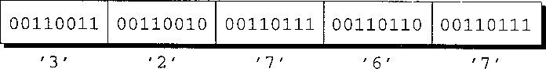
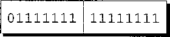

# Input/Output


<!-- TOC -->

- [Input/Output](#inputoutput)
    - [流](#流)
        - [文件指针](#文件指针)
        - [标准流和重定向](#标准流和重定向)
        - [文本文件与二进制文件](#文本文件与二进制文件)
            - [内容的区别](#内容的区别)
            - [读写数据的区别](#读写数据的区别)
    - [文件操作](#文件操作)
        - [打开文件](#打开文件)
            - [Windows 的注意点](#windows-的注意点)
        - [模式](#模式)
        - [关闭文件](#关闭文件)
        - [为打开的流附加文件](#为打开的流附加文件)
        - [从命令行获取文件名](#从命令行获取文件名)
            - [程序　检查文件是否可以打开](#程序　检查文件是否可以打开)
    - [References](#references)

<!-- /TOC -->


## 流
1. 在 C 语言中，术语 **流**（stream）表示任意输入的源或任意输出的目的地。
2. 许多小型程序（就像前面章节中介绍的那些）都是通过一个流（通常和键盘相关）获得全部的输入，并且通过另一个流（通常和屏幕相关）写出全部的输出。
3. 较大规模的程序可能会需要额外的流。这些流常常表示存储在不同介质（如硬盘驱动器、CD、DVD 和闪存）上的文件，但也很容易和不存储文件的设备（网络端口、打印机等）相关联。
4. 这里将集中讨论文件，因为它们常见且容易理解。在应该说流的时候，有时会使用术语 **文件**。）但是请记住一点，`<stdio.h>` 中的许多函数可以处理各种形式的流，而不仅仅可以处理表示文件的流。

### 文件指针
1. C 程序中对流的访问是通过 **文件指针**（file pointer）实现的。此指针的类型为 `FILE *`（`FILE` 类型在 `<stdio.h>` 中声明）。
2. 用文件指针表示的特定流具有标准的名字；如果需要，还可以声明另外一些文件指针。例如，如果程序除了标准流之外还需要两个流，则可以包含如下声明：
    ```cpp
    FILE *fp1, *fp2;
    ```
3. 虽然操作系统通常会限制可以同时打开的流的数量，但程序可以声明任意数量的 `FILE *` 类型变量。

### 标准流和重定向
1. `<stdio.h>` 提供了 3 个标准流。这 3 个标准流可以直接使用——我们不需要对其进行声明，也不用打开或关闭它们。
    文件指针 | 流 | 默认的含义
    --|--|--
    `stdin`  | 标准输入 | 键盘
    `stdout` | 标准输出 | 屏幕
    `stderr` | 标准错误 | 屏幕
2. 前面章节使用过的函数（`printf`、`scanf`、`putchar`、`getchar`、`puts` 和 `gets`）都是通过 `stdin` 获得输入，并且用 `stdout` 进行输出的。
3. 默认情况下，`stdin` 表示键盘，而 `stdout` 和 `stderr` 则表示屏幕。 然而，许多操作系统允许通过一种称为 **重定向**（redirection）的机制来改变这些默认的含义。
4. 通常，我们可以强制程序从文件而不是从键盘获得输入，方法是在命令行中放上文件的名字，并在前面加上字符 `<`：
    ```
    demo <in.dat
    ```
5. 这种方法称为 **输入重定向**（input redirection），它本质上是使 `stdin` 流表示文件（此例中为文件 `in.dat`）而非键盘。
6. 重定向的绝妙之处在于，`demo` 程序不会意识到正在从文件 `in.dat` 中读取数据，它会认为从 `stdin` 获得的任何数据都是从键盘上录入的。
7. **输出重定向**（output redirection）也是类似的。对 `stdout` 流的重定向通常是通过在命令行中放置文件名，并在前面加上字符 `>` 实现的：
    ```
    demo >out.dat
    ```
    现在所有写入 `stdout` 的数据都将进入 `out.dat` 文件中，而不是出现在屏幕上了。
8. 顺便说一下，我们还可以把输出重定向和输入重定向结合使用：
    ```
    demo <in.dat >out.dat
    ```
9. 字符 `<` 和 `>` 不需要与文件名相邻，重定向文件的顺序也是无关紧要的，所以下面的例子效果一样：
    ```
    demo < in.dat > out.dat
    demo >out.dat <in.dat
    ```
10. 输出重定向的一个问题是会把写入 `stdout` 的 **所有内容** 都放入到文件中。如果程序运行失常并且开始写出错消息，那么我们只能在看文件的时候才会知道。而这些应该是出现在 `stderr` 中的。
11. 通过把出错消息写到 `stderr` 而不是 `stdout` 中，我们可以保证即使在对 `stdout` 进行重定向时这些出错消息仍能出现在屏幕上。（不过，操作系统通常也允许对 `stderr` 进行重定向。）

### 文本文件与二进制文件
1. `<stdio.h>` 支持两种类型的文件：文本文件和二进制文件。
2. 在 **文本文件**（text file）中，字节表示字符，这使人们可以检查或编辑文件。例如，C 程序的源代码是存储在文本文件中的。
3. 另一方面，在 **二进制文件**（binary file）中，字节不一定表示字符；字节组还可以表示其他类型的数据，比如整数和浮点数。如果试图查看可执行 C 程序的内容，你会立刻意识到它是存储在二进制文件中的。

#### 内容的区别
* 文本文件分为若干行
    1. 文本文件的每一行通常以一两个特殊字符结尾， 特殊字符的选择与操作系统有关。
    2. 在 Windows 中，行末的标记是回车符（`'\x0d'`）与一个紧跟其后的回行符（`'\x0a'`）。在 UNIX 和 Macintosh 操作系统（Mac OS）的较新版本中，行末的标记是一个单独的回行符。旧版本的 Mac OS 使用一个单独的回车符。
* 文本文件可以包含一个特殊的 “文件末尾” 标记
    1. 一些操作系统允许在文本文件的末尾使用一个特殊的字节作为标记。
    2. 在 Windows 中，标记为 `'\x1a'`（Ctrl+Z）。Ctrl+Z 不是必需的，但如果存在，它就标志着文件的结束，其后的所有字节都会被忽略。使用 Ctrl+Z 的这一习惯继承自 DOS，而 DOS 中的这一习惯又是从 CP/M（早期用于个人电脑的一种操作系统）来的。
    3. 大多数其他操作系统（包括 UNIX）没有专门的文件末尾字符。
* 二进制文件不分行，也没有行末标记和文件末尾标记，所有字节都是平等对待的。

#### 读写数据的区别
1. 向文件写入数据时，我们需要考虑是按文本格式存储还是按二进制格式进行存储。为了搞清楚其中的差别，考虑在文件中存储数32 767的情况。
2. 一种选择是以文本的形式把该数按字符 `3`、`2`、`7`、`6`、`7` 写入。假设字符集为 ASCII，那么就可以得到下列 5 个字节
    
3. 另一种选择是以二进制的形式存储此数，这种方法只会占用两个字节
    
    （在按小端顺序存储数据的系统中，这两个字节的顺序相反。）
4. 从上述示例可以看出，用二进制形式存储数可以节省相当大的空间。
5. 编写用来读写文件的程序时，需要考虑该文件是文本文件还是二进制文件。在屏幕上显示文件内容的程序可能要把文件视为文本文件。但是，文件复制程序就不能认为要复制的文件为文本文件。如果那样做，就不能完全复制含有文件末尾字符的二进制文件了。
6. 在无法确定文件是文本形式还是二进制形式时，安全的做法是把文件假定为二进制文件。


## 文件操作
1. 简单性是输入和输出重定向的魅力之一：不需要打开文件、关闭文件或者执行任何其他的显式文件操作。
2. 可惜的是，重定向在许多应用中受到限制。当程序依赖重定向时，它无法控制自己的文件，甚至无法知道这些文件的名字。更糟糕的是，如果程序需要在同一时间读入两个文件或者写出两个文件，重定向都无法做到。
3. 当重定向无法满足需要时，我们将使用 `<stdio.h>` 提供的文件操作。包括打开文件、关闭文件、改变缓冲文件的方式、删除文件以及重命名文件。

### 打开文件
```cpp
FILE *fopen(const char * restrict filename, const char * restrict mode);
```

1. 如果要把文件用作流，打开时需要调用 `fopen` 函数。
2. `fopen` 函数的第一个参数是含有要打开文件名的字符串。“文件名” 可能包含关于文件位置的信息，如驱动器符或路径。
3. 第二个参数是 “模式字符串”，它用来指定打算对文件执行的操作。例如，字符串 `"r"` 表明将从文件读入数据，但是不会向文件写入数据。
4. 注意，在 `fopen` 函数的原型中，`restrict` 关键字出现了两次。`restrict` 是 C99 关键字，表明 `filename` 和 `mode` 所指向的字符串的内存单元不共享。C89 中的 `fopen` 原型不包含 `restrict`，但也有这样的要求。`restrict` 对 `fopen` 的行为没有影响，所以通常可以忽略。
5. `fopen` 函数返回一个文件指针。程序可以（且通常将）把此指针存储在一个变量中，稍后在需要对文件进行操作时使用它。
6. `fopen` 函数的常见调用形式如下所示，其中 `fp` 是 `FILE *` 类型的变量：
    ```cpp
    fp = fopen("in.dat", "r");        /* opens in.dat for reading */
    ```
    当程序稍后调用输入函数从文件 `in.dat` 中读数据时，将会把 `fp` 作为一个实际参数。
7. 当无法打开文件时，`fopen` 函数会返回空指针。这可能是因为文件不存在，也可能是因为文件的位置不对，还可能是因为我们没有打开文件的权限。
8. 永远不要假设可以打开文件，每次都要测试 `fopen` 函数的返回值以确保不是空指针。

#### Windows 的注意点
1. 在 `fopen` 函数调用的文件名中含有字符 `\` 时，一定要小心。因为 C 语言会把字符 `\` 看成是转义序列的开始标志。
    ```cpp
    fopen("c:\project\test1.dat", "r")
    ```
2. 这个调用会失败，因为编译器会把 `\t` 看成是转义字符。`\p` 不是有效的转义字符，但看上去像。根据 C 标准，`\p` 的含义是未定义的。
3. 有两种方法可以避免这一问题。一种方法是用 `\\` 代替 `\`：
    ```cpp
    fopen("c:\\project\\test1.dat", "r")
    ```
4. 另一种方法更简单——只要用 `/` 代替 `\` 就可以了：
    ```cpp
    fopen("c:/project/test1.dat", "r")
    ```
    Windows 会把 `/` 接受为目录分隔符。

### 模式
1. 给 `fopen` 函数传递哪种模式字符串不仅依赖于稍后将要对文件采取的操作，还取决于文件中的数据是文本形式还是二进制形式。
2. 为了打开一个文本文件，可以采用下表中的一种模式字符串。
    字符串 | 含义
    --|--
    `"r"` | 打开文件用于读
    `"w"` | 打开文件用于写（文件不需要存在）
    `"a"` | 打开文件用于追加（文件不需要存在）
    `"r+"` | 打开文件用于读和写，从文件头开始
    `"w+"` | 打开文件用于读和写（如果文件存在就截去）
    `"a+"` | 打开文件用于读和写（如果文件存在就追加）
3. 当使用 `fopen` 打开二进制文件时， 需要在模式字符串中包含字母 `b`。下表列出了用于二进制文件的模式字符串
    字符串 | 含义
    --|--
    `"rb"` | 打开文件用于读
    `"wb"` | 打开文件用于写（文件不需要存在）
    `"ab"` | 打开文件用于追加（文件不需要存在）
    `"r+b"` 或者 `"rb+"` | 打开文件用于读和写，从文件头开始
    `"w+b"` 或者 `"wb+"` | 打开文件用于读和写（如果文件存在就截去）
    `"a+b"` 或者 `"ab+"` | 打开文件用于读和写（如果文件存在就追加）
4. 顺便说一下，当打开文件用于读和写时，有一些特殊的规则。如果没有先调用一个文件定位函数，那么就不能从读模式转换成写模式，除非读操作遇到了文件的末尾。类似地，如果既没有调用 `fflush` 函数也没有调用文件定位函数，那么就不能从写模式转换成读模式。

### 关闭文件
    ```cpp
    int fclose(FILE *stream);
    ```

1. `fclose` 函数允许程序关闭不再使用的文件。`fclose` 函数的参数必须是文件指针，此指针来自 `fopen` 函数或 `freopen` 函数的调用。
2. 如果成功关闭了文件，`fclose` 函数会返回零；否则，它将会返回错误代码 `EOF`。
3. 为了说明如何在实践中使用 `fopen` 函数和 `fclose` 函数，下面给出了一个程序的框架。此程序打开文件 `example.dat` 进行读操作，并要检查打开是否成功，然后在程序终止前再把文件关闭：
    ```cpp
    #include <stdio.h>
    #include <stdlib.h>

    #define FILE_NAME "example.dat"

    int main(void)
    {
        FILE *fp;

        fp = fopen(FILE_NAME, "r");
        if (fp == NULL) {
            printf("Can't open %s\n", FILE_NAME);
            exit(EXIT_FAILURE);
        }
        ...
        fclose(fp);
        return 0;
    }
    ```
4. 当然，按照 C 程序员的编写习惯，通常也可以把 `fopen` 函数的调用和 `fp` 的声明结合在一起使用：
    ```cpp
    FILE *fp = fopen(FILE_NAME, "r");
    ```
    还可以把函数调用与 `NULL` 判定相结合：
    ```cpp
    if ((fp = fopen(FILE_NAME, "r")) == NULL) ...
    ```

### 为打开的流附加文件
```cpp
FILE *freopen(const char * restrict filename,
              const char * restrict mode,
              FILE * restrict stream);
```

1. `freopen` 函数为已经打开的流附加上一个不同的文件。最常见的用法是把文件和一个标准流（`stdin`、`stdout` 或 `stderr`）相关联。例如，为了使程序开始往文件 `foo` 中写数据，可以使用下列形式的 `freopen` 函数调用：
    ```cpp
    if (freopen("foo","w", stdout) == NULL) {
    /* error; foo can't be opened */
    }
    ```
2. 在关闭了先前（通过命令行重定向或者之前的 `freopen` 函数调用）与 `stdout` 相关联的所有文件之后，`freopen` 函数将打开文件 `foo`，并将其与 `stdout` 相关联。
3. `freopen` 函数的返回值通常是它的第三个参数（一个文件指针）。
4. 如果无法打开新文件，那么 `freopen` 函数会返回空指针。如果无法关闭旧的文件，那么 `freopen` 函数会忽略掉错误。
5. C99 新增了一种机制。如果 `filename` 是空指针，`freopen` 会试图把流的模式修改为 `mode` 参数指定的模式。不过，具体的实现可以不支持这种特性；如果支持，可以限定能进行哪些模式改变。

### 从命令行获取文件名
1. 当正在编写的程序需要打开文件时，马上会出现一个问题：如何把文件名提供给程序呢？把文件名嵌入程序自身的做法不太灵活，而提示用户录入文件名的做法也很笨拙。
2. 通常，最好的解决方案是让程序从命令行获取文件的名字。例如，当执行名为 `demo` 的程序时，可以通过把文件名放入命令行的方法为程序提供文件名：
    ```
    demo names.dat dates.dat
    ```
3. 之前了解到如何通过定义带有两个形式参数的 `main` 函数来访问命令行参数：
    ```cpp
    int main(int argc, char *argv[])
    {
    ...
    }
    ```
4. `argc` 是命令行参数的数量，而 `argv` 是指向参数字符串的指针数组。
5. `argv[0]` 指向程序的名字，从 `argv[1]` 到 `argv[argc-1]` 都指向剩余的实际参数，而 `argv[argc]` 是空指针。
6. 在上述例子中，`argc` 是 3，`argv[0]` 指向含有程序名的字符串，`argv[1]` 指向字符串 `"names.dat"`，而 `argv[2]` 则指向字符串 `"dates.dat"`：

#### 程序　检查文件是否可以打开
1. 下面的程序判断文件是否存在，如果存在是否可以打开进行读入。
2. 在运行程序时，用户将给出要检查的文件的名字：
    ```
    canopen file
    ```
3. 然后程序将显示出 file `can be opened` 或者显示出 file `can't be opened`。如果在命令行中录入的实际参数的数量不对，那么程序将显示出消息 `usage: canopen filename` 来提醒用户 `canopen` 需要一个文件名。
4. canopen.c
    ```cpp
    /* Checks whether a file can be opened for reading */

    #include <stdio.h>
    #include <stdlib.h>

    int main(int argc, char *argv[])
    {
        FILE *fp;

        if (argc != 2) {
            printf("usage: canopen filename\n");
            exit (EXIT_FAILURE);
        }


        if ((fp = fopen(argv[1], "r")) == NULL) {
            printf("%s can't be opened\n", argv[1]);
            exit (EXIT_FAILURE);
        }

        printf("%s can be opened\n", argv[1]);
        fclose(fp);
        return 0;
    }
    ```
    注意，可以使用重定向来丢弃 `canopen` 的输出，并简单地测试它返回的状态值。


## References
* [C语言程序设计](https://book.douban.com/subject/4279678/)
