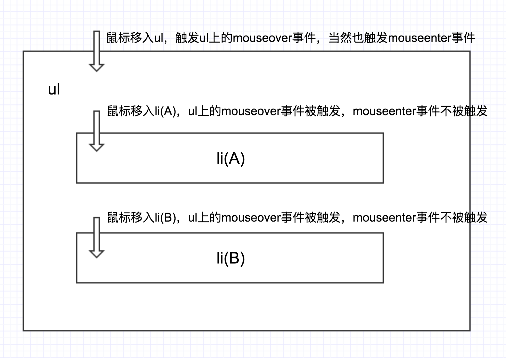

# Misc

<!-- TOC -->

- [Misc](#misc)
    - [事件绑定](#事件绑定)
        - [Passive Event Listeners](#passive-event-listeners)
    - [事件属性](#事件属性)
        - [`isTrusted`](#istrusted)
    - [`mouseover`/`mouseout` 和 `mouseenter``mouseleave` 的区别](#mouseovermouseout-和-mouseentermouseleave-的区别)
    - [特殊情况](#特殊情况)
        - [SVG 图片无法响应鼠标和触摸事件](#svg-图片无法响应鼠标和触摸事件)

<!-- /TOC -->

## 事件绑定
1. `target.addEventListener` 的第三个参数可以是一个布尔值，也可以是一个对象。
2. 如果是布尔值，则表示将时间注册在冒泡阶段（`false`）或捕获阶段（`true`）。
3. 如果是对象，则是一个 option 对象，有以下三个属性：
    * `capture`：布尔值，是否注册到捕获阶段
    * `once`：A Boolean indicating that the listener should be invoked at most once after being added. If `true`, the listener would be automatically removed when invoked.
    * `passive`: A Boolean which, if `true`, indicates that the function specified by listener will never call `preventDefault()`. If a passive listener does call `preventDefault()`, the user agent will do nothing other than generate a console warning.

### Passive Event Listeners
1. 先看一下 Chrome Update 的 [这篇文章](https://developers.google.com/web/updates/2016/06/passive-event-listeners?hl=zh-cn)
2. 触摸事件默认是会滚动页面的，但也可以通过 `preventDefault()` 来阻止其滚动
3. 当你触发了一个触摸事件，浏览器会等待滑动动作结束并执行完你的回调函数，才能确定你有没有调用 `preventDefault()`。
4. 而在等待滑动动作结束和等待执行完整的回调函数期间，浏览器只能安静的等待，不能擅自滚动页面。这就会导致不能及时的滚动页面，产生顿挫感。
5. Passive Event Listeners 意味着你向浏览器保证自己不会调用 `preventDefault()`，这样当你在执行滑动操作时，浏览器知道默认的滚动不会被阻止，所以就可以及时的滚动页面。

## 事件属性
### `isTrusted`
1. The `isTrusted` read-only property of the Event interface is a Boolean that is `true` when the event was generated by a user action, and `false` when the event was created or modified by a script or dispatched via` EventTarget.dispatchEvent()`.
2. 具体到每个事件的时候，还是要具体试一下，不一定和自己预期的一样。

## `mouseover`/`mouseout` 和 `mouseenter``mouseleave` 的区别
前者会冒泡后者不会

## 特殊情况
### SVG 图片无法响应鼠标和触摸事件
1. 测试了 onclick 和 onmouseenter，都无法响应。
2. 可以通过包一个 `<a>` 来监听事件。