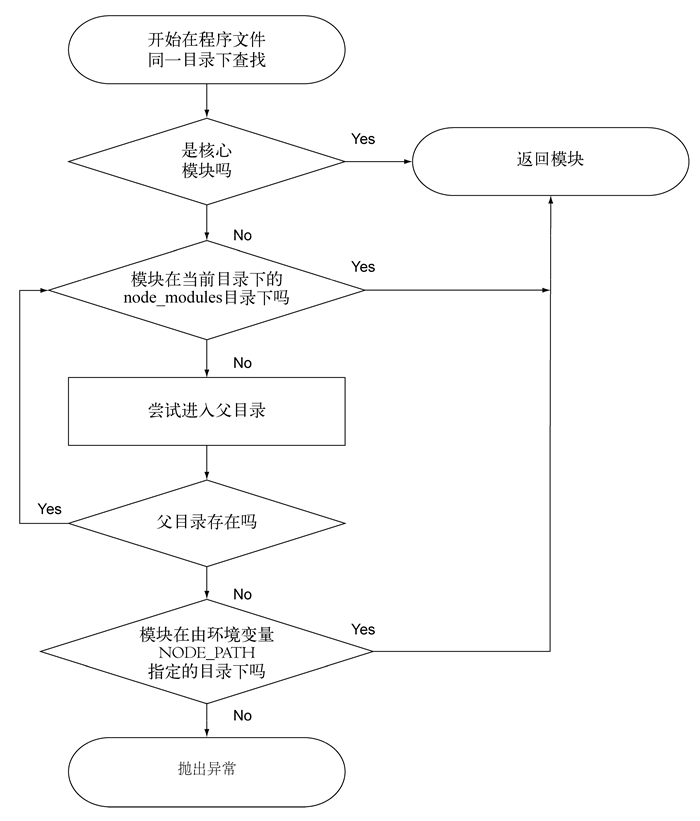
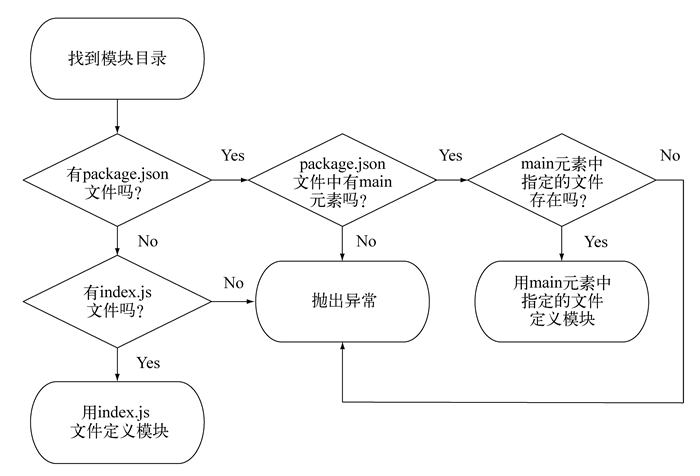

# Require

***
## About `require` and Sync-I/O
1. `require` is one of the few synchronous I/O operations in Node. Because
modules are often used and are general required at the top of the file, making
`require` sync helps to keep the code clean, orderly, and more readable.
2. But in the process of I/O-intensive place try not to use `require`. All
synchronous calls will block the Node until the call is completed. For example,
if you are running an HTTP server, you may encouter performance problems if
`require` is used on every incoming request.
3. So usually `require` and other synchronous operations are only used when the
program is initially loaded.

***
## Steps to find a module
### Find a module

### Find a module main file

***
## Cache
1. Node can cache the module as an object.If two files in the program require
the same module, the first file will save the data returned by the module into
the memory of the program, so that the second file will not have to go to the
source file of the module.
2. In fact, the secod require has the opportunity to modify the cached data.
This "monkey patching" allows one module to change the behavior of another,
without the developer creating a new version of it.
