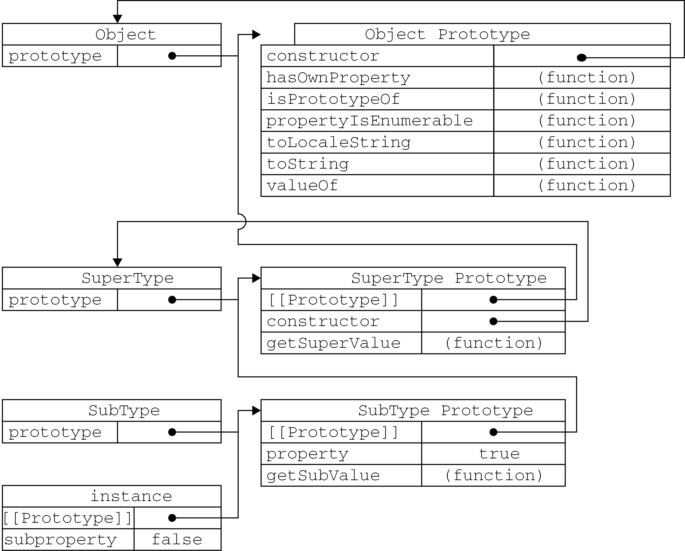

# Prototype


<!-- TOC -->

- [Prototype](#prototype)
    - [Prototype chain](#prototype-chain)
    - [`[[Prototype]]`](#prototype)
    - [检测原型](#检测原型)
        - [三种方法](#三种方法)
        - [区别](#区别)
    - [改变实例原型](#改变实例原型)
        - [改变原型的性能问题](#改变原型的性能问题)
    - [References](#references)

<!-- /TOC -->


1. 随便声明一个非箭头函数，它的 `prototype` 属性指向哪里。例如
    ```js
    function foo () {}
    foo.prototype // ?
    ```
2. 我们知道如果把 `foo` 作为构造函数调用，则实例的 `[[Prototype]]` 会指向 `foo.prototype`。那在作为构造函数调用之前，`foo.prototype` 是空的吗？还是有了一个对象了？如果是对象，这个对象是否已经在原型链上了？
3. 实际上，从下面的测试可以看出来，每当声明一个函数的时候，该函数自身上就会有 `prototype` 属性，这个属性指向的对象就是之后把该函数当做构造函数使用时，实例的原型对象。
4. 虽然这个原型对象此时还用不上，但是它已经被接到原型链上了
    ```js
    function foo () {}
    console.log(foo.hasOwnProperty("prototype")) // true
    console.log(Object.getPrototypeOf(foo.prototype) === Object.prototype) // true

    let ins = new foo();
    console.log(Object.getPrototypeOf(ins) === foo.prototype) // true
    ```
5. 除了通过函数的 `prototype` 属性，通过 `Object.getPrototypeOf(ins)` 方法也可以访问到这个原型对象（还有已经不推荐使用的 `__proto__`）
    ```js
    function Person () {}
    let person1 = new Person();

    console.log( Object.getPrototypeOf(person1) === Person.prototype ); // true
    console.log( Object.getPrototypeOf(person1) === person1.__proto__ ); // true
    ```
    
6. 原型的 `constructor` 属性指向引用该原型的构造函数
    ```js
    // constructor 不是 person1 的实例属性，这里访问的实际上是 person1.__proto__.constructor
    console.log(person1.constructor === Person); // true
    ```
7. `Object.prototype` 是仅有的没有原型的对象，它不继承任何属性
    ```js
    console.log(Object.getPrototypeOf(Object.prototype)) // null
    ```
8. 注意，并不是所有的原生原型都是 plain object
    ```js
    console.log( Object.prototype.toString.call(Array.prototype));    // [object Array]
    console.log( Array.isArray(Array.prototype) ); // true

    console.log( Object.prototype.toString.call(Function.prototype)); // [object Function]
    console.log( typeof Function.prototype ); // "function"
    
    console.log( Object.prototype.toString.call(Number.prototype));   // [object Number]
    
    console.log( Object.prototype.toString.call(Date.prototype));     // [object Object]
    ```
9. 箭头函数没有 `prototype`，所以它也不能作为构造函数
    ```js
    const bar = () => {};
    console.log(bar.prototype); // undefined
    new bar(); // TypeError: bar is not a constructor
    ```


## Prototype chain
1. 示例代码
    ```js
    // 最终原型是 Object 类的原型
    console.log( Object.getPrototypeOf(Object.prototype) ); // null
    
    // Object 类的构造函数的 prototype 属性和 Object 类的实例的 __proto__ 属性指向该原型
    console.log( Object.prototype === Object.getPrototypeOf({}) ); // true

    // 自定义类的构造函数的 prototype 属性和自定义类的实例的 __proto__ 属性指向自定义类的原型
    // 自定义的类的原型继承 Object 类的原型，也就是原型链增加了一节，达到了两节
    class SuperType {
        constructor () {}    
    }
    let superType = new SuperType();
    console.log( SuperType.prototype === Object.getPrototypeOf(superType) ); // true
    console.log( Object.getPrototypeOf(SuperType.prototype) === Object.prototype ); // true

    // 自定义子类的构造函数的 prototype 属性和自定义子类的实例的 __proto__ 属性指向自定义子类的原型
    // 自定义的子类的原型继承自定义父类的原型，也就是原型链又增加了一节，达到了三节
    class SubType extends SuperType {
        constructor () {
            super();
        }    
    }
    let subType = new SubType();
    console.log( SubType.prototype === Object.getPrototypeOf(subType) ); // true
    console.log( Object.getPrototypeOf(SubType.prototype) === SuperType.prototype ); // true
    ```
2. 每一个类有三个组成部分：
    * 原型对象
    * 构造函数
    * 实例
3. 每一个类的构造函数的 `prototype` 属性和实例的 `__proto__` 属性指向该类的原型对象。
4. 所谓的原型链，就是每个类的原型对象组成的链。下图只有最下面的类画出了实例，其实上面两个也有实例
    
5. 可以看到：一个实例通过 `__proto__` 指向原型链中自己的那个原型对象，然后该原型对象也是通过 `__proto__` 属性指向它的上一级的原型对象。
6. 另外，像 `Array` 啊 `Function` 啊这样的类也都是 `Object` 的子类，它们的原型对象的原型也是指向 `Object` 的原型对象
    ```js
    // `Array` 类的构造函数的 `prototype` 属性和实例的 `__proto__` 属性指向 `Array` 类的原型对象
    console.log( Array.prototype === Object.getPrototypeOf([]) ); // true
    // `Array` 类的原型继承 Object 类的原型，也就是原型链增加了一节，达到了两节
    console.log( Object.getPrototypeOf(Array.prototype) === Object.prototype ); // true

    // `Function` 类的构造函数的 `prototype` 属性和实例的 `__proto__` 属性指向 `Function` 类的原型对象
    console.log( Function.prototype === Object.getPrototypeOf(()=>{}) ); // true
    // `Function` 类的原型继承 Object 类的原型，也就是原型链增加了一节，达到了两节
    console.log( Object.getPrototypeOf(Function.prototype) === Object.prototype ); // true
    ```
7. 要注意，前面说 Object 类，这里的 “Object” 是指类名。但平时在代码中看到的 `Object` 实际上是个函数，也就是 Function 类的实例。`Array` 函数也是同理
    ```js
    console.log( Object.getPrototypeOf(Object) === Function.prototype ); // true
    console.log( Object.getPrototypeOf(Array) === Function.prototype ); // true
    ```


##  `[[Prototype]]`
1. 每当构造函数创建一个新的实例时，实例会有一个叫做 `[[Prototype]]` 的内部 slot，该 slot 是一个指针，指向构造函数的原型对象。
2. 使用 `Object.getPrototypeOf(obj)` 方法从代码中实际引用对象的 `[[Prototype]]`
    ```js
    let obj = {};
    console.log( obj.__proto__ === obj.constructor.prototype); // true
    console.log( Object.getPrototypeOf(obj) === obj.constructor.prototype); // true
    ```
3. 不要使用已经废弃的 `Object.prototype.__proto__`。


## 检测原型
### 三种方法
* `Object.prototype.isPrototypeOf()`: checks if an object exists in another object's prototype **chain**.
* `instanceof` operator : tests to see if the prototype property of a constructor appears anywhere in the prototype **chain** of an object.
* `Object.getPrototypeOf()`: returns the prototype (i.e. the value of the internal `[[Prototype]]` property) of the specified object.

### 区别
前两个是在整个原型链上检测，而最后一个是获取对象的直接原型
```js
let obj1 = {};
let obj2 = Object.create(obj1);
let obj3 = Object.create(obj2);

console.log(obj1.isPrototypeOf(obj2)); // true
console.log(obj1.isPrototypeOf(obj3)); // true

console.log(obj2 instanceof obj1.constructor); // true
console.log(obj3 instanceof obj1.constructor); // true

console.log(Object.getPrototypeOf(obj2)=== obj1); // true
console.log(Object.getPrototypeOf(obj3)=== obj1); // false
console.log(Object.getPrototypeOf(obj3)=== obj2); // true
```


## 改变实例原型
1. `Object.setPrototypeOf(instance, prototype)`。
2. 该方法等同于下面的函数：
    ```js
    function (obj, proto) {
        obj.__proto__ = proto;
        return obj;
    }
    ```
3. 不要使用已经废弃的`Object.prototype.__proto__`

### 改变原型的性能问题
1. 根据现代浏览器优化属性访问的实质，修改一个对象`[[Prototype]]`是一个影响性能的行为。
2. 这种性能影响是微妙且广泛的，不仅仅是修改原型本身的缓慢，之后任何会用到该对象
`[[Prototype]]`的操作都会收到影响。


## References
* [Specification](https://tc39.github.io/ecma262/)
* [Professional JavaScript for Web Developers](https://book.douban.com/subject/7157249/)
* [MDN](https://developer.mozilla.org/en-US/docs/Web/JavaScript/Reference/Global_Objects/Object)
