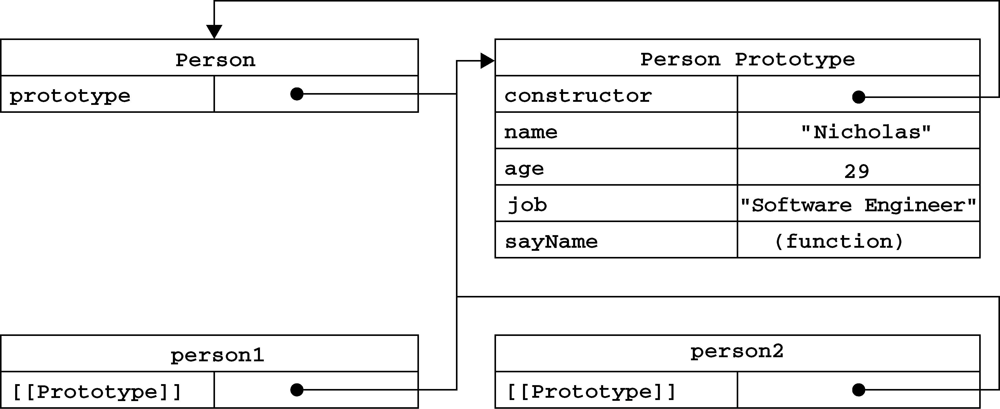

# Prototype




## Prototype
1. 每个函数都有一个原型对象
2. 如果函数作为构造函数被调用，则实例会继承该构造函数原型的属性和方法。
3. 有两个方法可以引用到原型对象：
    * 构造函数的`prototype`属性
    * 实例的内部 slot `[[Prototype]]`
4. 原型的`constructor`属性指向引用该原型的构造函数
    ```js
    let obj1 = {},
    	obj2 = {};
    console.log( obj1.constructor.prototype === obj2.constructor.prototype ); // true
    console.log( obj1.constructor === obj2.constructor.prototype.constructor ); // true
    ```
5. `Object.prototype`是仅有的没有原型的对象，它不继承任何属性。
6. 并不是所有的原生原型都是 plain object
    ```js
    console.log( Object.prototype.toString.call(Array.prototype));    // [object Array]
    console.log( Object.prototype.toString.call(Function.prototype)); // [object Function]
    console.log( Object.prototype.toString.call(Number.prototype));   // [object Number]
    console.log( Object.prototype.toString.call(Date.prototype));     // [object Object]
    ```


## Prototype chain
```js
Object.prototype.say = function(){
    console.log('Object');
};

let obj1 = {
    say1(){
        console.log('obj1');
    },
};
obj1.say(); // Object

let obj2 = Object.create(obj1);
obj2.say2 = function(){
    console.log('obj2');
};
obj2.say(); // Object
obj2.say1(); // obj1

let obj3 = Object.create(obj2);
obj3.say(); // Object
obj3.say1(); // obj1
obj3.say2(); // obj2
```
1. `obj1`直接继承`Object.prototype`
2. `obj2`直接继承`obj1`，间接继承`Object.prototype`
3. `obj3`直接继承`obj2`，间接继承`obj1`，进一步间接继承`Object.prototype`


##  `[[Prototype]]`
1. 每当构造函数创建一个新的实例时，实例会有一个叫做`[[Prototype]]`的内部 slot，该
slot 是一个指针，指向构造函数的原型对象。
2. 使用`Object.getPrototypeOf(obj)`方法从代码中实际引用`obj`对象的`[[Prototype]]`
    ```js
    let obj = {};
    console.log( obj.__proto__ === obj.constructor.prototype); // true
    console.log( Object.getPrototypeOf(obj) === obj.constructor.prototype); // true
    ```
3. 不要使用已经废弃的`Object.prototype.__proto__`
3. 看起来，与实例相关的原型操作，都是使用使用实例的`[[Prototype]]`，而不是使用其构造函
数的`prototype`属性。


## 检测原型
### 三种方法
* `Object.prototype.isPrototypeOf()`: checks if an object exists in another object's prototype chain.
* `instanceof` operator : tests to see if the prototype property of a constructor appears anywhere in the prototype chain of an object.
* `Object.getPrototypeOf()`: returns the prototype (i.e. the value of the internal `[[Prototype]]` property) of the specified object.

### 区别
前两个是在整个原型链上检测，而最后一个是获取对象的直接原型
```js
let obj1 = {};
let obj2 = Object.create(obj1);
let obj3 = Object.create(obj2);

console.log(obj1.isPrototypeOf(obj2)); // true
console.log(obj1.isPrototypeOf(obj3)); // true

console.log(obj2 instanceof obj1.constructor); // true
console.log(obj3 instanceof obj1.constructor); // true

console.log(Object.getPrototypeOf(obj2)=== obj1); // true
console.log(Object.getPrototypeOf(obj3)=== obj1); // false
console.log(Object.getPrototypeOf(obj3)=== obj2); // true
```


## 改变实例原型
1. `Object.setPrototypeOf(instance, prototype)`。
2. 该方法等同于下面的函数：
    ```js
    function (obj, proto) {
        obj.__proto__ = proto;
        return obj;
    }
    ```
3. 不要使用已经废弃的`Object.prototype.__proto__`

### 改变原型的性能问题
1. 根据现代浏览器优化属性访问的实质，修改一个对象`[[Prototype]]`是一个影响性能的行为。
2. 这种性能影响是微妙且广泛的，不仅仅是修改原型本身的缓慢，之后任何会用到该对象
`[[Prototype]]`的操作都会收到影响。


## References
* [Specification](https://tc39.github.io/ecma262/)
* [Professional JavaScript for Web Developers](https://book.douban.com/subject/7157249/)
* [MDN](https://developer.mozilla.org/en-US/docs/Web/JavaScript/Reference/Global_Objects/Object)
