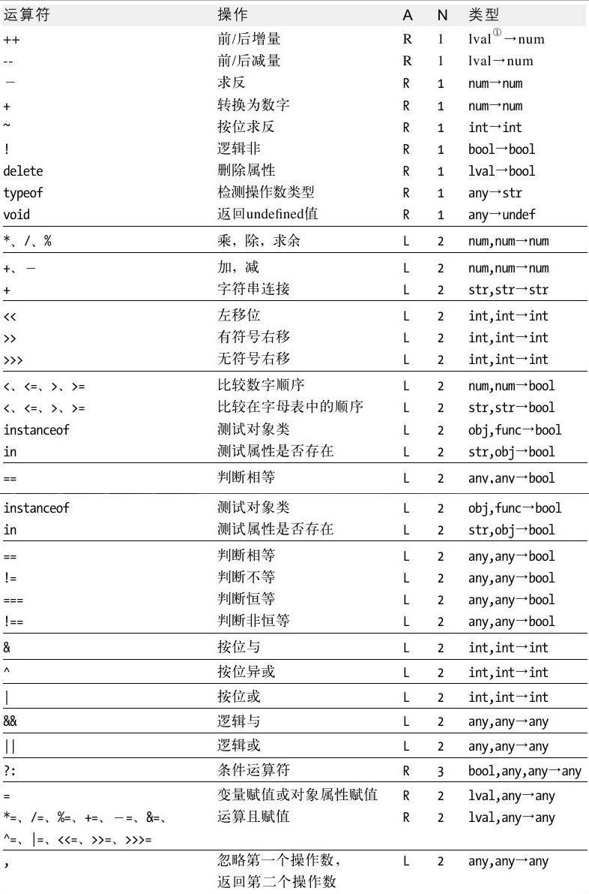

# Operators
Operators are unique in ECMAScript in that they can be used on a wide range of
values, including strings, numbers, Booleans, and even objects. When used on
objects, operators typically call the `valueOf()` and/or `toString()` method to
retrieve a value they can work with.


## 一元操作符
### 递增和递减操作符，分为前置型和后置型。
* 不管是前置还是后置，这个表达式都会对变量进行加一或减一，如果变量不是数值类型会先试图
转换为数值类型。但两者的返回值不同：前置语句返回自增或自减之后的值，而后置型的返回原来的
值。
* 所有这四个操作符对任何值都适用，还可以用于字符串、布尔值、浮点数和对象。  
在应用于不同的值时，递增和递减操作符遵循下列规则：
    * 在应用于一个包含有有效数字字符的字符串时，先将其转换为数字值，再执行操作。
    * 在应用于一个不包含有效数字字符串时，将变量的值设置为`NaN`。
    * 在应用于布尔值`false`时，先将其转换为`0`再执行操作。
    * 在应用于布尔值`true`时，先将其转换为`1`再执行操作。
    * 在应用于浮点数值时，直接执行操作。
    * 在应用于对象时，先调用对象的`valueOf()`方法以取得一个可供操作的值，然后对该值应
      用前述规则。

### 一元加减操作符
* 一元加操作符放在数值前面，对数值不会产生任何影响。
* 在对非数值应用时，一元加操作符会像`Number()`转型函数一样对这个值执行转换。布尔值转换
为`0`和`1`，字符串值按照一组特殊的规则进行解析，而对象是先调用它们的`valueOf()`和（或）
`toString()`方法，再转换得到的值。
* 一元减操作符主要用于表示负数。而当应用于非数值时，一元减操作符遵循与一元加操作符相同的
规则，最后再将得到的数值转换为负数。


## Bitwise Operators
### Basic
1. All numbers in ECMAScript are stored in IEEE-754 64-bit format, but the
bitwise operations do not work directly on the 64-bit representation. Instead,
the value is converted into a 32-bit integer, which in the range of
`[-2147483648, 2147483647]`,the operation takes place, and the result is
converted back into 64 bits. To the developer, it appears that only the 32-bit
integer exists, because the 64-bit storage format is transparent.
2. A curious side effect of this conversion is that the special values `NaN` and
 `Infinity` both are treated as equivalent to `0` when used in bitwise
operations.
3. Signed integers use the first 31 of the 32 bits to represent the numeric
value of the integer. The 32nd bit represents the sign of the number: `0` for
positive or `1` for negative.
4. Depending on the value of that bit, called the sign bit, the format of the
rest of the number is determined.
5. Positive numbers are stored in true binary format, with each of the 31 bits
representing a power of `2`, starting with the first bit (called bit 0),
representing 2<sup>0</sup> , the second bit represents 2<sup>1</sup>, and so on.
6. Negative numbers are also stored in binary code but in a format called *two’s
 complement*. The two’s complement of a number is calculated in three steps:
    1. Determine the binary representation of the absolute value (for example,
    to find `–18`, first determine the binary representation of `18`).
    2. Find the `one’s complement` of the number, which essentially means that
    every `0` must be replaced with a `1` and vice versa.
    3. Add `1` to the result.
    ```js
    function twosComplement( nDecimal ){
        if( !Number.isInteger(nDecimal) || nDecimal>-1 || nDecimal<-2147483648 ){ // 2^31
            throw new RangeError('The twosComplement function can only handle integers between [-1, -2147483648]');
        }

        let sOnesComplement = Math.abs(nDecimal)
                              .toString(2)
                              .replace(/0/g, "2").replace(/1/g, "0").replace(/2/g, "1")
                              .padStart(32, '1');

        return (Number.parseInt(sOnesComplement, 2) + 1).toString(2);
    }
    ```
    ```js
    -1            11111111111111111111111111111111
    -2            11111111111111111111111111111110
    -3            11111111111111111111111111111101
    -2147483646   10000000000000000000000000000010
    -2147483647   10000000000000000000000000000001
    -2147483648   10000000000000000000000000000000
    ```
7. ECMAScript does its best to keep all of this information from you. When
outputting a negative number as a binary string, you get the binary code of the
absolute value preceded by a minus sign:
    ```js
    console.log(-18..toString(2)); // '-10010'
    ```
8. If a bitwise operator is applied to a nonnumeric value, the value is first
converted into a number using the `Number()` function automatically and then the
 bitwise operation is applied. The resulting value is a number.

### Bitwise NOT
* `~`: returns the one’s complement of the number.
    ```js
    console.log(~26);        // -27
    console.log(~-26);       // 25
    console.log(~0);         // -1
    console.log(~NaN);       // -1
    console.log(~Infinity);  // -1
    ```
* 可以看出来十进制数的位操作也有着明显的规律，通过再次分析计算机存储负数的方法来探明其中
的规律。Let's imagine how computer store a negative number:
    1. Found a token, say `-18`
    2. Ignore the negative sign, got `18`
    3. Save this token in memory, as `00000000 00000000 00000000 00010010`
    4. Bitwise-not it, got `11111111 11111111 11111111 11101101`
    5. Add `1`, the result is `11111111 11111111 11111111 11101110`  
* 如果你对一个正数按位非，然后再加一，结果就是这个正数的相反数。即，一个正数`n`的相
反数再减一就是它的按位非结果（`-n-1`）；相反的过程，如果你对一个负数减一，然后再按位
非，结果就是这个负数的相反数。即，一个负数减一的按位非是该负数的相反数，也即，一个负
数`n`的按位非结果等于对该负数加一再求相反数（`-(n+1)`）。
    ```js
    function bitwiseNOT(n){
        return -n - 1
    }
    ```
* The summary above is actually not much useful, bitwise operation is not used
to achieve a faster math calculation.

### Bitwise AND
* `&`

### Bitwise OR
* `|`

### Bitwise XOR
* `^`: when different returns `1`, when same returns `0`

### Left Shift
* `<<`

### Signed Right Shift
* `>>`: The empty bits occur at the left of the number but after the sign bit

### Unsigned Right Shift
* `>>>`
* For numbers that are negative, the empty bits get fi lled with zeros
regardless of the sign of the number.
* Because the negative number is the two’s complement of its absolute value, the
 number becomes very large if not only moved a few bits.


## 布尔操作符
### 逻辑非  `!`
可以用于ECMAScript中的任何值。无论这个值是什么数据类型，这个操作符都会返回一个布尔值。
逻辑非操作符首先会将它的操作数转换为个布尔值，然后再对其求反。

### 逻辑与  `&&`
* 逻辑与操作属于短路操作，即如果第一个操作数能够决定结果，那么就不会再对第二个操作数求值
```js
var a = true;
var result = (a && someUndefinedVariable);      //这里会发生错误
alert(result);                                //这里不会执行

var a = false;
var result = (a && someUndefinedVariable);      //这里不会发生错误
alert(result);                                //这里会执行
```
* 逻辑与的返回结果是两个操作数中的一个，它的规则是：结合上面短路操作原理，返回那个决定了
整体逻辑布尔值的操作数。即，例如`x && y`：如果`x == false`，则返回`x`；如果
`x == true`，则返回`y`。

### 逻辑或  `||`
* 逻辑或运算符也是短路操作符
* 返回结果的逻辑与逻辑与相似

### 使用逻辑运算符实现`if`的功能
` a || b();` 相当于：
```js
if (!a){
    b()
}
```
`a && b();` 相当于：
```js
if(a){
    b();
}
```
例如函数的有一个可选的回调函数参数，则函数内部可以写成：
```js
callback && callback();
```


## 乘性操作符
ECMAScript定义了3个乘性操作符：乘法、除法和求模。在操作符为非数值的情况下会调用
`Number()`函数执行自动的类型转换。
### 乘法
在处理特殊值的情况下，乘法操作符遵循下列特殊的规则：
* 如果有一个操作数是`NaN`，则结果是`NaN`；
* 如果`Infinity`与`0`相乘，结果是`NaN`；
* 如果正负`Infinity`与非`0`数值相乘，结果是正负`Infinity`；
* 如果无穷之间相乘，结果仍然是无穷，正负号也相乘；
* 如果有一个操作数不是数值，则在后台调用`Number()`，然后再应用上面的规则。

### 除法
在处理特殊值的情况下，除法操作符遵循下列特殊的规则：
* 如果有一个操作数是`NaN`，则结果是`NaN`；
* 如果无穷除无穷，结果是`NaN`；
* 如果无穷除非无穷书，结果是还是无穷；符号取决于两者；
* 如果是`0`被`0`除，结果是`NaN`；
* 如果是非零数（包括无穷）被`0`除，则结果是无穷。**居然不是`NaN`！**
  符号取决于该非零数和`0`两者的符号。
* 如果有一个操作数不是数值，则在后台调用`Number()`将其转换为数值，然后再应用上面的规则。

### 求模
* 结果的符号和被除数相同
```js
console.log(8 % -3); // 2
```
* It also works for floating-point values. 同样要注意浮点数计算的不准确性
```js
console.log(-7.2%3.5); // -0.20000000000000018
```
* 在处理特殊值的情况下，求模操作符遵循下列特殊的规则：
    * 如果被除数无穷而除数有穷，则结果是`NaN`；
    * 如果除数是`0`，则结果是`NaN`；
    * 如果无穷被无穷除，结果是`NaN`；
    * 如果被除数是有限大的数值而除数是无限大的数值，则结果是被除数；
    * 如果被除数是`0`，则结果是`0`；
    * 如果有一个操作数不是数值，则在后台调用`Number()`将其转换为数值，然后再应用上面的
      规则。


## 加性操作符
加性操作符也会在后台转换不同的数据类型。然而，对于加性操作符而言，相应的转换规则还稍微有
点复杂。
### 加法
* 如果有一个操作数是`NaN`，则结果是`NaN`；
* 正无穷加正无穷等于正无穷，负无穷加负无穷等于负无穷，正无穷加负无穷结果为`NaN`；
* `+0`加`+0`，结果是`+0`；`-0`加`-0`，结果是`-0`；`+0`加`-0`，结果是`+0`;
* 如果两个操作数都是字符串，则将第二个操作数与第一个操作数拼接起来；
* 如果只有一个操作数是字符串，则将另一个操作数转换为字符串，然后再将两个字符串拼接起来；
* 如果有一个操作数是对象、数值或布尔值，则调用它们的`toString()`方法取得相应的字符串值，
  然后再相加。对于`undefined`和`null`，则分别调用`String()`函数并取得字符串。

### 减法
* 如果有一个操作数是`NaN`，则结果是`NaN`；
* 正无穷减正无穷结果为`NaN`，负无穷减负无穷结果为`NaN`，正无穷减负无穷结果为正无穷，负
  无穷减正无穷结果为负无穷；
* 两种0之间互相减：
```js
const n1 = 0 - 0;
const n2 = 0 - -0;
const n3 = -0 - -0;
const n4 = -0 - 0;
console.log(Object.is(n1, 0)); // true
console.log(Object.is(n2, 0)); // true
console.log(Object.is(n3, 0)); // true
console.log(Object.is(n4, -0)); // true
```
* 如果有一个操作数是字符串、布尔值、`null`或`undefined`，则先在后台调用`Number()`函数
将其转换为数值然后再执行减法计算；
* 如果有一个操作数是对象，则调用对象的`valueOf()`方法以取得表示该对象的数值。如果对象没
有`valueOf()`方法，则调用其`toString()`方法。


## 指数操作符   `**`
指数运算符也可以与等号结合，形成一个新的赋值运算符`**=`


## 关系操作符   `>` `<`
* 当关系操作符的操作数使用了非数值时，也要进行数据转换或完成某些奇怪的操作：
    * 如果两个操作数都是字符串，则比较两个字符串对应的字符串编码；
    * 如果一个操作数是数值，则将另一个操作数转换为数值，然后进行比较；
    * 如果有一个操作数是对象，则调用对象的`valueOf()`方法以取得表示该对象的数值。如果对
      象没有`valueOf()`方法，则调用其`toString()`方法。
    * 如果一个操作数是布尔值，则先将其转化为数值，然后再执行比较。
* 比较字符串时，实际比较的是两个字符串中对应位置的每个字符的字符编码值
```js
alert("23"<"3");    // true
alert(23<"3");      // false。因为“3”会先被转化为数值
```
* 任何操作数与`NaN`进行关系比较，结果都是`false`。
* 连续比较时的情况：
```js
console.log(1 < 2 < 3); // true   符合直观，但其实也是误解
console.log(3 < 2 < 1); // true   不符合直观
console.log(3 > 2 > 1); // false  不符合直观
```
只要注意关系操作符的返回值，就可以理解上述运算的结果。上述操作实际上的逻辑步骤是：
```js
console.log((1 < 2) < 3);
console.log((3 < 2) < 1);
console.log((3 > 2) > 1);
```
下一步是：
```js
console.log(true < 3);
console.log(false < 1);
console.log(true > 1);
```


## 相等操作符
### `==`和`!=`
两个操作符都会先转换操作数，然后再比较；
    * 如果有一个操作数是布尔值，则在比较相等性之前先将其转换为数值；
    * 如果一个操作数是字符串，另一个操作数是数值，先将字符串转为数值；
        ```js
        console.log(false == '0'); // true
        // 结合上一条规则，看起来是fasle被转换为数字0，'0'也被转换为数字0
        ```
    * 如果一个操作数是对象，另一个操作数不是，则调用对象的`valueOf()`方法，用得到的基
      本类型值比较；
    * `null`和`undefined`相等；
    * 要比较相等性之前，不能将`null`和`undefined`转换成其他任何值；
    * 如果有一个操作数是`NaN`，则相等操作符返回`false`，而不相等操作符返回`true`；
    * 即使两个操作数都是`NaN`，相等操作符也返回`false`；
    * 如果两个操作数都是对象，则比较它们是不是同一个对象。如果是则返回`true`，否则返回
      `false`。
    * `null`和`0`不相等，`undefined`和`0`也不相等。

### `===`和`!==`
* 不转换类型直接比较。
* `-0`和`0`相等


## 条件操作符
```js
variable = boolean_expression ? true_value : false_value;
```

## 赋值操作符
* 每个主要算数操作符（以及个别的其他操作符）都有对应的赋值操作符：
```js
*=
/=
%=
+=
-=
**=
<<=
>>=
>>>=
```
* 设计这些操作符的主要目的就是简化赋值操作，使用它们不会带来任何性能的提升。


## 逗号操作符
* 逗号操作符可以在一条语句中执行多个操作，多用于声明多个变量
```js
var num1 = 1, num2 = 2, num3 = 3;
```
* 逗号操作符还可用于赋值，总会返回表达式中的最后一项
```js
var num = (4, 5, 2, 8);  // num的值为8。看起来好像没什么意义
```

## `in`
It evaluates to true if the left-side value is the name of a property of the
right-side object.


## `delete`
* 它用来**删除**对象属性或者**清空**数组元素
* 针对对象是删除其整个属性（而不仅仅是属性值）;针对数组并不是删除，而是清空该项的内容。  
  如果用数组的`splice`方法，则是彻底删除该项，后面的项也会一次修改序号
```js
let a1 = ["a", "b", "c"];
console.log( a1[1] ); // b
delete a1[0];
console.log( a1[1] ); // b
console.log( a1 ); // [undefined, "b", "c"]

let a2 = ["a", "b", "c"];
console.log( a2[1] ); // b
a2.splice(1, 1);
console.log( a2[1] ); // c
console.log( a2 ); // ["a", "c"]
```
* only deletes own properties, not inherited ones.
* `delete` does not remove properties that have a configurable attribute of
`false`, but it will remove configurable properties of nonextensible objects
* 返回值
    * 返回`true`的情况
        * delete succeeded
        * the delete had no effect(such as deleting a nonexistent property)
        * when used with an expression that is not a property access expression
        ```js
        console.log(delete 2); // true
        ```
    * 返回`false`的情况: 严格模式下会报错的情况，在非严格模式下会返回`false`
* 如果对变量使用`delete`，非严格模式下会静默失败，严格模式下报错。删除其他类型的值有些
会在严格模式下报错，有些不一定，比如上面删除数字值虽然无意义但不会报错。
* 使用`var`声明的全局变量会作为`window`的属性，但其`configurable`特性为`false`，不能
通过`delete`删除


## 运算符优先级
下表按照运算符的优先级排序的，前面的运算符优先级要高于后面的运算符优先级。被水平分割线分
隔开来的运算符具有不同的优先级。标题为A的列表示运算符的结合性，L（从左至右）或
R（从右至左），标题为N的列表示操作数的个数。标题为“类型”的列表示期望的操作数类型，以及
运算符的结果类型（在“→”符号之后）。

