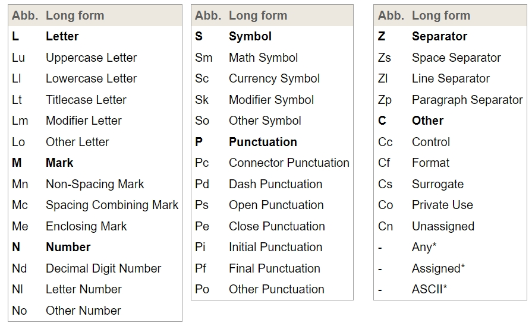

# Unicode


<!-- TOC -->

- [RegExp](#regexp)
    - [Creating a regular expression](#creating-a-regular-expression)
        - [Literal](#literal)
        - [Constructor](#constructor)
    - [References](#references)

<!-- /TOC -->


## Categories
1. 每个 Unicode 字符都有自己的若干个不同层级的属性，用来描述该字符的类型。
2. 最基本的属性级别是 General_Category，分为 `Letters`, `Punctuation`, `Symbols`, `Marks`, `Numbers`, `Separators` 和 `Other`。
3. 每个 General_Category 还有 Subcategory。例如 `Letters` 之下有子属性 `Uppercase Letter` 等。
4. 每个 General_Category 和 Subcategory 都有对应的缩写形式。[属性列表](https://unicode.org/reports/tr18/#General_Category_Property) 如下
    
5. 属性名对空格、大小写、连字符和下划线不敏感，例如下面的写法都是等价的：`\p{Lu}`, `\p{lu}`, `\p{uppercase letter}`, `\p{Uppercase Letter}`, `\p{Uppercase_Letter}`, 和 `\p{uppercaseletter}`。
6. 上表中带星号的属性是一些特殊类型，具体看 [文档](https://unicode.org/reports/tr18/#General_Category_Property) 。


## Script and Script Extensions Properties
1. 还没仔细看，但一个大用处就是可以匹配不同的文字系统，譬如匹配中文、匹配平假名、匹配货币符号等等。 https://unicode.org/reports/tr18/#Script_Property。
2. 例如中文的 script 属性值是 `Hani`（或者 `Han`）。使用使用 script 属性如下匹配
    ```js
    const mixedCharacters = "a𠮷ε国國Л";
    mixedCharacters.match(/\p{Script=Hani}/gu); // ['𠮷', '国', '國']
    ```
3. 其中的 `Script` 可以缩写为 `sc`：`/\p{sc=Hani}/`。
4. Script 属性的属性名 `Script`、`sc` 和属性值都是区分大小写的。
5. [Script 属性列表](https://gist.github.com/mcxiaoke/97389276d8f78077d00aa3ebace53174)。


## References
* [MDN](https://developer.mozilla.org/en-US/docs/Web/JavaScript/Reference/Regular_expressions/Unicode_character_class_escape)
* [Unicode：修饰符 "u" 和类 \p{...}](https://zh.javascript.info/regexp-unicode)
* [UNICODE REGULAR EXPRESSIONS](https://unicode.org/reports/tr18/#General_Category_Property)
* [UNICODE SCRIPT PROPERTY](https://www.unicode.org/reports/tr24/#Script)
* [Script 属性列表](https://gist.github.com/mcxiaoke/97389276d8f78077d00aa3ebace53174)
