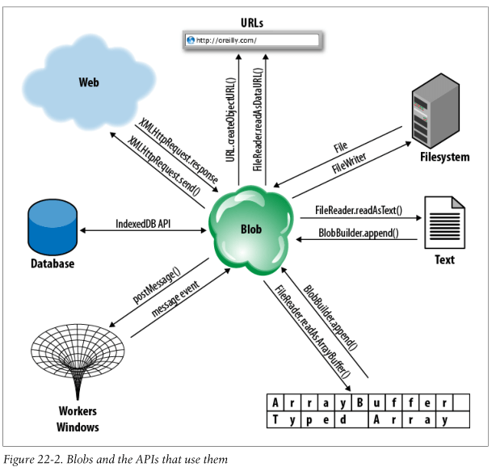

# Binary Large Object
[MDN](https://developer.mozilla.org/en-US/docs/Web/API/Blob)


## Basic
1. Blob 是对大数据块的不透明引用或者句柄。名字来源于 SQL 数据库，表示“二进制大对象”
（Binary Large Object）。
2. 在 JavaScript 中，Blob 通常表示二进制数据，不过它们不一定非得是大量数据：Blob 也可
以表示一个小型文本文件的内容。
3. Blob 是不透明的：能对它们进行直接操作的就只有获取它们的大小（以字节为单位）、MIME 类
型以及将它们分割成更小的 Blob。
4. Web 浏览器可以将 Blob 存储到内存中或者磁盘上，Blob 可以表示非常大的数据块（比如视频
文件），如果事先不用`slice()`方法将它们分割成为小数据块的话，无法存储在主内存中。
5. 正是因为 Blob 可以表示非常大的数据块，并且它可能需要磁盘的访问权限，所以使用它们的
API 是异步的（在 Worker 线程中有提供相应的同步版本）。
6. Blob 本身并没有多大意思，但是它们为用于二进制数据的大量 JavaScript API 提供重要的数
据交换机制。下图展示了如何从 Web、本地文件系统、本地数据库或者其他的窗口和 Worker 中对
Blob 进行读写，以及如何以文本、类型化数组或者URL的形式读取 Blob 内容。



## Files as Blobs
1. `<input type="file">`元素最初是用于在 HTML 表单中实现文件上传的。浏览器总是很小心
地实现该元素，目的是为了只允许上传用户显式选择的文件。
2. 脚本是无法将该元素的`value`属性设置成一个文件名的，这样它们就无法实现将用户电脑上任
意的文件进行上传。
3. 最近，浏览器提供商已经对该元素进行了扩展，允许客户端可以访问用户选择的文件了。要注意
的是，允许客户端脚本读取选择的文件内容不会引发安全问题，它和允许这些文件上传到服务器的安
全级别是一样的。
4. 在支持本地文件访问的浏览器中，`<input type="file">`元素上的`files`属性则是一个
`FileList`对象。该对象是一个类数组对象，其元素是若干个用户选择的 File 对象。一个 File
对象就是一个 Blob，除此之外，还多了`name`和`lastModifiedDate`属性

```html
<script>
// Log information about a list of selected files
function fileinfo(files) {
    for(var i = 0; i < files.length; i++) { // files is an array-like object
        var f = files[i];
        console.log(f.name, // Name only: no path
            f.size, f.type, // size and type are Blob properties
            f.lastModifiedDate); // another File property
    }
}
</script>
<!-- Allow selection of multiple image files and pass them to fileinfo()-->
<input type="file" accept="image/*" multiple onchange="fileinfo(this.files)"/>
```
5. 除了通过`<input>`元素来选择文件之外，用户还可以通过将本地文件拖放到浏览器中来给予脚
本访问它们的权限。当应用接收到一个`drop`事件，事件对象的`dataTransfer.files`属性就会
和放入的`FileList`进行关联（如果有的话）。


## Downloading Blobs
使用时要测试兼容性
```js
let xhr = new XMLHttpRequest();
xhr.open("GET", "test.mp4");
xhr.responseType = "blob" // 必须设定这个属性的值为"blob"
xhr.onprogress = function(ev) {
    console.log(ev.loaded + "/" + ev.total); // show progress, if needed
};
xhr.onload = function() {
    console.log(xhr.response); // 获得MP4文件的Blob对象
}
xhr.send(null);
```


## Building Blobs
1. Blob 通常表示来自诸如本地文件、URL 以及数据库外部资源的大数据块。然而，有的时候，
Web 应用想要创建的 Blob，并将其上传到 Web 上或者存储到一个文件或者数据库中或者传递给另
一个线程。
2. 要从自己的数据来创建Blob，可以使用`Blob`构造函数（`BlobBuilder`已经被废弃）
Use DataURLt build a blob and generate the corresponding Blob URL
```js
let sDataURI = 'data:image/png;base64,iVBORw0KGgoAAAANSUhEUgAAADAAAAAwCAYAAABXA'
              +'vmHAAACrElEQVR42u2Xz2sTQRSAX8VSb1K8iNqKooJH2Ux6Ksn+iPQqxZMIehJB'
              +'0do/IMhmQWsvHr2KSEGk0tSLIoWIYNUKij20F2/N7iaUZnYT0kYzzhMKs0HDJiT'
              +'dLcwHDwKZSd63781LBiQSSW9JZdkhzfKm1Rz9mjZp/W9YdEU3vXv4HsQZ40FtNG'
              +'36q5rls//Ej4tmbSS2T15Mvp3ExOPmEMQNbBtMMEyoljcFcQN7PqyAlqNfIG7gY'
              +'Q0tYNIaxA1MrJPY3wImbUqBKAXSFv0tBSIVMOkvKRDtGKWN/T6FdqRAxFNoWwpE'
              +'PIXqUqBT6ALU/UVgu8GW4GD3f6f9TRDYNJTDrk7YbtiqUumHwIYoUJuHERDAS0r'
              +'4CvgFECgbY+cFAR7KT+g1POmCKFDNw6WggHc3fBtVb4CAoyauBgXIG+g1Xh5mRA'
              +'Gah6cggBd11fK/h7lOprIs0H6uRl6KAo5O7kOv4QmPiwJ4Jqqv4FiwCtXjvD2+t'
              +'RmfK6kZ/ygI2HritK0rDVGgrClJ6DWMwYC/AGuCBMYcIC2V0CzvjmbRz3j3xUjn'
              +'6CfeYreUJ2wQkGD75INPX1mFfsEFrrcIYCvdhC4paWQakxajpJMr0C9YFg54i7A'
              +'sClRmh9/xnr0NHcInzZStk2aLwAcGMAD9pPIazvFKVDD5rdnhJeHLX5RTyRPQHp'
              +'z5o66emMc9wdlPtvA8wF7Aq2BUHh1525qEo5JtR1WeOXpickO9cJIpyuD6xJmhY'
              +'iZ5ytWSl3mlnuOaf+2zDaLDXmJrSgZ/MYVEugo+gSh+FkSBa4yd5Ul87DZ5XpFl'
              +'/AyIEjzYjkau8WqshU2cr13HPbgX4gJOD97n465GZlyVvC9mSKloKI2iTnbwNT+'
              +'gBX54H+IaXAtxJzE3ycSAFqSAFJACUkAikXD+AHj5/wx2o5osAAAAAElFTkSuQm'
              +'CC';

console.log(URL.createObjectURL(dataURI2Blob(sDataURI)));

function dataURI2Blob(dataURI) {

    let byteString = atob(dataURI.split(',')[1]),
        mimeString = dataURI.split(',')[0].split(':')[1].split(';')[0];

    // write the bytes of the string to a typed array
    let ia = new Uint8Array(byteString.length);
    for (let i = 0; i < byteString.length; i++) {
        ia[i] = byteString.charCodeAt(i);
    }

    return new Blob([ia], {type:mimeString});
}
```


## Blob URLs
### Create a Blob URL
1. 传递一个 Blob 给`URL.createObjectURL()`方法会返回一个 URL（以普通字符串形式）。该
URL 以`blob://`开始，紧跟着是一小串文本字符串，该字符串用不透明的唯一标识符来标识 Blob
2. 要注意的是，这和`data://` URL是不同的，`data://` URL 会对内容进行编码。Blob URL
只是对浏览器存储在内存中或者磁盘上的 Blob 的一个简单引用。
3. `blob://` URL 和`file://` URL 也是不同的，`file://` URL 直接指向本地文件系统中的
一个文件，暴露了文件的路径，允许目录浏览，因此带来安全问题的。

```html
<input type="file" />

```
```js
document.querySelector('input').addEventListener('change', function(ev){
    document.querySelector('img').src = URL.createObjectURL(ev.target.files[0]);
});
```

4. Blob URL 和创建它们的脚本拥有同样的源。这使得它们比`file://` URL更加灵活，由于
`file://` URL是非同源的，因此要在 Web 应用中使用它们相对比较麻烦。
5. Blob URL 只有在同源的文档中才是有效的。比如，如果将一个 BlobURL 通过
`postMessage()`传递给一个非同源窗口，则该 URL 对于该窗口来说是没有任何意义的。
6. Blob URL 并不是永久有效的。一旦用户关闭了或者离开了包含创建 Blob URL 脚本的文档，该
Blob URL就失效了。比如，将 Blob URL 保存到本地存储器中，然后当用户开始一个新的 Web 应
用会话的时再使用它，这是不可能的。

#### Revoke a Blob url
1. 可以通过调用`URL.revokeObjectURL()`方法（或者`webkitURL.revokeObjectURL()`方法）
，来手动让 Blob URL 失效，
2. 之所以提供这样的方式，是因为这和内存管理问题有关。一旦展示了图片的缩略图之后，Blob 就
不再需要了，应当回收它。但是，如果 Web 浏览器正维护创建的 Blob 和 Blob URL 之间的映射
关系，那么即使该 Blob 已经不用了，也不会被回收。
3. JavaScript 解释器无法跟踪字符串的使用情况，如果 URL 仍然是有效的，那么它只能认为该
URL 可能还在用。这就意味着，在手动撤销该 URL 之前，是不会将其回收的。


## Reading Blobs
1. The `FileReader` object allows us read access to the characters or bytes
contained in a Blob, and you can think of it as the opposite of a `BlobBuilder`.
(A better name would be BlobReader, since it works with any Blob, not just
Files.)  
2. Since Blobs can be very large objects stored in the filesystem, the API for
reading them is asynchronous, much like the XMLHttpRequest API. A synchronous
version of the API, FileReaderSync, is available in worker threads, although
workers can also use the asynchronous version.
3. To use a FileReader, first create an instance with the `FileReader()`
constructor. Next, define event handlers. Typically you’ll define handlers for
load and error events and possibly also for progress events. You can do this
with `onload`, `onerror` , and `onprogress` or with the standard
`addEventListener()` method. FileReader objects also trigger `loadstart`,
`loadend`, and `abort` events, which are like the XMLHttpRequest events with the
 same names.
4. Once you’ve created a FileReader and registered suitable event handlers, you
must pass the Blob you want to read to one of four methods: `readAsText()`,
`readAsArrayBuffer()`, `readAsDataURL()`, and `readAsBinaryString()`.
5. As the FileReader reads the Blob you’ve specified, it updates its `readyState`
 property. The value starts off at `0`, indicating that nothing has been read.
It changes to `1` when some data is available, and changes to `2` when the read
has completed. The `result` property holds a partial or complete result as a
string or ArrayBuffer. You do not normally poll the `state` and `result`
properties, but instead use them from your `onprogress` or `onload` event
handler.
6. In worker threads, you can use `FileReaderSync` instead of `FileReader`. The
synchronous API defines the same `readAsText()` and `readAsArrayBuffer()`
methods that take the same arguments as the asynchronous methods. The difference
 is that the synchronous methods block until the operation is complete and
return the resulting string or ArrayBuffer directly, with no need for event
handlers.

### readAsText()
Read local text files that the user selects
```html
Select the file to display:
<input type="file" onchange="readfile(this.files[0])"></input>
<pre id="output"></pre>
```
```js
// Read the specified text file and display it in the <pre> element below
function readfile(f) {
    var reader = new FileReader(); // Create a FileReader object
    reader.readAsText(f); // Read the file
    reader.onload = function() { // Define an event handler
        var text = reader.result; // This is the file contents
        var out = document.getElementById("output"); // Find output element
        out.innerHTML = ""; // Clear it
        out.appendChild(document.createTextNode(text)); // Display file contents
    }
    reader.onerror = function(e) { // If anything goes wrong
        console.log("Error", e); // Just log it
    };
}
```

### readAsArrayBuffer()
Read the first four bytes of a file as a big-endian integer.
```html
<input type="file" onchange="typefile(this.files[0])"></input>
```
```js
// Examine the first 4 bytes of the specified blob. If this "magic number"
// identifies the type of the file, asynchronously set a property on the Blob.
function typefile(file) {
    var slice = file.slice(0,4); // Only read the start of the file
    var reader = new FileReader(); // Create an asynchronous FileReader
    reader.readAsArrayBuffer(slice); // Read the slice of the file
    reader.onload = function(e) {
        var buffer = reader.result; // The result ArrayBuffer
        var view = new DataView(buffer); // Get access to the result bytes
        var magic = view.getUint32(0, false); // Read 4 bytes, big-endian
        switch(magic) { // Determine file type from them
            case 0x89504E47: file.verified_type = "image/png"; break;
            case 0x47494638: file.verified_type = "image/gif"; break;
            case 0x25504446: file.verified_type = "application/pdf"; break;
            case 0x504b0304: file.verified_type = "application/zip"; break;
            default:         file.verified_type = "other";
        }
        console.log(file.name, file.verified_type);
    };
}
```
