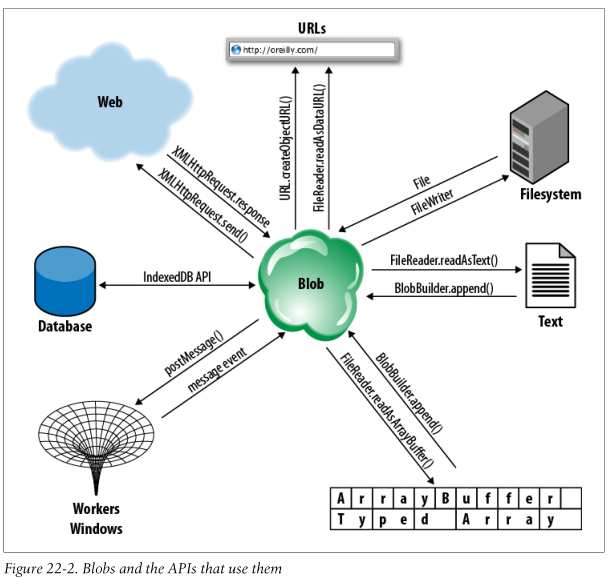
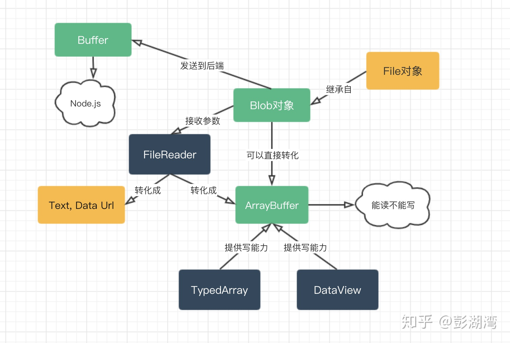

# Binary Large Object


<!-- TOC -->

- [Binary Large Object](#binary-large-object)
    - [1. Basic](#1-basic)
        - [1.1 概念](#11-概念)
        - [1.2 Blob 很可能是大尺寸对象](#12-blob-很可能是大尺寸对象)
        - [1.3 Blob 的关系网](#13-blob-的关系网)
    - [2. Files as Blobs](#2-files-as-blobs)
        - [2.1 作为 `File` 对象的 blob 对象](#21-作为-file-对象的-blob-对象)
            - [2.1.1 通过 `<input type="file">` 获得](#211-通过-input-typefile-获得)
            - [2.1.2 通过拖拽事件获得](#212-通过拖拽事件获得)
        - [2.2 `<input type="file">` 的安全性](#22-input-typefile-的安全性)
    - [3. Building Blobs](#3-building-blobs)
    - [4. 属性和方法](#4-属性和方法)
        - [4.1 实例属性](#41-实例属性)
            - [4.1.1 `size`](#411-size)
            - [4.1.2 `type`](#412-type)
        - [4.2 实例方法](#42-实例方法)
            - [4.2.1 `arrayBuffer()`](#421-arraybuffer)
            - [4.2.2 `slice()`](#422-slice)
            - [4.2.3 `stream()`](#423-stream)
            - [4.2.4 `text()`](#424-text)
    - [5. Reading Blobs](#5-reading-blobs)
        - [5.1 调用构造函数并注册读取后的回调函数](#51-调用构造函数并注册读取后的回调函数)
        - [5.2 请求读取 blob](#52-请求读取-blob)
        - [5.3 进度事件](#53-进度事件)
        - [5.4 `readAsText()`](#54-readastext)
        - [5.5 `readAsArrayBuffer()`](#55-readasarraybuffer)
    - [6. 功能](#6-功能)
        - [6.1 和 web 相互传递 blob](#61-和-web-相互传递-blob)
            - [6.1.1 通过 Ajax 或者 fetch 下载 blob](#611-通过-ajax-或者-fetch-下载-blob)
            - [6.1.2 使用 Ajax 或表单上传 blob](#612-使用-ajax-或表单上传-blob)
        - [6.2 通过 URL 来使用 blob](#62-通过-url-来使用-blob)
            - [6.2.1 转化为 Blob URL](#621-转化为-blob-url)
                - [6.2.1.1 Create a Blob URL](#6211-create-a-blob-url)
                - [6.2.1.2 Blob URL 是对资源的引用](#6212-blob-url-是对资源的引用)
                - [6.2.1.3 同源](#6213-同源)
                - [6.2.1.4 有效期为 session](#6214-有效期为-session)
                - [6.2.1.5 Revoke a Blob URL —— 内存回收](#6215-revoke-a-blob-url--内存回收)
                - [6.2.1.6 `blob://` 类似于 `http://` scheme](#6216-blob-类似于-http-scheme)
            - [6.2.2 转化为 DataURL](#622-转化为-dataurl)
        - [6.3 和字符串相互转换](#63-和字符串相互转换)
        - [6.4 和 ArrayBuffer/ArrayBufferView 相互转换](#64-和-arraybufferarraybufferview-相互转换)
        - [6.5 和 DataURL 相互转换](#65-和-dataurl-相互转换)
    - [References](#references)

<!-- /TOC -->


## 1. Basic
### 1.1 概念
1. A Blob is an opaque reference to, or handle for, a chunk of data. 
2. The name comes from SQL databases, where it means “Binary Large Object.” 
3. In JavaScript, Blobs often represent binary data, and they can be large, but neither is required: a Blob could also
represent the contents of a small text file. 
4. Blobs are opaque: all you can do with them directly is determine their size in bytes, ask for their MIME type, and chop them up into smaller Blobs:
    ```js
    var blob = ... // We'll see how to obtain a Blob later
    blob.size // Size of the Blob in bytes
    blob.type // MIME type of the Blob, or "" if unknown
    var subblob = blob.slice(0,1024, "text/plain"); // First 1K of the Blob as text
    var last = blob.slice(blob.size-1024, 1024); // Last 1K of the Blob, untyped
    ```

### 1.2 Blob 很可能是大尺寸对象
1. The web browser can store Blobs in memory or on disk, and Blobs can represent really enormous chunks of data (such as video files) that are too large to fit in main memory without first being broken into smaller pieces with `slice()`.
2. Because Blobs can be so large and may require disk access, the APIs that work with them are asynchronous (with
synchronous versions available for use by worker threads).

### 1.3 Blob 的关系网
1. Blobs are not terribly interesting by themselves, but they serve as a critical data interchange mechanism for various JavaScript APIs that work with binary data. 
2. 下图展示了如何从 Web、本地文件系统、本地数据库或者其他的窗口和 Worker 中对 Blob 进行读写，以及如何以文本、类型化数组或者URL的形式读取 Blob 内容。注意其中的 `BlobBuilder` 已经被弃用，改为新的 `Blob` 构造函数来创建 blob。
    
3. 下图是 Blob 和其他相关对象的关系
    


## 2. Files as Blobs
The `File` interface is based on `Blob`, inheriting blob functionality and expanding it to support files on the user's system.

### 2.1 作为 `File` 对象的 blob 对象
#### 2.1.1 通过 `<input type="file">` 获得
1. In browsers that support local file access, the files property of an `<input type="file">` element will be a FileList object. 
2. This is an array-like object whose elements are zero or more user-selected File objects.

#### 2.1.2 通过拖拽事件获得
3. In addition to selecting files with an `<input>` element, a user can also give a script access to local files by dropping them into the browser. 
2. When an application receives a drop event, the `dataTransfer.files` property of the event object will be the FileList associated with the drop, if there was one.

### 2.2 `<input type="file">` 的安全性
1. The `<input type="file">` element was originally intended to enable file uploads in HTML forms. Browsers have always been careful to implement this element so that it only allows the upload of files explicitly selected by the user.
2. Scripts cannot set the `value` property of this element to a filename, so they cannot go uploading arbitrary files
from the user’s computer. 
3. More recently, browser vendors have extended this element to allow client-side access to user-selected files. 
4. Note that allowing a client-side script to read the contents of selected files is no more or less secure than allowing those files to be uploaded to the server.


## 3. Building Blobs
1. Blobs often represent chunks of data from an external source such as a local file, a URL, or a database. 
2. But sometimes a web application wants to create its own Blobs to be uploaded to the Web or stored in a file or database or passed to another thread. 
3. 要从自己的数据来创建Blob，可以使用 `Blob` 构造函数。可以基于以下四种类型中的一种或者几种的数据构造 blob
    * `ArrayBuffer`
    * `ArrayBufferView`
    * `Blob`
    * `USVString`
4. 具体的方法参考 [文档](https://developer.mozilla.org/en-US/docs/Web/API/Blob/Blob)。下面的例子使用 DataURL 构建一个 blob 然后生成对应的 blob URL
    ```js
    const sDataURI = 'data:image/png;base64,iVBORw0KGgoAAAANSUhEUgAAADAAAAAwCAYAAABXA'
                    +'vmHAAACrElEQVR42u2Xz2sTQRSAX8VSb1K8iNqKooJH2Ux6Ksn+iPQqxZMIehJB'
                    +'0do/IMhmQWsvHr2KSEGk0tSLIoWIYNUKij20F2/N7iaUZnYT0kYzzhMKs0HDJiT'
                    +'dLcwHDwKZSd63781LBiQSSW9JZdkhzfKm1Rz9mjZp/W9YdEU3vXv4HsQZ40FtNG'
                    +'36q5rls//Ej4tmbSS2T15Mvp3ExOPmEMQNbBtMMEyoljcFcQN7PqyAlqNfIG7gY'
                    +'Q0tYNIaxA1MrJPY3wImbUqBKAXSFv0tBSIVMOkvKRDtGKWN/T6FdqRAxFNoWwpE'
                    +'PIXqUqBT6ALU/UVgu8GW4GD3f6f9TRDYNJTDrk7YbtiqUumHwIYoUJuHERDAS0r'
                    +'4CvgFECgbY+cFAR7KT+g1POmCKFDNw6WggHc3fBtVb4CAoyauBgXIG+g1Xh5mRA'
                    +'Gah6cggBd11fK/h7lOprIs0H6uRl6KAo5O7kOv4QmPiwJ4Jqqv4FiwCtXjvD2+t'
                    +'RmfK6kZ/ygI2HritK0rDVGgrClJ6DWMwYC/AGuCBMYcIC2V0CzvjmbRz3j3xUjn'
                    +'6CfeYreUJ2wQkGD75INPX1mFfsEFrrcIYCvdhC4paWQakxajpJMr0C9YFg54i7A'
                    +'sClRmh9/xnr0NHcInzZStk2aLwAcGMAD9pPIazvFKVDD5rdnhJeHLX5RTyRPQHp'
                    +'z5o66emMc9wdlPtvA8wF7Aq2BUHh1525qEo5JtR1WeOXpickO9cJIpyuD6xJmhY'
                    +'iZ5ytWSl3mlnuOaf+2zDaLDXmJrSgZ/MYVEugo+gSh+FkSBa4yd5Ul87DZ5XpFl'
                    +'/AyIEjzYjkau8WqshU2cr13HPbgX4gJOD97n465GZlyVvC9mSKloKI2iTnbwNT+'
                    +'gBX54H+IaXAtxJzE3ycSAFqSAFJACUkAikXD+AHj5/wx2o5osAAAAAElFTkSuQm'
                    +'CC';

        
    function dataURI2Blob(dataURI) {
        // 获取其中的 base64 部分字符串并解码为 binary string.
        // Binary string is a String object in which each character in the string is treated as a byte of binary data.
        let byteString = atob(dataURI.split(',')[1]); 

        let mimeString = dataURI.split(',')[0].split(':')[1].split(';')[0]; // 获得 MINE type
        let ia = new Uint8Array(byteString.length); // 构造 Typed Array 来操作二进制数据

        // 将每个二进制字符转换为码点并存入 Typed Array
        for (let i = 0; i < byteString.length; i++) {
            ia[i] = byteString.charCodeAt(i);   
        }

        return new Blob([ia], {type:mimeString}); // 使用 Typed Array 构造 blob
    }

    function geneImg () {
        let blobURL = URL.createObjectURL( dataURI2Blob(sDataURI) ); // 用 blob 生成 blob URL
        let img = document.createElement('img');
        img.src = blobURL;
        document.body.appendChild(img)
    }


    geneImg();
    ```


## 4. 属性和方法
### 4.1 实例属性
#### 4.1.1 `size`
1. The size, in bytes, of the data contained in the `Blob` object.
2. Read only.

#### 4.1.2 `type`
1. A string indicating the MIME type of the data contained in the `Blob`. If the type is unknown, this string is empty.
2. Read only.

### 4.2 实例方法
#### 4.2.1 `arrayBuffer()`
Returns a `Promise` that resolves with the contents of the blob as binary data contained in an `ArrayBuffer`.

#### 4.2.2 `slice()`
Creates and returns a new `Blob` object which contains data from a subset of the blob on which it's called.

#### 4.2.3 `stream()`
1. Returns a `ReadableStream` which upon reading returns the data contained within the `Blob`.
2. With `stream()` and the returned `ReadableStream`, you gain several interesting capabilities:
    * Call `getReader()` on the returned stream to get an object to use to read the data from the blob using methods such as the `ReadableStreamDefaultReader` interface's `read()` method.
    * Call the returned stream's `pipeTo()` method to pipe the blob's data to a writable stream.
    * Call the returned stream's `tee()` method to tee the readable stream. This returns an array containing two new `ReadableStream` objects, each of which returns the contents of the `Blob`.
    * Call the returned stream's `pipeThrough()` method to pipe the stream through a `TransformStream` or any other readable and writable pair.

#### 4.2.4 `text()`
Returns a `Promise` that resolves with a string containing the contents of the blob, interpreted as UTF-8.


## 5. Reading Blobs
1. The `FileReader` object allows us read access to the characters or bytes contained in a Blob. 
2. Since Blobs can be very large objects stored in the filesystem, the API for reading them is asynchronous, much like the `XMLHttpRequest` API. 
3. A synchronous version of the API, `FileReaderSync`, is available in worker threads, although workers can also use the asynchronous version.

### 5.1 调用构造函数并注册读取后的回调函数
1. To use a FileReader, first create an instance with the `FileReader()` constructor. 
2. Next, define event handlers. Typically you’ll define handlers for load and error events and possibly also for progress events. 
3. You can do this with `onload`, `onerror`, and `onprogress` or with the standard `addEventListener()` method. 
4. FileReader objects also trigger `loadstart`, `loadend`, and `abort` events, which are like the `XMLHttpRequest` events with the same names.

### 5.2 请求读取 blob
1. Once you’ve created a FileReader and registered suitable event handlers, you must pass the Blob you want to read to one of four methods: `readAsText()`, `readAsArrayBuffer()`, `readAsDataURL()`, and `readAsBinaryString()`.
2. You can, of course, call one of these methods first and then register event handlers — the single-threaded nature of
JavaScript, means that event handlers will never be called until your function has returned and the browser is back in its event loop. 异步的读取回调至少要在下一个事件循环，所以肯定会在注册回调之后。比如这样写
    ```js
    let reader = new FileReader();
    reader.readAsDataURL(file);
    reader.onload = () => { 
        // reader.result
        // ... 
    };
    ```
3. The first two methods are the most important and are the ones covered here. Each of these read methods takes a Blob as its first argument. 
4. `readAsText()` takes an optional second argument that specifies the name of a text encoding. If you omit the encoding, it will automatically work with ASCII and UTF-8 text (and also UTF-16 text with a byte-order mark or BOM).

### 5.3 进度事件
1. As the FileReader reads the Blob you’ve specified, it updates its `readyState` property. 
2. The value starts off at `0`, indicating that nothing has been read.
3. It changes to `1` when some data is available, and changes to `2` when the read has completed. 
4. The `result` property holds a partial or complete result as a string or ArrayBuffer. 
4. You do not normally poll the `state` and `result` properties, but instead use them from your `onprogress` or `onload` event handler.

### 5.4 `readAsText()`
Read local text files that the user selects
```html
Select the file to display:
<input type="file" onchange="readfile(this.files[0])" />
<pre id="output"></pre>
```
```js
// Read the specified text file and display it in the <pre> element below
function readfile(f) {
    var reader = new FileReader(); // Create a FileReader object
    reader.readAsText(f); // Read the file
    reader.onload = function() { // Define an event handler
        var text = reader.result; // This is the file contents
        var out = document.getElementById("output"); // Find output element
        out.innerHTML = ""; // Clear it
        out.appendChild(document.createTextNode(text)); // Display file contents
    }
    reader.onerror = function(e) { // If anything goes wrong
        console.log("Error", e); // Just log it
    };
}
```

### 5.5 `readAsArrayBuffer()`
Read the first four bytes of a file as a big-endian integer.
```html
<input type="file" onchange="typefile(this.files[0])" />
```
```js
// Examine the first 4 bytes of the specified blob. 
// If this "magic number" identifies the type of the file, asynchronously set a property on the Blob.
function typefile(file) {
    let slice = file.slice(0, 4); // Only read the start of the file
    let reader = new FileReader(); // Create an asynchronous FileReader
    reader.readAsArrayBuffer(slice); // Read the slice of the file
    reader.onload = function(e) {
        let buffer = reader.result; // The result ArrayBuffer
        let view = new DataView(buffer); // Get access to the result bytes
        let magic = view.getUint32(0, false); // Read 4 bytes, big-endian
        switch(magic) { // Determine file type from them
            case 0x89504E47: 
                file.verified_type = "image/png"; 
                break;
            case 0x47494638: 
                file.verified_type = "image/gif"; 
                break;
            case 0x25504446: 
                file.verified_type = "application/pdf"; 
                break;
            case 0x504b0304: 
                file.verified_type = "application/zip"; 
                break;
            default:         
                file.verified_type = "other";
        }
        console.log(file.name, file.verified_type);
    };
}
```


## 6. 功能
### 6.1 和 web 相互传递 blob
#### 6.1.1 通过 Ajax 或者 fetch 下载 blob
1. 使用时要测试兼容性。
2. GET the contents of the url as a Blob and pass it to the specified callback.
3. If the Blob you’re downloading is quite large and you want to start processing it while it is downloading, you can use an `onprogress` event handler
    ```js
    let xhr = new XMLHttpRequest();
    xhr.open("GET", "test.mp4");
    xhr.responseType = "blob" // 必须设定这个属性的值为 "blob"
    xhr.onprogress = function(ev) {
        console.log(ev.loaded + "/" + ev.total); // show progress, if needed
    };
    xhr.onload = function() {
        console.log(xhr.response); // 获得 MP4 文件的 Blob 对象
    }
    xhr.send(null);
    ```
4. 可以进一步使用 `<a>` 将 blob 从浏览器下载到本地
    ```js
    xhr.onload = function() {
        let blob = xhr.response;
        let blobUrl = URL.createObjectURL(blob);
        let a = document.createElement('a');
        a.href = blobUrl;
        a.download = getFileNameByUrl(url); // 通过 download 属性将 a 标签的点击事件响应设置为下载，并执行下载后的文件名
        a.click();
    }
    ```

#### 6.1.2 使用 Ajax 或表单上传 blob
1. 使用 Ajax 上传时不需要表单的完整提交文件功能，但仍然需要 `<input type="file" />` 来让用户手动上传本地文件到浏览器。
2. 同时要结合 `FormData` 来模拟表单的文件提交
    ```js
    function uploadfile() {
        let fd = new FormData();
        let file = document.getElementById('img').files[0]; // 用户手动选择的文件
        fd.append('img', file);

        let xhr = new XMLHttpRequest();
        xhr.onreadystatechange = function () {
            if( xhr.readyState == 4 ) {
                let data = xhr.responseText;
                console.log(data)
            }
        };
        xhr.open('post', '/upload/', true)
        xhr.send(fd);
    }
    ```


### 6.2 通过 URL 来使用 blob
Blob 可以转换为两种形式的 URL：Blob URL 和 DataURL

#### 6.2.1 转化为 Blob URL
##### 6.2.1.1 Create a Blob URL
1. One of the simplest things you can do with a Blob is create a URL that refers to the Blob. 
2. You can then use this URL anywhere you’d use a regular URL: in the DOM, in a stylesheet, or even as the target of an XMLHttpRequest.
3. Pass a blob to `window.URL.createObjectURL()` and it returns a URL (as an ordinary string). 
    ```html
    <input type="file" />
    
    ```
    ```js
    document.querySelector('input').addEventListener('change', function(ev){
        document.querySelector('img').src = URL.createObjectURL(ev.target.files[0]);
    });
    ```
4. 使用时测试兼容性，犀牛书第六版说：Chrome and Webkit prefix that new global, calling it `webkitURL` — `webkitURL.createObjectURL`。

##### 6.2.1.2 Blob URL 是对资源的引用
1. The URL will begin with `blob://`, and that URL scheme will be followed by a short string of text that identifies the Blob with some kind of opaque unique identifier. 
2. Note that this is very different than a `data://` URL, which encodes its own contents. A Blob URL is simply a reference to a Blob that is stored by the browser in memory or on the disk.
3. `blob://` URLs are also quite different from `file://` URLs, which refer directly to a file in the local filesystem, exposing the path of the file, allowing directory browsing, and otherwise raising security issues.

##### 6.2.1.3 同源
1. Blob URLs have the same origin as the script that creates them. 
2. This makes them much more versatile than `file://` URLs, which have a distinct origin and are therefore difficult to use within a web application. 
3. A Blob URL is only valid in documents of the same origin. If, for example, you passed a Blob URL via `postMessage()` to a window with a different origin, the URL would be meaningless to that window.

##### 6.2.1.4 有效期为 session
1. Blob URLs are not permanent. A Blob URL is no longer valid once the user has closed or navigated away from the document whose script created the URL. 
2. It is not possible, for example, to save a Blob URL to local storage and then reuse it when the user begins a new session with a web application.

##### 6.2.1.5 Revoke a Blob URL —— 内存回收
1. It is also possible to manually “revoke” the validity of a Blob URL by calling `URL.revokeObjectURL()`. 
2. This is a memory management issue. Once the thumbnail image has been displayed, the Blob is no longer needed and it should be allowed to be garbage collected. 
3. But if the web browser is maintaining a mapping from the Blob URL we’ve created to the Blob, that Blob cannot be garbage collected even if we’re not using it. 
4. The JavaScript interpreter cannot track the usage of strings, and if the URL is still valid, it has to assume that it might still be used. 
5. This means that it cannot garbage collect the Blob until the URL has been revoked. 

##### 6.2.1.6 `blob://` 类似于 `http://` scheme
1. The `blob://` URL scheme is explicitly designed to work like a simplified `http://` URL, and browsers are required to act like mini HTTP servers when `blob://` URLs are requested. 
2. If a Blob URL that is no longer valid is requested, the browser must send a *404 Not Found* status code. 
3. If a Blob URL from a different origin is requested, the browser must respond with *403 Not Allowed*. 
4. Blob URLs only work with GET requests, and when one is successfully requested, the browser sends an HTTP *200 OK* status code and also sends a *Content-Type* header that uses the type property of the Blob.
5. Because Blob URLs work like simple HTTP URLs, you can “download” their content with XMLHttpRequest. (However, you can read the content of a Blob more directly using a `FileReader` object.)

#### 6.2.2 转化为 DataURL
通过 `FileReader.readAsDataURL()` 方法
```html
<input type="file" onchange="previewFile()">
<br><br>

```
```js
function previewFile() {
    // 获取用户上传的 blob
    const file = document.querySelector('input[type=file]').files[0];

    // 创建 FileReader 实例并添加读取完成的回调
    const reader = new FileReader();
    reader.addEventListener("load", function () {
        // 获取到 DataURL
        document.querySelector('img').src = reader.result;
    }, false);

    if (file) {
        // 读取 blob
        reader.readAsDataURL(file);
    }
}
```

### 6.3 和字符串相互转换
1. 通过构造函数把字符串转为 blob
    ```js
    let str = 'hello world';
    let newBlob = new Blob([str]);
    console.log(newBlob); // Blob {size: 11, type: ""}
    ```
2. 通过 blob 的实例方法 `text` 或者通过 `FileReader` 的 `readAsText` 方法把 blob 转为字符串
    ```js
    // 使用 blob 实例方法 text()
    new Blob(['北京欢迎你']).text()
    .then((text)=>{
        console.log(text); // "北京欢迎你"
    });

    // 使用 FileReader
    let reader = new FileReader();
    reader.addEventListener('load', function () {
        console.log(reader.result); // "北京欢迎你"
    });
    reader.readAsText( new Blob(['北京欢迎你']) );
    ```

### 6.4 和 ArrayBuffer/ArrayBufferView 相互转换
1. ArrayBuffer 可以通过 `Blob` 构造函数转为 blob，blob 可以通过实例方法 `arrayBuffer()` 或者 `FileReader` 转为 ArrayBuffer。
    ```js
    let buffer = new ArrayBuffer(32);
    let blob = new Blob([buffer]);
    console.log(blob); // Blob {size: 32, type: ""}


    // 使用 blob 实例方法 arrayBuffer()
    blob.arrayBuffer()
    .then((buffer) => {
        console.log(buffer);  // ArrayBuffer(32) {}
    });


    // 使用 FileReader
    let reader = new FileReader();
    reader.addEventListener('load', ()=>{
        console.log( reader.result ); // ArrayBuffer(32) {}
    });
    reader.readAsArrayBuffer(blob); 
    ```
2. ArrayBufferView 也是直接通过 `Blob` 构造函数转为 blob；但从 blob 转为 ArrayBufferView 时，只能先转为 ArrayBuffer，之后还需要使用相同的类型化数组转为视图
    ```js
    let typedArr = new Uint16Array([97, 32, 72, 101, 108, 108, 111, 32, 119, 111, 114, 108, 100, 33]);
    let blob = new Blob([typedArr]);
    console.log(blob); // Blob {size: 28, type: ""}


    blob.arrayBuffer()
    .then((buffer) => {
        console.log( buffer ); // ArrayBuffer(28) {}
        console.log( new Uint16Array(buffer) ); 
        // Uint16Array(14) [97, 32, 72, 101, 108, 108, 111, 32, 119, 111, 114, 108, 100, 33]
    });


    let reader = new FileReader();
    reader.addEventListener('load', ()=>{
        console.log( reader.result ); // ArrayBuffer(28) {}
        console.log( new Uint16Array(reader.result) ); 
        // Uint16Array(14) [97, 32, 72, 101, 108, 108, 111, 32, 119, 111, 114, 108, 100, 33]
    });
    reader.readAsArrayBuffer(blob);
    ```

### 6.5 和 DataURL 相互转换
1. Blob 转 DataURL 很简单，使用 `FileReader` 的 `readAsDataURL` 方法
    ```js
    let blob = dataURI2Blob(sDataURI);
        let reader = new FileReader();
        reader.addEventListener('load', ()=>{
            console.log( reader.result );
        });
        reader.readAsDataURL(blob);
    ```
2. DataURL 转 blob 麻烦一下，要先把 base64 字符串转为二进制字符串，再把二进制字符串 ArrayBuffer，然后再转为 blob
    ```js
    function dataURI2Blob(dataURL) {
        let base64 = dataURL.split(',')[1];

        // 解码为 binary string
        // Binary string is a String object in which each character in the string is treated as a byte of binary data.
        let byteString = atob(base64);

        let ia = new Uint8Array(byteString.length); // 构造 Typed Array 来操作二进制数据
        
        // 将每个二进制字符转换为码点并存入 Typed Array
        for (let i = 0; i < byteString.length; i++) {
            ia[i] = byteString.charCodeAt(i);   
        }
        
        let MIMEType = dataURL.split(',')[0].split(':')[1].split(';')[0];
        return new Blob([ia], {type:MIMEType}); // 使用 Typed Array 构造 blob
    }


    const dataURL = 'data:image/png;base64,iVBORw0KGgoAAAANSUhEUgAAADAAAAAwCAYAAABXA'
                        +'vmHAAACrElEQVR42u2Xz2sTQRSAX8VSb1K8iNqKooJH2Ux6Ksn+iPQqxZMIehJB'
                        +'0do/IMhmQWsvHr2KSEGk0tSLIoWIYNUKij20F2/N7iaUZnYT0kYzzhMKs0HDJiT'
                        +'dLcwHDwKZSd63781LBiQSSW9JZdkhzfKm1Rz9mjZp/W9YdEU3vXv4HsQZ40FtNG'
                        +'36q5rls//Ej4tmbSS2T15Mvp3ExOPmEMQNbBtMMEyoljcFcQN7PqyAlqNfIG7gY'
                        +'Q0tYNIaxA1MrJPY3wImbUqBKAXSFv0tBSIVMOkvKRDtGKWN/T6FdqRAxFNoWwpE'
                        +'PIXqUqBT6ALU/UVgu8GW4GD3f6f9TRDYNJTDrk7YbtiqUumHwIYoUJuHERDAS0r'
                        +'4CvgFECgbY+cFAR7KT+g1POmCKFDNw6WggHc3fBtVb4CAoyauBgXIG+g1Xh5mRA'
                        +'Gah6cggBd11fK/h7lOprIs0H6uRl6KAo5O7kOv4QmPiwJ4Jqqv4FiwCtXjvD2+t'
                        +'RmfK6kZ/ygI2HritK0rDVGgrClJ6DWMwYC/AGuCBMYcIC2V0CzvjmbRz3j3xUjn'
                        +'6CfeYreUJ2wQkGD75INPX1mFfsEFrrcIYCvdhC4paWQakxajpJMr0C9YFg54i7A'
                        +'sClRmh9/xnr0NHcInzZStk2aLwAcGMAD9pPIazvFKVDD5rdnhJeHLX5RTyRPQHp'
                        +'z5o66emMc9wdlPtvA8wF7Aq2BUHh1525qEo5JtR1WeOXpickO9cJIpyuD6xJmhY'
                        +'iZ5ytWSl3mlnuOaf+2zDaLDXmJrSgZ/MYVEugo+gSh+FkSBa4yd5Ul87DZ5XpFl'
                        +'/AyIEjzYjkau8WqshU2cr13HPbgX4gJOD97n465GZlyVvC9mSKloKI2iTnbwNT+'
                        +'gBX54H+IaXAtxJzE3ycSAFqSAFJACUkAikXD+AHj5/wx2o5osAAAAAElFTkSuQm'
                        +'CC';

    console.log( dataURI2Blob(dataURL) ); // {size: 741, type: "image/png"}
    ```


## References
* [MDN](https://developer.mozilla.org/en-US/docs/Web/API/Blob)
* [聊聊JS的二进制家族：Blob、ArrayBuffer和Buffer](https://zhuanlan.zhihu.com/p/97768916)
* [HTML5 Blob与ArrayBuffer、TypeArray和字符串String之间转换](https://cloud.tencent.com/developer/article/1077970)