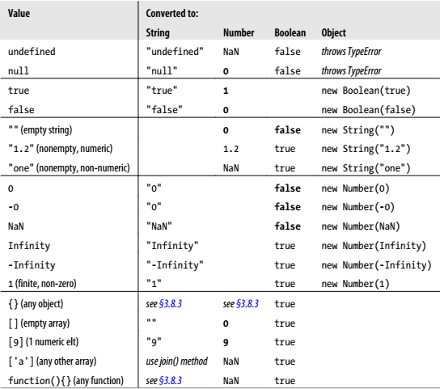

# TypeCasting

* Converting a value from one type to another is often called "type casting,"
when done explicitly, and "coercion" when done implicitly.
* 对`undefined`和`null`使用`Object()`转型并不会报错，而是返回空对象
* `valueOf()` will evaluate an object. The value of a wrapper object is
primitive type value, the values of other objects are still reference type value

  


## 转换为数值类型
### `Number()` 函数或者前置`+`操作符
* 可用于任何类型数据。
* 如果为了易于阅读，使用 `Number()` 来转型；如果为了更简短，使用加号来替代该函数。
* 使用其他数学操作符也会在内部调用`Number()`函数，只不过相比于前置加操作符它们还会多一
步计算。

```js
console.log(Number('1'));   // 1
console.log(Number('-1'));  // -1
console.log(Number('0'));   // 0
console.log(Number('-0'));  // -0
console.log(Number('⑨'));   // NaN
console.log(Number(''));    // 0
```

### `Number.parseInt()` 和 `Number.parseFloat()`
* 用于转换字符串。但实际中，如果转换的是数组，且数组第0项是数字或者数字字符串，也可以转化。
* 解析浮点数字符串式解析精度有限
```js
let parsedFloat = Number.parseFloat('1.337000012397766117451156851189711');
console.log( parsedFloat );// 1.337000012397761
```


## 转换为字符串
### 通用类型方法：
* `String()`函数或者直接加上一个空字符串（加上非空字符串会直接拼接）
* `toString()`方法
    * 引用类型调用该方法的效果：
    ```js
    let obj = {x:3, y:5};
    console.log( obj.toString() ); // "[object Object]"

    let arr = [1, 2, 3];
    console.log( arr.toString() ); // "1,2,3"

    function fn(){return;}
    console.log( fn.toString() ); // "function fn(){return;}"

    let date = new Date();
    console.log( date.toString() ); // "Mon Sep 19 2016 13:02:58 GMT+0800 (China Standard Time)"

    let re = /\d+/g;
    console.log( re.toString() ); // "/\d+/g"
    ```
    * 无法转换`null`和`undefined`，会报错
* `valueOf()` 方法返回的是原始值，不是字符串形式  
    ```js
    let obj = {x:3, y:5};
    console.log(obj.valueOf() === obj); // true

    let arr = [1, 2, 3];
    console.log(arr.valueOf() === arr); // true

    function fn(){return;}
    console.log(fn.valueOf() === fn); // true

    let re = /\d+/g;
    console.log(re.valueOf() === re); // true

    let date = new Date();
    console.log(date.valueOf()); // 1474267248866
    console.log(typeof date.valueOf()); // "number"

    let str = new String('hello');
    console.log(str.valueOf()); // "hello"
    console.log(typeof str.valueOf()); // "string"
    ```
    以上返回值的typeof分别是 `object object function number object`

### 数组转化为字符串的方法
* `String()`函数  
    ```js
    String([1, 2, 3]) // "1,2,3"
    ```
* `toString()` 方法
    ```js
    [1, 2, 3].toString() // "1,2,3"
    ```
* `join()` 方法：可自定义分隔符
* 循环

### 数值转换为字符串
    * `toFixed()`
    * `toExponential()`
    * `toPrecision()`
    * `String()`
    * `toString()`
        * 指定参数可以转换为其他进制字符串


## 转换为布尔值
如果为了易于阅读，使用`Boolean()`来转型；如果为了更简短，使用`!!`来替代该函数。


## 转换为数组
### 一. `Array.from()`
将可遍历（iterable）的对象转换为数组
```js
Array.from({ length: 10 }, a => Math.random() ); // 创建一个包含十个随机数的数组
```

### 二. 扩展运算符
将可遍历（iterable）的对象和字符串转换为数组
```js
[...document.querySelectorAll('div')];

console.log( [..."qwer"]  ); // ["q", "w", "e", "r"]
```

### 三. `split()`
字符串转换为数组


## 转换为对象
### 通用类型方法
* `Object()`

### 字符串转换为对象
1. `Object.assign`
```js
let str = 'abc';
let obj = Object.assign({}, str );
console.log(obj); // { "0": "a", "1": "b", "2": "c" }
```
