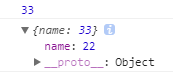

# Debug with Chrome

***
## `debugger`
You can also wrap it in conditional
```js
let i = 0;
if(i){ debugger; }
console.log(i++);  //0
if(i){ debugger; } // break here
console.log(i++);
```


***
## `console`
### `console` 系的一个通病
```js
let o = {name: 33};
console.log(o.name);
console.log(o);
o.name = 22;
```
  

You can use `JSON.stringify` to avoid it
```js
let o = {name: 33};
console.log(JSON.stringify(o)); // {"name":33}
o.name = 22;
```


### `printf`-like and output style
https://getfirebug.com/wiki/index.php/Console.log
```js
let obj = {
    name: "33",
    age: 22
};
console.log("%c%s%o","color: red; background: yellow; font-size: 24px; font-weight: bold;", "对象引用：", obj);
```


### `console.assert(assertion, ...data)`
1. Writes an error message to the console if the assertion is false. If the
assertion is true, nothing happens.
2. The `console.assert()` method is implemented differently in Node.js than the
`console.assert()` method available in browsers.
In browsers, calling `console.assert()` with a falsy assertion will cause the
message to be printed to the console without interrupting execution of
subsequent code. In Node.js, however, a falsy assertion will cause an
`AssertionError` to be thrown.


### `console.clear()`
Clears the console.


### `console.count(label)` 输出执行到该行的次数
1. Logs the number of times that this particular call to `count()` has been
called.
2. If `label` is supplied, this function logs the number of times `count()` has
been called with that particular label. If `label` is omitted, the function logs
 the number of times `count()` has been called at this particular line.
```js
for(let i=0; i<5; i++){
    console.count('times');
}
// times: 1
// times: 2
// times: 3
// times: 4
// times: 5
```


### `console.dir(object)`
Displays an interactive list of the properties of the specified JavaScript
object. The output is presented as a hierarchical listing with disclosure
triangles that let you see the contents of child objects.


### `console.dirxml()`
Displays an interactive tree of the descendant elements of the specified
XML/HTML element. If it is not possible to display as an element the JavaScript
Object view is shown instead. The output is presented as a hierarchical listing
of expandable nodes that let you see the contents of child nodes.


### `console.error()` `console.warn()`
```js
function foo(){
    console.error("error");
    console.warn("warn");
}
function bar(){
    foo();
}
bar();
```


### `console.group()` `console.groupCollapsed()` `console.groupEnd()`


### `console.info()` `console.log()`


### `console.profile()` `console.profileEnd()`
Did not find any use


### `console.table(data [, columns]);`
```js
{
    let obj = {
        name: '33',
        age:22,
        info: {
            a: 'aaa',
            b: 'bbb',
        },
    };
    console.table(obj);
}

{
    function Person(firstName, lastName) {
        this.firstName = firstName;
        this.lastName = lastName;
    }

    var john = new Person("John", "Smith");
    var jane = new Person("Jane", "Doe");
    var emily = new Person("Emily", "Jones");

    console.table([john, jane, emily], ["firstName"]);
}

{
    let arr = [
        [1, 11, 111], [2, 22, 222], [3, 33, 333]
    ];
    console.table(arr)
    console.table(arr, [1])
}
```


### `console.time(label)` `console.timeEnd(label)`


### `console.timeStamp()`
Did not find any use


### `console.trace()`
Outputs a stack trace to the Web Console.
