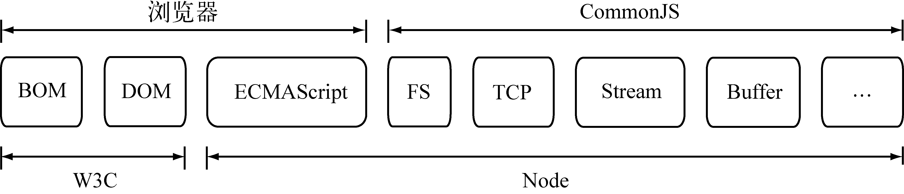

# CommonJS 规范

## CommonJS 规范要解决的 JavaScript 中存在问题
* **没有模块系统**。
* **标准库较少**。ECMAScript 仅定义了部分核心库，对于文件系统，I/O 流等常见需求却没有
标准的 API。就 HTML5 的发展状况而言，W3C 标准化在一定意义上是在推进这个过程，但是它仅限
于浏览器端。
* **没有标准接口**。在 JavaScript 中，几乎没有定义过如 Web 服务器或者数据库之类的标准
统一接口。
* **缺乏包管理系统**。这导致 JavaScript 应用中基本没有自动加载和安装依赖的能力。


## Node 与浏览器以及 W3C 组织、CommonJS 组织、ECMAScript之间的关系



## CommonJS 的模块规范
CommonJS 对模块的定义十分简单，主要分为模块引用、模块定义和模块标识3个部分。

### 模块引用
在 CommonJS 规范中，存在`require()`方法，这个方法接受模块标识，以此引入一个模块的
API 到当前上下文中。

### 模块定义
1. 对应引用的功能，上下文提供了`exports`对象用于导出当前模块的方法或者变量，并且它是唯
一导出的出口。
2. 在模块中，还存在一个`module`对象，它代表模块自身，而`exports`是`module`的属性。
3. 在 Node 中，一个文件就是一个模块，将方法挂载在`exports`对象上作为属性即可定义导出
    ```js
    exports.add = function () {
        var sum = 0,
            i = 0,
            args = arguments,
            l = args.length;
        while (i < l) {
            sum += args[i++];
        }
        return sum;
    };
    ```

### 模块标识
* 模块标识其实就是传递给`require()`方法的参数，可以是核心模块名、相对路径或绝对路径。
* 可以没有文件名后缀`.js`。


## References
* [《深入浅出Node.js》 2.1章节](https://book.douban.com/subject/25768396/)
