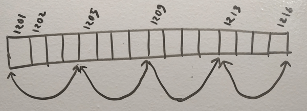

# Performance


## Why JavaScript arrays are not actual arrays
### Actual arrays
1. Before stating something about JavaScript, let me tell you what is an `Array`.
2. So, arrays are a bunch of continuous memory location, used to hold some values. Here the emphasis is on the word `continuous` or `contiguous`; because this has a significant effect.
  

3. An memory representation of an array has been provided in the picture above. So it is made to hold 4 elements of 4 bits each. Thus it is taking 16 bits memory blocks, all in the same order.
4. Suppose, I’ve declared `tinyInt arr[4];` and it has captured a series of memory blocks, starting from address `1201`. Now at some point if I try to read `a[2]`, what it will do is a simple mathematical calculation to find out the address of `a[2]`. Something like `1201 + (2 X 4)` and will directly read from address `1209`.

### JavaScript arrays
1. In JavaScript, an array is a hash-map. It can be implemented using various data structures, one of them is linked-list. 
  

2. So in JavaScript if you declare an array `var arr = new Array(4);` it will make a structure like the picture above. Thus, if you want to read from `a[2]` at any point in your program; it has to traverse starting from `1201` to find the address of `a[2]`.
3. So this is how JavaScript arrays are different from actual arrays. Obviously a mathematical calculation will take way lesser time than an linked-list traversal. For long arrays, life will be more tough.


## Evolution of JavaScript arrays  
### Using homogeneous array
1. JavaScript engines these days actually allocate contiguous memory for its arrays; if the array if homogeneous (all elements of same type). 
2. Good programmers always keep their array homogeneous and JIT (just in time compiler) taking the advantage of that does all its array reading calculation just like the way `C` compiler does. 
3. But, the moment you want to insert an element of different type on that homogeneous array, JIT de-structure the entire array and recreate with the old-days style. 
4. So, if you are not writing bad codes, JavaScript `Array` objects maintains an actual array behind the scene, which is really great for the modern JS developers.

### Typed Array
1. Not only that, the arrays have evolved even more with ES2015 or ES6, we have `ArrayBuffer` with us today. 
2. `ArrayBuffer` gives you a chunk of contiguous memory chunk and let you do whatever you want with it. However, dealing directly with memory is very low level and more complicated. So we have Views to deal with ArrayBuffer.
3. Typed arrays are performant and efficient. It was introduced after the request from WebGL people, as they were facing immense performance issues without a way to handle binary data efficiently. You can also share the memory using `SharedArrayBuffer` across multiple web-workers to get a performance boost. 


## Performance
### 先说结论：别使用混杂类型元素数组

### 写入速度比较
#### 单一类型元素数组 VS 类型化数组 —— 没有明确结论
  ```js
  var LIMIT = 10000000;
  var arr = new Array(LIMIT);
  console.time("Homogeneous array insertion time");
  for ( var i = 0; i < LIMIT; i++) {
      arr[i] = i;
  }
  console.timeEnd("Homogeneous array insertion time");
  ```
  ```js
  var LIMIT = 10000000;
  var buffer = new ArrayBuffer(LIMIT * 4);
  var arr = new Int32Array(buffer);
  console.time("ArrayBuffer insertion time");
  for (var i = 0; i < LIMIT; i++) {
      arr[i] = i;
  }
  console.timeEnd("ArrayBuffer insertion time");
  ```

* 引用文章中的测试结果： Node.js 8.4.0 on Mac，普通数组 55ms，类型化数组 52ms。
* 我在 windows Chrome 75.0.3770.142 上测试结果：普通数组只需要 25ms 左右，而 类型化数组却超过了 30ms。
* 我在 Node v10.13.0 上测试结果：普通数组只要 11ms 左右，类型化数组却超过 20ms。
* 而我在 Firefox 66.0.4 上测试结果却完全相反且相差很多：普通数组要超过 170ms 左右，而类型化数组只大约 30ms。

#### 混杂类型元素数组 VS 单一类型元素数组 —— 前者明显慢得多
  ```js
  var LIMIT = 10000000;
  var arr = new Array(LIMIT);
  arr.push({ a: 22 });
  console.time("Heterogeneous array insertion time");
  for (var i = 0; i < LIMIT; i++) {
      arr[i] = i;
  }
  console.timeEnd("Heterogeneous rray insertion time");
  ```

* 我在 windows Chrome 75.0.3770.142 上测试结果：超过 800ms
* 我在 Node v10.13.0 上测试结果：超过 700ms
* 我在 Firefox 66.0.4 上测试结果：超过 2000ms

###　读取速度比较
#### 单一类型元素数组 VS 类型化数组
* 引用文章中的测试结果：普通数组 196ms，类型化数组 27ms
* 我测试的结果：没有差别

#### 混杂类型元素数组 VS 单一类型元素数组 —— 没有差别


## References
* [Diving deep into JavaScript array – evolution & performance](http://voidcanvas.com/javascript-array-evolution-performance/)
