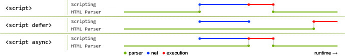

## two phases
### First phase
document content is loaded and the scripts code is run.
### Second phase
Once the document is loaded and all scripts have run, JavaScript execution
enters its second phase. This phase is asynchronous and event-driven.


## single-threaded execution model
1. Both core JavaScript and client-side JavaScript have a single-threaded
execution model. Scripts and event handlers are (or must appear to be) executed
one at a time without concurrency. This keeps JavaScript programming simple
2. HTML5 defines “WebWorkers” which serve as a kind of a background thread, but
clientside JavaScript still behaves as if it is strictly single-threaded. Even
when concurrent execution is possible, client-side JavaScript cannot ever detect
 the fact that it is occurring.
3. JavaScript scripts and event handlers must not run for too long. If a script
performs a computationally intensive task, it will introduce a delay into
document loading, and the user will not see the document content until the
script completes. If an event handler performs a computationally intensive task,
 the browser may become nonresponsive, possibly causing the user to think that
it has crashed.
4. 除了主JavaScript执行进程外，还有一个需要在进程下一次空闲时执行的代码队列。随着页面在
其生命周期中的推移，代码会按照执行顺序添加入队列。例如，当某个按钮被按下时，它的事件处理
程序代码就会被添加到队列中，并在下一个可能的时间里执行。当接收到某个Ajax响应时，回调函数
的代码会被添加到队列。在JavaScript中没有任何代码是立刻执行的，但一旦进程空闲则尽快执行。

### 定时器的运行规则
1. JavaScript是运行于单线程的环境中的，而定时器仅仅只是计划代码在未来的某个时间执行。执
行时机是不能保证的，因为在页面的生命周期中，不同时间可能有其他代码在控制JavaScript进程。
在页面下载完后的代码运行、事件处理程序、Ajax回调函数都必须使用同样的线程来执行。实际上，
浏览器负责进行排序，指派某段代码在某个时间点运行的优先级。  
2. 定时器对队列的工作方式是，当特定时间过去后将代码插入。注意，给队列添加代码并不意味着
对它立刻执行，而只能表示它会尽快执行。设定一个150ms后执行的定时器不代表到了150ms代码就
立刻执行，它表示代码会在150ms后被加入到队列中。如果在这个时间点上，队列中没有其他东西，
那么这段代码就会被执行，表面上看上去好像代码就在精确指定的时间点上执行了。其他情况下，代
码可能明显地等待更长时间才执行。


## Client-Side JavaScript Timeline
### 三种原生JS文件加载和执行方式
* 默认：同步加载，同步执行  
    在下载脚本并执行完成之前都不会解析之后的HTML代码，即脚本的加载和执行都会阻塞解析文档
* defer：异步加载，延迟执行
    1. 延迟至文档解析完成之后再执行
    2. 保证先后顺序，b.js会在a.js执行之后再执行，b.js可以依赖a.js
        ```html
        <script defer src="a.js">
        <script defer src="b.js">
        ```
* async：异步加载，同步执行
    1. 不保证先后顺序，b.js不一定会在a.js执行之后再执行，b.js不能依赖a.js
    ```html
    <script async src="a.js">
    <script async src="b.js">
    ```
    2. If a `<script>` tag has both attributes, a browser that supports both
    will honor the async attribute and ignore the defer attribute.

  
**使用```defer```和```async```先查看最新的浏览器支持情况**  

[参考资料1](https://www.igvita.com/2014/05/20/script-injected-async-scripts-considered-harmful/)  
[参考资料2](http://www.cnblogs.com/RachelChen/p/5456193.html)   
[参考资料3](http://www.cnblogs.com/RachelChen/p/5456185.html)  


## 文档加载时间线  
**This is an idealized timeline and all browsers do not support all of its
details.**
1. The web browser creates a Document object and begins parsing the web page,
adding Element objects and Text nodes to the document as it parses HTML elements
 and their textual content. The `document.readyState` property has the value
`loading` at this stage.
2. When the HTML parser encounters `<script>` elements that have neither the
`async` nor `defer` attributes, it adds those elements to the document and then
executes the inline or external script. These scripts are executed synchronously
, and the parser pauses while the script downloads (if necessary) and runs.
**inline script 不会阻塞渲染**
3. 异步下载带有`async`或者`defer`属性的scripts，并在下载完成后立刻同步执行带有`async`
属性的脚本文件
4. When the document is completely parsed, the `document.readyState` property
changes to `interactive`.
5. Any scripts that had the `defer` attribute set are executed
6. The browser fires a `DOMContentLoaded` event on the Document object. This
marks the transition from synchronous script execution phase to the asynchronous event-driven phase of program execution. Note, however, that there may still be
async scripts that have not yet executed at this point.
7. The document is completely parsed at this point, but the browser may still be
 waiting for additional content, such as images, to load. When all such content
finishes loading, and when all async scripts have loaded and executed, the `document.readyState` property changes to `complete` and the web browser fires a
 `load` event on the Window object.
8. From this point on, event handlers are invoked asynchronously in response to
user input events, network events, timer expirations, and so on.

*This timeline does not specify when the document becomes visible to the user or
 when the web browser must start responding to user input events. Those are
implementation details. For very long documents or very slow network connections
, it is theoretically possible that a web browser will render part of a document
 and allow the user to start interacting with it before all the scripts have
executed. In that case, user input events might be fired before the event-driven
 phase of program execution has formally started.*
