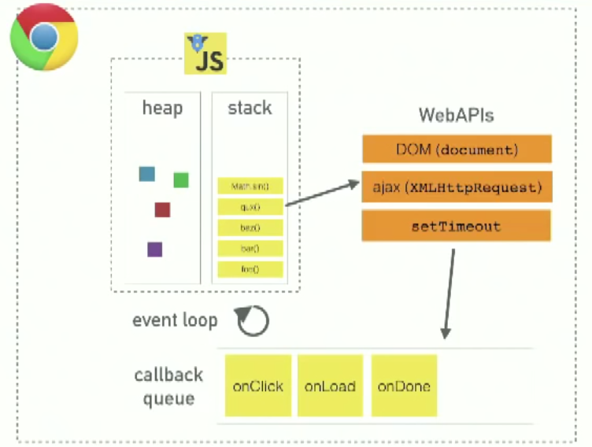
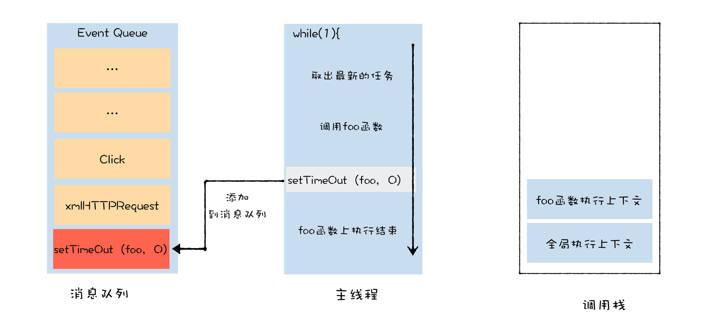

# Concurrency model and Event Loop


JavaScript Runtime:


<!-- TOC -->

- [Concurrency model and Event Loop](#concurrency-model-and-event-loop)
    - [TODO](#todo)
        - [异步回调是否被会错误打断](#异步回调是否被会错误打断)
    - [The JavaScript Engine](#the-javascript-engine)
        - [Call stack](#call-stack)
        - [Memory Heap](#memory-heap)
    - [JS 既然是单线程，为什么可以执行异步操作？](#js-既然是单线程为什么可以执行异步操作)
        - [Basic Architecture](#basic-architecture)
    - [Event Table and Event Queue](#event-table-and-event-queue)
        - [事件表](#事件表)
        - [事件队列](#事件队列)
    - [事件循环](#事件循环)
        - [一个事件循环流程](#一个事件循环流程)
        - [`main()` 以及 `setTimeout` 的回调总是最后执行](#main-以及-settimeout-的回调总是最后执行)
    - [宏任务和微任务](#宏任务和微任务)
        - [宏任务的执行过程](#宏任务的执行过程)
        - [使用异步宏任务解决栈溢出](#使用异步宏任务解决栈溢出)
        - [宏任务实现异步的问题](#宏任务实现异步的问题)
        - [微任务的执行](#微任务的执行)
        - [能否在微任务中循环地触发新的微任务](#能否在微任务中循环地触发新的微任务)
        - [JS 中的宏任务和微任务](#js-中的宏任务和微任务)
        - [再看一个更复杂的例子](#再看一个更复杂的例子)
    - [异常处理](#异常处理)
    - [Several runtimes communicating together](#several-runtimes-communicating-together)
    - [References](#references)

<!-- /TOC -->


## TODO
### 异步回调是否被会错误打断
* 在 Chrome 和 FF 上（2018.7），异步回调的执行不会被之前的同步错误打断：
    ```js
    setTimeout(()=>{
        console.log(22);
    })
    throw new Error();
    console.log(33);
    ```
    先输出错误后输出`22`。用 AJAX 测试也是不会被打断。  
* 但在 Node.js(8.1.2) 上只会输出错误


## The JavaScript Engine
JavaScript 引擎主要由两部分组成：
* Memory Heap — this is where the memory allocation happens
* Call Stack — this is where your stack frames are as your code executes

### Call stack
1. JavaScript has a single call stack in which it keeps track of what function we’re currently executing and what function is to be executed after that.
2. 每一个函数调用都会在往调用栈内 push 一个 frame
    ```js
    function foo(b) {
        var a = 10;
        return a + b + 11;
    }

    function bar(x) {
        var y = 3;
        return foo(x * y);
    }

    console.log(bar(7)); // returns 42
    ```
3. When calling `bar`, a first frame is created containing `bar`'s arguments and local variables.
4. When `bar` calls `foo`, a second frame is created and pushed on top of the first one containing `foo`'s arguments and local variables.
5. When `foo` returns, the top frame element is popped out of the stack (leaving only `bar`'s call frame).
6. When `bar` returns, the stack is empty.

### Memory Heap
Objects are allocated in a heap which is just a name to denote a large mostly unstructured region of memory.（日文：オブジェクトはヒープに割り当てられています。ヒープは、メモリの大規模で大部分は構造化されていない領域を意味する名前です。）


## JS 既然是单线程，为什么可以执行异步操作？
1. 很明显，异步操作显然是两个操作在同时执行。
2. The short answer is that JavaScript language is single-threaded and the asynchronous behaviour is not part of the JavaScript language itself, rather they are built on top of the core JavaScript language in the browser (or the
programming environment) and accessed through the browser APIs.

### Basic Architecture


1. 上图中只有 V8 JS 虚线框部分是 JS 引擎，它确实是单线程的。
2. 所谓的异步操作是在虚线框外部的执行环境（例如浏览器）还可以执行其他操作，从而形成并发异步。
3. 执行环境提供给 JS 一些异步操作 API（上图的 WebAPIs），JS 调用这些 API 并传入回调函数。
4. 执行环境帮助 JS 执行这些异步操作，执行完成后，把相应的回调函数加入到下面讲到的 EventTable，等待被 JS 执行。


## Event Table and Event Queue
1. 在没有异步操作的情况下，JS 就会按照上面 `Stack` 说明中的方式，不断的线性执行，直到程序结束。
2. 但如果程序中执行了一个异步操作，就会涉及到另外两个数据结构：**事件表**（Event Table） 和 **事件队列**（Event Queue）。
3. 看起来事件队列 **消息队列**（Message Queue）的部分。另外，结合上面的图片，看起来也可以称为 Callback Queue。
4. 并不是所有的异步操作都会被加入到消息队列中，详见下面的 【Macrotask 和 Microtask】。

### 事件表
1. 这个数据结构记录了事件及其对应的回调函数。
2. 当一个事件发生时，事件表就会把该事件对应的回调函数传递给事件队列。
3. 事件表不会执行回调（这是调用栈里的工作），也不会把回调推入调用栈（这是事件队列和事件循环的工作），它只负责记录事件及其回调，以及在事件发生时把回调传递给事件队列。

### 事件队列
1. 是队列结构的数据结构，事件队列保证了若干个事件回调按照顺序依次执行。
2. 事件队列从事件表那里接收到回调函数，但还需要某种机制来把队列里面的回调函数推进调用栈。这种机制就是下面要说的 **事件循环**（Event loop）。


## 事件循环
1. 事件循环是一个持续运行的进程，它不断的检查调用栈是否被清空。
2. 一次检查周期被称为一次 **tick**，每次 tick 事件循环机制会检查调用栈是否被清空。
3. 如果清空了，事件循环机制会看看事件队列里有没有待执行的回调，如果有的话，就把排在最前面的回调推进调用栈，如果没有就什么也不做。感觉上异步回调是不应该在当前调用的非空的时候就放到最上面执行，但如果这样会怎样呢？
4. 也就是说，JS 核心部分只是从一个 main 函数开始，执行若干个嵌套的函数。如果没有异步的事件，则最外层的 main 函数返回后 JS 也就结束工作了，因为调用栈已经清空，并且因为没有异步回调，所以会一直空着。
5. 但如果在调用栈清空之前发起了异步操作，那么在异步执行完时，并且已经等待调用栈清空，异步回调就会被推入调用栈，现在调用栈就会继续启动执行函数。

### 一个事件循环流程
```js
function main(){
    console.log('A');
    setTimeout(
        function display(){ console.log('B'); }
    , 0);
	console.log('C');
}
main();
```

可以看 [视频演示](https://www.youtube.com/watch?v=8aGhZQkoFbQ)

1. 首先是 `main` 入栈并执行；
2. 接着内部的 `console.log` 函数入栈并执行；
3. `console.log` 返回后出栈，`setTimeout` 函数入栈并执行。`setTimeout` 是同步执行的没问题，只不过它的参数函数会异步执行；
4. `setTimeout` 返回后出栈，另一个 `console.log` 函数入栈并执行；
5. 这个 `console.log` 返回后出栈；`main` 也执行完毕，返回出栈；
6. 调用栈清空了。
7. 因为 `setTimeout` 设置的时间延迟很短，所以此时可能已经触发了这个 “到时” 的事件，而这个事件的回调函数就是 `setTimeout` 的第一个参数。既然事件已经触发，所以事件表就会找到这个回调，将它加入到事件队列。
8. 在下一个 tick，事件循环机制检查调用栈发现已经清空了，然后又检查事件队列发现有排队的回调，就把最前面的回调加入到调用栈，调用栈因此开始继续执行。

### `main()` 以及 `setTimeout` 的回调总是最后执行
1. 如下代码，`"timeout"` 是最后被打印出来的
    ```js
    setTimeout(function(){
        console.log('timeout');
    }, 0);

    for(let i=0; i<999; i++){
        console.log('loop');
    }

    console.log('end');
    ```
2. 上面说到，事件循环机制会一直检查调用栈，如果调用栈清空了，就把事件队列里面的函数加入到调用栈开始执行。
3. 那么你可能会这样分析上面代码：
    1. JS 调用了浏览器的 `setTimeout` 接口，告诉浏览器立刻（0 毫秒后）把 `console.log('timeout')` 加入事件队列。
    2. `setTimeout` 函数执行完后，它的执行环境就会被 pop 出调用栈。
    3. 因为在上面的代码中 `setTimeout` 并不是被其他函数嵌套调用的，所以 `setTimeout` 的执行环境看起来就是在调用栈的最底部。
    4. 既然 `setTimeout` 的执行环境已经出栈了，那调用栈就应该是空了。
    5. 因此事件表会把 `console.log('timeout')` 加入事件队列。
    6. 之前事件队列也是空的，所以紧接着事件队列把该函数推入调用栈，打印出 `'timeout'`。
4. 但显然分析结果与事实不符。`console.log('timeout')` 不但没有立刻被调用，它在漫长的 `for` 循环里也没有机会插队，甚至在 `for` 循环结束后仍然没有被推入调用栈。直到最后的 `console.log('end')` 执行完，`console.log('timeout')` 才被推入栈中执行。
5. 也就是说，直到最后的 `console.log('end')` 执行完，调用栈才彻底空了。之前栈底一直有什么函数一直没有被返回。
6. 虽然以前可能没注意，但在追踪调用栈的时候，确实是会看到这个函数的：
    ```js
    function foo(){
        console.trace()
    }
    foo();
    ```
    打印的结果是：
    ```
    console.trace
    foo @ test.html:30
    (anonymous) @ test.html:32
    ```
7. 就是最后那个匿名函数。现在不明白它的机制，大概就是类似于 C 的 `main` 函数，但它总是作为整个执行环境的最外层被调用。在 [上面那个视频](https://www.youtube.com/watch?v=8aGhZQkoFbQ) 里，这个匿名函数被写为了 `main`。可能是 “全局执行环境栈”，参考这篇：`Theories\Languages\JavaScript\UnderstandJS\ExecutionContext&VariableObject&ScopeChain.md`
8. 因为它是在整个执行环境的最外层，而不是某个函数的最外层，所以即使异步操作是在函数内部，回调也不会在函数返回后执行，而是仍然要等到其他代码执行完：
    ```js
    function foo(){
        setTimeout(function(){
            console.log('timeout'); // 仍然是在最后被打印，而不是在 out 之前
        }, 0);

        for(let i=0; i<999; i++){
            console.log('loop');
        }

        console.log('end');
    }

    foo();
    console.log('out');
    ```
9. 当然，在事件循环本次 tick 的最后，这个全局执行环境也会被弹出调用栈，否则也不会进入下一个 tick 执行事件队列里后续的事件。
10. 那也就是说，事件循环的每次 tick，都会先入栈这个全局执行环境，最后也都会对它执行出栈。


## 宏任务和微任务
1. 判断一下下面的输出顺序：
    ```js
    setTimeout(function(){
        console.log(3)
    });

    new Promise(function(resolve){
        console.log(1);
        for(var i = 0; i < 10000; i++){
            i == 99 && resolve();
        }
    }).then(function(){
        console.log(4)
    });

    console.log(2);
    ```
2. 上面的输出顺序不是 1 2 3 4，而是 1 2 4 3。同样是异步操作，为什么在后面的反而比前面的更早执行。这就是 **宏任务**（Macrotask）和 **微任务**（Microtask）的区别。
3. 向任务队列加入的一个异步回调任务，称为一个宏任务。最初的主程序（不是异步回调中的执行的）也可以算作一个宏任务。
4. 并不是所有的异步任务都会被加到任务队列，有些异步任务会被加入到另一个队列，加入这一队列的任务称为微任务。
5. 在没有微任务队列时候，JS 的事件循环机制是：
    ```
    主程序 Macrotask —— Macrotask1 —— Macrotask2 —— ……
    ```
4. 有微任务队列时候，JS 的事件循环机制是：
    ```
    主程序 Macrotask —— 主程序的 Microtask —— 
    Macrotask1 —— Macrotask1 的 Microtask —— 
    Macrotask2 —— Macrotask2 的 Microtask ——
    ……
    ```  

### 宏任务的执行过程
1. 我们先从主线程和调用栈开始分析。我们知道，调用栈是一种数据结构，用来 **管理在主线程上执行的函数的调用关系**。
2. 接下来我们通过执行下面这段代码，来分析下调用栈是如何管理主线程上函数调用的
    ```js
    function bar() {
    }
    foo(fun){
        fun()
    }
    foo(bar)
    ```
3. 当 V8 准备执行这段代码时，会先将全局执行上下文压入到调用栈中，如下图所示
    
4. 然后 V8 便开始在主线程上执行 `foo` 函数，首先它会创建 `foo` 函数的执行上下文，并将其压入栈中，那么此时调用栈、主线程的关系如下图所示
    
5. 然后，`foo` 函数又调用了 `bar` 函数，那么当 V8 执行 `bar` 函数时，同样要创建 `bar` 函数的执行上下文，并将其压入栈中，最终效果如下图所示
    
6. 等 `bar` 函数执行结束，V8 就会从栈中弹出 `bar` 函数的执行上下文，此时的效果如下所示
    
7. 最后，`foo` 函数执行结束，V8 会将 `foo` 函数的执行上下文从栈中弹出，效果如下所示
    

### 使用异步宏任务解决栈溢出
1. 以上就是调用栈管理主线程上函数调用的方式。不过，这种方式会带来一种问题，那就是栈溢出。比如下面这段代码
    ```js
    function foo(){
        foo()
    }
    foo()
    ```
2. 由于 `foo` 函数内部嵌套调用它自己，所以在调用 `foo` 函数的时候，它的栈会一直向上增长，最终导致栈溢出
    
3. 我们可以使用 `setTimeout` 来解决栈溢出的问题，`setTimeout` 的本质是将同步函数调用改成异步函数调用，这里的异步调用是将 `foo` 封装成事件，并将其添加进消息队列中，然后主线程再按照一定规则循环地从消息队列中读取下一个任务
    ```js
    function foo() {
        setTimeout(foo, 0)
    }
    foo()
    ```
4. 现在我们可以从调用栈、主线程、消息队列这三者的角度来分析这段代码的执行流程了。
5. 首先，主线程会从消息队列中取出需要执行的宏任务，假设当前取出的任务就是要执行的这段代码，这时候主线程便会进入代码的执行状态。这时关于主线程、消息队列、调用栈的关系如下图所示
    
6. 接下来 V8 就要执行 `foo` 函数了，执行 `foo` 函数时，同样会创建 `foo` 函数的执行上下文，并将其压入栈中，最终效果如下图所示    
    
7. 当 V8 执行执行 `foo` 函数中的 `setTimeout` 时，`setTimeout` 会将 `foo` 函数封装成一个新的宏任务，并将其添加到消息队列中，在 V8 执行 `setTimeout` 函数时的状态图如下所示    
    
8. 等 `foo` 函数执行结束，V8 就会结束当前的宏任务，调用栈也会被清空，调用栈被清空后状态如下图所示    
    
9. 当一个宏任务执行结束之后，忙碌的主线程依然不会闲下来，它会一直重复这个取宏任务、执行宏任务的过程。刚才通过 `setTimeout` 封装的回调宏任务，也会在某一时刻被主线取出并执行，这个执行过程，就是 `foo` 函数的调用过程。具体示意图如下所示    
    
10. 因为 `foo` 函数并不是在当前的父函数内部被执行的，而是封装成了宏任务，并丢进了消息队列中，然后等待主线程从消息队列中取出该任
务，再执行该回调函数 `foo`，这样就解决了栈溢出的问题。    

### 宏任务实现异步的问题
1. 对于栈溢出问题，虽然我们可以通过将某些函数封装成宏任务的方式来解决，但是宏任务需要先被放到消息队列中，如果某些宏任务的执行时间过久，那么就会影响到消息队列后面的宏任务的执行，而且这个影响是不可控的，因为你无法知道前面的宏任务需要多久才能执行完成。
2. 于是 JavaScript 中又引入了微任务，微任务会在当前的任务快要执行结束时执行。利用微任务，你就能比较精准地控制你的回调函数的执行时机。

### 微任务的执行
1. 通俗地理解，V8 会为每个宏任务维护一个微任务队列。当 V8 执行一段 JavaScript 时，会为这段代码创建一个环境对象，微任务队列就是存放在该环境对象中的。
2. 当你生成一个微任务，该微任务会被 V8 自动添加进微任务队列，等整段代码快要执行结束时，在该环境对象销毁之前，也就是 **调用栈清空之前**，V8 会先处理微任务队列中的微任务。
3. 关于微任务的执行时机：
    * 和宏任务异步调用不同，微任务依然会在当前任务执行结束之前被执行。这也就意味着在当前微任务执行结束之前，消息队列中的其他任务是不可能被执行的。
    * 但是，触发的微任务不会在当前的函数中被执行，所以执行微任务时，不会导致栈的无限扩张。
4. 分析下面代码
    ```js
    function bar(){
        console.log('bar')
        Promise.resolve().then(
            () =>console.log('micro-bar')
        ) 
        setTimeout(() =>console.log('macro-bar'), 0)
    }


    function foo() {
        console.log('foo')
        Promise.resolve().then(
            () =>console.log('micro-foo')
        ) 
        setTimeout(() =>console.log('macro-foo'), 0)
        
        bar()
    }

    foo()

    console.log('global')

    Promise.resolve().then(
        () =>console.log('micro-global')
    ) 

    setTimeout(() =>console.log('macro-global'), 0)
    ```
5. 当 V8 执行这段代码时，会首先将全局执行上下文压入调用栈中，并在执行上下文中创建一个空的微任务队列。此时：
    * 调用栈中只有全局执行上下文；
    * 微任务队列为空。
6. 然后，执行 `foo` 函数的调用，V8 会先创建 `foo` 函数的执行上下文，并将其压入到栈中；接着执行 `Promise.resolve`，这会生成一个 `micro-foo` 微任务，V8 会将该微任务添加进微任务队列；然后执行 `setTimeout` 方法，该方法会生成一个 `macro-foo` 宏任务，V8 会将该宏任务添加进消息队列。那么此时    
    * 调用栈中包含了全局执行上下文、`foo` 函数的执行上下文；
    * 微任务队列有了一个微任务，`micro-foo`；
    * 消息队列中存放了一个通过 `setTimeout` 设置的宏任务，`macro-foo`。
7. 接下来，`foo` 函数调用了 `bar` 函数，那么 V8 需要再创建 `bar` 函数的执行上下文，并将其压入栈中；接着执行 `Promise.resolve`，这会生成一个 `micro-bar` 微任务，该微任务会被添加进微任务队列。然后执行 `setTimeout` 方法，这也会生成一个 `macro-bar` 宏任务，宏任务同样也会被添加进消息队列。那么此时    
    * 调用栈中包含了全局执行上下文、`foo` 函数的执行上下文、`bar` 的执行上下文；
    * 微任务队列中的微任务是 `micro-foo`、`micro-bar`；
    * 消息队列中，宏任务的状态是 `macro-foo`、`macro-bar`。
8. 接下来，`bar` 函数执行结束并退出，`bar` 函数的执行上下文也会从栈中弹出；紧接着 `foo` 函数执行结束并退出，`foo` 函数的执行上下文也随之从栈中被弹出。那么此时：
    * 调用栈中只包含了全局执行上下文；
    * 微任务队列中的微任务同样还是 `micro-foo`、`micro-bar`；
    * 消息队列中宏任务的状态同样还是 `macro-foo`、`macro-bar`。
9. 主线程执行完了 `foo` 函数，但因为后面还有全局代码要执行，调用栈中的全局执行上下文要继续保留。所以微任务还不能执行。
10. 然后执行全局环境中的代码 `Promise.resolve` 了，这会生成一个 `micro-global` 微任务，V8 会将该微任务添加进微任务队列；接着又执行 `setTimeout` 方法，该方法会生成了一个 `macro-global` 宏任务，V8 会将该宏任务添加进消息队列。那么此时：
    * 调用栈中包含的是全局执行上下文；
    * 微任务队列中的微任务是 `micro-foo`、`micro-bar`、`micro-global`；
    * 消息队列中宏任务的状态是 `macro-foo`、`macro-bar`、`macro-global`。
11. 现在，全部的代码都执行完了，准备要销毁全局执行上下文了。但在销毁之前要先依次执行掉微任务列表里面微任务。
12. 微任务执行完后，销毁全局执行上下文。主线程事件循环进入下一个 tick，从消息队列里取出一个任务继续执行。

### 能否在微任务中循环地触发新的微任务
1. 前面使用了异步宏任务解决了循环调用的问题，那么能不能用异步的微任务解决这个问题呢？比如，我们将代码改为    
    ```js
    function foo() {
        return Promise.resolve().then(foo)
    }
    foo()
    ```
2. 执行函数 `foo` 会创建一个微任务，然后在本次宏任务结束之前会执行这个微任务，然而这个微任务的执行会再次创建一个微任务。
3. 这就导致了本次宏任务无法结束，而是要不断的执行这个微任务。
4. 虽然每次执行微任务的时候调用栈都会清空到只剩下全局执行上下文，所以并不会导致栈溢出。但是程序也干不了其他事情了。

### JS 中的宏任务和微任务
1. Macrotasks 包括：
    * `setTimeout`
    * `setInterval`
    * `setImmediate`
    * `MessageChannel`
    * `I/O`
    * `UI渲染`
2. microtasks 包括：
    * `process.nextTick`
    * `promise`
    * `Object.observe`
    * `MutationObserver`
3. 对于一些精度和实时性要求较高的异步场景，如果使用宏任务的话执行时机不可控，可能要等待的时间比较长，这样的任务就适合为设计为微任务。
4. 注意 `setTimeout` 第二个参数的意义，是指在这么长时间之后回调任务放进任务队列，而任务本身还是要在队列里排队的。

### 再看一个更复杂的例子
```js
const interval = setInterval(() => {
    console.log('setInterval')
}, 0)

setTimeout(() => {
    console.log('setTimeout 1')
    Promise.resolve()
    .then(() => {
        console.log('promise 3')
    })
    .then(() => {
        console.log('promise 4')
    })
    .then(() => {
        setTimeout(() => {
            console.log('setTimeout 2')
            Promise.resolve()
            .then(() => {
                console.log('promise 5')
            })
            .then(() => {
                console.log('promise 6')
            })
            .then(() => {
                clearInterval(interval)
            })
        }, 0)
    })
}, 0)

Promise.resolve()
.then(() => {
    console.log('promise 1')
})
.then(() => {
    console.log('promise 2')
})
```

1. 当前宏任务执行中，`setInterval` 和 `setTimeout` 都是宏任务，先后加入到宏任务队列。
2. `Promise` 是微任务，所以先打印出 `promise 1` 和 `promise 2`。
3. 然后执行 `setInterval` 的宏任务，打印 `setInterval`。
4. `setInterval` 会再次加入到宏任务队列，但它前面还有之前的 `setTimeout`。
5. 执行 `setTimeout`  的宏任务，打印 `setTimeout 1`。此时宏任务队列中只剩下 `setInterval`。
6. 之后的 `Promise` 由于是微任务，所以会先执行其所有的 `then`，打印出 `promise 3` 和 `promise 4`。
7. 第三个 `then` 内部是 `setTimeout`，加入到宏任务队列。
8. 调用栈清空，此时宏任务队列排在最前面的是第二个 `setInterval`，打印 `setInterval`。
9. `setInterval` 会第三次加入到宏任务队列，但它前面还有一个的 `setTimeout 2` 所在的 `setTimeout`。
10. 执行 `setTimeout` 回调，打印 `setTimeout 2`。
11. 之后又是 `Promise` 的微任务，打印出 `promise 5` 和 `promise 6`，并结束 `interval`。宏任务队列中现在唯一的任务 `setInterval` 回调没有机会执行。


```shell
promise 1
promise 2
setInterval
setTimeout 1
promise 3
promise 4
setInterval
setTimeout 2
promise 5
promise 6
```


## 异常处理
1. 参考[这个回答](https://stackoverflow.com/a/25172622)：A thrown exception may also exit one or more execution contexts.
2. 也就是说，一个异常如果没有被最外层的函数执行环境捕获，就会异常退出该执行环境
    ```js
    function bar () {
        try {
            throw new Error("hehe");
        }
        catch (err) {
            console.error("bar:", err.message);
        }
    }

    function foo () {
        try {
            bar();
        }
        catch (err) {
            console.error("foo:", err.message);
        }
    }

    try {
        foo()
    }
    catch(err) {
        console.log("main:", err.message);
    }
    ```
    如上面代码所示，在调用栈最上层的 `bar` 中抛出的异常，依次可以在 `bar`、`foo` 和全局执行环境中被捕获。如果在全局执行环境中没有捕获，就会导致全局执行环境退出，程序终止。
3. 但是如果异常是发生在宏任务回调中的，当宏任务回调被退出调用栈的时候，调用栈是空的。所以此时宏任务回调的环境就是最外层环境。
4. 在这里抛出的错误，如果没有被捕获，就会导致该环境执行终止
    ```js
    setTimeout(()=>{
        console.log(1111); // 会打印
        throw new Error();
        console.log(2222); // 不会打印
    }, 2222);
    ```
5. 但是，如果是之前的执行环境里的异常没有被捕获，导致执行环境终止，之后的宏任务回调因为是在独立的执行环境，则可以正常执行
    ```js
    setTimeout(()=>{
        console.log(2222);
    }, 2222);

    throw new Error();
    ```
    main 函数的执行环境抛出了错误，导致退出执行环境。此时调用栈清空，但两秒后 `setTimeout` 的回调进来建立了新的执行环境，里面的代码可以正常执行。
6. 甚至，更有趣的是，即使之前的 main 环境里进行了事件绑定，之后 main 环境异常退出，但因为事件回调是浏览器负责的，所以还可以正常的响应事件
    ```js
    window.addEventListener("click", ()=>{
        console.log("click");
    })
    throw new Error();
    ```
7. 另外，这也是为什么 `setInterval` 回调里如果抛出异常，循环还可以继续进行的原理。因为每次执行的回调都是一个宏任务，都是独立的执行环境，尽管每次都会异常退出，但负责循环的并不是在当前执行环境，所以循环依旧
    ```js
    setInterval(()=>{
        throw new Error();
        console.log(666); // 虽然每次执行回调都会导致异常退出执行环境而不能打印 `666`
    }, 1111);
    ```
    

## Several runtimes communicating together
1. A web worker or a cross-origin iframe has its own stack, heap, and message queue.
2. Two distinct runtimes can only communicate through sending messages via the `postMessage` method.


## References
* [MDN](https://developer.mozilla.org/en-US/docs/Web/JavaScript/EventLoop)
* [JavaScript Event Loop Explained](https://medium.com/front-end-hacking/javascript-event-loop-explained-4cd26af121d4)
* [Understanding JS: The Event Loop](https://hackernoon.com/understanding-js-the-event-loop-959beae3ac40)
* [Philip Roberts: What the heck is the event loop anyway? | JSConf EU](https://www.youtube.com/watch?v=8aGhZQkoFbQ)
* [How JavaScript works: an overview of the engine, the runtime, and the call stack](https://blog.sessionstack.com/how-does-javascript-actually-work-part-1-b0bacc073cf)
* [10分钟理解JS引擎的执行机制](https://segmentfault.com/a/1190000012806637)
* [event loop js事件循环 microtask macrotask](https://blog.csdn.net/sjn0503/article/details/76087631)
* [图解 Google V8](https://time.geekbang.org/column/intro/296)