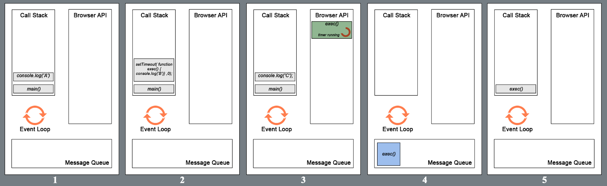

# Concurrency model and Event Loop


## Call stack
1. JavaScript has a single call stack in which it keeps track of what function
we’re currently executing and what function is to be executed after that. 因为只
有一个调用栈所以是单线程？
2. 每一个函数调用都会在往调用栈内 push 一个 frame
    ```js
    function foo(b) {
      var a = 10;
      return a + b + 11;
    }

    function bar(x) {
      var y = 3;
      return foo(x * y);
    }

    console.log(bar(7)); // returns 42
    ```
3. When calling `bar`, a first frame is created containing `bar`'s arguments and
 local variables.
4. When `bar` calls `foo`, a second frame is created and pushed on top of the
first one containing `foo`'s arguments and local variables.
5. When `foo` returns, the top frame element is popped out of the stack (leaving
 only `bar`'s call frame).
6. When `bar` returns, the stack is empty.

**Heap**:
Objects are allocated in a heap which is just a name to denote a large mostly
unstructured region of memory.（日文：オブジェクトはヒープに割り当てられています。
ヒープは、メモリの大規模で大部分は構造化されていない領域を意味する名前です。）


## JS 既然是单线程，为什么可以执行异步操作？
之前也偶尔想过这个问题，因为很明显，异步操作显然是两个操作在同时执行。  
The short answer is that JavaScript language is single-threaded and the
asynchronous behaviour is not part of the JavaScript language itself, rather
they are built on top of the core JavaScript language in the browser (or the
programming environment) and accessed through the browser APIs.

### Basic Architecture

1. 异步操作其实都不是 JS 本身执行的，而是执行环境（例如浏览器）执行的。
2. 执行环境提供给 JS 一些异步操作 API，JS 调用这些 API 并传入回调函数。
3. 浏览器帮助 JS 执行这些异步操作，执行完成后，把相应的回调函数加入到下面讲到的 Event
Table，等待被 JS 执行。


## Event Table and Event Queue
在没有异步操作的情况下，JS 就会按照上面 `Stack` 说明中的方式，不断的线性执行，直到程序
结束。但如果程序中执行了一个异步操作，就会涉及到另外两个数据结构：Event Table and
Event Queue。（似乎这两者合起来统称 Message Queue）

### Event Table
1. This is a data structure which knows that a certain function should be
triggered after a certain event.
2. Once that event occurs (timeout, click, mouse move) it sends a notice.
3. Bear in mind that the Event Table does not execute functions and does not
add them to the call stack on it’s own. It’s sole purpose is to keep track of
events and send them to the Event Queue.  
看起来是在 Event Table 注册异步操作和其对应的回调。

### Event Queue
1. The Event Queue is a data structure similar to the stack — again you add
items to the back but can only remove them from the front.
2. It kind of stores the correct order in which the functions should be executed.
3. It receives the function calls from the Event Table, but it needs to somehow
send them to the Call Stack? This is where the Event Loop comes in.


## Event loop
1. Event loop is a constantly running process that checks if the call stack is
empty.
2. Imagine it like a clock and every time it *ticks* it looks at the call stack
and if it is empty it looks into the Event Queue. If there is something in the
event queue that is waiting it is moved to the call stack. If not, then nothing
happens.

### 一个事件循环流程
```js
function main(){
    console.log('A');
    setTimeout(
        function display(){ console.log('B'); }
    ,0);
	console.log('C');
}
main();
```
  
可以看 [视频演示]([Philip Roberts: What the heck is the event loop anyway? | JSConf EU](https://www.youtube.com/watch?v=8aGhZQkoFbQ)

### `main()` 以及 `setTimeout` 的回调总是最后执行
如下代码，`timeout` 是最后被打印出来的
```js
setTimeout(function(){
    console.log('timeout');
}, 0);

for(let i=0; i<999; i++){
    console.log('loop');
}

console.log('end');
```
1. 上面说到，event loop 机制会一直检查调用栈，如果调用栈清空了，就把 Event Queue 里面
的函数加入到调用栈开始执行。
2. 那么你可能会这样分析上面代码：
    1. JS 调用了浏览器的 `setTimeout` 接口，告诉浏览器立刻（0毫秒）把
     `console.log('timeout')` 加入 Event Table。
    2. `setTimeout` 执行完后，她就会被 pop 出调用栈，现在看起来没有函数在运行了，所以
    调用栈空了。
    3. 因此 Event Table 会把 `console.log('timeout')` 加入 Event Queue，紧接着
    Event Queue 把该函数推入调用栈，打印出 `'timeout'`。
3. 但显然分析结果与事实不符。`console.log('timeout')` 不但没有立刻被调用，它在漫长的
`for` 循环里也没有机会插队，甚至在`for` 循环结束后仍然没有被推入调用栈。直到最后的
`console.log('end')` 执行完，`console.log('timeout')` 才被推入栈中执行。
4. 也就是说，直到最后的 `console.log('end')` 执行完，调用栈才彻底空了。之前栈底一直有
什么函数一直没有被返回。
5. 虽然以前可能没注意，但在追踪调用栈的时候，确实是会看到这个函数的：
    ```js
    function foo(){
        console.trace()
    }
    foo();
    ```
    打印的结果是：
    ```shell
    console.trace
    foo @ test.html:30
    (anonymous) @ test.html:32
    ```
6. 就是最后那个匿名函数。现在不明白它的机制，但它总是作为整个执行环境的最外层被调用。在
[这个视频](https://www.youtube.com/watch?v=8aGhZQkoFbQ)里，这个匿名函数被写为了
`main`。因为它是在整个执行环境的最外层，而不是某个函数的最外层，所以即使异步操作是在函
数内部，回调也不会在函数返回后执行，而是仍然要等到其他代码执行完：
    ```js
    function foo(){
        setTimeout(function(){
            console.log('timeout'); // 仍然是在最后被打印，而不是在 out 之前
        }, 0);

        for(let i=0; i<999; i++){
            console.log('loop');
        }

        console.log('end');
    }

    foo();
    console.log('out');
    ```
7. 这也是为什么，为了防止过量递归造成栈溢出时，可以把每次重复的操作作为 `setTimeout`
的 0ms 回调。因为这样重复操作会等到调用栈清空时才被执行。


## Several runtimes communicating together
1. A web worker or a cross-origin iframe has its own stack, heap, and message
queue.
2. Two distinct runtimes can only communicate through sending messages via the
`postMessage` method.


## References
* [MDN](https://developer.mozilla.org/en-US/docs/Web/JavaScript/EventLoop)
* [JavaScript Event Loop Explained](https://medium.com/front-end-hacking/javascript-event-loop-explained-4cd26af121d4)
* [Understanding JS: The Event Loop](https://hackernoon.com/understanding-js-the-event-loop-959beae3ac40)
* [Philip Roberts: What the heck is the event loop anyway? | JSConf EU](https://www.youtube.com/watch?v=8aGhZQkoFbQ)
