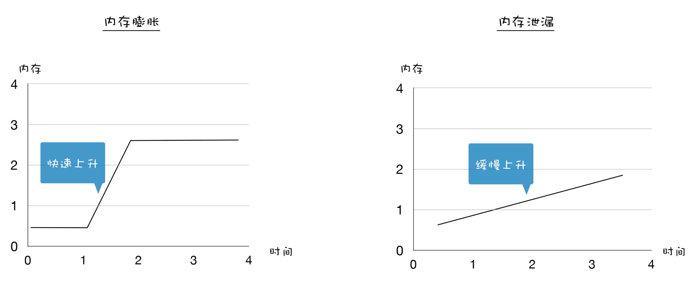

# Memory Leaks


<!-- TOC -->

- [Memory Leaks](#memory-leaks)
    - [泄漏原理](#泄漏原理)
    - [可能造成内存泄露的场景](#可能造成内存泄露的场景)
    - [意外的全局变量](#意外的全局变量)
    - [过多过大的闭包](#过多过大的闭包)
    - [过大的缓存](#过大的缓存)
    - [其他的内存不良使用情况](#其他的内存不良使用情况)
        - [内存膨胀](#内存膨胀)
        - [频繁的垃圾回收](#频繁的垃圾回收)
    - [References](#references)

<!-- /TOC -->


## 泄漏原理
1. 根据标记-清除垃圾回收算法，不会被回收的内存是那些保存的对象仍然可访问的。
2. 因此内存泄漏的情况就是那些，虽然程序员以为用不上了、但是还能被访问到的数据。
3. 或者是可以进行空间优化但没有进行的情况。


## 可能造成内存泄露的场景
* 意外的全局变量
* 过大过多的闭包
* 过大的缓存


## 意外的全局变量
1. 如果不使用严格模式，函数内部不使用 `var`/`let`/`const` 声明的变量和 `this` 都会成为全局变量，全局变量的内存不会被回收。
2. 如果必须要使用全局变量保存数据，确保在使用完后手动清空。


## 过多过大的闭包
1. 考虑下面的代码
    ```js
    function foo(){  
        let arr = new Array(10000000)
        return function(){}
    }

    let bar = foo();
    ```
2. 即使返回的函数根本没有引用 `arr`，但是闭包的特性就是会保留外层函数的环境，包括它内部的所有数据。所以只要 `foo()` 返回的函数还能被访问到，例如被 `bar` 引用，那么那个大数组就会一直存在。
3. 所以如果要使用过多过大的闭包时，应该在使用结束后释放掉引用。例如
    ```js
    bar = null;
    ```


## 过大的缓存
缓存为了起效就不能随便删除，如果不给缓存设置一个上限容量的话，可能就会持续增大。


## 其他的内存不良使用情况
### 内存膨胀
1. **内存膨胀**（Memory bloat）和内存泄漏有一些差异，内存膨胀主要表现在程序员对内存管理的不科学，比如只需要 50M 内存就可以搞定的，有些程序员却花费了 500M 内存。
2. 额外使用过多的内存有可能是没有充分地利用好缓存，也有可能加载了一些不必要的资源。通常表现为内存在某一段时间内快速增长，然后达到一个平稳的峰值继续运行。比如一次性加载了大量的资源，内存会快速达到一个峰值。
3. 内存膨胀和内存泄漏的关系可以参看下图
    
4. 要避免内存膨胀，我们需要合理规划项目，充分利用缓存等技术来减轻项目中不必要的内存占用。

### 频繁的垃圾回收
1. 除了内存泄漏和内存膨胀，还有另外一类内存问题，那就是频繁使用大的临时变量，导致了新生代空间很快被装满，从而频繁触发垃圾回收。
2. 频繁的垃圾回收操作会让你感觉到页面卡顿。比如下面这段代码
    ```js

    function strToArray(str) {
        let i = 0
        const len = str.length
        let arr = new Uint16Array(str.length)
        for (; i < len; ++i) {
            arr[i] = str.charCodeAt(i)
        }
        return arr;
    }

    function foo() {
        let i = 0
        let str = 'test V8 GC'
        while (i++ < 1e5) {
            strToArray(str);
        }
    }

    foo()
    ```
3. 这段代码就会频繁创建临时变量，这种方式很快就会造成新生代内存内装满，从而频繁触发垃圾回收。
4. 为了解决频繁的垃圾回收的问题，你可以考虑将这些临时变量设置为全局变量。


## References
* [图解 Google V8](https://time.geekbang.org/column/intro/296)
* [Beware of the closure memory leak in Javascript](https://heichwald.github.io/2016/01/10/memory-leak-closure-javascript.html)
* [4 Types of Memory Leaks in JavaScript and How to Get Rid Of Them](https://auth0.com/blog/four-types-of-leaks-in-your-javascript-code-and-how-to-get-rid-of-them/)
* [Manual memory management](https://en.wikipedia.org/wiki/Manual_memory_management)
* [An interesting kind of JavaScript memory leak](https://blog.meteor.com/an-interesting-kind-of-javascript-memory-leak-8b47d2e7f156)