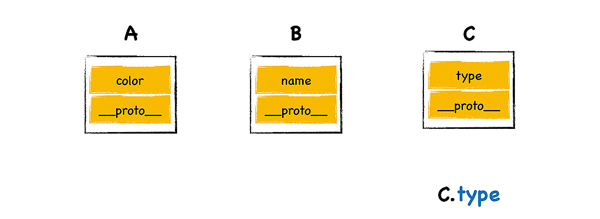
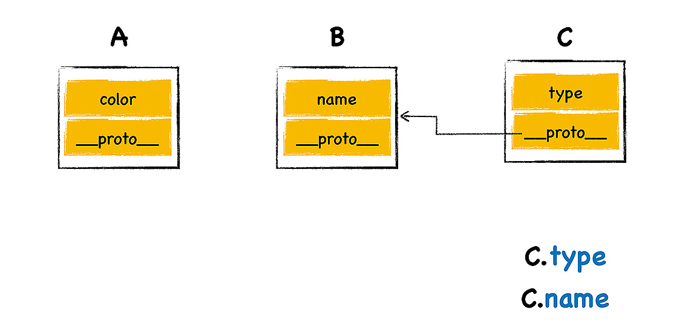
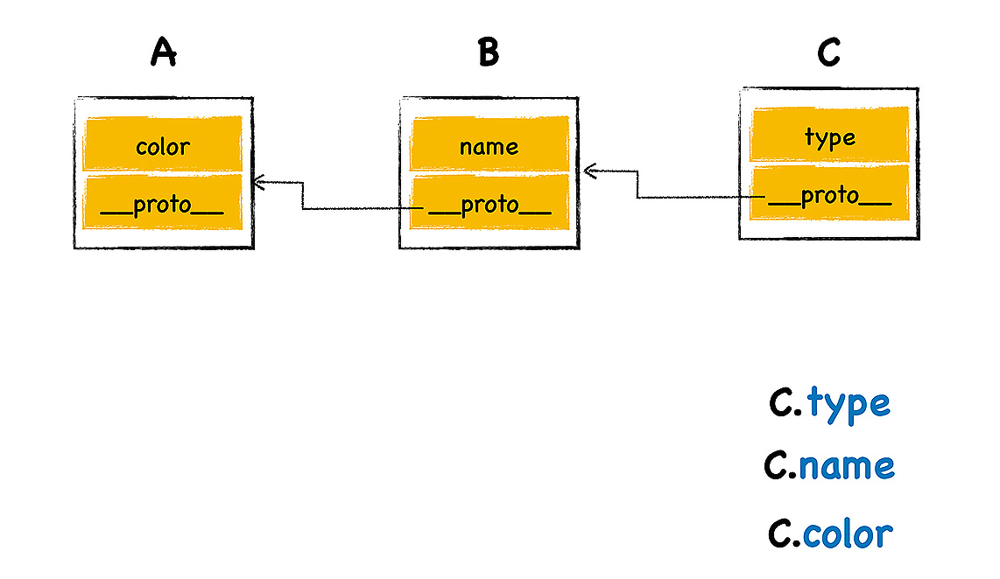

# Inheritance

<!-- TOC -->

- [Inheritance](#inheritance)
    - [两种继承的类型](#两种继承的类型)
    - [原型继承的实现原理](#原型继承的实现原理)
    - [References](#references)

<!-- /TOC -->

## 两种继承的类型
1. 简单地理解，继承就是一个对象可以访问另外一个对象中的属性和方法。
2. 不同的语言实现继承的方式是不同的，其中最典型的两种方式是 **基于类** 的设计和 **基于原型继承** 的设计。
3. C++、Java、C# 这些语言都是基于经典的类继承的设计模式，这种模式最大的特点就是提供了非常复杂的规则，并提供了非常多的关键字，诸如 `class`、`friend`、`protected`、`private`、`interface` 等，通过组合使用这些关键字，就可以实现继承。使用基于类的继承时，如果业务复杂，那么你需要创建大量的对象，然后需要维护非常复杂的继承关系，这会导致代码过度复杂和臃肿，另外引入了这么多关键字也给设计带来了更大的复杂度。
4. 而 JavaScript 的继承方式和其他面向对象的继承方式有着很大差别，JavaScript 本身不提供一个 class 实现。虽然标准委员会在 ES2015/ES6 中引入了 `class` 关键字，但那只是语法糖，JavaScript 的继承依然和基于类的继承没有一点关系。JavaScript 仅仅在对象中引入了一个 **原型的属性**，就实现了语言的继承机制，基于原型的继承省去了很多基于类继承时的繁文缛节，简洁而优美。

## 原型继承的实现原理
1. 参看下图
    
2. 有一个对象 C，它包含了一个属性 `type`，那么对象 C 是可以直接访问它自己的属性 `type` 的，但是怎样让 C 对象像访问自己的属性一样，访问 B 对象的属性呢？
3. JavaScript 的每个对象都包含了一个隐藏属性 `__proto__`，我们就把该隐藏属性 `__proto__` 称之为该 **对象的原型** (prototype);`__proto__` 指向了内存中的另外一个对象，我们就把 `__proto__` 指向的对象称为该对象的原型对象，那么该对象就可以直接访问其原型对象的方法或者属性。
4. 比如我让 C 对象的原型指向 B 对象，那么便可以利用 C 对象来直接访问 B 对象中的属性或者方法了，最终的效果如下图所示：
    
5. 当 C 对象将它的 `__proto__` 属性指向了 B 对象后，那么通过对象 C 来访问对象 B 中的 `name` 属性时，引擎会先从对象 C 中查找，但是并没有查找到，接下来引擎继续在其原型对象 B 中查找，因为对象 B 中包含了 `name` 属性，那么 V8 就直接返回对象 B 中的 `name` 属性值，虽然 C 和 B 是两个不同的对象，但是使用的时候，B 的属性看上去就像是 C 的属性一样。
6. 同样的方式，B 也是一个对象，它也有自己的 `__proto__` 属性，比如它的属性指向了内存中另外一块对象 A
        
7. 我们使用 `C.name` 和 `C.color` 时，给人的感觉属性 `name` 和 `color` 都是对象 C 本身的属性，但实际上这些属性都是位于原型对象上，我们把这个查找属性的路径称为 **原型链**，它像一个链条一样，将几个原型链接了起来。
8. 我们再来回顾下继承的概念：继承就是一个对象可以访问另外一个对象中的属性和方法，在 JavaScript 中，我们通过原型和原型链的方式来实现了继承特性。
9. 使用构造函数创建对象时，每个实例的 `__proto__` 都会指向构造函数的 `prototype` 属性，所以所有实例的原型对象都是构造函数的 `prototype` 指向的对象。因此在实现继承时，子类共享的原型属性就应该设置在构造函数 `prototype` 属性指向的对象上。

## References
* [图解 Google V8](https://time.geekbang.org/column/intro/296)