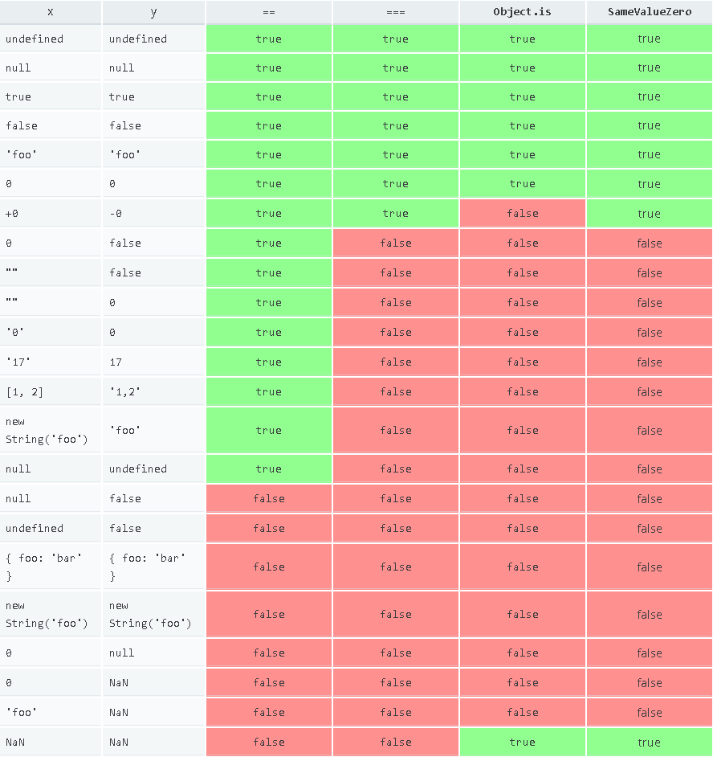

# Equality Algorithms


<!-- TOC -->

- [Equality Algorithms](#equality-algorithms)
    - [ES2015 中的四种相等算法](#es2015-中的四种相等算法)
    - [JavaScript 的三种具体的相等比较操作](#javascript-的三种具体的相等比较操作)
    - [详细解释](#详细解释)
        - [Strict equality using `===`](#strict-equality-using-)
    - [Loose equality using `==`](#loose-equality-using-)
        - [Same-value equality](#same-value-equality)
        - [Same-value-zero equality](#same-value-zero-equality)
    - [示例](#示例)
    - [References](#references)

<!-- /TOC -->


## ES2015 中的四种相等算法
算法 | 实现和描述
--|--
Abstract Equality Comparison | `==`
Strict Equality Comparison | `===`、`Array.prototype.indexOf` 比对、 `Array.prototype.lastIndexOf` 比对和 `switch...case` 比对
Same-value-zero | used by `%TypedArray%` and `ArrayBuffer` constructors, as well as `Map` and `Set` operations, and up-coming `String.prototype.includes` and `Array.prototype.includes` in ES2016
Same-value | 其他地方。包括 `Object.is`。


## JavaScript 的三种具体的相等比较操作
* strict equality: `===`
* loose equality: `==`
* Same-value: `Object.is`


## 详细解释
### Strict equality using `===`
1. Strict equality is almost always the correct comparison operation to use.
2. For all values except numbers, it uses the obvious semantics: a value is only equal to itself.
3. 虽然 ECMAScript 的数字使用 IEEE 754 的浮点数标准，因此有 `0` 和 `-0` 的区分，但 ECMAScript 的标准规定 `0 === -0` 为 `true`。
4.  `NaN` 不等于 `NaN` 看起来就是，`NaN` 并不是计算的结果，而是计算发生错误的提示。所以如果你两个计算都发生了错误，那最多说它们都是错的，但不能说它们是相等的。但是，也不能说他们是不相等的，值为只有在算对的情况下才可说比较是否相等。所以任何涉及 `NaN` 的操作都会返回 `NaN` 也是很合理的，因为如果返回其他结果，那错误就被掩盖了。但 `Object.is` 和 `===` 分别返回 `true` 和 `false`，就不合理了。感觉出现 `NaN` 的情况应该改为直接抛出错误。不懂，有待深入

## Loose equality using `==`
1. It is pretty much never a good idea to use loose equality.
2. The result of a comparison using strict equality is easier to predict, and as no type coercion takes place the evaluation may be faster.
3. 三个有特殊值参与的相等：
    ```js
    console.log(false == 0); // true
    console.log(false == ''); // true
    console.log(null == undefined); // true
    ```

### Same-value equality
1. Same-value equality addresses a final use case: determining whether two values are functionally identical in all contexts.
2. Same-value equality is provided by the `Object.is` method.

### Same-value-zero equality
Similar to same-value equality, but considered `+0` and `-0` equal.


## 示例


```js
let arr = [NaN, -0];
console.log(Object.is(arr[0], NaN)); // true
console.log(Object.is(arr[1], 0)); // false
console.log(arr.includes(NaN)); // true
console.log(arr.includes(0)); // true

console.log( Object.is(NaN, NaN) ); // true
console.log( NaN === NaN );         // false

console.log( Object.is(0, -0) ); // false
console.log( 0 === -0 );         // true
```


## References
* [MDN](https://developer.mozilla.org/en-US/docs/Web/JavaScript/Equality_comparisons_and_sameness)
* [stackoverflow](https://stackoverflow.com/questions/10034149/why-is-nan-not-equal-to-nan)
