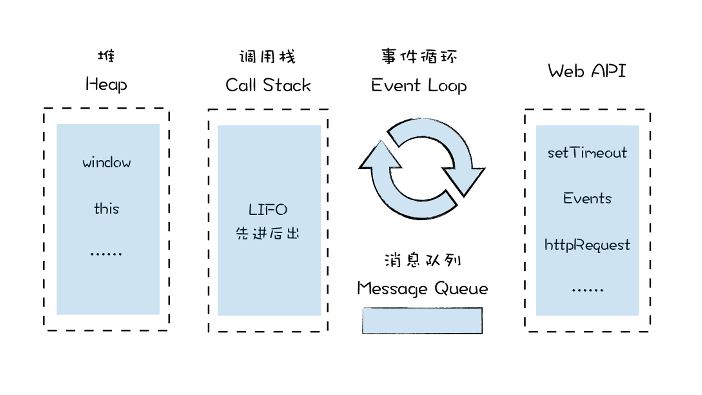
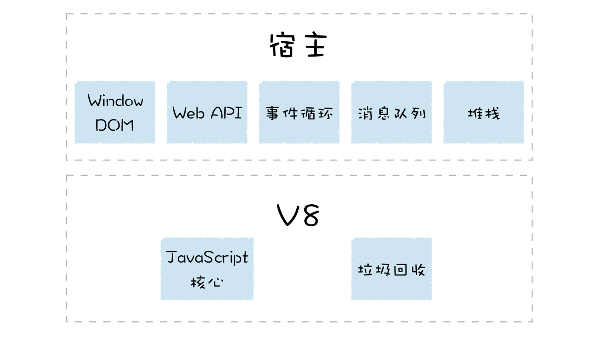

# Runtime Environment （以 V8 讲解）


<!-- TOC -->

- [Runtime Environment （以 V8 讲解）](#runtime-environment-以-v8-讲解)
    - [概述](#概述)
    - [宿主环境](#宿主环境)
    - [构造数据存储空间：堆空间和栈空间](#构造数据存储空间堆空间和栈空间)
    - [全局执行上下文和全局作用域](#全局执行上下文和全局作用域)
    - [构造事件循环系统](#构造事件循环系统)
    - [References](#references)

<!-- /TOC -->


## 概述
1. 当你想执行一段 JavaScript 代码时，只需要将代码丢给 V8 虚拟机，V8 便会执行并返回给你结果。
2. 其实在执行 JavaScript 代码之前，V8 就已经准备好了代码的运行时环境，这个环境包括了堆空间和栈空间、全局执行上下文、全局作用域、内置的内建函数、宿主环境提供的扩展函数和对象，还有消息循环系统
    
3. 准备好运行时环境之后，V8 才可以执行 JavaScript 代码，包括解析源码、生成字节码、解释执行或者编译执行这一系列操作。


## 宿主环境
1. 浏览器为 V8 提供基础的消息循环系统、全局变量、Web API，而 V8 的核心是实现了 ECMAScript 标准。
2. V8 只提供了 ECMAScript 定义的一些对象和一些核心的函数，这包括了 `Object`、`Function`、`String`。除此之外，V8 还提供了垃圾回收器、协程等基础内容，不过这些功能依然需要宿主环境的配合才能完整执行
    
3. 如果 V8 使用不当，比如不规范的代码触发了频繁的垃圾回收，或者某个函数执行时间过久，这些都会占用宿主环境的主线程，从而影响到程序的执行效率，甚至导致宿主环境的卡死。
4. 好了，现在我们知道，要执行 V8，则需要有一个宿主环境，宿主环境可以是浏览器中的渲染进程，可以是 Node.js 进程, 也可以是其他的定制开发的环境，而这些宿主则提供了很多 V8 执行 JavaScript 时所需的基础功能部件，接下来我们就来一一分析下这些部件。


## 构造数据存储空间：堆空间和栈空间
1. 由于 V8 是寄生在浏览器或者 Node.js 这些宿主中的，因此，V8 也是被这些宿主启动的。比如，在 Chrome 中，只要打开一个渲染进程，渲染进程便会初始化 V8，同时初始化堆空间和栈空间。
2. 栈空间主要是用来管理 JavaScript 函数调用的，栈是内存中 **连续的** 一块空间，同时栈结构是 “先进后出” 的策略。
3. 在函数调用过程中，涉及到上下文相关的内容都会存放在栈上，比如基础类型、引用到的对象的地址、函数的执行状态、`this` 值等都会存在在栈上。
4. 当一个函数执行结束，那么该函数的执行上下文便会被销毁掉。
5. 栈空间的最大的特点是空间连续，所以在栈中每个元素的地址都是固定的，因此栈空间的查找效率非常高。
6. 但是通常在内存中，很难分配到一块很大的连续空间，因此，V8 对栈空间的大小做了限制，如果函数调用层过深，那么 V8 就有可能抛出栈溢出的错误。
7. 堆空间是一种树形的存储结构，用来存储引用类型的离散的数据，诸如函数、数组，在浏览器中还有 `window` 对象、`document` 对象等，这些都是存在堆空间的。
8. 宿主在启动 V8 的过程中，会同时创建堆空间和栈空间，再继续往下执行，产生的新数据都会存放在这两个空间中。


## 全局执行上下文和全局作用域
1. V8 初始化了基础的存储空间之后，接下来就需要初始化全局 **执行上下文** 和全局作用域了，这两个内容是 V8 执行后续流程的基础。
2. 当 V8 开始执行一段可执行代码时，会生成一个执行上下文。V8 用执行上下文来维护执行当前代码所需要的变量声明、`this `指向等。执行上下文中主要包含三部分，变量环境、词法环境和 `this` 关键字
    
3. 比如在浏览器的环境中，全局执行上下文中就包括了 `window` 对象，还有默认指向 `window` 的 `this` 关键字，另外还有一些 Web API 函数，诸如 `setTimeout`、`XMLHttpRequest` 等内容。而词法环境中，则包含了使用 `let`、`const` 等变量的内容。
4. 全局执行上下文在 V8 的生存周期内是不会被销毁的，它会一直保存在堆中，这样当下次在需要使用函数或者全局变量时，就不需要重新创建了。5. 另外，当你执行了一段全局代码时，如果全局代码中有声明的函数或者定义的变量，那么函数对象和声明的变量都会被添加到全局执行上下文中。比如下面这段代码：
    ```js
    var x = 1
    function show_x(){
        console.log(x)
    }
    ```
    V8 在执行这段代码的过程中，会在全局执行上下文中添加变量 `x` 和函数 `show_x`。
5. 还有一点需要注意下，就是全局作用域和全局执行上下文的关系。比如在 ES6 中，同一个全局执行上下文中，可能存在多个作用域。下面这段代码：
    ```js
    var x = 5
    {
        let y = 2
        const z = 3
    }
    ```
    这段代码在执行时，就会有两个对应的作用域，一个是全局作用域，另外一个是括号内部的作用域，但是这些内容都会保存到全局执行上下文中。
6. 当 V8 调用了一个函数时，就会进入函数的执行上下文，这时候全局执行上下文和当前的函数执行上下文就形成了一个栈结构。比如执行下面这段代码
    ```js
    var x = 1
    function show_x(){
        console.log(x)
    }
    function bar(){
        show_x()
    }
    bar()
    ```
    当执行到 show_x 的时候，其栈状态如下图所示
    
7. 全局执行上下文和函数的执行上下文生命周期是不同的。函数执行上下文在函数执行结束之后，就会被销毁；而全局执行上下文则和 V8 的生命周期是一致的。所以在实际项目中，如果不经常使用的变量或者数据，最好不要放到全局执行上下文中。


## 构造事件循环系统
1. 有了堆空间和栈空间，生成了全局执行上下文和全局作用域，接下来就可以执行 JavaScript 代码了吗？答案是不行，因为 V8 还需要有一个主线程，用来执行 JavaScript 和执行垃圾回收等工作。
2. V8 是寄生在宿主环境中的，它并没有自己的主线程，而是使用宿主所提供的主线程，V8 所执行的代码都是在宿主的主线程上执行的。
3. 只有一个主线程依然不行，因为如果你开启一个线程，在该线程执行一段代码，那么当该线程执行完这段代码之后，就会自动退出了，执行过程中的一些栈上的数据也随之被销毁，下次再执行另外一个段代码时，你还需要重新启动一个线程，重新初始化栈数据，这会严重影响到程序执行时的性能。
4. 为了在执行完代码之后，让线程继续运行，通常的做法是在代码中添加一个循环语句，在循环语句中监听下个事件，比如你要执行另外一个语句，那么激活该循环就可以执行了。比如下面的模拟代码
    ```js
    while(1){
        Task task = GetNewTask()；
        RunTask(task)；
    }
    ```
    这段代码使用了一个循环，不断地获取新的任务，一旦有新的任务，便立即执行该任务。
5. 如果主线程正在执行一个任务，这时候又来了一个新任务，比如 V8 正在操作 DOM，这时候浏览器的网络线程完成了一个页面下载的任务，而且 V8 注册监听下载完成的事件，那么这种情况下就需要引入一个 **消息队列**，让下载完成的事件暂存到消息队列中，等当前的任务执行结束之后，再从消息队列中取出正在排队的任务。
6. 当执行完一个任务之后，我们的事件循环系统会重复这个过程，继续从消息队列中取出并执行下个任务。


## References
* [图解 Google V8](https://time.geekbang.org/column/intro/296)