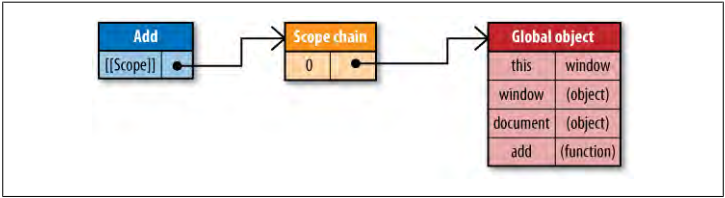
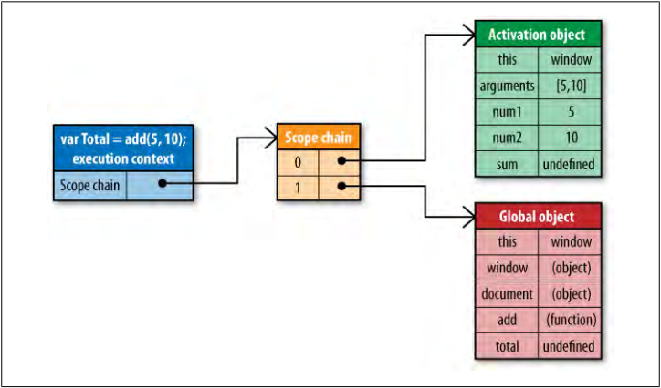

# 和作用域相关的四个概念

* variable object
* scope chain
* execution context
* activation object 


## 变量对象和作用域链
1. Every function in JavaScript is represented as an object—more specifically, as an instance of Function. 
2. Function objects have properties just like any other object, and these include both the properties that you can access programmatically and a series of internal properties that are used by the JavaScript engine but are not accessible through code. One of these properties is `[[Scope]]`, as defined by ECMA-262, Third Edition.
3. The internal `[[Scope]]` property contains a collection of objects representing the scope
in which the function was created. This collection is called the function’s scope chain
and it determines the data that a function can access. 可以看到，内部属性`[[Scope]]`本来就是指向链式结构的，即作用域链。
4. Each object in the function’s scope chain is called a *variable object*, and each of these contains entries for variables in the form of key-value pairs. 作为作用域链上面的每一节，其实体就是一个变量对象
5. When a function is created（注意是创建而不是调用，词法作用域）, its scope chain is populated with objects representing the data that is accessible in the scope in which the function was created. 
创建一个函数时，就会有若干个变量对象来组成该函数的作用域链，这些变量对象决定了该函数所在的作用域可以访问哪些数据。一个函数有一个内部属性`[[Scope]]`，该属性指向一系列有变量对象组成的链状结构，这个结构又被称为作用域链。
6. For example, consider the following global function:
    ```js
    function add(num1, num2){
        var sum = num1 + num2;
        return sum;
    }
    ```
7. When the `add()` function is created, its scope chain is populated with a single variable
object: the global object representing all of the variables that are globally defined. This
global object contains entries for `window`, `navigator`, and `document`, to name a few. 注意这里的作用域链是不包括函数内部作用域的，因为函数还没有执行。
    
8. The `add` function’s scope chain is later used when the function is executed. Suppose that the following code is executed:
    ```js
    var total = add(5, 10);
    ```


## 执行环境和活动对象
1. Executing the `add` function triggers the creation of an internal object called an *execution
context*. 执行环境是在函数执行时创建的。
2. An execution context defines the environment in which a function is being executed. 
3. Each execution context is unique to one particular execution of the function, and so multiple calls to the same function result in multiple execution contexts being created. 比如参数的变量声明的是创建函数时就进行的，它是变量对象里面的属性，不管函数在哪里被调用多少次，其变量对象上的参数属性都是不变的。但是每次调用时，都会新创建一个新的执行环境，在每个执行环境里都可能会有不同的值赋给这个参数。
4. The execution context is destroyed once the function has been completely executed.
5. An execution context has its own scope chain that is used for identifier resolution. When the execution context is created, its scope chain is initialized with the objects contained in the executing function’s [[Scope]] property. 每次函数调用都会创建新的执行环境，用来变量解析。但每个新的执行环境都是统一的使用该函数的变量对象们（即作用域链）来初始化的。
6. These values are copied over into the execution context scope chain in the order in which they appear in the function.
7. Once this is complete, a new object called the *activation object* is created for the execution context. The activation object acts as the variable object for this execution and contains entries for all local variables, named arguments, the `arguments` collection, and `this`. 
8. This object is then pushed to the front of the scope chain.上面说到执行环境的作用域链是用函数创建时的作用域链初始化的，而创建时的作用域链是不包括函数自身作用域的。这里在执行时会再创建一个表示函数内部作用域的变量对象，即活动对象。该对象被添加到执行环境的作用域最前端，因此执行环境的作用域链相比于创建时的作用域链就多了一个变量对象，即表示当前函数内部作用域的活动对象。
    

9.  When the execution context is destroyed, so is the activation object. 
10. Each time a variable is encountered during the function’s execution, the process of identifier resolution takes place to determine where to retrieve or store the data. During this process, the execution context’s scope chain is searched for an identifier with the same name. 
11. The search begins at the front of the scope chain, in the execution function’s activation object. 
12. If found, the variable with the specified identifier is used; if not, the search continues on to the next object in the scope chain. This process continues until either the identifier is found or there are no more variable objects to search, in which case the identifier is deemed to be `undefined`. 


## References
* [*High Performance JavaScript* Chapter 2](https://book.douban.com/subject/4183808/)