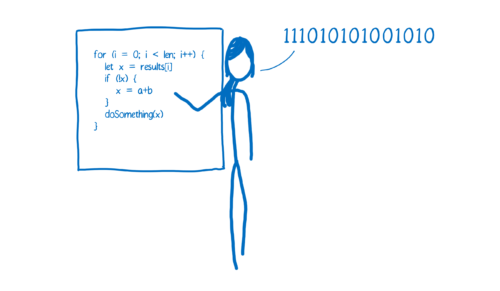
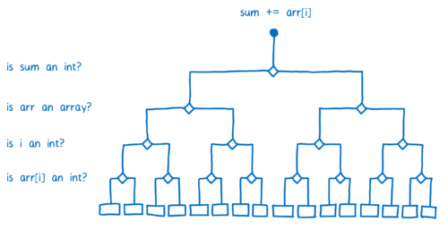

# Just-In-Time (JIT) compilation


## Interpreter and Compiler
In programming, there are generally two ways of translating to machine language. You can use an interpreter or a compiler.

### Interpreter
1. With an interpreter, this translation happens pretty much line-by-line, on the fly.  

    
2. Interpreters are quick to get up and running. You don’t have to go through that whole compilation step before you can start running your code. You just start translating that first line and running it.
3. Because of this, an interpreter seems like a natural fit for something like JavaScript. It’s important for a web developer to be able to get going and run their code quickly.
4. And that’s why browsers used JavaScript interpreters in the beginning.
5. But the con of using an interpreter comes when you’re running the same code more than once. For example, if you’re in a loop. Then you have to do the same translation over and over and over again.

### Compiler
1. A compiler on the other hand doesn’t translate on the fly. It works ahead of time to create that translation and write it down.  

  
2. It takes a little bit more time to start up because it has to go through that compilation step at the beginning. But then code in loops runs faster, because it doesn’t need to repeat the translation for each pass through that loop.
3. Another difference is that the compiler has more time to look at the code and make edits to it so that it will run faster. These edits are called optimizations.
4. The interpreter is doing its work during runtime, so it can’t take much time during the translation phase to figure out these optimizations.


## Just-in-time compilers: the best of both worlds
1. As a way of getting rid of the interpreter’s inefficiency—where the interpreter has to keep retranslating the code every time they go through the loop—browsers started mixing compilers in.
2. Different browsers do this in slightly different ways, but the basic idea is the same. They added a new part to the JavaScript engine, called a monitor (aka a profiler). That monitor watches the code as it runs, and makes a note of how many times it is run and what types are used.
3. At first, the monitor just runs everything through the interpreter.
4. If the same lines of code are run a few times, that segment of code is called warm. If it’s run a lot, then it’s called hot.

### Baseline compiler
1. When a function starts getting warm, the JIT will send it off to be compiled. Then it will store that compilation.
2. Each line of the function is compiled to a “stub”. The stubs are indexed by line number and variable type. If the monitor sees that execution is hitting the same code again with the same variable types, it will just pull out its compiled version.
3. That helps speed things up. But like I said, there’s more a compiler can do. It can take some time to figure out the most efficient way to do things… to make optimizations.
4. The baseline compiler will make some of these optimizations. It doesn’t want to take too much time, though, because it doesn’t want to hold up execution too long.
5. However, if the code is really hot—if it’s being run a whole bunch of times—then it’s worth taking the extra time to make more optimizations.

### Optimizing compiler
1. When a part of the code is very hot, the monitor will send it off to the optimizing compiler. This will create another, even faster, version of the function that will also be stored.
2. In order to make a faster version of the code, the optimizing compiler has to **make some assumptions**.
3. For example, if it can assume that all objects created by a particular constructor have the same shape—that is, that they always have the same property names, and that those properties were added in the same order— then it can cut some corners based on that.
4. The optimizing compiler uses the information the monitor has gathered by watching code execution to make these judgments. If something has been true for all previous passes through a loop, it assumes it will continue to be true.
5. But of course with JavaScript, there are never any guarantees. You could have 99 objects that all have the same shape, but then the 100th might be missing a property.
6. So the compiled code needs to check before it runs to see whether the assumptions are valid. If they are, then the compiled code runs. But if not, the JIT assumes that it made the wrong assumptions and trashes the optimized code.
7. Then execution goes back to the interpreter or baseline compiled version. This process is called deoptimization (or bailing out).
8. Usually optimizing compilers make code faster, but sometimes they can cause unexpected performance problems. If you have code that keeps getting optimized and then deoptimized, it ends up being slower than just executing the baseline compiled version.
9. Most browsers have added limits to break out of these optimization/deoptimization cycles when they happen. If the JIT has made more than, say, 10 attempts at optimizing and keeps having to throw it out, it will just stop trying.


## An example optimization: Type specialization
1. There are a lot of different kinds of optimizations, but I want to take a look at one type so you can get a feel for how optimization happens. One of the biggest wins in optimizing compilers comes from something called type specialization.
2. The dynamic type system that JavaScript uses requires a little bit of extra work at runtime. For example, consider this code:
  ```js
  function arraySum(arr) {
    var sum = 0;
    for (var i = 0; i < arr.length; i++) {
      sum += arr[i];
    }
  }
  ```
3. The `+=` step in the loop may seem simple. It may seem like you can compute this in one step, but because of dynamic typing, it takes more steps than you would expect.
4. Let’s assume that `arr` is an array of 100 integers. Once the code warms up, the baseline compiler will create a stub for each operation in the function. So there will be a stub for `sum += arr[i]`, which will handle the `+=` operation as integer addition.
5. However, `sum` and `arr[i]` aren’t guaranteed to be integers. Because types are dynamic in JavaScript, there’s a chance that in a later iteration of the loop, `arr[i]` will be a string. Integer addition and string concatenation are two very different operations, so they would compile to very different machine code.
6. The way the JIT handles this is by compiling multiple baseline stubs. If a piece of code is monomorphic (that is, always called with the same types) it will get one stub. If it is polymorphic (called with different types from one pass through the code to another), then it will get a stub for each combination of types that has come through that operation.
7. This means that the JIT has to ask a lot of questions before it chooses a stub:  

  
8. Because each line of code has its own set of stubs in the baseline compiler, the JIT needs to keep checking the types each time the line of code is executed. So for each iteration through the loop, it will have to ask the same questions.
9. The code would execute a lot faster if the JIT didn’t need to repeat those checks. And that’s one of the things the optimizing compiler does.
10. In the optimizing compiler, the whole function is compiled together. The type checks are moved so that they happen before the loop.
11. Some JITs optimize this even further. For example, in Firefox there’s a special classification for arrays that only contain integers. If `arr` is one of these arrays, then the JIT doesn’t need to check if `arr[i]` is an integer. This means that the JIT can do all of the type checks before it enters the loop.


## Conclusion
1. That is the JIT in a nutshell. It makes JavaScript run faster by monitoring the code as it’s running it and sending hot code paths to be optimized. This has resulted in many-fold performance improvements for most JavaScript applications.
2. Even with these improvements, though, the performance of JavaScript can be unpredictable. And to make things faster, the JIT has added some overhead during runtime, including:
  * optimization and deoptimization
  * memory used for the monitor’s bookkeeping and recovery information for when bailouts happen
  * memory used to store baseline and optimized versions of a function
3. There’s room for improvement here: that overhead could be removed, making performance more predictable. And that’s one of the things that WebAssembly does.


## References
* [A crash course in just-in-time (JIT) compilers](https://hacks.mozilla.org/2017/02/a-crash-course-in-just-in-time-jit-compilers/)
