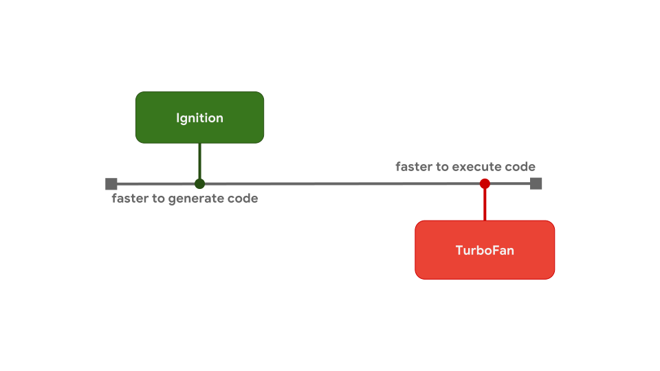

# Optimizing prototypes


<!-- TOC -->

- [Optimizing prototypes](#optimizing-prototypes)
    - [阅读基础](#阅读基础)
    - [设计思想](#设计思想)
        - [hot 操作缓存权衡](#hot-操作缓存权衡)
    - [Optimization tiers and execution trade-offs](#optimization-tiers-and-execution-trade-offs)
    - [Optimizing prototype property access](#optimizing-prototype-property-access)
        - [Classes and prototype-based programming](#classes-and-prototype-based-programming)
        - [Prototype property access](#prototype-property-access)
        - [Optimizing](#optimizing)
    - [Validity cells](#validity-cells)
    - [访问原型最佳实践](#访问原型最佳实践)
    - [References](#references)

<!-- /TOC -->


## 阅读基础
* [Hidden Class](../Object/HiddenClass.md)
* [Inline Caches](../Object/InlineCaches.md)


## 设计思想
### hot 操作缓存权衡
1. 让我想到在开发一个项目时，有时可能会需求紧急快速上线，所以上线的时候会存在架构不合理甚至较多 bug。
2. 但是在后期，项目使用的越来越多，就有必要对其中关键的部分进行优化。
3. 当然就像引擎的优化是并行的一样，项目的优化也一样是并行执行的，优化好之后再替换到正在使用的非优化的部分。
4. 而且就像引擎中在解释器和编译器还加入了中间的优化层一样，对项目的优化也常常不会一步到位，也存在中间部分优化的过程。

C 中一个结构体的所有实例都是相同的 shape


## Optimization tiers and execution trade-offs
1. Although the high-level pipeline is similar between engines, there are often differences in the optimization pipeline. 
2. Why is that? Why do some engines have more optimization tiers than others? It turns out there is a trade-off between quickly getting code to run, or taking some more time but eventually running the code with optimal performance.
    
3. An interpreter can produce bytecode quickly, but bytecode is generally not very efficient. An optimizing compiler on the other hand takes a little longer, but eventually produces much more efficient machine code.
4. This is exactly the model that V8 uses. V8’s interpreter is called Ignition, and it’s the fastest interpreter of all the engines (in terms of raw bytecode execution speed). V8’s optimizing compiler is named TurboFan, and it eventually generates highly-optimized machine code.
    
5. This trade-off between startup latency and execution speed is the reason why some JavaScript engines choose to add optimization tiers in between. For example, SpiderMonkey adds a Baseline tier in between the interpreter and their full IonMonkey optimizing compiler:
    
    （Chrome 91 的版本也加入了一个中间层）
6. The interpreter generates bytecode quickly, but the bytecode executes relatively slowly. Baseline takes a little longer to generate code, but it offers better run-time performance. And finally, the IonMonkey optimizing compiler takes the longest to produce machine code, but that code can run very efficiently.
7. Let’s take a look at a concrete example and see how the pipelines in the different engines deal with it. Here’s some code that gets repeated often, in a hot loop.
    ```js
    let result = 0;
    for (let i = 0; i < 4242424242; ++i) {
        result += i;
    }
    console.log(result);
    ```
8. V8 starts running the bytecode in the Ignition interpreter. At some point the engine determines that the code is hot and starts up the TurboFan frontend, which is the part of TurboFan that deals with integrating profiling data and constructing a basic machine representation of the code. This is then sent to the TurboFan optimizer on a different thread for further improvements
    
9. While the optimizer is running, V8 continues executing the bytecode in Ignition. At some point the optimizer is done and we have executable machine code, and the execution can continue with that.
10. 除了在启动速度和执行效率之间的权衡以外，还有内存使用方面的权衡。字节码很简洁，但是生成的机器码会有有很多代码量。所以如果不是反复执行，那编译成机器码占用更大的内存也是一种浪费。


## Optimizing prototype property access
1. Engines store the `Shape` of the object separately from the object’s values.
    
2. Shapes enable an optimization called `Inline Caches` or `ICs` for short. Combined, Shapes and ICs can speed up repeated property accesses from the same place in your code.
    

### Classes and prototype-based programming
1. Let’s zoom in on what happens behind the scenes when we create a new instance of `Bar` called `foo`
    ```js
    class Bar {
    	constructor(x) {
    		this.x = x;
    	}
    	getX() {
    		return this.x;
    	}
    }

    const foo = new Bar(true);
    ```
2. The instance created from running this code has a shape with a single property `x'`. The prototype of `foo` is the `Bar.prototype` that belongs to the class `Bar`.
3. This `Bar.prototype` has a shape of its own, containing a single property `'getX'` whose value is the function `getX` that just returns `this.x` when called
    
4. If you create another instance of the same class, both instances share the object shape, as we discussed earlier. Both instances point to the same `Bar.prototype` object
    

### Prototype property access
1. Ok, so now we know what happens when we define a class and we create a new instance. But what happens if we call a method on an instance, like we’re doing here
    ```js
    class Bar {
    	constructor(x) { this.x = x; }
    	getX() { return this.x; }
    }

    const foo = new Bar(true);
    const x = foo.getX();
    //        ^^^^^^^^^^
    ```
2. You can think of any method call as two individual steps:
    ```js
    const x = foo.getX();

    // is actually two steps:

    const $getX = foo.getX;
    const x = $getX.call(foo);
    ```
    Step 1 is to load the method, which is just a property on the prototype (whose value happens to be a function). Step 2 is to call the function with the instance as the `this` value.
3. Let’s walk through that first step, which is loading the method `getX` from the instance `foo`.
    
4. The engine starts at the `foo` instance and realizes there is no `'getX'` property on `foo`'s shape, so it has to walk up the prototype chain for it.
5. We get to `Bar.prototype`, look at its prototype shape, and see that it has the `'getX'` property at offset `0`.
6. We look up the value at this offset in `Bar.prototype` and find the JSFunction `getX` that we were looking for.

### Optimizing
1. Loading prototype properties is a very frequent operation: it happens every time you call a method!
2. Earlier, we discussed how engines optimize loading regular, own properties through the use of Shapes and Inline Caches. How can we optimize repeated loads of prototype properties on objects with similar shapes?
3. 就上面的例子来说，为了能实现重复的快速访问，我们必须确保一些东西没有被更改，这样才能使用缓存的结果而不是按照完整的步骤重新查询。具体来说，要进行下面三步检查：
    1. The shape of `foo` does not contain `'getX'` and did not change. 一旦 `foo` 的 shape 发生改变，我们就不确定这个改变是否是添加了实例的 `getX` 方法，所以必须要进行检查。This means no one altered the object `foo` by adding or deleting a property, or by changing one of the property attributes. 
    2. The prototype of `foo` is still the initial `Bar.prototype`. This means no one changed `foo`'s prototype by using `Object.setPrototypeOf()` or by assigning to the special `__proto__` property.
    3. The shape of `Bar.prototype` contains `'getX'` and did not change. This means no one altered the `Bar.prototype` by adding or deleting a property, or by changing one of the property attributes.
4. In the general case, that means we have to perform 1 check on the instance itself, plus 2 checks for each prototype up to the prototype which holds the property we’re looking for.
5. `1+2N` checks (where `N` is the number of prototypes involved) may not sound too bad for this case, because the prototype chain is relatively shallow — but engines often have to deal with much longer prototype chains, like in the case of common DOM classes.
6. For each object involved up until the prototype that carries the property, we need to do shape checks for absence. 
7. It’d be nice if we could reduce the number of checks by folding the prototype check into the absence check. And that’s essentially what engines do with a simple trick: instead of storing the prototype link on the instance itself, engines store it on the `Shape`
    
8. Each shape points to the prototype. This also means that every time the prototype of `foo` changes, the engine transitions to a new shape. 也就是说，现在实例对象本身不需要引用它的原型了，它的 shape 会自动引用最新的原型。也就是说，上面三步检查中的第二步实际上不需要了。
9. With this approach, we can reduce the number of checks required from `1+2N` to `1+N` for faster property access on prototypes. But that’s still quite expensive, since it’s still linear in the length of the prototype chain. 
10. Engines implement different tricks to further reduce this to a constant number of checks, especially for subsequent executions of the same property loads.


## Validity cells
1. V8 treats prototype shapes specially for this purpose. Each prototype has a unique shape that is not shared with any other objects (specifically not with other prototypes), and each of these prototype shapes has a special `ValidityCell` associated with it. **This `ValidityCell` is invalidated whenever someone changes the associated prototype or any prototype above it**.
    
2. To speed up subsequent loads from prototypes, V8 puts an Inline Cache in place, with four fields:
    
3. When warming up the inline cache during the first run of this code, V8 remembers:
    * the offset at which the property(`getX`) was found in the prototype.也就是 Inline Cache 最下面一行的 `Offset`;
    * the prototype on which the property was found (`Bar.prototype` in this example，Inline Cache 的第二行 `Prototype`)；
    * the shape of the instance (the shape of `foo` in this case，Inline Cache 的第三行 `Shape`)；也就是说这个 Inline Cache 是和实例对应的，而不是和原型；
    * and also the link to the current ValidityCell of the immediate prototype that is linked to from the instance shape (which also happens to be `Bar.prototype` in this case，Inline Cache 的第一行 `ValidityCell`).
4. The next time the Inline Cache is hit, the engine has to check the shape of the instance and the `ValidityCell`. If it’s still valid, the engine can reach out directly to the `Offset` on the `Prototype`, skipping the additional lookups.
5. When the prototype is changed, a new shape is allocated and the previous `ValidityCell` is invalidated. So the Inline Cache misses the next time it’s executed, resulting in worse performance.
    
6. Although prototypes are just objects, they are treated specially by JavaScript engines to optimize the performance of method lookups on prototypes. Leave your prototypes alone! Or if you really need to touch prototypes, then do it before other code runs, so that you at least don’t invalidate all the optimizations in the engine while your code is running.


## 访问原型最佳实践
* 其实可以修改实例的 shape


## References
* [JavaScript engine fundamentals: optimizing prototypes](https://mathiasbynens.be/notes/prototypes)
* [JavaScript engine fundamentals: optimizing prototypes 译文](https://hijiangtao.github.io/2018/08/21/Prototypes/)
