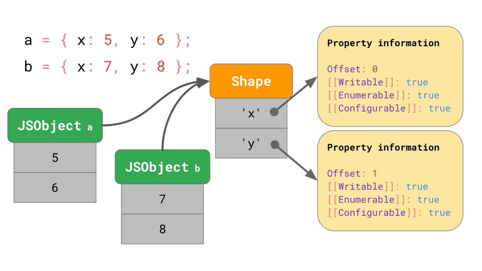
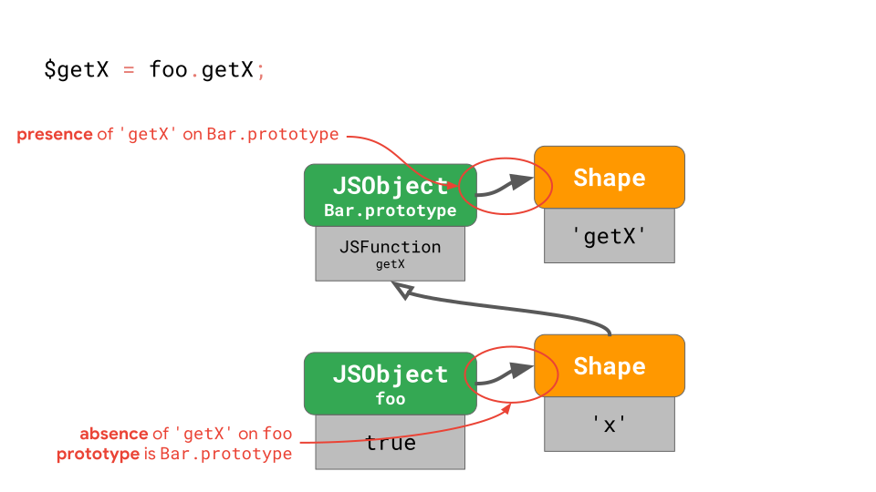
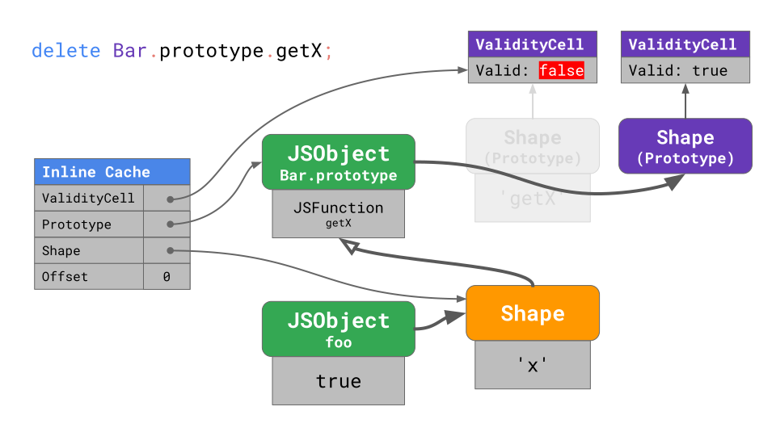

# Optimizing prototypes


<!-- TOC -->

- [Optimizing prototypes](#optimizing-prototypes)
    - [阅读基础](#阅读基础)
    - [Optimization tiers and execution trade-offs](#optimization-tiers-and-execution-trade-offs)
    - [Optimizing prototype property access](#optimizing-prototype-property-access)
        - [Classes and prototype-based programming](#classes-and-prototype-based-programming)
        - [基本属性查询](#基本属性查询)
        - [优化属性查询](#优化属性查询)
    - [Validity cells](#validity-cells)
    - [References](#references)

<!-- /TOC -->


## 阅读基础
* [Shapes and Inline Caches](./Shapes&InlineCaches.md)


## Optimization tiers and execution trade-offs
不懂。不太懂，以后再看[这一段](https://mathiasbynens.be/notes/prototypes#tradeoffs)


## Optimizing prototype property access
1. Engines store the `Shape` of the object separately from the object’s values.
    
2. Shapes enable an optimization called `Inline Caches` or `ICs` for short. Combined, Shapes and ICs can speed up repeated property accesses from the same place in your code.
    

### Classes and prototype-based programming
1. Let’s zoom in on what happens behind the scenes when we create a new instance of Bar called foo
    ```js
    class Bar {
    	constructor(x) {
    		this.x = x;
    	}
    	getX() {
    		return this.x;
    	}
    }

    const foo = new Bar(true);
    ```
2. The instance created from running this code has a shape with a single property `'x'`. The prototype of `foo` is the `Bar.prototype` that belongs to the class `Bar`.
3. This `Bar.prototype` has a shape of its own, containing a single property `'getX'` whose value is the function `getX` that just returns `this.x` when called.
    
4. If you create another instance of the same class, both instances share the object shape, as we discussed earlier. Both instances point to the same `Bar.prototype` object.
    

### 基本属性查询
1. Ok, so now we know what happens when we define a class and we create a new instance. But what happens if we call a method on an instance, like we’re doing here?
    ```js
    class Bar {
    	constructor(x) { this.x = x; }
    	getX() { return this.x; }
    }

    const foo = new Bar(true);
    const x = foo.getX();
    //        ^^^^^^^^^^
    ```
2. You can think of any method call as two individual steps:
    ```js
    const x = foo.getX();

    // is actually two steps:

    const $getX = foo.getX;
    const x = $getX.call(foo);
    ```
    Step 1 is to load the method, which is just a property on the prototype (whose value happens to be a function). Step 2 is to call the function with the instance as the `this` value.
3. Let’s walk through that first step, which is loading the method `getX` from the instance `foo`.
    
4. The engine starts at the `foo` instance and realizes there is no `'getX'` property on `foo`'s shape, so it has to walk up the prototype chain for it.
5. We get to `Bar.prototype`, look at its prototype shape, and see that it has the `'getX'` property at offset `0`.
6. We look up the value at this offset in `Bar.prototype` and find the JSFunction `getX` that we were looking for.

### 优化属性查询
1. JavaScript’s flexibility makes it possible to mutate prototype chain links, for example:
    ```js
    const foo = new Bar(true);
    foo.getX();
    // → true

    Object.setPrototypeOf(foo, null);
    foo.getX();
    // → Uncaught TypeError: foo.getX is not a function
    ```
2. In this example, we call `foo.getX()` twice, but each time it has a completely different meaning and result. This is why, although prototypes are just objects in JavaScript, speeding up prototype property access is even more challenging for JavaScript engines than speeding up own property access on regular objects.
3. Looking at programs in the wild, loading prototype properties is a very frequent operation: it happens every time you call a method!
    ```js
    class Bar {
    	constructor(x) { this.x = x; }
    	getX() { return this.x; }
    }

    const foo = new Bar(true);
    const x = foo.getX();
    //        ^^^^^^^^^^
    ```
4. Earlier, we discussed how engines optimize loading regular, own properties through the use of Shapes and Inline Caches. How can we optimize repeated loads of prototype properties on objects with similar shapes?
5. 在这里例子里，为了能实现重复的快速访问，我们必须确保一些东西没有被更改，这样才能使用缓存的结果而不是按照完整的步骤重新查询：
    1. The shape of `foo` does not contain `'getX'` and did not change. This means no one altered the object foo by adding or deleting a property, or by changing one of the property attributes. 一有属性变化，就会有新的 shape 出现。
    2. The prototype of `foo` is still the initial `Bar.prototype`. This means no one changed `foo`'s prototype by using `Object.setPrototypeOf()` or by assigning to the special `__proto__` property.
    3. The shape of `Bar.prototype` contains `'getX'` and did not change. This means no one altered the `Bar.prototype` by adding or deleting a property, or by changing one of the property attributes.
6. In the general case, that means we have to perform 1 check on the instance itself, plus 2 checks for each prototype up to the prototype which holds the property we’re looking for.
7. `1+2N` checks (where `N` is the number of prototypes involved) may not sound too bad for this case, because the prototype chain is relatively shallow — but engines often have to deal with much longer prototype chains, like in the case of common DOM classes.
8.  It’d be nice if we could reduce the number of checks by folding the prototype check into the absence check. And that’s essentially what engines do with a simple trick: instead of storing the prototype link on the instance itself, engines store it on the `Shape`
    
9. Each shape points to the prototype. This also means that every time the prototype of `foo` changes, the engine transitions to a new shape. Now we only need to check the shape of an object to both assert absence of certain properties and also guard the prototype link. 也就是说，上面3步检查中的第二步实际上不需要了。
10. With this approach, we can reduce the number of checks required from `1+2N` to `1+N` for faster property access on prototypes. But that’s still quite expensive, since it’s still linear in the length of the prototype chain. Engines implement different tricks to further reduce this to a constant number of checks, especially for subsequent executions of the same property loads.


## Validity cells
1. V8 treats prototype shapes specially for this purpose. Each prototype has a unique shape that is not shared with any other objects (specifically not with other prototypes), and each of these prototype shapes has a special `ValidityCell` associated with it. **This `ValidityCell` is invalidated whenever someone changes the associated prototype or any prototype above it**.
    
2. To speed up subsequent loads from prototypes, V8 puts an Inline Cache in place, with four fields:
    
3. When warming up the inline cache during the first run of this code, V8 remembers the offset at which the property was found in the prototype, the prototype on which the property was found (`Bar.prototype` in this example), the shape of the instance (the shape of `foo` in this case), and also the link to the current ValidityCell of the immediate prototype that is linked to from the instance shape (which also happens to be `Bar.prototype` in this case).
4. The next time the Inline Cache is hit, the engine has to check the shape of the instance and the `ValidityCell`. If it’s still valid, the engine can reach out directly to the `Offset` on the `Prototype`, skipping the additional lookups.
5. When the prototype is changed, a new shape is allocated and the previous `ValidityCell` is invalidated. So the Inline Cache misses the next time it’s executed, resulting in worse performance.
    
6. Although prototypes are just objects, they are treated specially by JavaScript engines to optimize the performance of method lookups on prototypes. Leave your prototypes alone! Or if you really need to touch prototypes, then do it before other code runs, so that you at least don’t invalidate all the optimizations in the engine while your code is running.


## References
* [JavaScript engine fundamentals: optimizing prototypes](https://mathiasbynens.be/notes/prototypes)
* [JavaScript engine fundamentals: optimizing prototypes 译文](https://hijiangtao.github.io/2018/08/21/Prototypes/)
