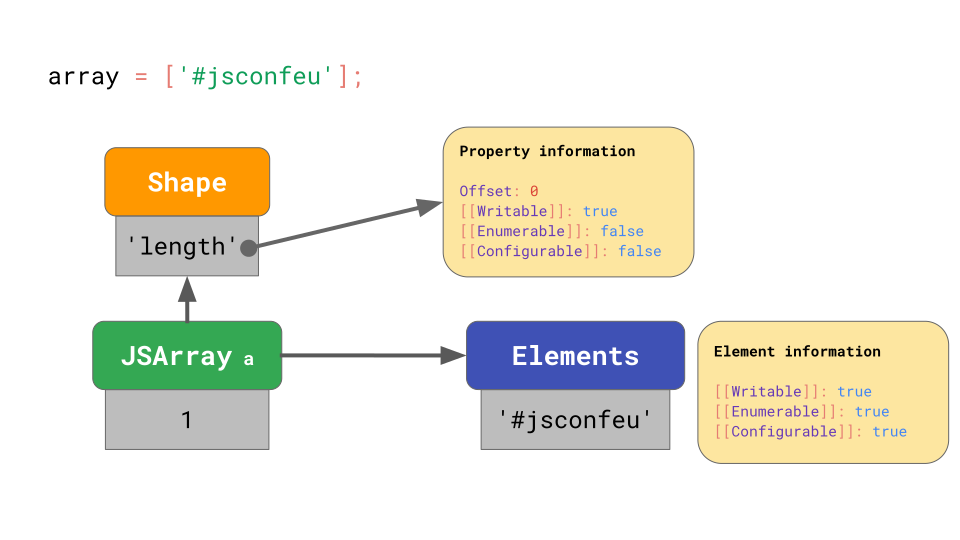

# Shapes and Inline Caches

## The JavaScript engine pipeline
1. The JavaScript engine parses the source code and turns it into an Abstract Syntax Tree (AST).
2. Based on that AST, the interpreter can start to do its thing and produce bytecode. At that point the engine is actually running the JavaScript code.
3. To make it run faster, the bytecode can be sent to the optimizing compiler along with profiling data.
4. The optimizing compiler makes certain assumptions based on the profiling data it has, and then produces highly-optimized machine code.
5. If at some point one of the assumptions turns out to be incorrect, the optimizing compiler deoptimizes and goes back to the interpreter.


### Interpreter/compiler pipelines in JavaScript engines
1. Now, let’s zoom in on the parts of this pipeline that actually run your JavaScript code, i.e. where code gets interpreted and optimized.
2. Generally speaking, there’s a pipeline containing an interpreter and an optimizing compiler.
3. The interpreter generates unoptimized bytecode quickly, and the optimizing compiler takes a little longer but eventually produces highly-optimized machine code.


4. This generic pipeline is pretty much exactly how V8, the JavaScript engine used in Chrome and Node.js, works:
    
5. The interpreter in V8 is called Ignition, and is responsible for generating and executing bytecode.
6. While it runs the bytecode, it collects profiling data, which can be used to speed up the execution later.
7. When a function becomes *hot*, for example when it’s run often, the generated bytecode and the profiling data are passed on to TurboFan, our optimizing compiler, to generate highly-optimized machine code based on the profiling data.
8. 原文还讲到其他[几个引擎的大体流程](https://mathiasbynens.be/notes/shapes-ics#pipeline-comparison)。Why do some engines have more optimizing compilers than others? It’s all about trade-offs. An interpreter can produce bytecode quickly, but bytecode is generally not very efficient. An optimizing compiler on the other hand takes a little longer, but eventually produces much more efficient machine code. There is a trade-off between quickly getting code to run (interpreter) or taking some more time, but eventually running the code with optimal performance (optimizing compiler). Some engines choose to add multiple optimizing compilers with different time/efficiency characteristics, allowing for more fine-grained control over these trade-offs at the cost of additional complexity. Another trade-off relates to memory usage; see [our follow-up article](https://mathiasbynens.be/notes/prototypes#tradeoffs) for details on that. At a high level, all JavaScript engines have the same architecture: there’s a parser and some kind of interpreter/compiler pipeline.


## JavaScript’s object model
1. Let’s look at what else JavaScript engines have in common by zooming in on how some aspects are implemented. For example, how do JavaScript engines implement the JavaScript object model, and which tricks do they use to speed up accessing properties on JavaScript objects? As it turns out, all major engines implement this very similarly.
2. The ECMAScript specification essentially defines all objects as dictionaries, with string keys mapping to [property attributes](https://tc39.github.io/ecma262/#sec-property-attributes).
    

### Array
1. You can think of arrays as a special case of objects.
2. One difference is that arrays have special handling of array indices. Another difference is that arrays also have a magical `length` property.
3. JavaScript defines arrays similarly to objects. For example, all the keys including array indices are represented as strings explicitly. The first element in the array is stored under the key `'0'`.
    
    ```js
    console.log(Object.keys([1, 2])); // ["0", "1"]
    console.log(Object.getOwnPropertyNames([1, 2])); // ["0", "1", "length"]
    ```


## Optimizing property access
### Shapes
1. In JavaScript programs, it’s common to have multiple objects with the same property keys. Such objects have the same shape.
    ```js
    const object1 = { x: 1, y: 2 };
    const object2 = { x: 3, y: 4 };
    // `object1` and `object2` have the same shape.
    ```
2. It’s also very common to access the same property on objects with the same shape (不懂，common 吗？):  
    ```js
    function logX(object) {
    	console.log(object.x);
    }

    const object1 = { x: 1, y: 2 };
    const object2 = { x: 3, y: 4 };

    logX(object1);
    logX(object2);
    ```
3. With that in mind, JavaScript engines can optimize object property access based on the object’s shape.
4. Let’s assume we have an object with the properties `x` and `y`, and it uses the dictionary data structure we discussed earlier: it contains the keys as strings, and those point to their respective property attributes.
    
5. If you access a property, e.g. `object.y`, the JavaScript engine looks in the `JSObject` for the key `'y'`, then loads the corresponding property attributes, and finally returns the `[[Value]]`.
6. But where are these property attributes stored in memory? Should we store them as part of the `JSObject`?
7. If we assume that we’ll be seeing more objects with this shape later, then it’s wasteful to store the full dictionary containing the property names and attributes on the `JSObject` itself, as the property names are repeated for all objects with the same shape. That’s a lot of duplication and unnecessarily memory usage.
8. As an optimization, engines store the Shape of the object separately. 因为 shape 有可能是公用的，所以就提取出来。但从下图看，`[[Value]]`以外的特性也被作为公用的了，所以说同一个 shape 不仅是指相同的属性名，也要求属性`[[Value]]`以外的特性也相同？


9. This `Shape` contains all the property names and the attributes, except for their `[[Value]]`s. Instead the Shape contains the offset of the values inside of the JSObject, so that the JavaScript engine knows where to find the values.
10. Every `JSObject` with this same shape points to exactly this `Shape` instance. Now every `JSObject` only has to store the values that are unique to this object.


11. The benefit becomes clear when we have multiple objects. No matter how many objects there are, as long as they have the same shape, we only have to store the shape and property information once!
12. All JavaScript engines use shapes as an optimization, but they don’t all call them shapes:
    * Academic papers call them *Hidden Classes*
    * V8 calls them *Maps*
    * Chakra calls them *Types*
    * JavaScriptCore calls them *Structures*
    * SpiderMonkey calls them *Shapes*

### Transition chains and trees
#### Chains
1. What happens if you have an object with a certain shape, but then you add a property to it? How does the JavaScript engine find the new shape?
    ```js
    const object = {};
    object.x = 5;
    object.y = 6;
    ```
2. The shapes form so-called `transition chains` in the JavaScript engine. Here’s an example:
    
3. The object starts out without any properties, so it points to the empty shape. The next statement adds a property `'x'` with a value `5` to this object, so the JavaScript engine transitions to a shape that contains the property `'x'` and a value `5` is added to the `JSObject` at the first offset `0`. The next line adds a property `'y'`, so the engine transitions to yet another shape that contains both `'x'` and `'y'`, and appends the value `6` to the `JSObject` (at offset `1`).
4. **Note**: The order in which properties are added impacts the shape. For example, `{ x: 4, y: 5 }` results in a different shape than `{ y: 5, x: 4 }`.
5. We don’t even need to store the full table of properties for each `Shape`. Instead, every `Shape` only needs to know about the new property it introduces. For example, in this case we don’t have to store the information about `'x'` in that last shape, because it can be found earlier in the chain. To make this work, every `Shape` links back to its previous shape:
    
6. If you write `o.x` in your JavaScript code, the JavaScript engine looks up the property `'x'` by walking up the transition chain until it finds the Shape that introduced property `'x'`.

#### Trees
1. ut what happens if there’s no way to create a transition chain? For example, what if you have two empty objects, and you add a different property to each of them?
    ```js
    const object1 = {};
    object1.x = 5;
    const object2 = {};
    object2.y = 6;
    ```
2. In that case we have to branch, and instead of a chain, we end up with a *transition tree*:
    
3. Here, we create an empty object `a`, and then add a property `'x'` to it. We end up with a `JSObject` containing a single value, and two Shapes: the empty shape, and the shape with only a property `x`.
4. The second example starts with an empty object `b` too, but then adds a different property `'y'`. We end up with two shape chains, and a total of three shapes.
5. Does that mean we always start at the empty shape? Not necessarily. Engines apply some optimizations for object literals that already contain properties. Let’s say we either add `x` starting from the empty object literal, or have an object literal that already contains `x`:
    ```js
    const object1 = {};
    object1.x = 5;
    const object2 = { x: 6 };
    ```
6. In the first example, we start at the empty shape and transition to the shape that also contains `x`, just as we saw before.
7. In the case of `object2`, it makes sense to directly produce objects that already have `x` from the beginning instead of starting from an empty object and transitioning.
    
8. The object literal that contains the property `'x'` starts at a shape that contains `'x'` from the beginning, effectively skipping the empty shape. This is what (at least) V8 and SpiderMonkey do. This optimization shortens the transition chains and makes it more efficient to construct objects from literals. Benedikt’s blog post on [surprising polymorphism in React applications](https://medium.com/@bmeurer/surprising-polymorphism-in-react-applications-63015b50abc) discusses how these subtleties can affect real-world performance.

#### ShapeTable 优化链式查询
1. Here’s an example of a 3D point object with properties `'x'`, `'y'`, and `'z'`
    ```js
    const point = {};
    point.x = 4;
    point.y = 5;
    point.z = 6;
    ```
2. As we learned before, this creates an object with 3 shapes in memory (not counting the empty shape). To access the property `'x'` on that object, e.g. if you write `point.x` in your program, the JavaScript engine needs to follow the linked list: it starts at the `Shape` at the bottom, and then works its way up to the `Shape` that introduced `'x'` at the top
    
3. That’s going to be really slow if we do this more often, especially when the objects have lots of properties. The time to find the property is `O(n)`, i.e. linear in the number of properties on the object.
4. To speed up searching for properties, JavaScript engines add a `ShapeTable` data structure. This `ShapeTable` is a dictionary, mapping property keys to the respective `Shape`s that introduce the given property
    
5. Wait a minute, now we’re back to dictionary lookups… That’s where we were before we started adding `Shape`s in the first place! So why do we bother with shapes at all? The reason is that shapes enable another optimization called `Inline Caches`.    

### Inline Caches (ICs)
1. The main motivation behind shapes is the concept of Inline Caches or ICs. ICs are the key ingredient to making JavaScript run fast! JavaScript engines use ICs to memorize information on where to find properties on objects, to reduce the number of expensive lookups.
2. Here’s a function getX that takes an object and loads the property x from it:
    ```js
    function getX(o) {
    	return o.x;
    }
    ```
    If we run this function in JSC, it generates the following bytecode:
    
3. The first `get_by_id` instruction loads the property `'x'` from the first argument (`arg1`) and stores the result into `loc0`. The second instruction returns what we stored to `loc0`.
4. JSC also embeds an Inline Cache into the `get_by_id` instruction, which consists of two uninitialized slots.
5. Now let’s assume we call `getX` with an object `{ x: 'a' }`. As we learned, this object has a shape with property `'x'` and the `Shape` stores the offset and attributes for that property `x`.
    
6. When you execute the function for the first time, the `get_by_id` instruction looks up the property `'x'` and finds that the value is stored at offset `0`.
7. The IC embedded into the `get_by_id` instruction memorizes the shape and the offset at which the property was found
    
8. For subsequent runs, the IC only needs to compare the shape, and if it’s the same as before, just load the value from the memorized offset. Specifically, if the JavaScript engine sees objects with a shape that the IC recorded before, it no longer needs to reach out to the property information at all — instead, the expensive property information lookup can be skipped entirely. That’s significantly faster than looking up the property each time.
    


## Storing arrays efficiently
1. For arrays, it’s common to store properties that are array indices. The values for such properties are called array elements.
2. It would be wasteful memory-wise to store property attributes for each and every array element in every single array. Instead, JavaScript engines use the fact that array-indexed properties are writable, enumerable, and configurable by default, and store array elements separately from other named properties.
3. Consider this array:
    ```js
    const array = [
    	'#jsconfeu',
    ];
    ```
    The engine stores the array length (`1`), and points to the Shape that contains the offset and the attributes for the `'length'` property.
    
4. This is similar to what we’ve seen before… but where are the array values stored ? Every array has a separate *elements backing store* that contains all the array-indexed property values. The JavaScript engine doesn’t have to store any property attributes for array elements, because usually they are all writable, enumerable, and configurable.
    
5. What happens in the unusual case, though? What if you change the property attributes of array elements ? In such edge cases, the JavaScript engine represents the entire elements backing store as a dictionary that maps array indices to property attributes
    
6. Even when just a single array element has non-default attributes, the entire array’s backing store goes into this slow and inefficient mode. Avoid `Object.defineProperty` on array indices!


## Take-aways
Based on this knowledge, we identified some practical JavaScript coding tips that can help boost performance:
* Always initialize your objects in the same way, so they don’t end up having different shapes.
* Don’t mess with property attributes of array elements, so they can be stored and operated on efficiently.


## References
* [JavaScript engine fundamentals: Shapes and Inline Caches](https://mathiasbynens.be/notes/shapes-ics)
* [JavaScript engine fundamentals: Shapes and Inline Caches 译文](https://hijiangtao.github.io/2018/06/17/Shapes-ICs/)
