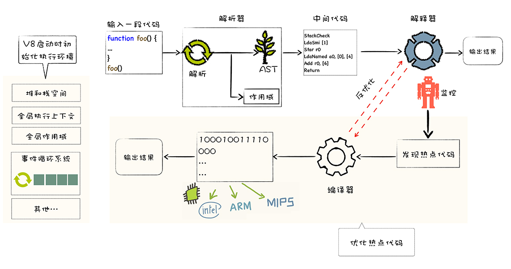

# Summary

<!-- TOC -->

- [Summary](#summary)
    - [什么是 V8？](#什么是-v8)
    - [高级语言的代码执行方式——解释执行和编译执行](#高级语言的代码执行方式解释执行和编译执行)
    - [V8 是怎么执行 JavaScript 的方式](#v8-是怎么执行-javascript-的方式)
    - [References](#references)

<!-- /TOC -->

## 什么是 V8？
1. V8 是 JavaScript 虚拟机的一种。我们可以简单地把 JavaScript 虚拟机理解成是一个翻译程序，将人类能够理解的编程语言 JavaScript，翻译成机器能够理解的机器语言。
2. 虚拟机通过模拟实际计算机的各种功能来实现代码的执行，如模拟实际计算机的 CPU、堆栈、寄存器等，虚拟机还具有它自己的一套指令系统。
3. 所以对于 JavaScript 代码来说，V8 就是它的整个世界，当 V8 执行 JavaScript 代码时，你并不需要担心现实中不同操作系统的差异，也不需要担心不同体系结构计算机的差异，你只需要按照虚拟机的规范写好代码就可以了。
4. V8 执行 JavaScript 代码的主要核心流程分为编译和执行两步。首先需要将 JavaScript 代码转换为低级中间代码或者机器能够理解的机器代码，然后再执行转换后的代码并输出执行结果。
5. 在 V8 出现之前，所有的 JavaScript 虚拟机所采用的都是 **解释执行** 的方式，这是 JavaScript 执行速度过慢的一个主要原因。而 V8 率先引入了 **即时编译**（JIT）的双轮驱动的设计，这是一种权衡策略，混合 **编译执行** 和解释执行这两种手段，给 JavaScript 的执行速度带来了极大的提升。
6. 另外，V8 也是早于其他虚拟机引入了惰性编译、内联缓存、隐藏类等机制，进一步优化了 JavaScript 代码的编译执行效率。

## 高级语言的代码执行方式——解释执行和编译执行
1. 和汇编语言一样，处理器也不能直接识别由高级语言所编写的代码，那怎么办呢？通常，要有两种方式来执行这些代码。
2. 第一种是解释执行，需要先将输入的源代码通过解析器编译成中间代码，之后直接使用解释器解释执行中间代码，然后直接输出结果
    
3. 第二种是编译执行。采用这种方式时，也需要先将源代码转换为中间代码，然后我们的编译器再将中间代码编译成机器代码
    
    通常编译成的机器代码是以二进制文件形式存储的，需要执行这段程序的时候直接执行二进制文件就可以了。还可以使用虚拟机将编译后的机器代码保存在内存中，然后直接执行内存中的二进制代码。
4. 以上就是计算机执行高级语言的两种基本的方式。但是针对不同的高级语言，这个实现方式还是有很大差异的，比如要执行 C 语言编写的代码，你需要将其编译为二进制代码的文件，然后再直接执行二进制代码。而对于像 Java 语言、JavaScript 语言等，则需要虚拟机模拟计算机的这个编译执行流程。

## V8 是怎么执行 JavaScript 的方式
1. 那么，V8 作为 JavaScript 的虚拟机的一种，它到底是怎么执行 JavaScript 代码的呢？是解释执行，还是编译执行呢？实际上，V8 并没有采用某种单一的技术，而是混合编译执行和解释执行这两种手段，我们把这种混合使用编译器和解释器的技术称为 **JIT**（Just In Time）技术。
2. 这是一种权衡策略，因为这两种方法都各自有各自的优缺点：解释执行的启动速度快，但是执行时的速度慢；而编译执行的启动速度慢，但是执行时的速度快。
3. 可以参考下面完整的 V8 执行 JavaScript 的流程图，我们把这套流程称之为 V8 的编译流水线
    
4. 编译流水线本身并不复杂，但是其中涉及到了很多技术，诸如 JIT、延迟解析、隐藏类、内联缓存等等。这些技术决定着一段 JavaScript 代码能否正常执行，以及代码的执行效率。
5. 我们先看上图中的最左边的部分，在 V8 启动执行 JavaScript 之前，它还需要准备执行 JavaScript 时所需要的一些基础环境，这些内容都是在执行 JavaScript 过程中需要使用到的。例如
    * JavaScript 全局执行上下文就包含了执行过程中的全局信息，比如一些内置函数，全局变量等信息；
    * 全局作用域包含了一些全局变量，在执行过程中的数据都需要存放在内存中；
    * 而 V8 是采用了经典的堆和栈的内存管理模式，所以 V8 还需要初始化内存中的堆和栈结构；
    * 另外，想要我们的 V8 系统活起来，还需要初始化消息循环系统，消息循环系统包含了消息驱动器和消息队列，不断接受消息并决策如何处理消息。
6. 基础环境准备好之后，接下来就可以向 V8 提交要执行的 JavaScript 代码了。
7. 首先 V8 会接收到要执行的 JavaScript 源代码，不过这对 V8 来说只是一堆字符串，V8 并不能直接理解这段字符串的含义，它需要 **结构化** 这段字符串。结构化是指信息经过分析后可分解成多个互相关联的组成部分，各组成部分间有明确的层次结构，方便使用和维护，并有一定的操作规范。
8. V8 源代码的结构化之后，就生成了 **抽象语法树** (AST)，AST 是便于 V8 理解的结构。这里还需要注意一点，在生成 AST 的同时，V8 还会生成相关的作用域，作用域中存放相关变量。
9. 有了 AST 和作用域之后，接下来就可以生成 **字节码** 了，字节码是介于 AST 和机器代码的中间代码。但是与特定类型的机器代码无关，解释器可以直接解释执行字节码，或者通过编译器将其编译为二进制的机器代码再执行。
10. 生成了字节码之后，解释器就登场了，它会按照顺序解释执行字节码，并输出执行结果。
11. 在解释器附近画了个监控机器人，这是一个监控解释器执行状态的模块，在解释执行字节码的过程中，如果发现了某一段代码会被重复多次执行，那么监控机器人就会将这段代码标记为热点代码。
12. 当某段代码被标记为热点代码后，V8 就会将这段字节码丢给优化编译器，优化编译器会在后台将字节码编译为二进制代码，然后再对编译后的二进制代码执行优化操作，优化后的二进制机器代码的执行效率会得到大幅提升。如果下面再执行到这段代码时，那么 V8 会优先选择优化之后的二进制代码，这样代码的执行速度就会大幅提升。
13. 不过，和静态语言不同的是，JavaScript 是一种非常灵活的动态语言，对象的结构和属性是可以在运行时任意修改的，而经过优化编译器优化过的代码只能针对某种固定的结构，一旦在执行过程中，对象的结构被动态修改了，那么优化之后的代码势必会变成无效的代码，这时候优化编译器就需要执行反优化操作，经过反优化的代码，下次执行时就会回退到解释器解释执行。

## References
* [图解 Google V8](https://time.geekbang.org/column/intro/296)
