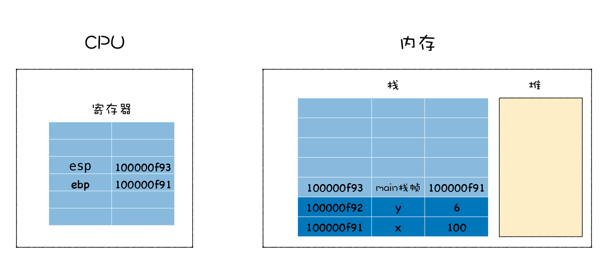

# Stack And Heap


<!-- TOC -->

- [Stack And Heap](#stack-and-heap)
    - [一例](#一例)
    - [栈如何管理函数调用](#栈如何管理函数调用)
    - [分析最开始的例子](#分析最开始的例子)
    - [堆的作用](#堆的作用)
    - [References](#references)

<!-- /TOC -->


## 一例
1. 执行下面这样一段代码会遇到栈溢出的错误
    ```js
    function foo() {
        foo()
    }
    foo()
    ```
2. 为了解决栈溢出的问题，我们可以在 `foo` 函数内部使用 `setTimeout` 来触发 `foo` 函数的调用，改造之后的程序就可以正确执行
    ```js
    function foo() {
        setTimeout(foo, 0)
    }
    ```
3. 如果使用 `Promise` 来代替 `setTimeout`，在 `Promise` 的 `then` 方法中调用 `foo` 函数
    ```js
    function foo() {
        return Promise.resolve().then(foo)
    }
    foo()
    ```
    执行这段代码并没有报告栈溢出的错误，但是整个页面卡住了。
4. 这三段代码的底层执行逻辑是完全不同的：
    * 第一段代码是在同一个任务中重复调用嵌套的 `foo` 函数；
    * 第二段代码是使用 `setTimeout` 让 `foo` 函数在不同的任务中执行；
    * 第三段代码是在同一个任务中执行 `foo` 函数，但是却不是嵌套执行。
5. 这是因为，V8 执行这三种不同代码时，它们的内存布局是不同的，而不同的内存布局又会影响到代码的执行逻辑。
6. 下面，我们从函数特性入手，来一步步延伸出通用的函数调用模型，进而来分析不同的函数调用方式是如何影响到运行时内存布局的。


## 栈如何管理函数调用
1. 首先我们来分析最简单的场景：当执行一个函数的时候，栈怎么变化。
2. 当一个函数被执行时，函数的参数、函数内部定义变量都会依次压入到栈中，结合实际的代码来分析下这个过程，参考下图
    
    1. 当执行到函数的第一段代码的时候，变量 `x` 第一次被赋值，且值为 5，这时 5 会被压入到栈中。
    2. 然后，执行第二段代码，变量 `y` 第一次被赋值，且值为 6，这时 6 会被压入到栈中。
    3. 接着，执行到第三段代码，注意这里变量 `x` 是第二次被赋值，且新的值为 100，那么这时并不是将 100 压入到栈中，而是替换之前压入栈的内容，也就是将栈中的 5 替换成 100。
    4. 最后，执行第四段代码，我们会先计算出来 `x+y` 的值，然后再将 `x+y` 的值赋值给 `z`，由于 `z` 是第一次被赋值，所以 `z` 的值也会被压入到栈中。
3. 再来分析更加复杂一点的场景了：当一个函数调用另外一个函数时，栈的变化情况是怎样的。使用下面这段代码
    ```cpp
    int add(num1,num2){
        int x = num1;
        int y = num2;
        int ret = x + y;
        return ret;
    }


    int main()
    {
        int x = 5;
        int y = 6;
        x = 100;
        int z = add(x,y);
        return z;
    }
    ```
4. 当执行到 `int z = add(x,y)` 时，当前栈的状态如下所示
    
5. 接下来，就要调用 `add` 函数了，理想状态下，执行 `add` 函数的过程是下面这样的
    
6. 不过执行这里，会遇到一个问题，那就是当 `add` 函数执行完成之后，需要将执行代码的控制权转交给 `main` 函数，这意味着需要将栈的状态恢复到 `main` 函数上次执行时的状态，我们把这个过程叫 **恢复现场**。
7. 要实现恢复现场，需要在寄存器中保存一个永远指向当前栈顶的指针。**栈顶指针** 的作用就是告诉你应该往哪个位置添加新元素，这个指针通常存放在 esp（Extended Stack Pointer） 寄存器中。
8. 如果你想往栈中添加一个元素，那么你需要先根据 esp 寄存器找到当前栈顶的位置，然后在栈顶上方添加新元素。新元素添加之后，还需要将新元素的地址更新到 esp 寄存器中。
9. 有了栈顶指针，就很容易恢复 `main` 函数的执行现场了，当 `add` 函数执行结束时，只需要将栈顶指针向下移动就可以了
    
10. 观察上图，将 esp 的指针向下移动到之前 main 函数执行时的地方就可以。不过新的问题又来了，CPU 是怎么知道要移动到这个地址呢？
11. CPU 的解决方法是增加了另外一个 ebp(Extended Base Pointer) 寄存器，用来保存当前函数的起始位置，我们把一个函数的起始位置也称为 **栈帧指针**，ebp 寄存器中保存的就是当前函数的栈帧指针，如下图所示
    
12. 关于 **栈帧**，每个栈帧对应着一个未运行完的函数，栈帧中保存了该函数的返回地址和局部变量。
13. 在 `main` 函数调用 `add` 函数的时候，`main` 函数的栈顶指针就变成了 `add` 函数的栈帧指针，所以需要将 `main` 函数的栈顶指针保存到 ebp 中。
14. 当 `add` 函数执行结束之后，需要销毁 `add` 函数的栈帧，并恢复 `main` 函数的栈帧。那么只需要取出 `main` 函数的栈顶指针写到 esp 中即可 (`main` 函数的栈顶指针是保存在 ebp 中的)，这就相当于将栈顶指针移动到 `main` 函数的区域。
15. 那么现在，我们还是不能执行继续 `main` 函数，这主要是因为 · 函数也有它自己的栈帧指针，在执行 · 函数之前，我们还需恢复它的栈帧指针。
16. 通常的方法是：在 `main` 函数中调用 `add` 函数时，CPU 会将当前 `main` 函数的栈帧指针保存在栈中，如下图所示：
    
17. 当函数调用结束之后，就需要恢复 `main` 函数的执行现场了。首先取出 ebp 中的指针，写入 esp 中；然后从栈中取出之前保留的 `main` 的栈帧地址，将其写入 ebp 中。到了这里 ebp 和 esp 就都恢复了，可以继续执行 · 函数了。


## 分析最开始的例子
1. 以上我们详细分析了 C 函数的执行过程，在 JavaScript 中，函数的执行过程也是类似的：如果调用一个新函数，那么 V8 会为该函数创建栈帧；等函数执行结束之后，销毁该栈帧。
2. 因为栈结构的容量是固定的，所以如果重复嵌套执行一个函数，那么就会导致栈会栈溢出。
3. 第一段代码由于循环嵌套调用了 `foo`，所以当函数运行时，就会导致 `foo` 函数会不断地调用 `foo` 函数自身，这样就会导致栈无限增，进而导致栈溢出的错误。
4. 第二段代码是在函数内部使用了 `setTimeout` 来启动 `foo` 函数，`setTimeout` 会使得 `foo` 函数在消息队列后面的任务中执行，所以不会影响到当前的栈结构，也就不会导致栈溢出。
5. 第三段代码 TODO。这是在本轮时间循环的微任务里调用 `foo`，但没有导致栈溢出，那就说明在微任务阶段，宏任务的调用栈已经清空了。这是之前 `foo` 的调用栈已经清空了？那为什么不是在微任务阶段嵌套调用栈导致溢出的情况？


## 堆的作用
1. 虽然栈的操作速度非常快，但是也有缺点的，其中最大的缺点也是它的优点所造成的，那就是栈是连续的，所以要想在内存中分配一块连续的大空间是非常难的，因此栈空间是有限的。
2. 基于栈不方便存放大的数据，因此我们使用了另外一种数据结构用来保存一些大数据，这就是堆。
3. 和栈空间不同，存放在堆空间中的数据是不要求连续存放的。从堆上分配内存块没有固定模式的，你可以在任何时候分配和释放它。
4. 以下面这段代码为例
    ```cpp
    struct Point
    {
        int x;
        int y;
    };


    int main()
    {
        int x = 5;
        int y = 6;
        int *z = new int;
        *z = 20;


        Point p;
        p.x = 100;
        p.y = 200;


        Point *pp = new Point();
        pp->y = 400;
        pp->x = 500;
        delete z;
        delete pp;
        return 0;
    }
    ```
5. 观察上面这段代码，你可以看到代码中有 `new int`、`new Point` 这种语句，当执行这些语句时，表示要在 **堆** 中分配一块数据，然后返回指针，通常返回的指针会被保存到 **栈** 中。
6. 下面我们来看看当 `main` 函数快执行结束时，堆和栈的状态
    
7. 观察上图，我们可以发现，当使用 `new` 时，我们会在堆中分配一块空间，在堆中分配空间之后，会返回分配后的地址，我们会把该地址保存在栈中。
8. 通常，当堆中的数据不再需要的时候，需要对其进行销毁。像 C/C++ 这种手动管理内存的语言，如果没有手动销毁堆中的数据，那么就会造成内存泄漏。不过 JavaScript 使用了自动垃圾回收策略，可以实现垃圾自动回收。但是事情总有两面性，垃圾自动回收也会给我们带来一些性能问题。所以不管是自动垃圾回收策略，还是手动垃圾回收策略，要想写出高效的代码，我们都需要了解内存的底层工作机制。


## References
* [图解 Google V8](https://time.geekbang.org/column/intro/296)