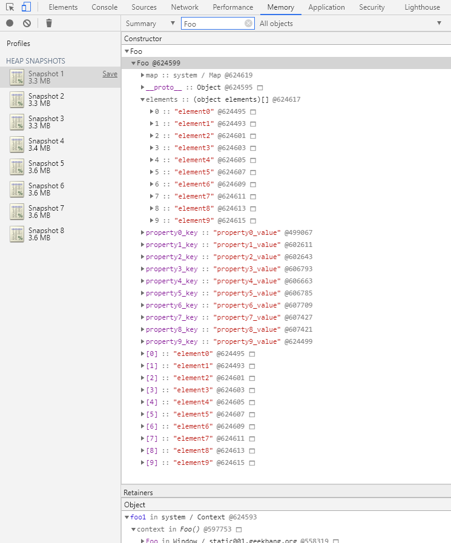
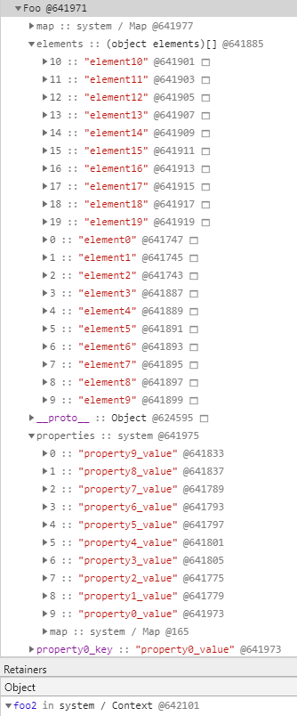
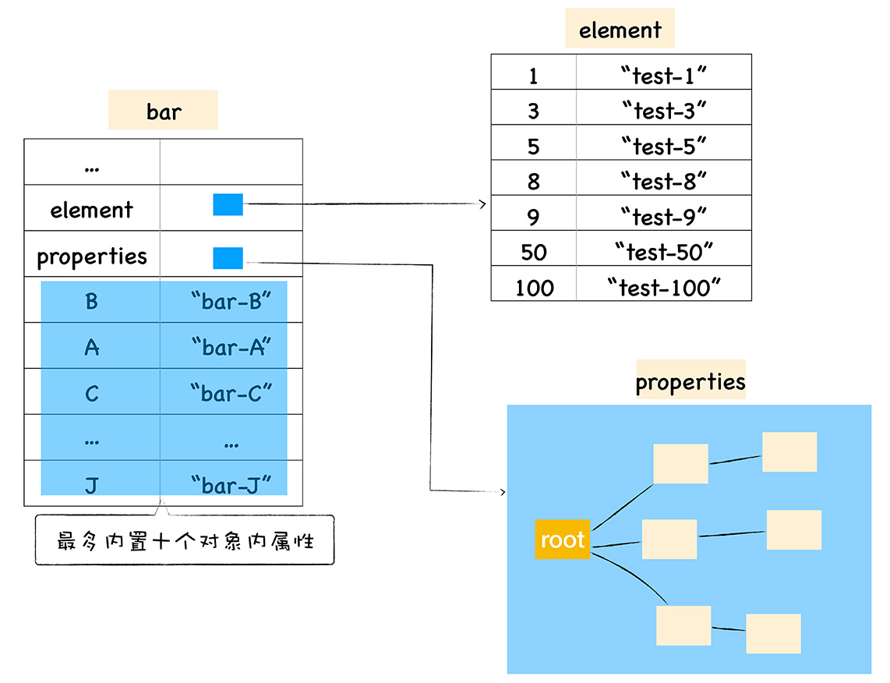
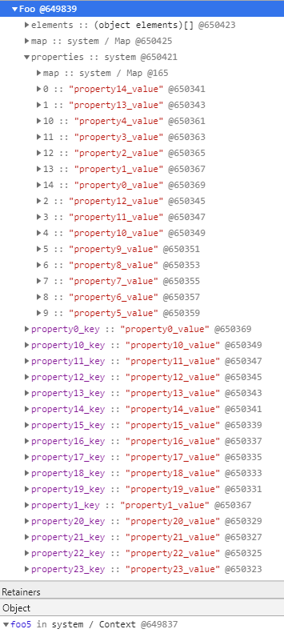
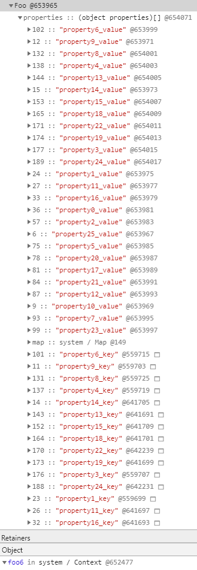
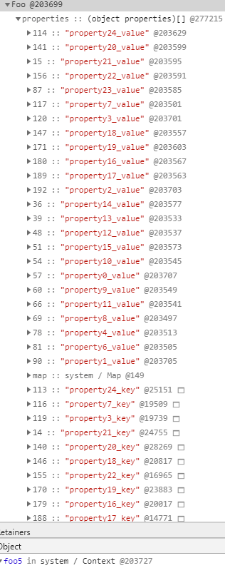
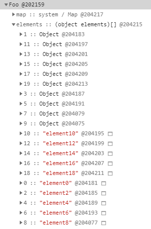
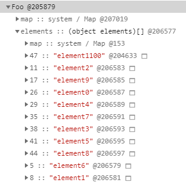

# Fast And Slow Properties


<!-- TOC -->

- [Fast And Slow Properties](#fast-and-slow-properties)
    - [常规属性 (properties) 和排序属性 (element)](#常规属性-properties-和排序属性-element)
        - [对象内属性 (in-object properties)](#对象内属性-in-object-properties)
    - [快属性和慢属性](#快属性和慢属性)
        - [常规属性的情况](#常规属性的情况)
        - [排序属性的情况](#排序属性的情况)
    - [References](#references)

<!-- /TOC -->


## 常规属性 (properties) 和排序属性 (element)
1. 参考下面这样一段代码
    ```js
    function Foo() {
        this[100] = 'test-100'
        this[1] = 'test-1'
        this["B"] = 'bar-B'
        this[50] = 'test-50'
        this[9] =  'test-9'
        this[8] = 'test-8'
        this[3] = 'test-3'
        this[5] = 'test-5'
        this["A"] = 'bar-A'
        this["C"] = 'bar-C'
    }
    var bar = new Foo()


    for(key in bar){
        console.log(`index:${key}  value:${bar[key]}`)
    }
    ```
    段代码所打印出来的结果
    ```
    index:1  value:test-1
    index:3  value:test-3
    index:5  value:test-5
    index:8  value:test-8
    index:9  value:test-9
    index:50  value:test-50
    index:100  value:test-100
    index:B  value:bar-B
    index:A  value:bar-A
    index:C  value:bar-C
    ```
2. 我们发现打印出来的属性顺序并不是我们设置的顺序，我们设置属性的时候是乱序设置的，但是输出的内容却非常规律，总的来说体现在以下两点：
    * 设置的数字属性被最先打印出来了，并且是按照数字大小的顺序打印的；
    * 设置的字符串属性依然是按照之前的设置顺序打印的。
3. 之所以出现这样的结果，是因为在 ECMAScript 规范中定义了 **数字属性应该按照索引值大小升序排列，字符串属性根据创建时的顺序升序排列**。根据下面将要说的快属性和慢属性，只有使用线性数据结构的快属性是按照这个顺序，使用非线性结构的慢属性则没有顺序要求。
4. 在这里我们把对象中的数字属性称为 **排序属性**，在 V8 中被称为 elements，字符串属性就被称为 **常规属性**，在 V8 中被称为 properties。
5. 在 V8 内部，为了有效地提升存储和访问这两种属性的性能，分别使用了两个 **线性数据结构** 来分别保存排序属性和常规属性，具体结构如下图所示（图中的 “element” 应该为复数形式）
    
6. 通过上图我们可以发现，`bar` 对象包含了两个隐藏属性：`elements` 属性和 `properties` 属性，`elements` 属性指向了 elements 对象，在 elements 对象中，会按照顺序存放排序属性，`properties` 属性则指向了 properties 对象，在 properties 对象中，会按照创建时的顺序保存了常规属性。
7. 分解成这两种线性数据结构之后，如果执行索引操作，那么 V8 会先从 elements 属性中按照顺序读取所有的元素，然后再在 properties 属性中读取所有的元素，这样就完成一次索引操作。

### 对象内属性 (in-object properties)
1. 将不同的属性分别保存到 `elements` 属性和 `properties` 属性中简化了程序的复杂度，但是在查找元素时，却多了一步操作。比如执行 `bar.B` 这个语句来查找 `B` 的属性值， V8 会先查找出 `properties` 属性所指向的对象 properties，然后再在 properties 对象中查找 `B` 属性，这种方式在查找过程中增加了一步操作，因此会影响到元素的查找效率。
2. 基于这个原因，V8 采取了一个权衡的策略以加快查找属性的效率，这个策略是将部分 **常规属性** 直接存储到对象本身，我们把这称为 **对象内属性** (in-object properties)
    
3. **排序属性** 并不存在对象内属性，都是保存在 elements 对象中。
4. 不过对象内属性的数量是固定的，默认是 10 个，如果添加的属性超出了对象分配的空间，则它们将被保存在常规属性存储中，也就是 properties 对象中。
5. 使用如下构造函数测试
    ```js
    function Foo(property_num,element_num) {
        // 添加排序属性
        for (let i = element_num - 1; i >= 0 ; i--) {
            this[i] = `element${i}`;
        }
        // 添加常规属性
        for (let i = property_num - 1; i >= 0 ; i--) {
            let ppt = `property${i}`
            this[ppt + '_key'] = ppt + '_value';
        }
    }
    ```
6. 只添加 10 个属性时
    ```js
    let foo1 = new Foo(10, 10);
    ```
    `foo` 对象中只有 `elements` 属性没有 `properties` 属性，说明常规属性都保存为了对象内属性
    
    （同级别中，下面会列出所有的属性，那些应该只是作为展示方便调试，并不代表是对象内属性）
6. 添加 20 个属性时
    ```js
    let foo2 = new Foo(20, 20);
    ```
     `foo` 对象中有了 `properties` 属性，其中按照添加时的顺序保存了 10 个后添加属性，说明开始添加的 10 个常规属性是保存为了对象内属性。排序属性仍然是全部直接保存在 elements 对象中（注意确实是按照索引顺序的，只不过在图上索引本身的显示是十位数的跑到上面了）。
    


## 快属性和慢属性
1. 通常，我们将保存在线性数据结构中的属性称之为 “快属性”，因为线性数据结构中只需要通过索引即可以访问到属性，虽然访问线性结构的速度快，但是如果线性结构中属性很多时，添加或者删除操作的效率会非常低。
2. 因此，如果一个对象的属性过多时，V8 就会采取另外一种存储策略，那就是 “慢属性” 策略，慢属性的对象内部会有独立的非线性数据结构 (字典) 作为属性存储容器。所有的属性元信息不再是线性存储的，也不会有前 10 个保存为对象内属性，而是全部都保存在非线性的属性字典中
    

### 常规属性的情况
1. 在我当前环境测试中，当对象有不超过 25 个常规属性时，前 10 个会保存为对象内属性，剩下的会保存在 **线性的** properties 对象中
    ```js
    let foo5 = new Foo(25, 25);
    ```
    
    可以看到，后添加 15 个常规属性保存在 properties 中，而且是按照添加顺序保存的（同样注意这里索引号的显示是乱的）。因为是按照添加顺序线性保存的，所以没有保存属性的 key，可以直接通过索引号来索引。
2. 如果是大于 25 个常规属性的情况，则 **全部的** 属性的会保存在 **非线性的** properties 对象中
    ```js
    let foo6 = new Foo(26, 26);
    ```
    
    可以看到，现在全部的 26 个常规属性都保存在了 properties 对象中，并没有属性保存为对象内属性。而且保存在 properties 中的属性也是非线性的，并不是按照添加顺序。因为不是线性的，所以不能按照索引号索引，所以会同时相邻的保存属性的 key 和 value。
3. 因为快属性的数据结构更适合查找而不适合删除，所以 “少用 `delete` 删除属性” 这条优化建议可以在快属性状态下有效。快属性状态下删掉一个属性后，会转为使用慢属性模式（少用 `delete` 删除属性不仅是因为这一个原因，还有使用隐藏类时的考虑）
    ```js
    delete foo5.property5_key
    ```
    

### 排序属性的情况
1. 排序属性很多时并不会变成慢属性，这一点和数组的情况比较相似。
2. 但即使排序属性存储不同类型的属性值，仍然不会变成慢属性。如下测试
    ```js
    function Foo(property_num,element_num) {
        // 添加排序属性
        for (let i = element_num - 1; i >= 0 ; i--) {
            if (i % 2) {
            this[i] = {};
            }
            else {
                this[i] = `element${i}`;
            }

        }
        // 添加常规属性
        for (let i = property_num - 1; i >= 0 ; i--) {
            let ppt = `property${i}`
            this[ppt + '_key'] = ppt + '_value';
        }
    }

    let foo = new Foo(10, 100);
    ```
    
3. 但是如果索引号很稀疏，那就会变为慢属性模式
    ```js
    function Foo(property_num,element_num) {
        for (let i = element_num - 1; i >= 0 ; i--) {
            this[i] = `element${i}`;
        }
        for (let i = property_num - 1; i >= 0 ; i--) {
            let ppt = `property${i}`
            this[ppt + '_key'] = ppt + '_value';
        }
    }
    let foo = new Foo(10, 10);
    foo[1100] = "element1100"
    ```
    


## References
* [图解 Google V8](https://time.geekbang.org/column/intro/296)
* [Fast properties in V8](https://v8.dev/blog/fast-properties)
* [V8 是怎么跑起来的 —— V8 中的对象表示](https://www.cnblogs.com/chargeworld/p/12236848.html)
