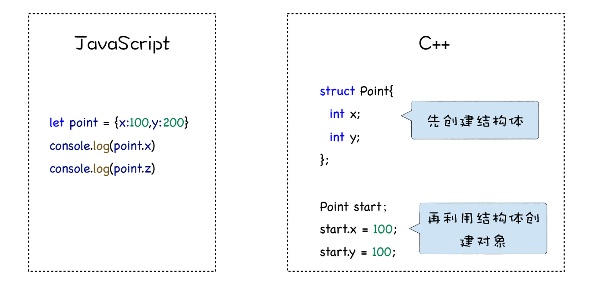
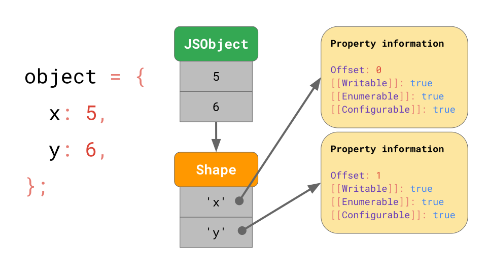
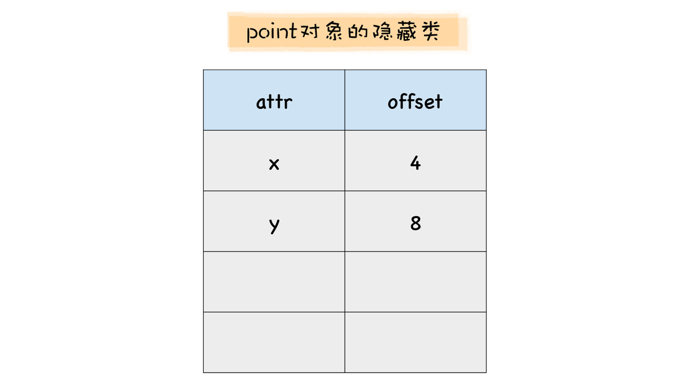
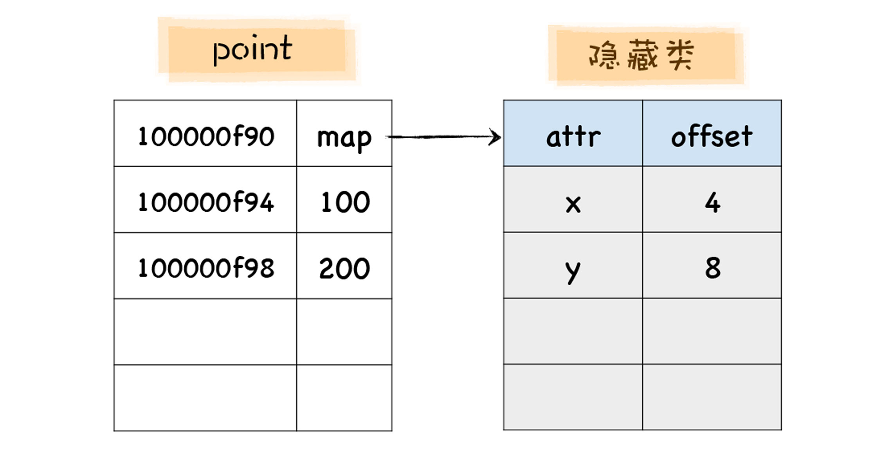
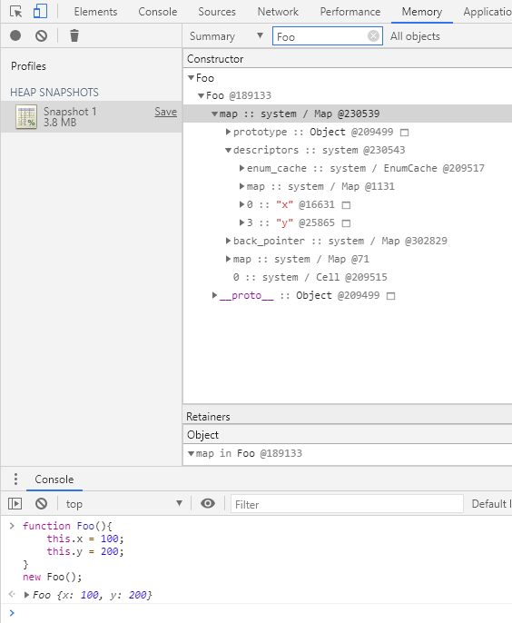
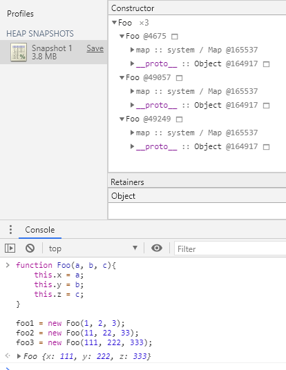
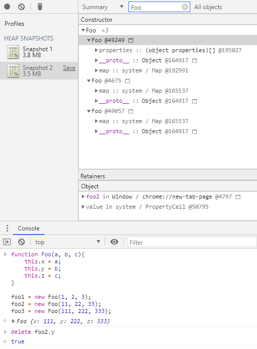
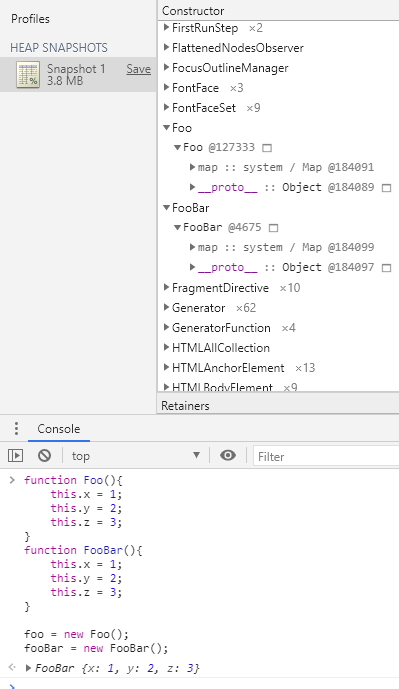
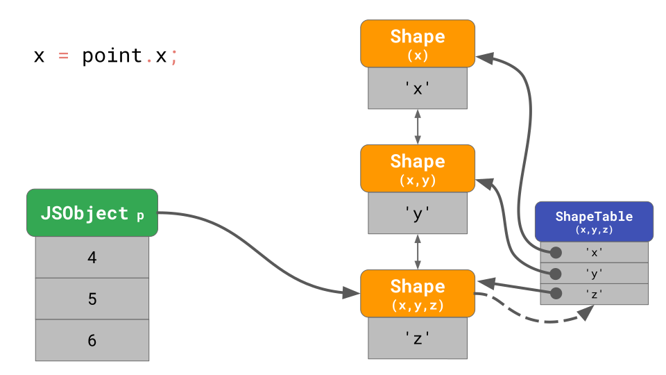

# Hidden Class


<!-- TOC -->

- [Hidden Class](#hidden-class)
    - [设计目的](#设计目的)
        - [关键细节](#关键细节)
    - [实现原理](#实现原理)
        - [基础的隐藏类](#基础的隐藏类)
        - [隐藏类链——对象再添加属性后的补救措施](#隐藏类链对象再添加属性后的补救措施)
        - [隐藏类 table——对隐藏类链的优化](#隐藏类-table对隐藏类链的优化)
    - [抽象本质](#抽象本质)
    - [设计思想](#设计思想)
        - [Shape——灵活与高效的权衡](#shape灵活与高效的权衡)
    - [静态语言访问属性的效率更高](#静态语言访问属性的效率更高)
    - [隐藏类 (Hidden Class）](#隐藏类-hidden-class)
    - [多个对象共用一个隐藏类](#多个对象共用一个隐藏类)
    - [Transition chains and trees](#transition-chains-and-trees)
        - [使用 ShapeTable 来优化长链查询](#使用-shapetable-来优化长链查询)
        - [Transition trees](#transition-trees)
    - [重新构建隐藏类会降低效率](#重新构建隐藏类会降低效率)
    - [数组的情况](#数组的情况)
    - [最佳实践](#最佳实践)
    - [References](#references)

<!-- /TOC -->


## 设计目的
1. 根据 `Theories/Languages/JavaScript/V8/Basic/JIT.md` 讲到的内容，优化编译器的工作方式是对代码做出假设，而最重要的假设之一就是数据类型不变。
2. 隐藏类的作用就是这样的假设，它负责把对象静态化。假定同一个构造函数创建的对象有相同的属性，相同的属性类型，并且后期不会增删属性。
3. 这样的假设，就使得对象在内存中的偏移量是固定的，可以快速查找。
4. 基于这样形状不变的假设，引擎可以把对象编译成高效的机器码。

### 关键细节
* 如果创建好对象后再添加属性，隐藏类保存的 shape 是不是完全失效？如果不是会怎么做？


## 实现原理
### 基础的隐藏类
1. 引擎为每个对象创建一个隐藏类，其中保存了对象的 shape 信息：对象有哪些属性，每个属性的内存偏移量是多少。
2. 现在每个属性的偏移量就是固定的了，不用每次访问时想要计算一下偏移量。
3. 既然固定下来了，样就可以编译为高效的机器码了。
4. 这个隐藏类不只是给这一个对象实例使用，只要是相同构造函数创建的对象，只要 shape 不改变，那都是共用这一个隐藏类。这也正是它被称为 “类” 的原因。
5. 既然是类，那它里面就不保存对象实例的具体属性值，只保存 shape 信息。

### 隐藏类链——对象再添加属性后的补救措施
1. 对象如果创建好之后有添加了属性，显然 shape 就会发生变化。
2. 但之前的 shape 还是可以用的，而且可能还被其他对象共用，所以不需要抛弃。
3. 这里的不就措施是在单独为新添加的属性建立一个隐藏类，然后连接到之前的隐藏类上。
4. 之前要查找一个属性，只是在单一的隐藏类中查找偏移量，现在就需要在隐藏类链里面查找了。
5. 每次查找是从最后添加的隐藏类开始沿着链查找。可以想象，如果反复添加新属性，这个链就会越长，查找越早添加的属性的成本就会越高。

### 隐藏类 table——对隐藏类链的优化
1. 如果隐藏类链很长查找就很慢，所以引擎实现了一个 ShapeTable，它是从属性名到该属性隐藏类之间的映射。
2. 这个 table 是连接在最新添加的隐藏类上。当你从最新添加的隐藏类开始查找一个属性时，不需要沿着长长的链查找，只需要，只需要从 table 中查找属性名就可以直接访问到其所在的隐藏类。


## 抽象本质
1. 把 JavaScript 可变的对象变成 C 结构体那样不可变数据结构。


## 设计思想
### Shape——灵活与高效的权衡
1. 要说 JavaScript 中使用 shape 的设计思想，那其实就只是模仿静态语言。
2. 但在 JavaScript 这里有趣的是，它是在灵活的基础上提供了高效的选项。默认优先给你高效的，但如果你的场景需要为了灵活而牺牲效率，那引擎也提供了这个选项。
3. 而且即使你牺牲性能在创建对象之后再添加属性，引擎也会通过 transition chain 的形式尽可能的优化；甚至在你进一步牺牲性能创建了很长的 transition chain 时，引擎也会通过 ShapeTable 尽可能的进行优化。
4. 这么说来，提升了性能之后的 JavaScript，它的灵活不仅仅是体现在灵活本身，而是体现在使用者可以在灵活和高效之间作选择。


## 静态语言访问属性的效率更高
1. 我们通过下面两段代码，来对比一下动态语言和静态语言在运行时的一些特征
    
2. 我们知道，JavaScript 在运行时，对象的属性是可以被修改的，所以当 V8 使用了一个对象时，比如使用了 `point` 的时候，它并不知道该对象中是否有 `x`，也不知道 `x` 相对于对象的偏移量是多少，也可以说 V8 并不知道该对象的具体的 **形状**（Shape）。
3. 那么，当在 JavaScript 中要查询对象 `point` 中的 `x` 属性时，V8 会按照具体的规则一步一步来查询，这个过程非常的慢且耗时。
4. C++ 代码在执行之前需要先被编译，编译的时候，每个对象的形状都是固定的，也就是说，在代码的执行过程中，`Point` 的形状是无法被改变的。
5. 那么在 C++ 中访问一个对象的属性时，自然就知道该属性相对于该对象地址的偏移值了。比如在 C++ 中使用 `start.x` 的时候，编译器会直接将 `x` 相对于 `start` 的地址写进汇编指令中，那么当使用了对象 `start` 中的 `x` 属性时，CPU 就可以直接去内存地址中取出该内容即可，没有任何中间的查找环节。


## 隐藏类 (Hidden Class）
1. V8 将这种静态的特性引入，目前所采用的一个思路就是将 JavaScript 中的对象静态化，也就是 V8 在运行 JavaScript 的过程中，会假设 JavaScript 中的对象是静态的。
2. 具体地讲，V8 对每个对象做如下两点假设：
    * 对象创建好了之后就不会添加新的属性；
    * 对象创建好了之后也不会删除属性。
3. 符合这两个假设之后，V8 就可以对 JavaScript 中的对象做深度优化了。
4. 具体地讲，V8 会为每个对象创建一个隐藏类，对象的隐藏类中记录了该对象一些基础的布局信息，包括以下两点：
    * 对象中所包含的所有的属性；
    * 每个属性相对于对象的偏移量。
5. 有了隐藏类之后，那么当 V8 访问某个对象中的某个属性时，就会先去隐藏类中查找该属性相对于它的对象的偏移量。有了偏移量和属性类型，V8 就可以直接去内存中取出对于的属性值，而不需要经历一系列的查找过程，那么这就大大提升了 V8 查找对象的效率。
6. 结合一段代码来分析下隐藏类是怎么工作的
    ```js
    let point = {x:100,y:200}
    ```
7. 当 V8 执行到这段代码时，会先为 `point` 对象创建一个隐藏类。在 V8 中，把隐藏类又称为 **map**，每个对象都有一个 `map` 属性，其值指向内存中的隐藏类。
8. 隐藏类描述了对象的属性布局，它主要包括了属性名称和每个属性所对应的偏移量，以及每个属性的描述符。
      
9. 注意这里只有属性值保存在对象里，属性名及其描述符都保存在隐藏类里。也就是说对象的信息都保存在隐藏类中，而具体使用时保存的值保存在具体对象里。这里的隐藏类就相当于 C 中声明的结构体。
10. 比如 `point` 对象的隐藏类就包括了 `x` 和 `y` 属性，`x` 的偏移量是 4，`y` 的偏移量是 8
    
11. 关于 `point` 对象和它的 `map` 之间的关系，你可以参看下图
    
    左边的是 `point` 对象在内存中的布局，右边是 `point` 对象的 map，我们可以看到，`point` 对象的第一个属性就指向了它的 map。
12. 既然 JS 对象本身没有形状，那就为对象创建一个外在的作为形状表的隐藏类，然后让对象引用隐藏类来使用形状信息。
13. 实际测试
    


## 多个对象共用一个隐藏类
1. 如果两个对象的形状是相同的，V8 就会为其复用同一个隐藏类，这样有两个好处：
    * 减少隐藏类的创建次数，也间接加速了代码的执行速度；
    * 减少了隐藏类的存储空间。
2. 那么，什么情况下两个对象的形状是相同的，要满足以下几点：
    * 相同的构造函数和原型？TODO
    * 相等的属性个数；
    * 相同的属性名称；
    * 相同属性的属性具有相同的描述符：`[[writable]]`、`[[enumerable]]`、`[[configurable]]`
    * 相同的初始化顺序（偏移量？）。即使属性都一样，但顺序不同，也会导致形状不同。使用字面量创建对象时有这个可能。
       
3. 下面用同一个构造函数创建了三个对象，可以看到它们的 map 都是一样的
       
4. 但是删掉 `foo2` 的 `y` 属性后，它的 map 就和其他两个不一样了
       
5. 不过看起来如果不是来自于同一个构造函数，即使形状相同也不会复用 map。而且我尝试让这两个构造函数使用同样的原型，结果还是不同的 map
       


## Transition chains and trees
1. 如果你有一个具有特定形状的对象，但你又向它添加了一个属性，此时会发生什么？ JavaScript 引擎是如何找到这个新形状的？例如下面的情况
    ```js
    const object = {};
    object.x = 5;
    object.y = 6;
    ```  
2. 在 JavaScript 引擎中，shape 的表现形式被称作 transition 链。以下是一个示例
       
3. 该对象在初始化时没有任何属性，因此它指向一个空的 shape。下一个语句为该对象添加值为 5 的属性 `x`，所以 JavaScript 引擎转向一个包含属性 `x` 的 shape；接下来一个语句添加了一个属性 `y`，引擎便转向另一个包含 `x` 和 `y` 的 shape。
4. 我们甚至不需要为每个 shape 存储完整的属性表。相反，每个 shape 只需要知道它引入的新属性。在此例中，我们不必在最后一个 shape 中存储关于 `x` 的信息，因为它可以在更早的链上被找到。
5. 要做到这一点，每一个 shape 都会与其之前的 shape 相连（注意 shape 之间的连接从前面的单向箭头变成了双向箭头）
       
6. 如果你在 JavaScript 代码中写到了 `o.x`，则 JavaScript 引擎会沿着 transition 链去查找属性 `x`，直到找到引入属性 `x` 的 shape。
7. 注意看图片中，对象是和最后添加的属性的 shape 关联的。那么可以想象，如果反复为一个对象添加新属性，这个链就会很长，查找越早添加的某个属性的 shape 也就会越耗时。
8. 幸好，在通过字面量创建对象时，里面的属性并不是这样一个一个添加的。引擎对已包含属性的对象字面量会应用一些优化，它会直接创建一个包含当前属性的 shape，而不是从空 shape 开始一个一个的组成 transition 链
       
9. 这正是 “使用对象字面量创建对象时一次性写完所有属性” 这个优化建议的原因。（另一个建议是尽量使用字面量创建对象，因为省去了调用构造函数）

### 使用 ShapeTable 来优化长链查询
1. 以下面代码为例
    ```js
    const point = {};
    point.x = 4;
    point.y = 5;
    point.z = 6;
    ```
2. 这里忽略掉空的 shape 的话，会生成具有 3 个 shape 的链
       
3. 如果要查找 `point.x`，引擎需要从链的最下端开始查找，一路查找到顶端才能找到找到 `x` 的偏移。
4. 为了优化这种情况，引擎使用了叫做 **ShapeTable** 的字典数据结构，从属性的 key 映射到属性的 shape
       
    
### Transition trees
1. 但是，如果不能只创建一个 transition 链呢？例如，如果你有两个空对象，并且你为每个对象都添加了一个不同的属性
    ```js
    const object1 = {};
    object1.x = 5;
    const object2 = {};
    object2.y = 6;
    ```
2. 在这种情况下我们便必须进行分支操作，此时我们最终会得到一个 transition 树而不是 transition 链
         
3. 在这里，我们创建一个空对象 `a`，然后为它添加一个属性 `x`。 我们最终得到一个包含单个值的 JSObject，以及两个 shape：空 shape 和仅包含属性 `x` 的 Shape。
4. 第二个对象也是从一个空对象 `b` 开始的，但之后被添加了一个不同的属性 `y`。我们最终形成两个 shape 链，总共是三个 shape。
5. 到了这里，看起来引入 shape 机制也没有快多少，为了查找一个属性的偏移还是很费劲的。但引入 shape 还是有重要意义的，因为虽然查找一个属性的偏移也比较麻烦，但是这个偏移可以被缓存下来，供给 inline cache 使用。Inline cache 正是 shape 真正发挥作用的地方。
    

## 重新构建隐藏类会降低效率
1. JavaScript 作为动态语言，在执行过程中，对象的形状是可以被改变的。
2. 从上面可以看到，如果添加属性、删除属性或者修改属性的数据类型，都会导致隐藏类结构的变化。
3. 这不仅意味着引擎要为新改变的对象重新构建新的隐藏类，而且还可能会增加 transition 链的长度。这对于执行效率来说是一笔大的开销。


## 数组的情况
1. 考虑这个数组：
    ```js
    const array = [
        '#jsconfeu',
    ];
    ```
2. 引擎存储了数组长度（1），并指向包含 `offset` 和 `length` 特性属性的 shape
       
3. 这里面没有看到数组项的值，因为每个数组都有一个单独的 **elements backing store**，其中包含所有数组索引的属性值
       
4. 同时注意上图中，elements 右边存储了数组元素的属性特性，这个特性默认情况下并不是针对某个数组项的，而是所有数组项通用的。因为默认情况下，数组项都是可写的，可枚举的以及可配置的，所以不需要为每个数组项单独保存一个。
5. 但是如果更改了数组元素的属性，该怎么办？例如下面的情况
    ```js
    // Please don’t ever do this!
    const array = Object.defineProperty(
        [],
        '0',
        {
            value: 'Oh noes!!1',
            writable: false,
            enumerable: false,
            configurable: false,
        }
    );
    ```
6. 在这种边缘情况下，JavaScript 引擎会将 elements backing store 整体表示为一个由数组下标映射到属性特性的字典
       
7. 注意此时 elements 中的元素不是直接保存值了，而是保存序号然后映射到属性特性，值也保存在属性特性中。
8. 即使只有一个数组元素具有非默认属性，整个数组的 backing store 处理也会进入这种缓慢而低效的模式。因此不要在数组索引上使用 `Object.defineProperty`。


## 最佳实践
* 生成对象后不要删除或增加属性 —— 不改变 hidden class 的 shape
* 生成对象后不要修改属性类型 —— 不改变 hidden class 的 shape
* 生成对象后不要修改属性描述符 —— 不改变 hidden class 的 shape
* 字面量创建对象时一次写完所有的属性 —— 保持 transition chain 只有一节
* 字面量创建同类对象时每次都按照固定的顺序定义属性 —— 不改变 hidden class 的 shape
* 不要修改数组元素的属性描述符 —— 避免保存数组元素值的 backing store 中每个元素都单独的映射到各自独立的属性特性对象


## References
* [图解 Google V8](https://time.geekbang.org/column/intro/296)
* [JavaScript engine fundamentals: Shapes and Inline Caches](https://mathiasbynens.be/notes/shapes-ics)
* [JavaScript engine fundamentals: Shapes and Inline Caches 译文](https://hijiangtao.github.io/2018/06/17/Shapes-ICs/)