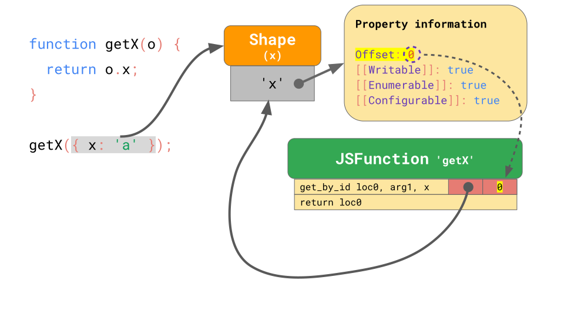
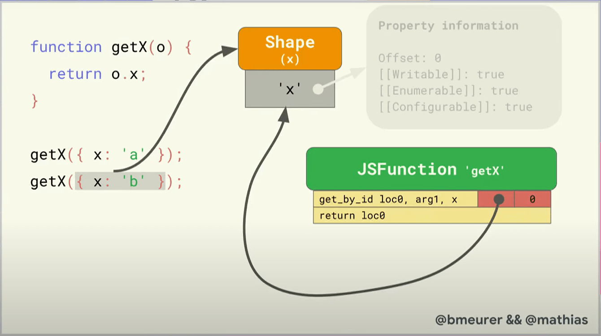
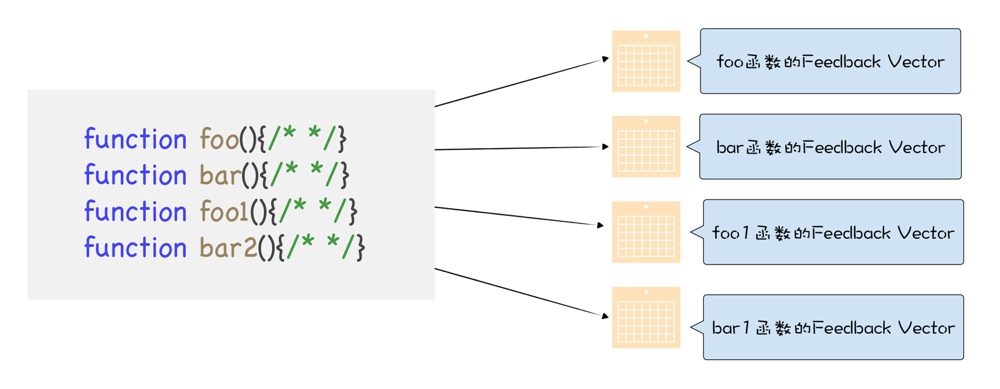
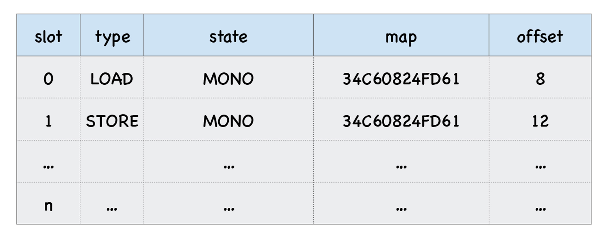
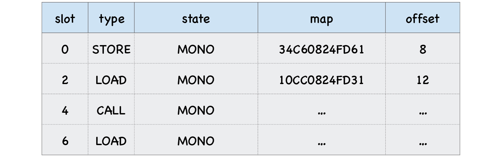
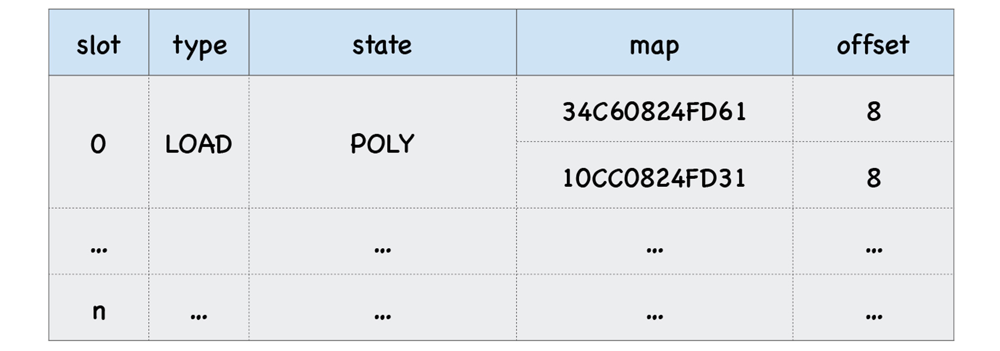

# Inline Caches


<!-- TOC -->

- [Inline Caches](#inline-caches)
    - [简单讲解](#简单讲解)
    - [复杂讲解](#复杂讲解)
        - [具体的例子](#具体的例子)
    - [多态和超态](#多态和超态)
    - [最佳实践](#最佳实践)
    - [References](#references)

<!-- /TOC -->


## 简单讲解
1. 隐藏类（属性 Shape）的主要动机就是为了实现 **内联缓存**（Inline Caches，ICs）。我们实现了属性的 shape 后，可以提升查找属性的速度。但是每次还是要先查找隐藏类，然后再根据隐藏类中的偏移来查找属性值。如果存在反复查找某个属性的情况时，还是希望可以再进一步简化查找步骤。于是我们通过内联缓存来进一步加速。
2. ICs 是促使 JavaScript 快速运行的关键因素。JavaScript 引擎利用 ICs 来记忆去哪里寻找对象属性的信息，以减少昂贵的重复查找。
3. 这里有一个函数 `getX`，它接受一个对象并从中取出属性 `x` 的值：
    ```js
    function getX(o) {
        return o.x;
    }
    ```
4. 如果我们在 JSC（JavaScriptCore，Apple 的 JavaScript 引擎） 中执行这个函数，它会生成如下字节码
       
5. 第一条指令 `get_by_id` 从第一个参数 `arg1` 中加载属性 `x` 的值并将其存储到地址 `loc0` 中；第二条指令返回我们存储到 `loc0` 中的内容。
6. 注意第一条指令后面两个空格，这个就是 JSC 还在 `get_by_id` 指令中嵌入的 Inline Cache，它由两个未初始化的插槽组成。
7. 现在假设我们用对象 `{x：'a'}` 调用 `getX` 函数。正如我们所知，这个对象有一个包含属性 `x` 的隐藏类（shape），该 shape 存储了属性 `x` 的偏移量和其他特性
       
8. 当你第一次执行该函数时，`get_by_id` 指令将查找 `o.x`，为了快速找到 `o.x` 的值，会先查找 `o` 的 shape，然后进一步找到偏移量，然后找到 `o.x` 的值。
9. 其实这个过程也是要经过好几次查询。尤其是当你要查找比较长的  transition chain 的时候就更加耗时。如果每次查找同一个属性还这么耗时，那就会浪费很多时间。
10. 所以实际上引擎在第一次函数调用时，在查找到属性所在对象的 shape 和偏移量后，会把这些信息存储到这条指令的 IC 的两个插槽里
       
11. 后续再运行这个指令时，IC 只需要对比 shape，如果它与以前相同，只需从记忆的偏移量处加载该属性值，而不需要再去访问 shape 具体的信息
       
    还是需要对比一下 shape 的，只不过不需要再加载 shape 并从里面读取偏移量。
    

## 复杂讲解
1. IC 的原理很简单，直观地理解，就是在 V8 执行函数的过程中，会观察函数中一些 **调用点** (CallSite) 上的关键的中间数据，然后将这些数据缓存起来，当下次再次执行该函数的时候，V8 就可以直接利用这些中间数据，节省了再次获取这些数据的过程。
2. IC 会为每个函数维护一个 **反馈向量** (FeedBack Vector)，反馈向量记录了函数在执行过程中的一些关键的中间数据
      
3. 反馈向量其实就是一个表结构，它由很多项组成的，每一项称为一个 **插槽** (slot)。V8 会将执行函数的中间数据依次写入到反馈向量的插槽中。
4. 比如下面这段函数
    ```js
    function loadX(o) { 
        o.y = 4
        return o.x
    }
    ```
    当 V8 执行这段函数的时候，它会判断 `o.y = 4` 和 `return o.x` 这两段是调用点，因为它们使用了对象和属性。那么 V8 会在 `loadX` 函数的反馈向量中为每个调用点分配一个插槽（这里的一个插槽对应上面简单讲解中的一组两个插槽）。
5. 每个插槽中包括了插槽的索引 (slot index)、插槽的类型 (type)、插槽的状态 (state)、隐藏类 (map) 的地址、还有属性的偏移量。
6. 比如上面这个函数中的两个调用点都使用了对象 `o`，那么反馈向量两个插槽中的 `map` 属性也都是指向同一个隐藏类的，因此这两个插槽的 `map` 地址是一样的    
      
    
### 具体的例子
1. 以下面代码为例
    ```js
    function foo(){}
    function loadX(o) { 
        o.y = 4
        foo()
        return o.x
    }
    loadX({x:1,y:4})
    ```
2. 具体的指令不懂，在 [这里](https://time.geekbang.org/column/intro/296)。这里直接看生成的 IC，如下
      
3. 第一个插槽的类型为 `STORE`，对应将累加器中的 4 赋给 `o.y`；第二个插槽的类型为 `LOAD`，对应加载函数 `foo`；第三个插槽的类型为 `CALL`，对应调用函数 `foo`；第四个插槽的类型为 `LOAD`，对应 `return o.x` 时加载该属性。
4. 当 V8 再次调用 `loadX` 函数时，比如执行到 `return o.x` 语句时，它就会在对应的插槽中查找 `x` 属性的偏移量，之后就能直接去内存中获取 `o.x` 的属性值了。这样就大大提升了执行效率。


## 多态和超态
1. 通过缓存执行过程中的基础信息，就能够提升下次执行函数时的效率。但是这有一个前提，那就是多次执行时，对象的形状是固定的。如果对象的形状不是固定的，那 V8 会怎么处理呢？
2. 例如下面的代码
    ```js
    function loadX(o) { 
        return o.x
    }
    var o = { x: 1,y:3}
    var o1 = { x: 3, y:6,z:4}
    for (var i = 0; i < 90000; i++) {
        loadX(o)
        loadX(o1)
    }
    ```
    可以看到，对象 `o` 和 `o1` 的形状是不同的，这意味着它们的隐藏类也是不同的。
3. 第一次执行时 `loadX` 时，V8 会将 `o` 的隐藏类记录在反馈向量中，并记录属性 `x` 的偏移量。当再次调用 `loadX` 函数时，V8 会取出反馈向量中记录的隐藏类，并和 `o1` 的隐藏类进行比较，发现不是一个隐藏类，那么此时 V8 就无法使用反馈向量中记录的偏移量信息了。
4. 面对这种情况，V8 会选择将新的隐藏类也记录在反馈向量中，同时记录属性值的偏移量。这时，反馈向量中的第一个槽里就包含了两个隐藏类和偏移量
      
5. 当 V8 再次执行 `loadX` 函数中的 `o.x` 语句时，同样会查找反馈向量表，发现第一个槽中记录了两个隐藏类。这时，V8 需要用参数对象的隐藏类和第一个插槽中的两个隐藏类来一一比较：如果和插槽中某个隐藏类相同，那么就使用该命中的隐藏类的偏移量（在本例中，会命中其中一个）；如果没有相同的，例如又传入了一个形状和前两个都不同的新对象，那将新对象的隐藏类信息也会被添加到反馈向量的第一个插槽中。
6. 现在我们知道了，一个反馈向量的一个插槽中可以包含多个隐藏类的信息，那么：
    * 如果一个插槽中只包含 1 个隐藏类，那么我们称这种状态为 **单态** (monomorphic)；
    * 如果一个插槽中包含了 2～4 个隐藏类，那我们称这种状态为 **多态** (polymorphic)；
    * 如果一个插槽中超过 4 个隐藏类，那我们称这种状态为 **超态** (magamorphic)。
7. 如果函数 `loadX` 的反馈向量中存在多态或者超态的情况，其执行效率肯定要低于单态的。比如当执行到 `o.x` 的时候，V8 会查询反馈向量的第一个插槽，发现里面有多个 map 的记录，那么 V8 就需要取出 `o` 的隐藏类，来和插槽中记录的隐藏类一一比较。如果记录的隐藏类越多，那么比较的次数也就越多，这就意味着执行效率越低。比如插槽中包含了 2～4 个隐藏类，那么可以使用线性结构来存储；如果超过 4 个，那么 V8 会采取 hash 表的结构来存储，这无疑会拖慢执行效率。
8. 所以我们需要避免多态和超态的情况，也就在对一类对象重复操作时，尽量让所有的对象属性是不变的。比如使用这个 `loadX(o)` 函数时，尽量不要使用多个不同形状的 `o` 对象作为参数。在这方面又体现出了静态类型语言的优势。


## 最佳实践
1. 因为 Inline Caches 就是用来缓存 Hidden Class 的，所以仍然是和 Hidden Class 一样的最佳实践，这样才能保证缓存可用。
2. 当然因为 Inline Caches 中多态和超态机制的存在，可以保存多个版本的缓存供对比选择，但对比仍然需要付出成本。所以依然要尽量保持函数操作的一类对象尽量少改变形状。


## References
* [图解 Google V8](https://time.geekbang.org/column/intro/296)
* [JavaScript engine fundamentals: Shapes and Inline Caches](https://mathiasbynens.be/notes/shapes-ics)
* [JavaScript engine fundamentals: Shapes and Inline Caches 译文](https://hijiangtao.github.io/2018/06/17/Shapes-ICs/)