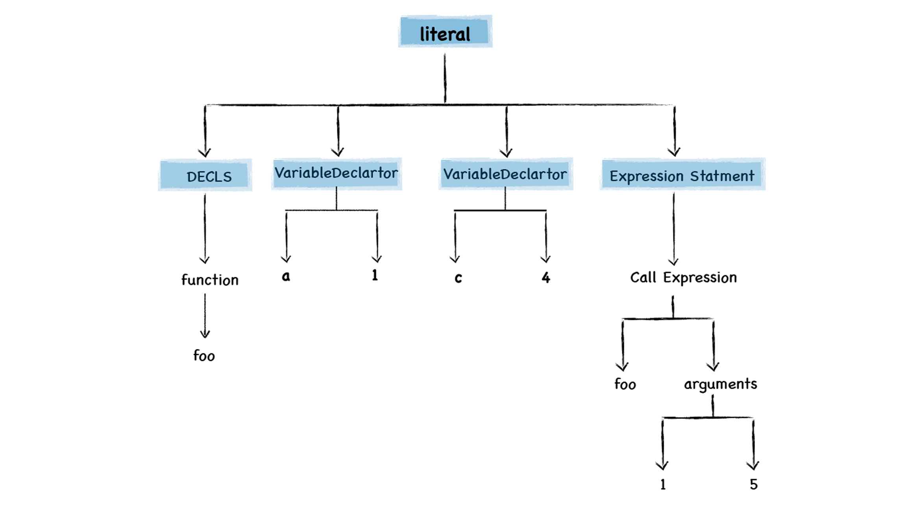

# Lazy Parsing


<!-- TOC -->

- [Lazy Parsing](#lazy-parsing)
    - [惰性解析](#惰性解析)
    - [惰性解析的过程](#惰性解析的过程)
    - [JavaScript 函数导致闭包的三个特性](#javascript-函数导致闭包的三个特性)
        - [JavaScript 语言允许在函数内部定义新的函数](#javascript-语言允许在函数内部定义新的函数)
        - [可以在内部函数中访问父函数中定义的变量](#可以在内部函数中访问父函数中定义的变量)
        - [函数可以作为返回值](#函数可以作为返回值)
    - [闭包给惰性解析带来的问题](#闭包给惰性解析带来的问题)
    - [预解析器的功能](#预解析器的功能)
    - [References](#references)

<!-- /TOC -->


## 惰性解析
1. V8 执行 JavaScript 代码，需要经过编译和执行两个阶段：
    1. 编译过程是指 V8 将 JavaScript 代码转换为字节码或者二进制机器代码的阶段；
    2. 执行阶段则是指解释器解释执行字节码，或者是 CPU 直接执行二进制机器代码的阶段。
2. 在编译 JavaScript 代码的过程中，V8 并不会一次性将所有的 JavaScript 解析为中间代码，这主要是基于以下两点：
    * 首先，如果一次解析和编译所有的 JavaScript 代码，过多的代码会增加编译时间，这会严重影响到首次执行 JavaScript 代码的速度；
    * 其次，解析完成的字节码和编译之后的机器代码都会存放在内存中，如果一次性解析和编译所有 JavaScript 代码，那么这些中间代码和机器代码将会一直占用内存。
3. 基于以上的原因，所有主流的 JavaScript 虚拟机都实现了惰性解析。所谓 **惰性解析** 是指：解析器在解析的过程中，如果遇到函数声明，那么会跳过函数内部的代码，并不会为其生成 AST 和字节码，而仅仅生成顶层代码的 AST 和字节码。惰性解析的过程


## 惰性解析的过程
1. 关于惰性解析，我们可以结合下面这个例子来分析下
    ```js
    function foo(a,b) {
        var d = 100
        var f = 10
        return d + f + a + b;
    }
    var a = 1
    var c = 4
    foo(1, 5)
    ```
2. 当把这段代码交给 V8 处理时，V8 会至上而下解析这段代码。在解析过程中首先会遇到 `foo` 函数，由于这只是一个函数声明语句，V8 在这个阶段只需要将该函数转换为函数对象
    
3. 注意，这里只是将该函数声明转换为函数对象，但是并没有解析和编译函数内部的代码，所以也不会为 `foo` 函数的内部代码生成抽象语法树。
4. 然后继续往下解析，由于后续的代码都是顶层代码，所以 V8 会为它们生成抽象语法树，最终生成的结果如下所示
    
5. 代码解析完成之后，V8 便会按照顺序自上而下执行代码。首先会先执行 `a=1` 和 `c=4`这两个赋值表达式；接下来执行 `foo` 函数的调用。
6. `foo` 函数调用的过程，是从 `foo` 函数对象中取出函数代码，然后和编译顶层代码一样，V8 会先编译 `foo` 函数的代码，编译时同样需要先将其编译为抽象语法树和字节码，然后再解释执行。
7. 不过在 V8 实现惰性解析的过程中，需要支持 JavaScript 中的闭包特性，这会使得 V8 的解析过程变得异常复杂。


## JavaScript 函数导致闭包的三个特性
### JavaScript 语言允许在函数内部定义新的函数
1. 在其他的大部分语言中，函数只能声明在顶层代码中，而 JavaScript 中之所以可以在函数中声明另外一个函数。
2. 主要是因为 JavaScript 中的函数即对象，你可以在函数中声明一个变量，当然也可以在函数中声明一个函数。

### 可以在内部函数中访问父函数中定义的变量
由于可以在函数中定义新的函数，所以很自然的，内部的函数可以使用外部函数中定义的变量。

### 函数可以作为返回值
因为函数是一等公民，所以可以像其他数据类型一样作为函数的返回值。


## 闭包给惰性解析带来的问题
1. 考虑下面的代码
    ```js
    function foo() {
        var d = 20
        return function inner(a, b) {
            const c = a + b + d
            return c
        }
    }
    const f = foo()
    ```
2. 分析下上面这段代码的执行过程：
    1. 当调用 `foo` 函数时，`foo` 函数会将它的内部函数 `inner` 返回给全局变量 `f`；
    2. 然后 `foo` 函数执行结束，执行上下文被 V8 销毁；
    3. 虽然 `foo` 函数的执行上下文被销毁了，但是因为被返回而依然存活的 `inner` 函数引用了 `foo` 函数作用域中的变量 `d`。
3. 这里的矛盾是：既然 `foo` 函数的执行上下文被销毁了，那它的局部变量 `d` 也需要被销毁，但是保存下来的 `inner` 函数却又要引用变量 `d`。
4. 因为采用了惰性解析，所以当执行到 `foo` 函数时，V8 只会解析 `foo` 函数，并不会解析内部的 `inner` 函数，那么这时候 V8 就不知道 `inner` 函数中是否引用了 `foo` 函数的变量 `d`。所以销毁 `foo` 的执行上下文的时候就不知道 `inner` 还需要变量 `d`。
5. 所以我们需要想办法实现：`foo` 的执行上下文可以被销毁，但是内部函数 `inner` 引用的变量缺不能被销毁。为了实现这个功能，需要一个叫做 **预解析器**（preparser）的模块。


## 预解析器的功能
1. V8 引入预解析器，比如当解析顶层代码的时候，遇到了一个函数，那么预解析器并不会直接跳过该函数，而是对该函数做一次快速的预解析。
2. 其主要目的有两个：一个是判断当前函数是不是存在一些语法上的错误；另一个就是要实现闭包的功能。
3. 预解析器会检查函数内部是否引用了外部变量，如果引用了外部的变量，预解析器会将栈中的变量复制到 **堆** 中。在下次执行到该函数的时候，直接使用堆中的引用，这样就解决了闭包所带来的问题。
4. Top-level code is an exception to this rule. The top-level of a script is always heap-allocated, since variables are visible across scripts.
4. TODO，如果嵌套函数不被返回，也会这样吗？


## References
* [图解 Google V8](https://time.geekbang.org/column/intro/296)
* [Blazingly fast parsing, part 2: lazy parsing](https://v8.dev/blog/preparser)