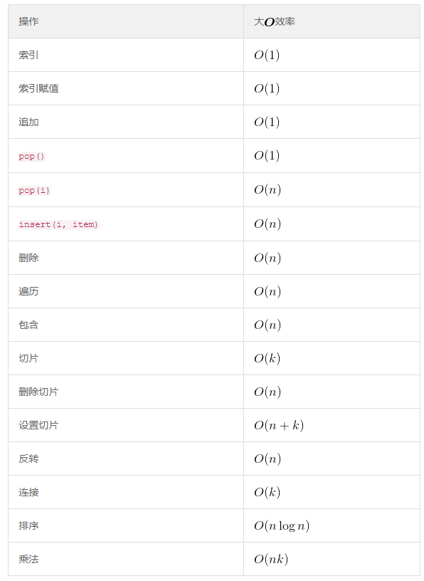
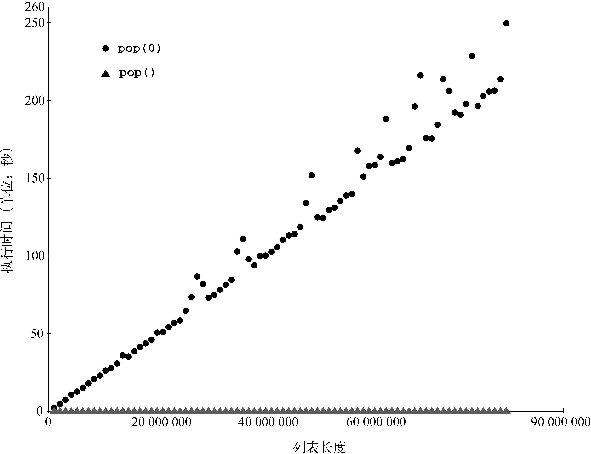
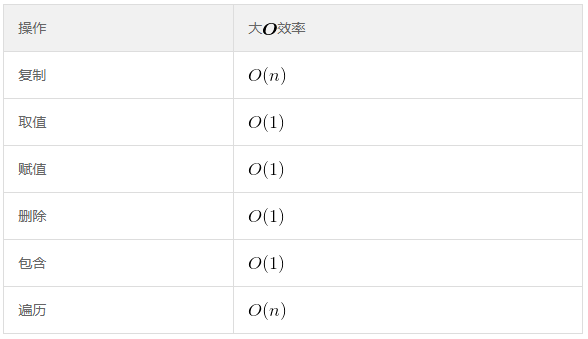
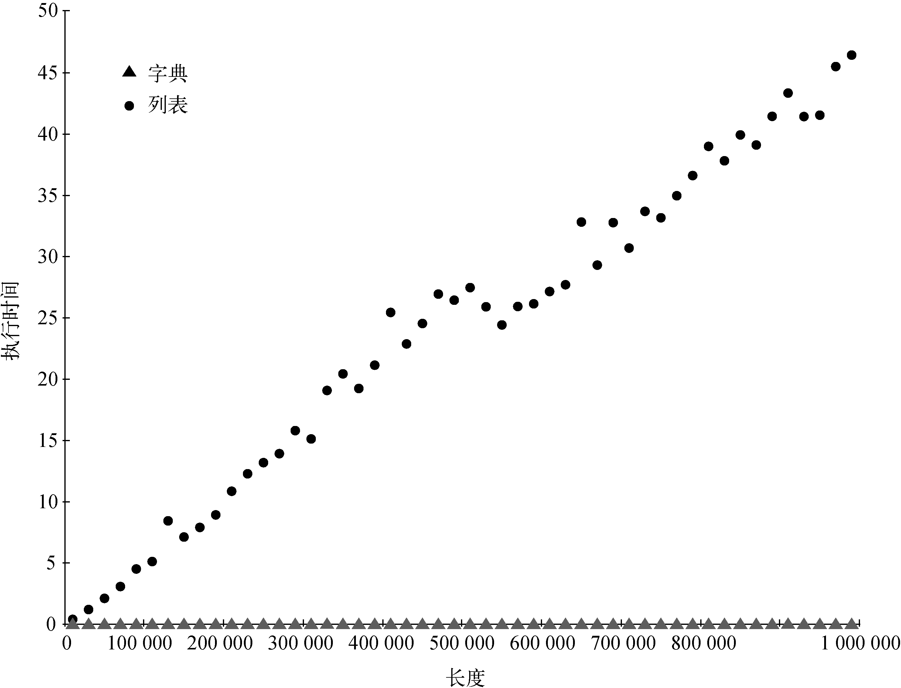

# BigO

## 列表
1. 两个常见操作是索引和给某个位置赋值。无论列表多长，这两个操作所花的时间应该恒定。像这种与列表长度无关的操作就是常数阶的。

### 列表操作的大O效率

1. 在列表末尾调用`pop`时，操作是常数阶的，在列表头一个元素或中间某处调用`pop`时，则是阶的。
2. 原因在于 Python 对列表的实现方式。在 Python 中，从列表头拿走一个元素，其他元素都要向列表头挪一位。这样的设计保证了索引操作为常数阶。Python 的实现者认为这是不错的取舍决策。

### 4种生成列表方式的比较
#### 四种方式
* 用`for`循环通过连接操作创建列表
* 采用追加方法
* 使用列表解析式
* 用列表构造器调用range函数

#### 时间比较
```py
from timeit import Timer

def test1():
    l = []
    for i in range(1000):
        l = l + [i]

def test2():
    l = []
    for i in range(1000):
        l.append(i)

def test3():
    l = [i for i in range(1000)]

def test4():
    l = list(range(1000))

# 创建一个Timer对象，其参数是两条Python语句。第1个参数是要为之计时的Python语句；第2个参数是建立测试的语句
t1 = Timer("test1()", "from __main__ import test1")
# 默认情况下，timeit会执行100万次语句，并在完成后返回一个浮点数格式的秒数。可以给timeit传入参数number，以指定语句的执行次数
print("concat ", t1.timeit(number=10000), "milliseconds")

t2 = Timer("test2()", "from __main__ import test2")
print("append ", t2.timeit(number=10000), "milliseconds")

t3 = Timer("test3()", "from __main__ import test3")
print("comprehension ", t3.timeit(number=10000), "milliseconds")

t4 = Timer("test4()", "from __main__ import test4")
print("list range ", t4.timeit(number=10000), "milliseconds")

# concat  11.106956799999999 milliseconds
# append  0.6252373999999996 milliseconds
# comprehension  0.32994830000000164 milliseconds
# list range  0.09848460000000081 milliseconds
```
1. 可以看出来连接操作的耗时明显多于其他三种方法。
2. 执行时间其实包含了调用测试函数的额外开销，但可以假设4种情形的函数调用开销相同，所以对比操作还是有意义的。

#### 建立测试的语句
1. 你可能已经熟悉`from`和`import`，但它们通常在 Python 程序文件的开头使用。
2. 本例中，`from __main__ import test1`将`test1`函数从`__main__`命名空间导入到`timeit`设置计时的命名空间。
3. `timeit`模块这么做，是为了在一个干净的环境中运行计时测试，以免某些变量以某种意外的方式干扰函数的性能。

### `pop(0)`和`pop`性能测试
#### 相同列表长度时两种`pop(0)`和`pop`的比较
```py
from timeit import Timer

popzero = Timer("x.pop(0)", "from __main__ import x")
popend = Timer("x.pop()", "from __main__ import x")

x = list(range(2000000))
print(popzero.timeit(number=1000)) # 1.2792038

x = list(range(2000000))
print(popend.timeit(number=1000)) # 5.2900000000022374e-05
```
可以看出来`pop(0)`比`pop`要慢得多

#### `pop(0)`和`pop()`在不同列表长度下的性能 
```py
from timeit import Timer

popzero = Timer("x.pop(0)", "from __main__ import x")
popend = Timer("x.pop()", "from __main__ import x")

print("pop(0) pop()")
for i in range(1000000, 100000001, 1000000):
    x = list(range(i))
    pt = popend.timeit(number=1000)
    x = list(range(i))
    pz = popzero.timeit(number=1000)
    print("%15.5f, %15.5f" % (pz, pt))
```
1. 在不同的列表长度下，`pop`的时间消耗一直很稳定，而`pop(0)`的时间消耗会随着列表长度增长而增长。
2. 下图展示了这种时间消耗
    


## 字典
### 字典操作的大O效率


### 比较列表和字典的包含操作
```py
import timeit
import random

for i in range(10000, 1000001, 20000):
    t = timeit.Timer("random.randrange(%d) in x" % i, "from __main__ import random, x")
    x = list(range(i))
    lst_time = t.timeit(number=1000)
    x = {j:None for j in range(i)}
    d_time = t.timeit(number=1000)
    print("%d, %10.3f, %10.3f" % (i, lst_time, d_time))
```
1. 随着列表变长，判断一个数是否在列表中所花的时间也就越长。对于以数字为键的字典，重复上述实验。我们会看到，判断数字是否在字典中的操作，不仅快得多，而且当字典变大时，耗时基本不变。
2. 下图展示了这种时间消耗
    