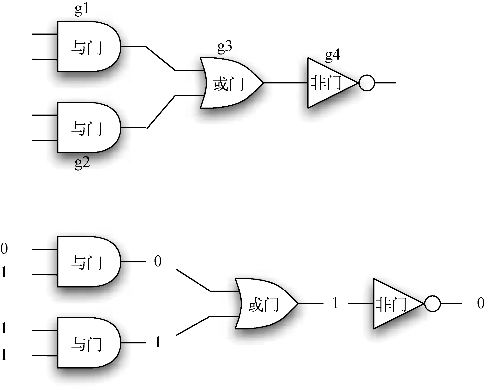
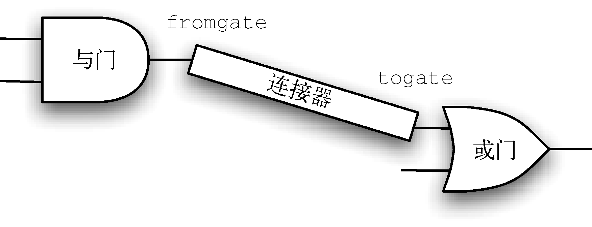

# Basic

## 对象
### 一洌
```py
# 最大公约数
def gcd(p, q):
    if (q == 0):
        return p
    return gcd(q, p%q)

# 约分
def reduction(p, q):
    common = gcd(p, q)
    return [p//common, q//common]

class Fraction:
    def __init__(self, top, bottom):
        self.num = top
        self.den = bottom

    # 当 print 实例时， Fraction 默认的 __str__ 方法当然不可能知道要输出实例的分数形式字符串，
    # 因此它只会返回该实例变量引用的内存中的实例的地址，形如 <__main__.Fraction object at 0x000001706D3087C0> 
    # 所以这里必须要重写 __str__ ，告诉在该类的实例被要求输出字符串时应该输入输出
    def __str__(self):
        return str(self.num) +'/'+ str(self.den)

    # 同理，加法也要重写
    def __add__(self, otherfraction):
        newnum = self.num * otherfraction.den + otherfraction.num * self.den
        newden = self.den * otherfraction.den
        common = gcd(newnum, newden)
        return Fraction(newnum//common, newden//common)

    # 同理
    def __eq__(self, otherfraction):
        r1 = reduction(self.num, self.den)
        r2 = reduction(otherfraction.num, otherfraction.den)
        return r1[0] == r2[0] and r1[1] == r2[1]


f1 = Fraction(2, 4)
f2 = Fraction(200, 400)
print(f1)       # 2/4
print(f2)       # 200/400
print(f1 + f2)  # 1/1
print(f1 == f2) # True
```


## 继承


### IS-A 关系 和 HAS-A 关系
#### IS-A关系 
1. 甲通过继承来使用乙的功能，甲是已的子类，则两者是 IS-A 关系，意为 甲“是”一种乙。
2. 例如 老虎 类继承了动物类，因而有了一些动物的功能，这里就可以说“老虎是动物”。
3. 在`./LogicGate.py`的例子中，`BinaryGate`和`LogicGate`之间就是 IS-A 关系关系。

#### HAS-A关系
1. 甲不通过继承而是直接引用乙的实例来使用乙的功能，则两者是 HAS-A 关系，意为 甲里面“有”乙。
2. 例如汽车里面装了空调而拥有了空调的功能，但不能使说汽车是一种空调或者是空调的子类，只能说汽车里面“有”空调。
3. 在`./LogicGate.py`的例子中，`Connector`和`LogicGate`之间就是 HAS-A 关系关系。
  