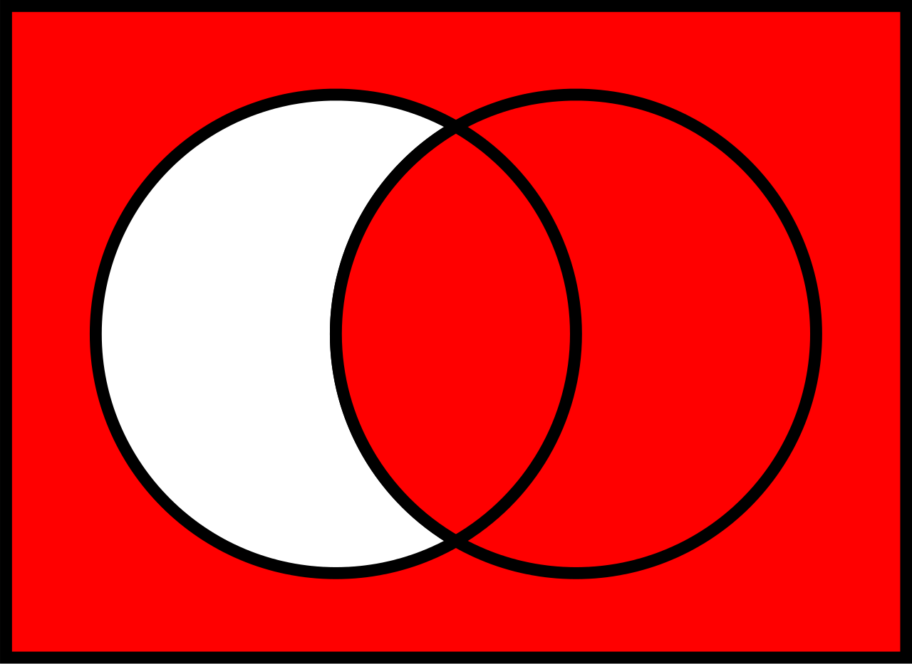

# Basic

<!-- TOC -->

- [Basic](#basic)
    - [抽象本质](#抽象本质)
        - [文氏图的本质——命题的真假情况](#文氏图的本质命题的真假情况)
    - [基本运算](#基本运算)
        - [Misc](#misc)
        - [异或](#异或)
        - [蕴含（implication）](#蕴含implication)
            - [真值表](#真值表)
        - [一些计算](#一些计算)
            - [$\lnot (A \land B)$ 等于 $(\lnot A) \lor (\lnot B)$](#\lnot-a-\land-b-等于-\lnot-a-\lor-\lnot-b)
            - [$\lnot (A \oplus B)$ 等于 $A = B$](#\lnot-a-\oplus-b-等于-a--b)
            - [$A \implies B$ 等于 $(\lnot A) \lor B$](#a-\implies-b-等于-\lnot-a-\lor-b)
            - [思考 $(\lnot B) \implies (\lnot A)$ 的文氏图](#思考-\lnot-b-\implies-\lnot-a-的文氏图)
    - [用集合的逻辑看待文氏图](#用集合的逻辑看待文氏图)
        - [true 和 false 在集合中的意义](#true-和-false-在集合中的意义)
        - [与](#与)
        - [或](#或)
        - [异或](#异或-1)
        - [相等](#相等)
        - [蕴含](#蕴含)
    - [两个值四种组合，所有的逻辑关系](#两个值四种组合所有的逻辑关系)
    - [卡诺图（Karnaugh Map）](#卡诺图karnaugh-map)
    - [包含未定义的逻辑](#包含未定义的逻辑)
        - [`undefined`](#undefined)

<!-- /TOC -->

## 抽象本质
### 文氏图的本质——命题的真假情况
1. 下面讲到的二元布尔运算，因为有两个命题，所以方框里面有两个原型。
2. 圆形里面代表该命题为真，圆形外面代表该该命题。
3. 圆形没有和方框一样大，就说明命题除了可能为真还有可能为假。
4. 两个原型相交再加上外面的方框，把整个图形划分为四个区域，分别对应一次布尔运算的两个运算数和运算结果。或者说，一次实验中两个命题的真假：
    * 两个圆形外面的区域：两个命题都为假时，用这个区域表示
    * 两个圆形相交的区域：两个命题都为真时，用这个区域表示
    * 左边的弯月形区域：左边命题为真右边命题为假时，用这个区域表示
    * 右边的弯月形区域：右边命题为真左边命题为假时，用这个区域表示
5. 在一次实验中，上述四个结果只能有一个结果，不可能同时出现两种结果。也就是说，一次两个命题的真假试验中，结果只能落在四个区域中的某一个。
6. 文氏图中可能会好几个区域都涂色了，只是说明这几个区域代表该布尔运算有好几种结果都可能为真。并不是说一次试验可以命中好几个结果。

## 基本运算
### Misc
1. 一些运算符  
    $\land$  
    $\lor$  
    $\oplus$  
    $\to$  
    $\lnot q$  
    $\setminus$  
    $\implies$  $\subset$  
    $\supset$
2. 异或的否定等于相等：$(\lnot (A \oplus B))=(A=B)$。异或就是两个不相等，所以它的否定就是两个相等。

### 异或
1. 这个运算名字的意思是：两个 “异” 的或。
2. 两个 “异” 分别是
    * $(A \land (\lnot B))$：A 真 B 假
    * $((\lnot A) \land B)$：A 假 B 真
3. 这两个 “异” 再进行或运算，就是异或的结果：(A 真 B 假) 或者 (A 假 B 真)。

### 蕴含（implication）
1. 同一试验下的两个事件 $A$ 和 $B$，若 $A$ 发生时 $B$ 必发生，则称 $A$ 蕴含 $A$。记作 $A \subset B$ 或 $A \implies B$。前者似乎是表示集合时用的符合，后者似乎是表示布尔运算时用到的符号。

#### 真值表
A | B | $A \implies B$
--|--|--
true | true | true
true | false | false
false | true | true
false | false | true

1. 第一行，$A$ 发生了，$B$ 也发生了，符合 $A$ 蕴含 $B$ 的定义，所以为真。
2. 第二行，$A$ 发生了，$B$ 却发生了，不符合 $A$ 蕴含 $B$ 的定义，所以为假。
3. 后两行，$A$ 直接没有发生，看起来连定义的前提都不满足。不过这两种情况都认为是真。
4. 看一下文氏图，除了第二行以外的情况都是 true
    
5. 没有涂红的情况，正好就是 “A 发生了 B 却没有发生”。

### 一些计算
#### $\lnot (A \land B)$ 等于 $(\lnot A) \lor (\lnot B)$
1. 前者的意思是：A 和 B 不同时为 true，当然也可以都不为 true。
2. 后者的意思是：A 不为 true 或者 B 不为 true。
3. 两者同意。这一相等的规律被称为 **德·摩根定律**（De Morgan's laws）

#### $\lnot (A \oplus B)$ 等于 $A = B$
$A \oplus B$ 是 A、B 相异，$\lnot (A \oplus B)$ 就是 A、B 相同。

#### $A \implies B$ 等于 $(\lnot A) \lor B$
1. 可以先通过文氏图来验证这一点，直接看书《程序员的数学》图 2-22
2. $\lnot A$ 就是蕴含的真值表的后两行，而 B 为 true 则是真值表的第一行。
3. 也就是受，要么就 A 为 false，直接让蕴含关系前提不满足，从而为 true；要么就 A 为 true 但是 B 也为 true，这就是标准的蕴含。

#### 思考 $(\lnot B) \implies (\lnot A)$ 的文氏图
1. 根据蕴含真值表的后两行，$\lnot B$ 直接为 false 时则蕴涵关系为真。也就是 B 为 true 时。
2. 根据蕴含真值表的第一行，$\lnot A$ 为 true 时蕴涵关系也为真。也就是 A 为 false。
3. 所以文氏图中的阴影部分就应该是 $B \lor (\lnot A)$

## 用集合的逻辑看待文氏图
### true 和 false 在集合中的意义
true 对应于属于某个集合，false 对应于不属于某个集合

### 与
1. 集合中的交集就是一种与运算。
2. 与运算有四种情况，因为交集的定义是 “既在 A 集合也在 B 集合”，所以交集是 A、B 都为真时的与运算，即 $A ^ B$。

### 或
1. 集合中的并集就是一种或运算。
2. 并集的定义是 “在 A 集合或者在 B 集合”，所以并集对应或运算中的三种情况，即 $A \land B$、$A \land (\lnot B)$ 和 $(\lnot A) \land B$。

### 异或
1. 以下两种情况的：
    * 在 A 集合且不再 B 集合
    * 在 B 集合且不再 A 集合
2. 对应异或运算的两种情况：$A \land (\lnot B)$ 和 $B \land (\lnot A)$

### 相等
1. 要么既在 A 集合也在 B 集合，要么既不在 A 集合也不在 B 集合。
2. 对应相等运算的两种情况：$A \land B$ 和 $(\lnot A) \land (\lnot B)$

### 蕴含
1. 以下两种情况
    * 既在 A 集合也在 B 集合
    * 不在 A 集合
2. 对应蕴含运算的三种情况：$A \land B$、$(\lnot A) \land B$ 和 $(\lnot A) \land (\lnot B)$

## 两个值四种组合，所有的逻辑关系
1. A 和 B 可以举出的 true / false 组合，一共有四种：
    A | B | 运算结果
    --|--|--
    true | true | 未知
    true | false | 未知
    false | true | 未知
    false | fales | 未知
2. 这个真值表，因为现在我们并不知道要进行哪种逻辑运算，所以四种组合的运算结果都是未知的。
3. 而根据不同的逻辑运算规则，每种组合的运算结果有 true / false 两种。
4. 比如同样是组合 true true 组合：如果进行 $\land$ 运算，那结果是 true；但如果进行 $\oplus$ 运算，结果就是 false。
5. 那么，考虑进行所有可能的逻辑运算规则，上面这个真值表，会有多少种不同的结果？
6. 比如说，$\land$ 运算和 $\oplus$ 运算就会得到两种不同的真值表。那么理论上，一共会有多少种不同的真值表？
7. 每种组合有两种运算结果，一共有四种组合，所有可以有 $2^4$ 种计算结果。
8. 也就是说，两个运算数的布尔运算可以实现最多 16 中不同结果的布尔运算。
9. 看书《程序员的数学》图 2-25，列出了 16 种可能的结果。
10. 这正好对应了一个四位的二进制数！四个数位要么是 1 要么是 0。这个四位的二进制数也一共可以表示 16 个值。

## 卡诺图（Karnaugh Map）
1. 直接看《程序员的数学》书上的例子把，逻辑问题视觉化之后就好理解多了。
2. 其中三灯游戏，正规来说是应该用一个立方体来表示，但按照书上的方法，在平面上也可以表示了。
3. 按照这个思路，还可以很轻松的在平面上实现四变量卡诺图。
4. 至于五变量，其实也是同样的思路，就是把四变量的表格再复制一份，一份用来表示第五维度的 true，另一份表示第五维度的 false。
5. 因为可能的结果数是 $2^n$，所以每增加一个维度就是把之前的格子再复制一份。

## 包含未定义的逻辑
### `undefined`
1. 注意，如果判断到了 `undefined`，那结果就是 `undefined`。
2. 比如 `undefined || true` 的值并不是 `true` 而是`undefined`；以及 `!undefined` 的值也并不是相反，仍然是 `undefined`。
3. 至于 `false && undefined` 因为根本不会判断到第二个值也就是 `undefined`，所以结果是 `false`。