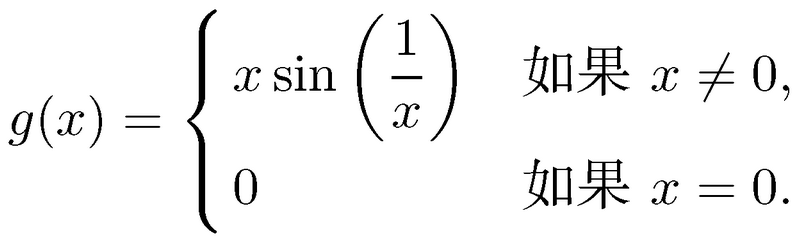

# Basic

## 连续性
### 在一点处连续
1. 函数f在点x=a处连续的三个条件：
    * 双侧极限存在并且是有限的
    * 函数在 x=a 处有定义，即f(a)存在，且是有限的
    * 以上两个量相等
2. 其实可以想象，极限存在就是会无限趋近某个值；有定义且和极限值相等就是不进会无限趋近这个值，最终也真的会到达这个值。从左侧可以一直趋近并到达这个值，右侧也无限趋近也就是说可以连续的离开这个值。所以在这个点附近就是连续的。

### 在一个区间上连续
#### 开区间 (a, b) 上连续
1. 如果函数在区间 (a, b) 上的每一点都连续, 那么它在该区间上连续。
2. 注意到 f 实际上没有必要在端点 x = a 或 x = b 上连续. 例如, 如果 f (x) = 1/x, 那么 f 在区间 (0, ∞) 上连续, 即使 f (0) 无定义. 该函数在区间 (-∞, 0) 上也连续, 但在区间 (-2, 3) 上不连续, 因为 0 位于此区间内, 而 f 在那里不连续.

#### 闭区间 [a, b] 上连续
* 函数 f 在 (a, b) 中的每一点都连续;
* 函数 f 在点 x = a 处右连续; 
* 函数 f 在点 x = b 处左连续。

### 连续函数
1. 如果函数在其定义域中的所有的点都连续, 我们就说它是连续的。
2. 如果函数的定义域包括一个带有左端点和/或右端点的区间, 那么在那里需要函数的单侧连续性.

## 连续函数的例子
### 多项式
1. 首先，常数函数`f (x) = 2 `是连续函数。因为当x趋向a时，函数的极限是2，函数的值也是2。
2. 第二步，只有一项的一次函数`g (x) = x`显然也是连续的。因为当x趋向a时，函数的极限是a，函数的值也是a。
3. 因为常数函数是连续的，即等式两边相等，所以一个连续函数的常数倍也是常理的，因为等式两边分别相乘仍然相等。
4. 同理，两个连续函数做加法、减法、乘法或复合, 会得到另一个连续函数。
5. 当用一个连续函数除以另一个连续函数的时候, 这几乎也一样成立：除了分母为零的点外, 商函数处处连续。
6. 所以，x是连续函数，x的任意次方也是连续函数，再乘以任意常数还是连续函数，再加上其他x的次方和常数的结果还是连续函数。

### 指数函数
因为都是连续的常数函数相乘，所以结果也是连续函数。

### 对数函数
TODO

### 三角函数
TODO 如果三角函数的参数时连续的，即等式成立，那么等式两边分别再 sin 一下，等式依然成立。但 sin 的参数有没有可能是不连续的函数？

### `f (x) = x sin (1/x)`
1. 除了零点以外，1/x 是连续的，所以 sin (1/x) 在零点意外是连续的，所以函数 f 在零点以外是连续的。
2. 如果如下定义 g 函数，把上面零点不存在的定义也加上
    
3. 如果在x=0时g也连续，则 g 就会是一个连续函数。
4. 可以看到 `x sin (1/x)` 这个函数是夹在 x 和 -x 两个函数之间的，而这两个函数在 x=0 时的极限是 0，所以 `x sin (1/x)` 在 x=0 时的极限也为 0，等于对应的函数值，证明函数在该点连续。
5. 因此函数 g 是连续函数。

