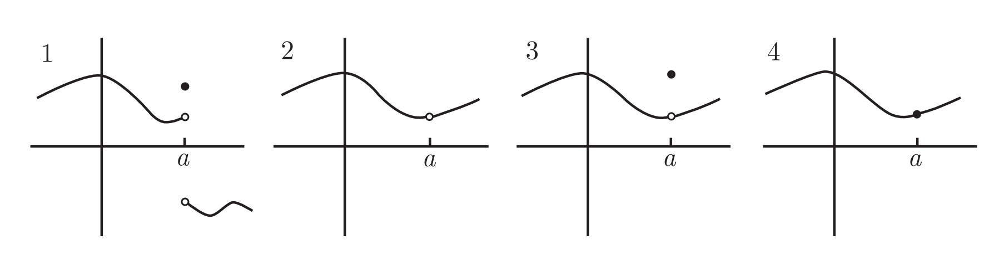
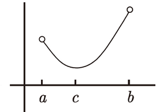

# 连续性

<!-- TOC -->

- [连续性](#连续性)
    - [在一点处连续](#在一点处连续)
    - [在一个区间上连续](#在一个区间上连续)
        - [开区间 (a, b) 上连续](#开区间-a-b-上连续)
        - [闭区间 [a, b] 上连续](#闭区间-a-b-上连续)
    - [连续函数](#连续函数)
    - [连续函数的例子](#连续函数的例子)
        - [多项式](#多项式)
        - [指数函数](#指数函数)
        - [对数函数](#对数函数)
        - [三角函数](#三角函数)
        - [`f (x) = x sin (1/x)`](#f-x--x-sin-1x)
        - [多项式 x->a 时的极限可以直接把 a 带入的原因](#多项式-x-a-时的极限可以直接把-a-带入的原因)
    - [介值定理](#介值定理)
        - [描述](#描述)
        - [例子](#例子)
            - [例1](#例1)
            - [例2](#例2)
            - [例4](#例4)
        - [例4](#例4-1)
    - [连续函数的最大值和最小值](#连续函数的最大值和最小值)

<!-- /TOC -->

## 在一点处连续
1. 函数 $f$ 在点 $x=a$ 处连续的三个条件：
    * 双侧极限存在并且是有限的；
    * 函数在 $x=a$ 处有定义，即 $f(a)$ 存在，且是有限的；
    * 以上两个量相等：$\lim\limits_{x\rightarrow\\a}f(x) = f(a)$。
2. 其实可以想象，极限存在就是会无限趋近某个值；有定义且和极限值相等就是不仅会无限趋近这个值，最终也真的会到达这个值。从左侧可以一直趋近并到达这个值，右侧也无限趋近也就是说可以连续的离开这个值。所以在这个点附近就是连续的。
3. 下图中，只有第四个函数在 $x=a$ 的点处连续
    

## 在一个区间上连续
### 开区间 $(a, b)$ 上连续
1. 如果函数在区间 $(a, b)$ 上的每一点都连续, 那么它在该区间上连续。
2. 注意到 $f$ 实际上没有必要在端点 $x = a$ 或 $x = b$ 上连续. 例如, 如果 $f(x) = 1/x$, 那么 $f$ 在区间 $(0, ∞)$ 上连续, 即使 $f(0)$ 无定义。该函数在区间 $(-∞, 0)$ 上也连续, 但在区间 $(-2, 3)$ 上不连续, 因为 $0$ 位于此区间内, 而 $f$ 在那里不连续。

### 闭区间 $[a, b]$ 上连续
需要满足以下三个条件
* 函数 $f$ 在 $(a, b)$ 连续;
* 函数 $f$ 在点 $x = a$ 处右连续; 
* 函数 $f$ 在点 $x = b$ 处左连续。

## 连续函数的例子
### 多项式
1. 首先，常数函数 `f(x) = 2` 是连续函数。因为当 $x$ 趋向 $a$ 时，函数的极限是 2，函数的值也是 2，即  $\lim\limits_{x\rightarrow\\a}c = c$。
2. 第二步，只有一项的一次函数 `g(x) = x` 显然也是连续的。因为当 $x$ 趋向 $a$ 时，函数的极限是 $a$，函数的值也是 $a$，即 $\lim\limits_{x\rightarrow\\a}x = a$。
3. 上面两个等式左右分别相乘，$\lim\limits_{x\rightarrow\\a}c\lim\limits_{x\rightarrow\\a}x = ca = \lim\limits_{x\rightarrow\\a}cx$，也就是说，一个连续函数的常数倍也是连续的。
4. 同理，两个连续函数做加法、减法、乘法或复合, 会得到另一个连续函数。
5. 当用一个连续函数除以另一个连续函数的时候, 这几乎也一样成立：除了分母为零的点外, 商函数处处连续。
6. 所以，$x$ 是连续函数，$x$ 的任意次方也是连续函数，再乘以任意常数还是连续函数，再加上其他 $x$ 的次方和常数的结果还是连续函数。

### 指数函数
因为都是连续的函数相乘，所以结果也是连续函数。

### 对数函数
TODO

### 三角函数
TODO 如果三角函数的参数连是续的，即等式成立，那么等式两边分别再 $sin$ 一下，等式依然成立。但 $sin$ 的参数有没有可能是不连续的函数？

### $f(x) = xsin(\frac{1}{x})$ 函数
1. 除了零点以外，$\frac{1}{x}$ 是连续的，所以 $sin(\frac{1}{x})$ 在零点以外是连续的，所以函数 $f$ 在零点以外是连续的。
2. 如果如下定义 $g$ 函数，把上面零点不存在的定义也加上
    $
    g(x)=
    \begin{cases}
        x sin(\frac{1}{x}) & 如果 x \ne 0 \\
        0                  & 如果 x = 0
    \end{cases}
    $

3. 如果在 $x=0$ 时 $g$ 也连续，则 $g$ 就会是一个连续函数。
4. 可以看到 $x sin(\frac{1}{x})$ 这个函数是夹在 $x$ 和 $-x$ 两个函数之间的，而这两个函数在 $x=0$ 时的极限是 0，所以 $x sin(\frac{1}{x})$ 在 $x=0$ 时的极限也为 0，等于对应的函数值，证明函数在该点连续。
5. 因此函数 $g$ 是连续函数。

## 多项式 x->a 时的极限可以直接把 a 带入的原因
1. 考虑如下极限的求解
    $\lim\limits_{x\rightarrow\\-1}\frac{x^2 - 3x + 2}{x-2}$
2. 求极限时可以直接把 $x=-1$ 代入计算出的结果就是极限值。但之前也曾经说过，某一点处的极限和该点具体的值是没有关系的，极限只是无限趋近，而并不是该点的值。
3. 现在了解到多项式是连续函数，所以上面这个函数在 $x=2$ 以外的点都是连续的，也就是说任何一点极限的值都等于该点实际的函数值。所以只要 $x$ 在定义域内，即 $x≠2$，那么任何一点的极限都等于该点的函数值。

## 介值定理
### 描述
1. 标准描述：如果 $f$ 在 $[a, b]$ 上连续，并且 $f(a)<0$ 且 $f(b)>0$，那么在区间 $(a, b)$ 上至少有一点 $c$，使得 $f(c) = 0$。代之以 $f(a)>0$ 且 $f(b)<0$，同样成立。
2. 变体：假设 $f$ 在 $[a, b]$ 上连续; 如果 $f(a) < M$ 且 $f(b) > M$ (或反过来), 那么在 $(a, b)$ 上存在一点 $c$ 使得 $f(c) = M$。

### 例子
#### 例1
1. 假设要证明多项式 $p(x) = -x^5 + x^4 + 3x + 1$ 在 $x = 1$ 和 $x = 2$ 之间有一个 $x$ 轴截距。
2. 因为 $p$ 是多项式，所以处处连续。
3. $p(1) = 4$，$p(2) = -9$，所以在此区间内至少有一个 $x$ 轴截距。

#### 例2
1. 如何证明方程 $x = cos(x)$ 有一个解呢？
2. 也就是说存在一个 $x$，使得 $x = cos(x)$。
3. 也就是说 $y = x$ 和 $y = cos(x)$ 有一个交点。
4. 另一方面，我们可以证明存在某个 $x$，使得 $x - cos(x) = 0$。
5. 需要证明函数 $f(x) = x - cos(x)$ 有一个 x 轴截距。
6. 函数 $f(x)$ 是连续的。因此根据介值定理，我们需要找到两个数 $a$ 和 $b$，使得 $f(a)<0$ 且 $f(b)>0$。
7. 那么，只要我们把这两个数选在 $y = x$ 和 $y = cos(x)$ 交点两侧附近即可。

#### 例4
1. 如果 $f(x) = 3^x + x^2$, 那么方程 $f(x) = 5$ 有解吗？
2. 这一次尝试不对 5 进行移项，即把函数变为 $f(x) = 3^x + x^2 - 5$，而是直接对 $y=5$ 的横轴使用介值定理，即，找到两个 $x$ 的值，使得对应的 $f(x)$ 一个小于 5 一个大于 5.
3. 随便试一个就行，比如 0 和 2。

### 例4
1. 证明任意的奇数次多项式至少有一个根。
2. 需要证明至少有两处的函数值分别是小于零和大于零的。
3. 多项式的正负无穷极限值等于首项极限，因为首项是奇数次，所以多项式的正负无穷极限值和自变量同号的，即一个正无穷一个负无穷。根据介值定理，在这两者之间一定有一个值为 0。

## 连续函数的最大值和最小值
1. 如果 $f$ 在 $[a,b]$ 上连续，那么 $f$ 在 $[a,b]$ 上至少有一个最大值和一个最小值。
2. 可以想象，从一个端点触发，不管画的有多高，最终都必须要回到另一个端点，而且中间是连续的不能有跳跃。
3. 注意这里一定要是限定在闭区间，因为在开区间上连续，函数可以在某个端点处的值无穷大或无穷小而不存在最大值或最小值；或者像下图一样只存在一个最大值或只存在一个最小值
    

## References
* [《普林斯顿微积分读本 (修订版)》](https://book.douban.com/subject/26899701/) 第5章

