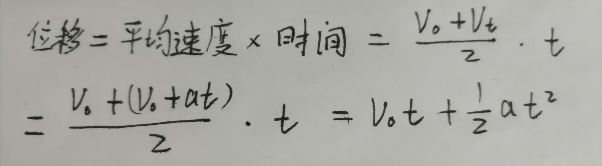
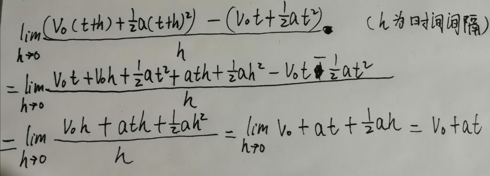
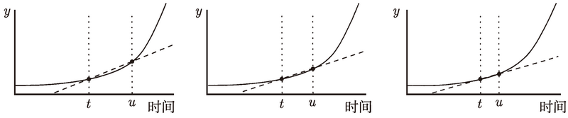
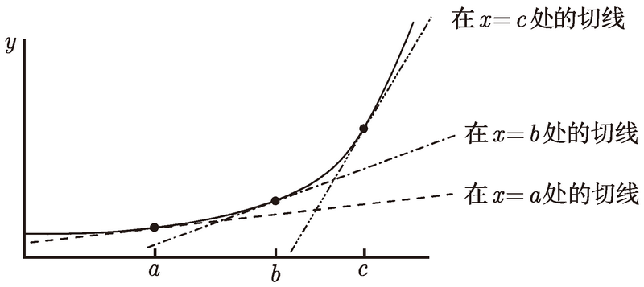
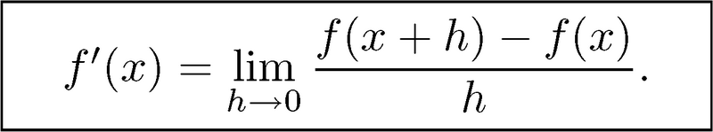
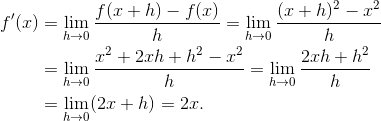
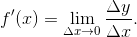

# 可导性

<!-- TOC -->

- [可导性](#可导性)
    - [思想](#思想)
    - [匀加速运动的速度计算](#匀加速运动的速度计算)
    - [导函数](#导函数)
        - [一例](#一例)
    - [作为极限比的导数](#作为极限比的导数)
    - [何时导数不存在](#何时导数不存在)
    - [可导性和连续性](#可导性和连续性)

<!-- /TOC -->

## 思想
1. 导数的意义，看起来就是计算某个状态下“果”对于“因”的敏感程度及响应方式。
2. 更广泛地说，人们希望掌握因果律，而导数就是在很细微的尺度上判断因的变化所导致的果的变化。

## 匀加速运动的速度计算
1. 初速度为v、加速度为a时，时刻t的速度为`v+at`。很合乎逻辑：单位时间乘以单位时间的速度变化值。
2. 先看一下位移的计算
    
3. 下面尝试使用极限方法来求瞬时速度，即：位移/时间间隔计算平均速度，当时间间隔趋向于0时，极限值就是瞬时速度
    
4. TODO 两种求速度的方法得出的结果是一样的，有什么内在的联系？
5. 图像阐释：由于瞬时速度是这些直线在 u → t 时的极限, 于是, 瞬时速度就等于通过点 (t, f (t)) 的切线的斜率
    

## 导函数
1. 我在曲线上画了通过三个不同的点的切线
    
2. 这些直线有不同的斜率. 也就是说, 切线的斜率取决于你选取的点 x 的值. 换句话说, 通过 (x, f (x)) 的切线的斜率是 x 的一个函数.
3. 正如上面计算速度的结果一样，位移函数的斜率值，即速度，是关于位移函数自变量 t 的一个函数。
4. 这个函数被称为 f 的**导数**, 并写作 f'. 我们说, 对 f 关于变量 x **求导**得到函数 f'。
5. 如果极限存在的话, 有
    
    在这种情况下, f 在 x 点**可导**。
6. 如果对于某个特定的 x, 极限不存在, 那么 x 的值就没有在导函数 f' 的定义域里（极限不存在就是导函数在该点不存在），即 f 在 x 点**不可导**。
7. 再看上面瞬时速度的极限阐释，如果 v (t) 是在时刻 t 的瞬时速度, 那么 v (t) = f' (t). 速度正是位置关于时间的导数。

### 一例
1. 如果 f (x) = x2, 那么 f' (x) 是什么呢？
    
2. 因此, f (x) = x2 的导数由 f' (x) = 2x 给出. 这意味着, 抛物线 y = x2 在点 (x, x2) 的切线的斜率就是 2x

## 作为极限比的导数
1. 导函数的公式也可以写成如下形式
    
2. 该公式的一个阐释是, x 中的一个小的变化产生了大约 f' (x) 倍的 y 中的变化。
3. 也就是说，**导数的意义是：当在某一位置自变量变化了很小一点时引发了因变量的变化，此时因变量变化量和自变量变化量的比值就是函数在该点的导数**。
4. f' (x) 并不真正地等于 Δy 和 Δx 的比值，因为这个比值其实是“平均速度”，不是切线的。它等于当 Δx 趋于 0 时该比值的极限。
5. 这意味着，如果想通过导数和 Δx 求 Δy，则取值越小，计算出的 Δy 就越准确。

## 何时导数不存在
1. 首先要在该点有定义。
2. 其次要左右导数都存在且相等。

## 可导性和连续性
1. 如果一个函数 f 在 x 上可导，那么它在 x 上连续。
2. TODO，书上的证明方法没什么顺理成章的推理，感觉就是凑出来的方法。
3. 考虑可导的定义，x 需要再左右两侧都存在导数且相等。
4. 从几何上说，左右两侧极限位置上要有相同的斜率；从更本质上说，自变量的的极限微小变化，将会导致因变量对应的同比例变化。如果函数在此处有哪怕一点点不连续，当自变量经过该不连续点时，因变量就会发生跳跃，不再是同比例变化。