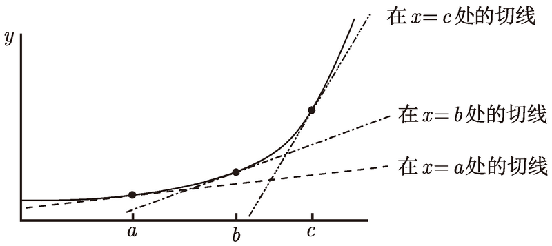

# 可导性

<!-- TOC -->

- [可导性](#可导性)
    - [思想](#思想)
    - [匀加速运动的速度计算](#匀加速运动的速度计算)
    - [导函数](#导函数)
        - [一例](#一例)
    - [作为极限比的导数](#作为极限比的导数)
    - [何时导数不存在](#何时导数不存在)
    - [可导性和连续性](#可导性和连续性)

<!-- /TOC -->

## 思想
1. 导数的意义，看起来就是计算某个状态下“果”对于“因”的敏感程度及响应方式。
2. 更广泛地说，人们希望掌握因果律，而导数就是在很细微的尺度上判断因的变化所导致的果的变化。

## 匀加速运动的速度计算
1. 使用初速度、加速度和时间来求瞬时速度：初速度为 $v_0$、加速度为 $a$ 时，时刻 $t$ 的瞬时速度为 $v_0 + at$。很合乎逻辑：单位时间乘以单位时间的速度变化值。
2. 下面尝试使用极限方法来求瞬时速度，即：位移/时间间隔计算平均速度，当时间间隔趋向于 0 时，极限值就是瞬时速度。
3. 先看一下位移的计算
    $位移 = 平均速度 \times 时间 = \frac{v_0 + v_t}{2}t = \frac{v_0 + (v_0 + at)}{2}t = v_0t + \frac{1}{2}at^2$
4. 然后使用极限方法求瞬时速度，$h$ 为时间间隔
    $\lim\limits_{h\rightarrow\\0}\frac{h时间后的位移 - 当前的位移}{h} = \lim\limits_{h\rightarrow\\0}\frac{(v_0(t+h) + \frac{1}{2}a(t+h)^2) - (v_0t + \frac{1}{2}at^2)}{h} = \lim\limits_{h\rightarrow\\0}\frac{v_0h + ath + \frac{1}{2}ah^2}{h} = \lim\limits_{h\rightarrow\\0}v_0 + at + \frac{1}{2}ah = v_0 + at$
4. TODO 两种求速度的方法得出的结果是一样的，有什么内在的联系？
5. 图像阐释：由于瞬时速度是这些直线在 u → t 时的极限, 于是, 瞬时速度就等于通过点 (t, f (t)) 的切线的斜率
    
6. TODO，为什么 $y = |x|$ 没有切线？

## 导函数
1. 我在曲线上画了通过三个不同的点的切线
    
2. 这些直线有不同的斜率.，也就是说, 切线的斜率取决于你选取的点 $x$ 的值. 换句话说, 通过 $(x, f (x))$ 的切线的斜率是 $x$ 的一个函数。
3. 这个函数的值（也就是斜率的值）是一个极限值，也就是 $\Delta{x}$ 趋向于 0 时，$\frac{\Delta{y}}{\Delta{x}}$ 的值。
4. 我们把这个新的函数称为 $f$ 的 **导数**, 并写作 $f'$。我们说, 对 $f$ 关于变量 $x$ **求导** 得到函数 $f'$
    $f'(x) = \lim\limits_{\Delta{x}\rightarrow\\0}\frac{\Delta{y}}{\Delta{x}} = \lim\limits_{h\rightarrow\\0}\frac{f(x+h) - f(x)}{h}$
5. 对于某个 $x$ 的值，如果上述极限存在的话, 我们说 $f$ 在 $x$ 点 **可导**。
6. 如果对于某个特定的 $x$, 上述极限不存在, 那么 $x$ 的值就没有在导函数 $f'$ 的定义域里（极限不存在就是导函数在该点不存在），即 $f$ 在 $x$ 点 **不可导**。
7. 再看上面瞬时速度的极限阐释，如果 $v(t)$ 是在时刻 $t$ 的瞬时速度, 那么 $v(t) = f'(t)$。速度正是位移关于时间的导数。

### 一例
1. 如果 $f(x) = x^2$, 那么 $f'(x)$ 是什么呢？
    $\lim\limits_{h\rightarrow\\0}\frac{f(x+h) - f(x)}{h} = \lim\limits_{h\rightarrow\\0}\frac{(x+h)^2 - (x)^2}{h} = \lim\limits_{h\rightarrow\\0}(2x + h) = 2x$
2. 因此, $f(x) = x2$ 的导数由 $f'(x) = 2x$ 给出。这意味着, 抛物线 $y = x^2$ 在点 $(x, x^2)$ 的切线的斜率就是 $2x$。

## 作为极限比的导数
1. 导数的意义是：当在某一位置自变量变化了很小一点时引发了因变量的变化，此时因变量变化量和自变量变化量的比值就是函数在该点的导数。
2. $f'(x)$ 并不等于 $\frac{\Delta{y}}{\Delta{x}}$ 的比值，因为这个比值其实是 “平均速度”，不是 “瞬时速度” 的。
3. 这意味着，如果想通过导数和 $\Delta{x}$ 求 $\Delta{y}$，则 $\Delta{x}$ 取值越小，计算出的 $\Delta{y}$ 就越准确。
4. 我们还可以用 $\frac{dy}{dx}$ 表示 $\lim\limits_{\Delta{x}\rightarrow\\0}\frac{\Delta{y}}{\Delta{x}}$。所以有 
    $f'(x) = \lim\limits_{\Delta{x}\rightarrow\\0}\frac{\Delta{y}}{\Delta{x}} = \frac{dy}{dx}$
5. 以函数 $f(x) = x^2$ 为例，可以有下面不同的表示形式：
    $f'(x) = \frac{dy}{dx} = \frac{d(x)^2}{dx} = \frac{d}{dx}(x)^2 = 2x$

## 何时导数不存在
1. 首先要在该点有定义。
2. 其次要左右导数都存在且相等。

## 可导性和连续性
1. 如果一个函数 $f$ 在 $x$ 上可导，那么它在 $x$ 上连续。
2. TODO，书上的证明方法没什么顺理成章的推理，感觉就是凑出来的方法。
3. 考虑可导的定义，$x$ 需要再左右两侧都存在导数且相等。
4. 从几何上说，左右两侧极限位置上要有相同的斜率；从更本质上说，自变量的的极限微小变化，将会导致因变量对应的同比例变化。如果函数在此处有哪怕一点点不连续，当自变量经过该不连续点时，因变量就会发生跳跃，不再是同比例变化。

## References
* [《普林斯顿微积分读本 (修订版)》](https://book.douban.com/subject/26899701/) 第5章