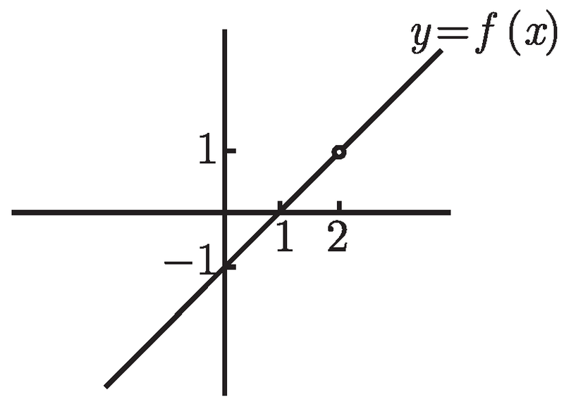
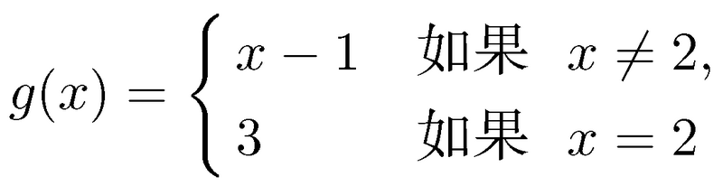
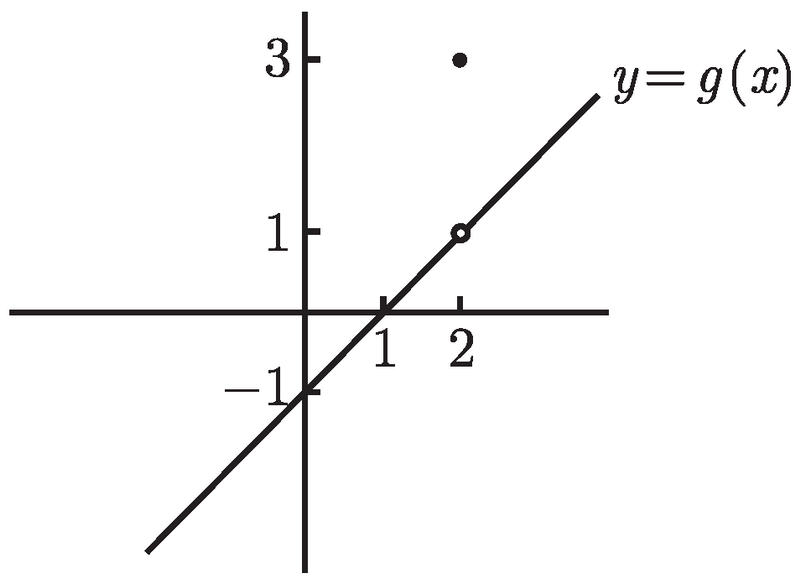
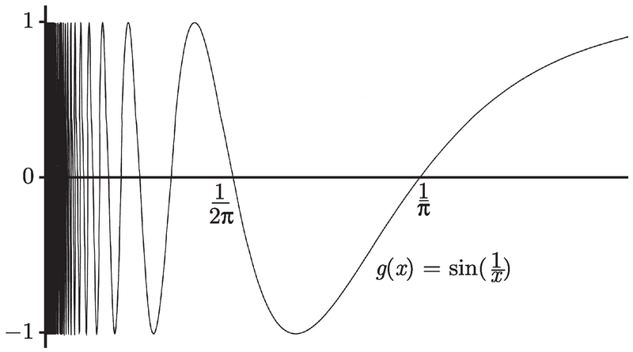
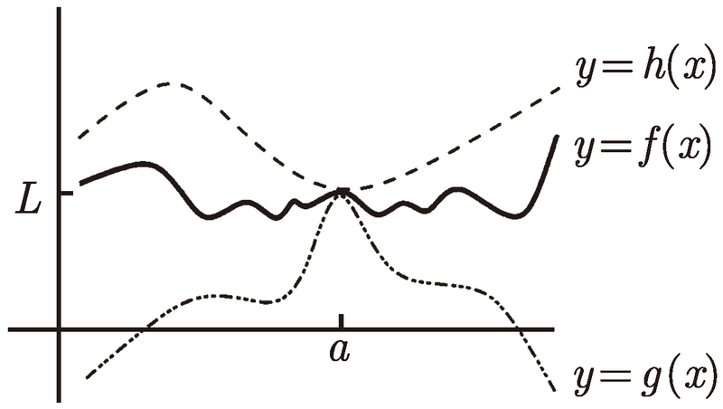
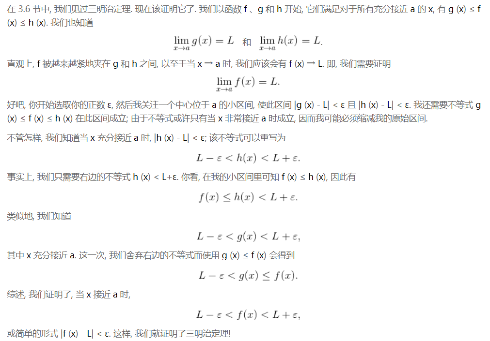

# Basic

## Miscs
### “每天进步一点点，日积月累就会进步很多”
1. 乍听起来好像没什么问题。似乎就算每天进步的很少，但只要时间足够长，就一定会进步很多，两边引起质变。
2. 但随便参考一个无限小数，比如π，从3开始，每秒进步一位小数，永远也不会进步到4的阶层！

## 基本思想
### 极限是**动态**的，而不是确定的值
1. 考虑函数`f (x) = x - 1　 x ≠ 2`
    
2. 我们一般会说：“当 x 趋近 2 时，函数的极限是 1”。
3. 但这样的描述是具有误导性的，会让人觉得好像函数的值会是 1，但其实这个函数的值域不包括是1。
4. 在 x 无限趋近于 2 时，函数的值并不是静态的，而是也伴随着无限趋近于 2，但永远不可能等于 2。
5. 所以，“极限是 1”的意思并不是说在某个时刻函数的值会等于1，而是说会无限趋近于1。
6. 所以，“当 x 趋近 2 时，函数的极限是 1”如果用更不容易误解的说法就是：“当 x 趋近 2 时，函数的值无限趋近于 1”。
7. 下面这个函数可以更好地说明，极限是动态趋近某个值而不是等于那个值
    
    
8. x趋近于2时，函数的极限是1，而并不是3。因为在这个过程中x是无限趋近于2但不等于2，所以y的值也是在直线上无限趋近于空心圆圈，而永远不会跳到上面实心的点上3。
9. 也正是因为只是永远趋近某个点而不是实际到达某个点，所以在直线上，才会有分别从两边趋近的情况，才会有左右极限的区别。

## 不存在极限的情况
1. 观察函数`g (x) = sin (1/x)`，考虑在x正向趋向于0时的极限。
2. 因为是正弦函数，所以函数值一定是在1和-1之间震荡的，而不会收敛趋向于某个值。
3. x趋向于0时，`1/x`不断增大。因为熟悉典型正弦函数的图像，即参数为单一变量`x`，所以考虑将`1/x`整体作为一个正弦函数的自变量，计算当`1/x`为π、2π、3π……时的x的值，可以画出如下的函数图像为
    
4. 当x为`2/(偶数π)`，正弦函数的整体参数为`(偶数π)/2`，函数值为0；当x为`2/(奇数π)`，正弦函数的整体参数为`(奇数π)/2`，函数值为±1。
5. 观察最右侧的波谷，可以看到它不是位于中间，因为波谷处的x值为`2/(3π)`，而中间的x值应该为`3/(4π)`。

## Squeeze Theorem
1. 假设对于所有的在 a 附近的 x, 我们都有 g (x) ≤ f (x) ≤ h (x), 当 x → a 时, 这两个函数 g 和 h 都收敛于同一个极限 L, 那么当 x → a 时, f 也收敛于极限 L.
    
2. 在 a 附近时，因为必须满足 g (x) ≤ f (x)，且必须满足当 x → a 时 g(x) 收敛于 L。所以当 g (x) 无限趋近于 L 时，f (x) 也必须无限趋近于 L 或者大于 L，才能保证在此区间内 g (x) ≤ f (x)。同理，在次区间内 f (x) 也必须无限趋近于 L 或者小于 L，才能保证在此区间内 f (x) ≤ h (x)。
3. 综上，再次区间内 f (x) 只能无限趋近于 L。
4. TODO 证明方法不懂
    