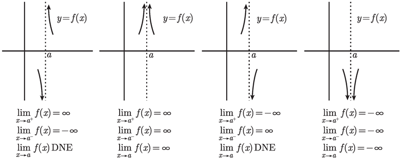

# Basic

<!-- vscode-markdown-toc -->
* 1. [数学思想](#)
	* 1.1. [无穷之间的差别，与无穷的真正含义](#-1)
* 2. [misc](#misc)
	* 2.1. [0/0不定式的极限思考 不懂](#-1)
	* 2.2. [为什么会出现0/0不定式](#00)
* 3. [x → a 时的有理函数的极限](#xa)
	* 3.1. [如果分母不为 0](#0)
	* 3.2. [如果结果为不定式，即分子分母都为 0](#0-1)
	* 3.3. [如果分母为 0 但分子不为 0](#00-1)
* 4. [x → a 时的平方根的极限](#xa-1)
* 5. [x → ∞ 时有理函数的极限](#x)
* 6. [x → ∞ 时的多项式型函数的极限](#x-1)

<!-- vscode-markdown-toc-config
	numbering=true
	autoSave=true
	/vscode-markdown-toc-config -->
<!-- /vscode-markdown-toc -->

##  1. 数学思想
###  1.1. 无穷之间的差别，与无穷的真正含义
1. 考虑当 $x → ∞$ 时，$\frac{x}{x^2}$ 的极限，因为可以变形为 $\frac{1}{x}$，所以极限是 0。
2. 但如果分别考虑分子分母，其他各自的极限都是正无穷，但这两种正无穷是有差别。
3. 其实这第二步的想法有问题的，第二步的想法似乎是在说：好，我现在是无穷大了，你也是无穷大了，但我的无穷大是你的无穷大的两倍。
4. 想法的错误点在于：“无穷大 **了**”，在于这种 **完成时的**、**静态的** 想法。
5. 实际上，无穷不是静态的，而是动态的。无穷不可能是静态的，静态不可能无穷，只有动态的才是没有穷尽的，静态的肯定就停在了某个地方。
6. 现在，用动态的思想来比较 $x$ 和 $x^2$ ，就很好理解了。
7. 现在，让 $x$ 的取值动态的持续的增大，在这个通往无穷的道路上，在任一时刻（任一 $x$ 的取值下），$x$ 的值都是 $x$ 本身，$x^2$ 的值都是 $x$ 的平方。
8. 这时就可以看出来，这个过程中，只要 $x$ 大于1，那么后者肯定是大于前者的。而当 $x$ 无穷大的，两者的差距也就是无穷大的，所以两者比值就会是 0。
9. 另一个例子，考虑 $x → ∞$ 时，$\frac{x^2 + x}{x^2}$ 的极限，根据上面有理函数的极限求法，知道它的函数是 1。也就是说，在 $x → ∞$ 时，$x^2 + x$ 和 ${x^2}$ 的值相同。
10. 同样，如果你分开看分子和分母，当 $x → ∞$ 时，分子不仅有和分母相等的 $x^2$，而且还多出了一个同样是无穷的 $x$。明明分子比分母多出了一个无穷，为什么它俩的极限却相同的呢？
11. 果然语言迷惑了思维！即使上面刚分析完，这个新的例子中，我又被自己的语言迷惑了！就是那句 “多出了一个无穷”！
12. 这种说法，就将无穷看成了一个确定的、静态的的概念。并不是说分子在一比一的基础上有加上了一个无穷！
13. 现在，动态的来看待。随着 $x → ∞$ 这个过程的推进，当 $x$ 很小的时候比如 $x=10$ 的时候，分子上多出一个 $x$ 造成的上下差别是很明显的，是 $\frac{110}{100}$，即 1.1；但当 $x$ 逐渐增大，这个比值就会越来越接近 1，会无穷的接近 1。
13. 当然永远不可能等于 1。所以，我们说 $x → ∞$ 时，$\frac{x^2 + x}{x^2}$ 的极限为 1 时，并不是说 $x → ∞$ 时它俩相等了，而是说，它俩的比值会无限接近于 1。
14. <b style="color: red;">没有无穷的 **状态**，只有趋向于无穷的 **动态**。</b>

##  2. misc
###  2.1. 0/0不定式的极限思考 不懂
1. 考虑 (x^2 -4)/(x-2) 在 x->2时的极限。
2. 直接将 x = 2 带入，结果为 0/0不定式。此时，分子的极限是0，分母的极限也是0。
3. 但实际上整体的极限是 4。也就是说，虽然分子分母都是无限趋近于0，但是在某个确定的 x 值的情况下，分子的值会是分母的4倍。
4. 同样是无穷小，但也是可以比较的。同样，同样是无穷大，也是可以比较的。

###  2.2. 为什么会出现0/0不定式
1. 比如 (x-2)/(x^2-4) 这个函数，如果 x=3 ，是没有任何问题的，但 x=2 时就会出现不定式。
2. 其实分子为0没有任何问题，但不定式的情况是在正常的分子为0的情况下，分母恰好同时也为0了。
3. 这种处境看起来看起来，但其实这只是在求极限的过程中才会有这样的尴尬。因为这个函数本身，它的定义域是不包含2的，所以你永远不应该把2带入。
4. 其实 x 永远不会等于2，所以分子和分母都永远不会为0。
5. 而求 x->2 的极限时，为了避免出现不定式而无法计算，必须要将函数转换为一个作用域包含 2 的版本，其实就是另一个函数，只不过不同之处只有 x 在 2 处有定义。

##  3. x → a 时的有理函数的极限
将 $x = a$ 带入，

###  3.1. 如果分母不为 0
1. 则结果 $y$ 就是所求的极限值。
2. 因为如果 $x = a$，那么得到的值就是 $y$。而如果 $x$ 无限趋近于 $a$，则结果也会无限趋近于 $y$。

###  3.2. 如果结果为不定式，即分子分母都为 0
1. 那么什么都可能会发生：极限或许是有限的, 极限或许是 $∞$ 或 $-∞$, 或者极限或许不存在：
    * 极限有限的情况：$\lim\limits_{x\rightarrow\\2}\frac{x^2 -4}{x-2} = 4$ 
    * 极限是 $∞$ 或 $-∞$ 的情况：TODO
    * 极限不存在的情况：TODO
2. 我们可以借助因式分解这一重要技巧来求解。通过因式分解，使得当 $a$ 被带入时，不会出现不定式的情况，进而求得极限
    $\lim\limits_{x\rightarrow\\2}\frac{x^2-3x+2}{x-2} = \lim\limits_{x\rightarrow\\2}\frac{(x-2)(x-1)}{x-2} = \lim\limits_{x\rightarrow\\2}(x-1) = 1$ 
3. 现在有趣之处在于，这个函数（记为 $f$）和 $g(x) = x-1$ 是不是同一个函数？显然在不化简 $f$ 的情况下，它的定义域不包括 $2$，但 $g$ 的定义域确实包括的，也就是说它们不是同一个函数。
4. 根据教材上所说，它们并不是同一个函数，那也就是说，并不能随便对一个函数进行化简，这种化简有时就会导致定义域的改变，而变为另一个函数。
5. 现在新的问题是，看起来，我们本来是要求求函数 $f$ 的极限，但最后求了函数 $g$ 的极限。
6. 不过并没有问题，因为这两个函数的区别仅仅是当 $x=2$ 处的差别，$x$ 取其他值的时候这两个函数的结果就是一样的。
7. 而当我们求极限的时候，恰好 $x$ 永远不会等于 2。所以用函数 $g$ 来求 $f$ 的极限没有问题。

###  3.3. 如果分母为 0 但分子不为 0 
1. 可以想象，因为分母无限趋近于 0，所以极限是趋向于无穷大的。
2. 这种趋近于 0 的过程可以从 0 的两侧分别趋近，并且正无穷负无穷都有可能，所以就组合出以下四种情况
    
4. 为了确定是四种情况中的哪一种，需要查看一下 $f(x)$ 在 $x=a$ 两边的符号。例如, 如果它在两边都是正的, 那就是在处理上述的第二种情形。
5. 例如 $\lim\limits_{x\rightarrow\\1}\frac{2x^2-x-6}{x(x-1)^3}$，带入 $x=1$ 时，得出 $\frac{-5}{0}$。
6. 当 $x=1$ 时：
    * 分子 $2x^2-x-6$ 等于 -5，$x$ 稍微移动一下，分子也仍然保持是负数；
    * 分母中的因子 $x$ 在 1 附近当然是正的。$(x-1)^3$ 在 $x>1$ 时为正，在 $x<1$ 时为负。
7. 所以：在 $x>1$ 时，y 是负无穷；在 $x<1$ 时，y 是正无穷。也就是上面的第三种情况。

##  4. x → a 时的平方根的极限
1. 考虑极限 $\lim\limits_{x\rightarrow\\5}\frac{\sqrt{x^2-9}-4}{x-5}$，直接将 $x=5$ 带入还是得到不定式。但此时因式分解也没用了。
2. 此时需要用到 **共轭表达式**，也就是和一个带根号的表达式相乘后会消掉其根号的表达式。具体到这里，就是要用到 $\sqrt{x^2-9}-4$ 的共轭表达式 $\sqrt{x^2-9}+4$，给分子分母同时乘以该共轭表达式
    $\lim\limits_{x\rightarrow\\5}\frac{\sqrt{x^2-9}-4}{x-5} = \lim\limits_{x\rightarrow\\5}\frac{x^2-25}{(x-5)(\sqrt{x^2-9}+4)} = \lim\limits_{x\rightarrow\\5}\frac{x+5}{\sqrt{x^2-9}+4}$
3. 现在带入 $x=5$ 就可以求解了。

##  5. x → ∞ 时有理函数的极限
1. $x → ∞$ 时，因为 $x$ 极大，所以多项式极限等于首项极限。
2. 可以通过证明 $\frac{多项式}{首项}$ 在 $x → ∞$ 时极限为 1 来证明上述结论。可以想象，$\frac{多项式}{首项}$ 的结果是 1 加上若干个在 x → ∞ 时极限为 0 的分数。
    
3. 因此，多项式在 $x → ∞$ 时极限就是它首项的极限。
4. 那么，对于有理函数，$x → ∞$ 时的极限，就是上下两个多项式的首项的比值在 $x → ∞$ 的极限。
5. 一般的，对于有理函数极限 $\lim\limits_{x\rightarrow\\∞}\frac{p(x)}{q(x)}$：
    * 如果 $p$ 的次数等于 $q$ 的次数，那么极限是有限的并且非零；
    * 如果 $p$ 的次数大于 $q$ 的次数，那么极限是正无穷或负无穷；
    * 如果 $p$ 的次数小于 $q$ 的次数，那么极限是零。

##  6. x → ∞ 时的多项式型函数的极限
1. 像 $f(x) = x^{\frac{2}{3}} + 1$、$f(x) = \sqrt{x^3} + 1$，但对多项式求极限的方法也适用于它们，因为我们还是要找到最高次数的项，即使这个次数不是整数。
2. 例如，$\lim\limits_{x\rightarrow\\∞}\frac{\sqrt{16x^4+8}+3x}{2x^2+6x+1}$。它的分母最高项无疑是 $2x^2$，而对于分子，可以看出来开放之后的最高项是 $4x^2$。所以最终的极限是 2。
3. 再这个有些特殊的情况
    $\lim\limits_{x\rightarrow\\∞}\frac{\sqrt{4x^6-5x^5}-2x^3}{\sqrt[3]{27x^6+8x}}$
4. 分母的最高项是 $3x^2$ 没问题；分子的根号开出来最高项是 $2x^3$，但它就和后面的 $2x^3$ 抵消了，然后就没办法立刻看出分子的最高项是多少了。
5. 所以这里仍然可以使用共轭表达式来消除根号
    $\lim\limits_{x\rightarrow\\∞}\frac{\sqrt{4x^6-5x^5}-2x^3}{\sqrt[3]{27x^6+8x}} = \lim\limits_{x\rightarrow\\∞}\frac{(\sqrt{4x^6-5x^5}-2x^3)(\sqrt{4x^6-5x^5}+2x^3)}{\sqrt[3]{27x^6+8x}(\sqrt{4x^6-5x^5}+2x^3)} = \lim\limits_{x\rightarrow\\∞}\frac{4x^6-5x^5-4x^6}{\sqrt[3]{27x^6+8x}(\sqrt{4x^6-5x^5}+2x^3)} = \lim\limits_{x\rightarrow\\∞}\frac{-5x^5}{\sqrt[3]{27x^6+8x}(\sqrt{4x^6-5x^5}+2x^3)}$
6. 现在分子没问题了，最高项就是 $-5x^5$，但分母的最高项已经不是 $3x^2$ 了，因为又乘上了分子的共轭表达式。但现在仍然容易看出来共轭表达式中可以计算出的最高项是 $4x^3$，则乘以左侧的最高项 $3x^2$，整个分母的最高项是 $12x^5$。所以整体的极限 $-\frac{5}{12}$。

## x → -∞ 的情况
1. 和 $x → ∞$ 的情况基本相同，唯一要注意的是开方时可能要取相反数。
2. 例如在求 $x → -∞$ 的极限时，$x$ 是负值，所以 $\sqrt{4x^6}$ 开方的结果应该是 $-2x^3$。