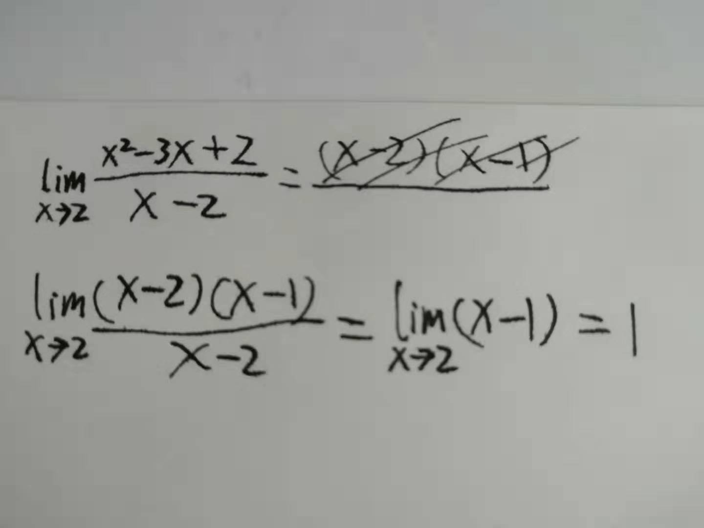
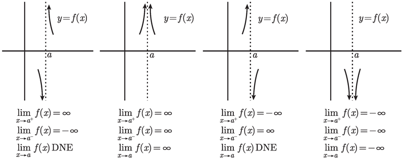
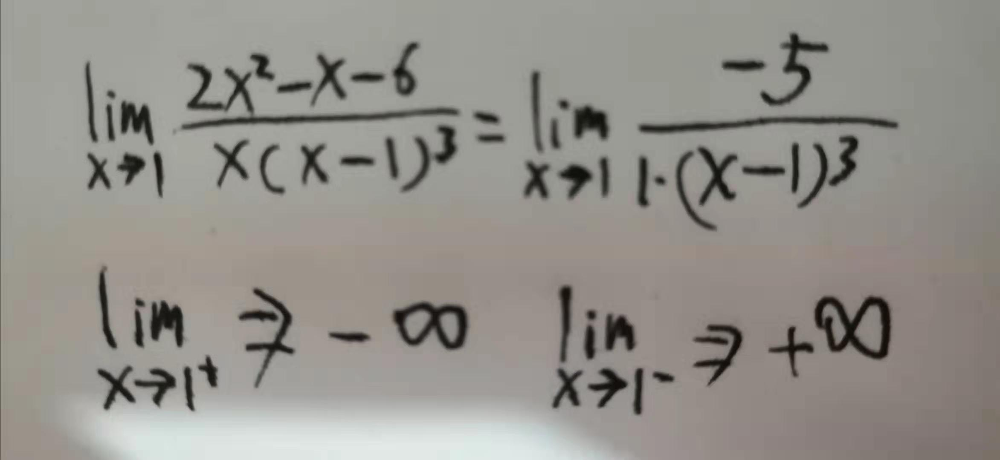
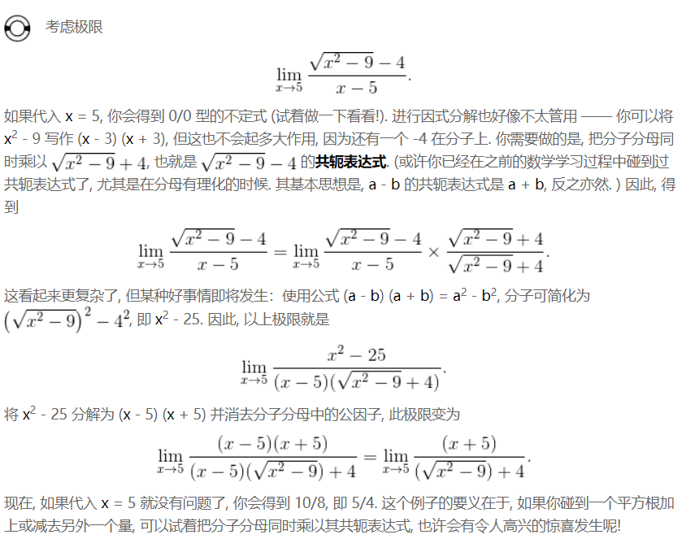
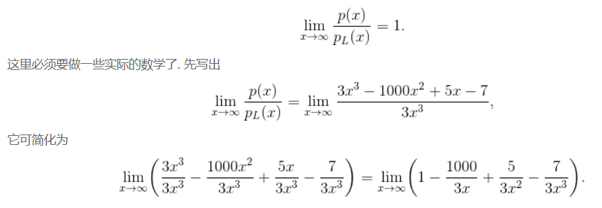
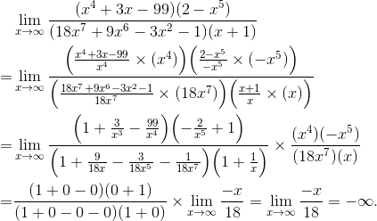
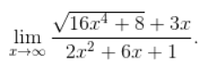
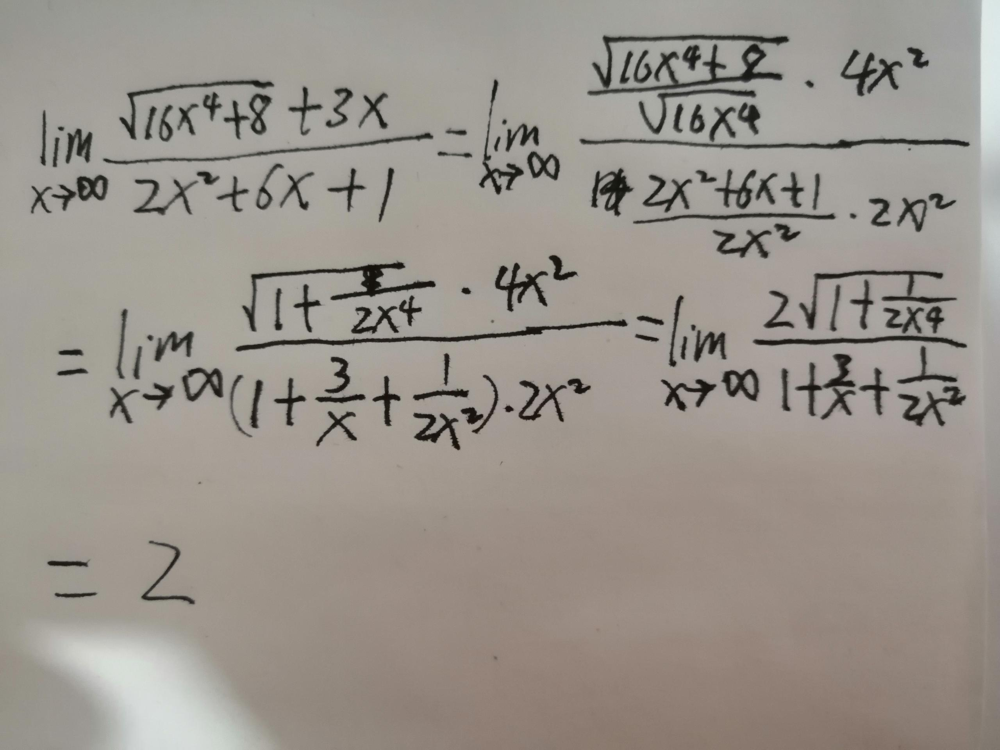

# Basic

## misc
### 0/0不定式的极限思考 不懂
1. 考虑 (x^2 -4)/(x-2) 在 x->2时的极限。
2. 直接将 x = 2 带入，结果为 0/0不定式。此时，分子的极限是0，分母的极限也是0。
3. 但实际上整体的极限是 4。也就是说，虽然分子分母都是无限趋近于0，但是在某个确定的 x 值的情况下，分子的值会是分母的4倍。
4. 同样是无穷小，但也是可以比较的。同样，同样是无穷大，也是可以比较的。

### 为什么会出现0/0不定式
1. 比如 (x-2)/(x^2-4) 这个函数，如果 x=3 ，是没有任何问题的，但 x=2 时就会出现不定式。
2. 其实分子为0没有任何问题，但不定式的情况是在正常的分子为0的情况下，分母恰好同时也为0了。
3. 这种处境看起来看起来，但其实这只是在求极限的过程中才会有这样的尴尬。因为这个函数本身，它的定义域是不包含2的，所以你永远不应该把2带入。
4. 其实 x 永远不会等于2，所以分子和分母都永远不会为0。
5. 而求 x->2 的极限时，为了避免出现不定式而无法计算，必须要将函数转换为一个作用域包含 2 的版本，其实就是另一个函数，只不过不同之处只有 x 在 2 处有定义。

## x → a 时的有理函数的极限
将 x = a 带入，

### 如果分母不为 0
1. 则结果 y 就是所求的极限值。
2. 因为如果 x = a ，那么得到的值就是 y。而如果 x 无限趋近于 a，则结果也会无限趋近于 y。

### 如果结果为不定式，即分子分母都为 0
1. 那么什么都可能会发生：极限或许是有限的, 极限或许是 ∞ 或 -∞, 或者极限或许不存在。不懂，为什么。极限有限的情况在 (x^2 -4)/(x-2) 在 x->2时的极限可以得出，但其他的情况呢？
2. 但至少可以了解到，如果出现了 0/0 不定式，是不能得出有效的极限结论的。必须要做一些其他处理。
3. 我们可以借助因式分解这一重要技巧来求解。通过因式分解，使得当 a 被带入时，不会出现不定式的情况，进而求得极限。
    
4. 现在有趣之处在于，这个函数（记为`f`）和`g(x) = x-1`是不是同一个函数？显然在不化简`f`的情况下，它的定义域不包括`2`，但`g`的定义域确实包括的，也就是说它们不是同一个函数。
5. 根据教材上所说，它们并不是同一个函数，那也就是说，并不能随便对一个函数进行化简，这种化简有时就会导致定义域的改变，而变为另一个函数。
6. 现在新的问题是，看起来，我们本来是要求求函数`f`的极限，但最后求了函数`g`的极限。
7. 不过并没有问题，以为这两个函数的区别仅仅是当 x=2 处的差别，x 取其他值的时候这两个函数的结果就是一样的。
8. 而当我们求极限的时候，恰好 x 永远不会等于 2。所以用函数`g`来求`f`的极限没有问题。

### 如果分母为 0 但分子不为 0 
1. 可以想象，因为分母无限趋近于0，所以极限是趋向于无穷大的。
2. 问题是分母肯定不为 0，而且这种趋近于 0 的过程可以从 0 的两侧分别趋近，所以分母会是一个很小的负数或者很小的整数。
3. 再结合分子的情况，就可能有以下四种情况
    
4. 需要查看一下 f (x) 在 x = a 两边的符号。计算一下分子在 x = a 的符号，然后再观察分母在当 x 略小于 a 和略大于 a 时的符号。
    

## x → a 时的平方根的极限
其实还是上面不定式的情况，只不过这里有根号的存在，就可以考虑使用共轭表达式来变形

## x → ∞ 时的有理函数的极限
1. x → ∞ 时，因为 x 极大，所以多项式极限等于首项极限。
2. 可以通过证明 多项式/首项 在 x → ∞ 时极限为 1 来证明上述结论。可以想象，多项式/首项 的结果是 1 加上若干个在 x → ∞ 时极限为 0 的分数。
    
3. 有了上述结论， x → ∞ 时的有理函数的极限，就是上下两个多项式的首项的比值在 x → ∞ 的极限。
4. 具体计算时，对于分子和分母的两个多项式，可以分别除以其各自首项再乘以各自首项。多项式除以首项，在 x → ∞ 时等于1，所以有理函数就变成了 x → ∞ 时的分子首项和分母首项的比值。
    

## 无穷之间的差别，与无穷的真正含义
1. 考虑当 x → ∞ 时，`x / x^2`的极限，因为可以变形为`1/2`，所以极限是0。
2. 但如果分别考虑分子分母，其他各自的极限都是正无穷，但这两种正无穷是有差别。
3. 其实这第二步的想法有问题的，第二步的想法似乎是在说：好，我现在是无穷大了，你也是无穷大了，但我的无穷大是你的无穷大的两倍。
4. 想法的错误点在于：“无穷大<b>了</b>”，在于这种完成时的静态的想法。
5. 实际上，无穷不是静态的，而是动态的。无穷不可能是静态的，静态不可能无穷，只有动态的才是没有穷尽的，静态的肯定就停在了某个地方。
6. 现在，用动态的思想来比较 x 和 x^2 ，就很好理解了。现在，让 x 的取值动态的持续的增大，在这个通往无穷的道路上，在任一时刻（任一x的取值下），x 的值都是x本身，x^2的值都是x的平方。这时就可以看出来，这个过程中，只要 x 大于1，那么后者肯定是大于前者的。
7. 而当 x 无穷大的，两者的差距也就是无穷大的，所以两者比值就会是0。
8. 另一个例子，考虑 x → ∞ 时，`(x^2 + x)/x^2`的极限，根据上面有理函数的极限求法，知道它的函数是1。也就是说，在 x → ∞ 时，`(x^2 + x)`和`(x^2 + x)/x^2`的值相同。
9. 同样，如果你分开看分子和分母，当 x → ∞ 时，分子不仅有和分母相等的x^2，而且还多出了一个同样是无穷的x。命名分子比分母多出了一个无穷，为什么它俩的极限确实相同的呢？
10. 果然语言迷惑了思维！即使上面刚分析完，这个新的例子中，我又被自己的语言迷惑了！就是那句“多出了一个无穷”！
11. 这种说法，就将无穷看成了一个确定的、静态的的概念。并不是说分子在一比一的基础上有加上了一个无穷！
12. 现在，动态的来看待。随着 x → ∞ 这个过程的推进，当x很小的时候比如x=10的时候，分子上多出一个x造成的上下差别是很明显的，是110/100，即1.1；但当x逐渐增大，这个比值就会越来越接近1，会无穷的接近1。
13. 当然永远不可能等于1。所以，我们说 x → ∞ 时，`(x^2 + x)/x^2`的极限为1时，并不是说x → ∞ 时它俩相等了，而是说，它俩的比值会无限接近于1。
14. <b style="color: red;">没有无穷，只有趋向于无穷！</b>

## x → ∞ 时的多项式型函数的极限
1. 本质上，你还是要知道，当 x → ∞ 时，影响算式值的是哪一部分。
    
2. 就上面的例子来说，分母很明确，首项是 2x^2，但分子略有迷惑。不过还是可以看出来，根号下16x^4起到的作用要比外面的 3x 更多。
3. 所以在 x → ∞ 时，分子的值会趋向于根号下16x^4。所以在计算极限是，应该认为分子的首项是根号下16x^4
    
1. 刚开始的思路是当 x → ∞ 时，分母无穷大，分子除以首项再乘以首项 2x^3，分子