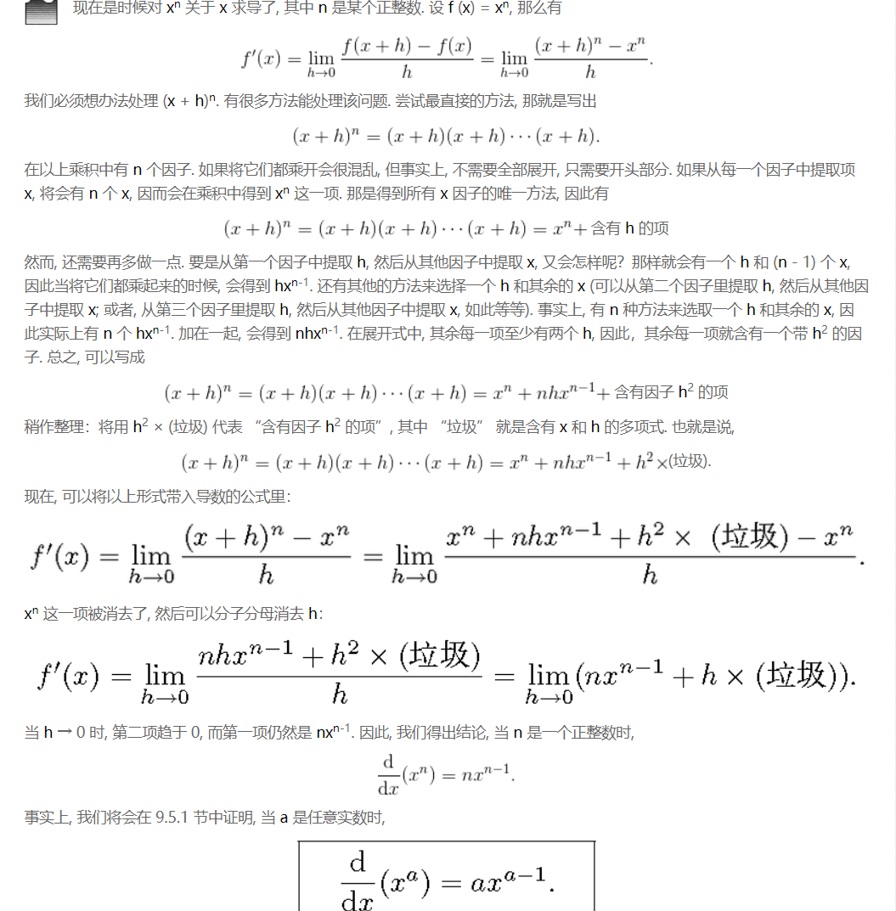
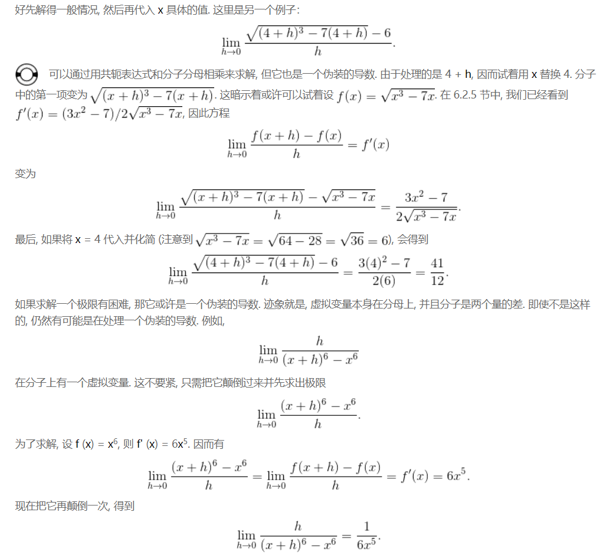

# Basic

<!-- TOC -->

- [Basic](#basic)
    - [使用定义求导](#使用定义求导)
        - [$x^n$ 关于 x 求导](#x^n-关于-x-求导)
    - [用更好的办法求导](#用更好的办法求导)
        - [函数的常数倍](#函数的常数倍)
        - [函数和与函数差](#函数和与函数差)
        - [通过乘积法则求积函数的导数](#通过乘积法则求积函数的导数)
        - [通过商法则求商函数的导数](#通过商法则求商函数的导数)
        - [通过链式求导法则求复合函数的导数](#通过链式求导法则求复合函数的导数)
    - [速度和加速度](#速度和加速度)
    - [导数伪装的极限](#导数伪装的极限)
        - [导数就是一种极限](#导数就是一种极限)
        - [使用导数求极限](#使用导数求极限)
    - [分段函数的导数](#分段函数的导数)
    - [直接画出导函数的图像](#直接画出导函数的图像)

<!-- /TOC -->

## 使用定义求导 
1. 一例，对 $f(x)=\sqrt{x}+x^2$ 求导
    $f'(x) = \lim\limits_{h\rightarrow\\0}\frac{f(x+h) - f(x)}{h} = \lim\limits_{h\rightarrow\\0}\frac{(\sqrt{x+h} + (x+h)^2) - (\sqrt{x} + x^2)}{h} = \lim\limits_{h\rightarrow\\0}\frac{\sqrt{x+h} - \sqrt{x}}{h} + \lim\limits_{h\rightarrow\\0}\frac{(x+h)^2 - x^2}{h} = \lim\limits_{h\rightarrow\\0}\frac{x+h-x}{h(\sqrt{x+h} + \sqrt{x})} + \lim\limits_{h\rightarrow\\0}\frac{2hx + h^2}{h} = \lim\limits_{h\rightarrow\\0}\frac{1}{\sqrt{x+h} + \sqrt{x}} + \lim\limits_{h\rightarrow\\0}(2x + h) = \frac{1}{2\sqrt{x}} + 2x$
2. 注意把一个界限拆分成两个极限的和的那一步，将比较复杂的情况分类为两组更简单的情况。

### $x^n$ 关于 x 求导
TODO 下面这段莫名其妙的证明

## 用更好的办法求导
### 函数的常数倍
1. 处理一个函数的常数倍很容易：只需在求导后, 用常数乘以该函数的导数就可以了。
2. 从导数的定义上也可以推导出这个结论。例如之前 $y$ 的变化量是 $x$ 变化量的 $k$ 倍，现在对函数乘以常数 $C$，$y$ 的变化量肯定就是 $C \times k$ 了。

### 函数和与函数差
1. 对于 $f(x)$，$x$ 变化 $Δx$ 时，$f(x)$会变为 $f(x) + f'(x) \times Δx$。
2. 对于 $g(x)$，$x$ 变化 $Δx$ 时，$g(x)$会变为 $g(x) + g'(x) \times Δx$。
3. 所以对于 $h(x) = f(x) + g(x)$，x 变化 $Δx$ 时，$h(x)$会变为 $f(x) + f'(x) \times Δx + g(x) + g'(x) \times Δx$。
4. $h(x)$ 的变化量为 $f'(x) \times Δx + g'(x) \times Δx$，根据导数的定义，可以求得 $h(x)$ 对 x 求导的结果为 $\Large f'(x)+g'(x)$。
5. 也就是说函数和的导数等于函数导数的和。

### 通过乘积法则求积函数的导数
1. 根据上面函数和求导的推导，对于 $h(x) = f(x) \times g(x)$，$x$ 变化 $Δx$ 时，$h(x)$会变为 $(f(x) + f'(x) \times Δx) \times (g(x) + g'(x) \times Δx)$。
2. 展开之后是 $f(x) \times g(x) + f(x) \times g'(x) \times Δx + f'(x) \times Δx \times g(x) + f'(x) \times Δx \times g'(x) \times Δx$
3. 再减去$f(x) \times g(x)$就是$h(x)$的变化量，即$f(x) \times g'(x) \times Δx + f'(x) \times Δx \times g(x) + f'(x) \times Δx \times g'(x) \times Δx$
4. 除以 $Δx$ 并求 $Δx$ 趋向于 0 时的极限，也就是求 $h(x)$ 关于 $x$ 的导数，结果为 $\Large f(x) \times g'(x) + f'(x) \times g(x)$
5. 对于 3 个函数相乘的情况，也是同样的原理，只不过展开的过程更麻烦一些。最终的结果是 $\Large f'(x)g(x)h(x) + f(x)g'(x)h(x) + f(x)g(x)h'(x)$

### 通过商法则求商函数的导数
还是按照上面的方法，得出如果 $h(x) = \frac{f(x)}{g(x)}$，那么 $\Large h'(x) = \frac{f'(x)g(x) - f(x)g'(x)}{(g(x))^2}$

### 通过链式求导法则求复合函数的导数
1. $h(x) = f(g(x))$
2. 需要注意的是，函数 $f$ 的自变量不是 $x$ 而是 $g(x)$
3. $x$ 变化 $Δx$ 时，$g(x)$ 的变化量就是 $g'(x) \times Δx$。
4. 所以 $f(g(x))$ 的变化量就是 $f'(g(x)) \times (g'(x) \times Δx$)。所以最后计算出的导数就是 $f'(g(x)) \times g'(x)$。
5. 或者可以正向来推理。函数值的变化率等于导数乘以自变量变化值，所以 $f(g(x))$ 的变化值就是 $f'(g(x)) \times Δg(x)$
6. 而 $Δg(x)$ 又可以由因变量 $x$ 推出，即 $g'(x) \times Δx$。
7. 所以，$f(g(x))$ 的变化值就是 $f'(g(x)) \times (g'(x) \times Δx)$。那变化率就是  $f'(g(x)) \times g'(x)$

#### 多变量函数的链式法则
1. 变量 $z$ 为 $u$、$v$ 的函数，如果 $u$、$v$ 分别为 $x$、$y$ 的函数，则 $z$ 为 $x$、$y$ 的函数，此时
    * $\LARGE \frac{dz}{dx} = \frac{dz}{du}\frac{du}{dx} + \frac{dz}{dv}\frac{dv}{dx}$
    * $\LARGE \frac{dz}{dy} = \frac{dz}{du}\frac{du}{dy} + \frac{dz}{dv}\frac{dv}{dy}$
2. $x$ 的微小增加量（可能是负值）会先分别会先 $u$ 和 $v$ 增加（可能是负值），然后进一步让 $z$ 增加（可能是负值）。
3. $x$ 让 $u$ 的增加率是 $\LARGE \frac{du}{dx}$，因此 $u$ 的增加让 $z$ 的增加率是 $\LARGE \frac{dz}{du}\frac{du}{dx}$；
4. $x$ 让 $v$ 的增加率是 $\LARGE \frac{dv}{dx}$，因此 $v$ 的增加让 $z$ 的增加率是 $\LARGE \frac{dz}{dv}\frac{dv}{dx}$；
5. 所以 $x$ 的微小增加最终让 $z$ 的增加率是上面两者之和 $\LARGE \frac{dz}{du}\frac{du}{dx} + \frac{dz}{dv}\frac{dv}{dx}$。
6. $x$ 的微小增加值乘以 $\LARGE \frac{dz}{dx}$ 就是 $z$ 的增加值。

## 速度和加速度
1. 速度是位移关于时间的导数：$\Large v = \frac{dx}{dt}$。
2. 而加速度是速度关于时间的导数：$\Large a = \frac{dv}{dt}$。
3. 所以加速度就是位移位移关于时间的二阶导数：$\Large a = \frac{dv}{dt} = \frac{d^2x}{dt^2}$。

## 导数伪装的极限
### 导数就是一种极限
如果用极限来描述导数，那么导数就是一个因果系统中，自变量的变化趋于零时，因变量的变化和自变量变化的比值。

### 使用导数求极限
1. 因为导数是极限的一个特例，而在这种特例下，极限的求解有时会很简单，所以某些极限问题就可以转换成导数问题来求解。
2. 看下面极限的求解  
    $\lim\limits_{h\rightarrow\\0}\frac{\sqrt[5]{32+h}+2}{h}$
3. 直接求解的话很困难，但是它的样子很像是求导，如果把 $h$ 看作是函数自变量的增量值，它看起来就像是如下求导    
    $\lim\limits_{h\rightarrow\\0}\frac{\sqrt[5]{x+h}+\sqrt[5]{x}}{h}$
4. 也就是对函数 $\sqrt[5]{x}$ 求导，结果为 $\frac{1}{5}{x}^{-\frac{4}{5}}$
5. 现在有了一个导数形式，然后再看看可以转换为是在求 $x$ 为多少时的导数，可以看出来是 32。代入上面导数结果函数中，可以得出极限为 $\frac{1}{5}{32}^{-\frac{4}{5}}$
6. 另外两个例子
    

## 分段函数的导数
检验一个分段函数在分段连接点上是否可导, 需要检验分段在连接点上极限相等 (以证明连续性) 以及分段的导数在连接点上相等. 否则, 在连接点上不可导.

## 直接画出导函数的图像
1. 假设有一个函数的图像, 你不知道它的方程, 但又想要画出其导函数的图像。
2. 导数的意义，就是计算某个状态下 “果” 对于 “因” 的敏感程度及响应方式。
3. 如果函数某一段是陡峭的爬坡，就说明自变量只变了一点因变量就同向变了很多，所以这一段的导数是正的而且比较大；相反如果是陡峭的下坡，说明这一段的导数是负的并且很负；如果某一段是直线，就证明因变量完全无视自变量的变化，敏感程度为 0，导数为 0。

## References
* [《普林斯顿微积分读本 (修订版)》](https://book.douban.com/subject/26899701/) 第6章
* [《深度学习的数学》](https://book.douban.com/subject/26899701/) 2-8