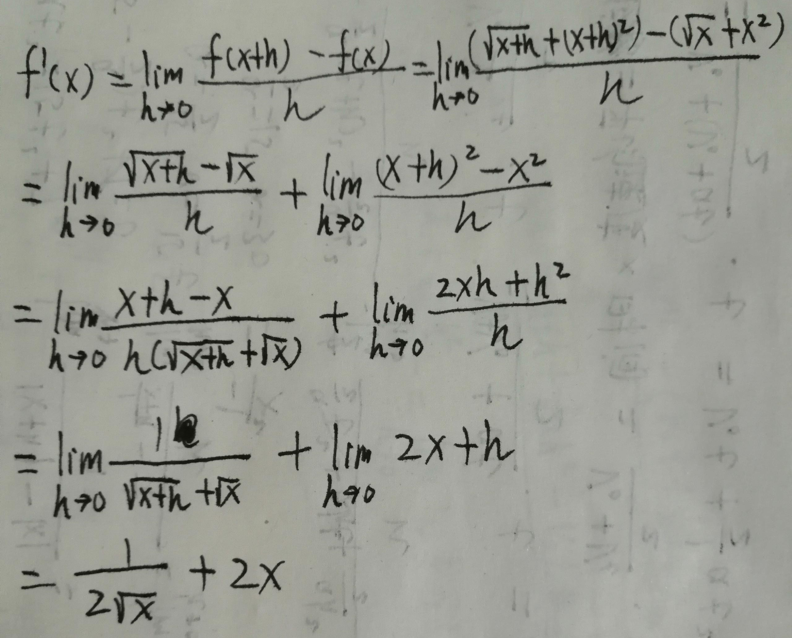
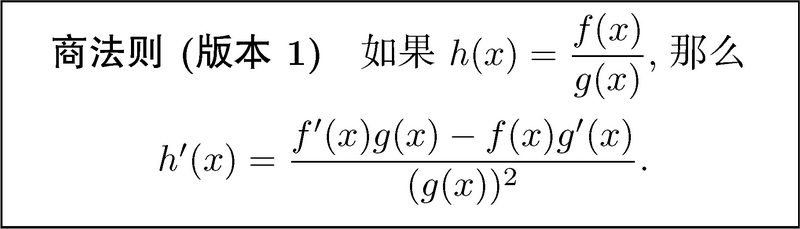

# Basic

<!-- TOC -->

- [Basic](#basic)
    - [使用定义求导](#使用定义求导)
        - [$x^n$ 关于 x 求导](#x^n-关于-x-求导)
    - [用更好的办法求导](#用更好的办法求导)
        - [函数的常数倍](#函数的常数倍)
        - [函数和与函数差](#函数和与函数差)
        - [通过乘积法则求积函数的导数](#通过乘积法则求积函数的导数)
        - [通过商法则求商函数的导数](#通过商法则求商函数的导数)
        - [通过链式求导法则求复合函数的导数](#通过链式求导法则求复合函数的导数)

<!-- /TOC -->

## 使用定义求导 
1. 一例，对 $f(x)=\sqrt{x}+x^2$ 求导
    
2. 从第一行到第二行的过程，将比较复杂的情况分类为两组更简单的情况

### $x^n$ 关于 x 求导
TODO 下面这段莫名其妙的证明

## 用更好的办法求导
### 函数的常数倍
1. 处理一个函数的常数倍很容易：只需在求导后, 用常数乘以该函数的导数就可以了。
2. 从导数的定义上也可以推导出这个结论。之前 y 的变化量是 x 变化量的 k 倍，现在对正割函数乘以常数 C，y 的变化量肯定就是 C*k 了。

### 函数和与函数差
1. 对于 $f(x)$，x 变化 $Δx$ 时，$f(x)$会变为 $f(x) + f'(x)*Δx$。
2. 对于 $g(x)$，x 变化 $Δx$ 时，$g(x)$会变为 $g(x) + g'(x)*Δx$。
3. 所以对于 $h(x) = f(x) + g(x)$，x 变化 $Δx$ 时，$h(x)$会变为 $f(x) + f'(x)*Δx + g(x) + g'(x)*Δx$。
4. $h(x)$ 的变化量为 $f'(x)*Δx + g'(x)*Δx$，对 x 求导的结果为 $f'(x)+g'(x)$
5. 也就是说函数和的导数等于函数导数的和。

### 通过乘积法则求积函数的导数
1. 根据上面函数和求导的推导，对于 $h(x) = f(x) * g(x)$，x 变化 $Δx$ 时，$h(x)$会变为 $(f(x) + f'(x)*Δx) * (g(x) + g'(x)*Δx)$。
2. 展开之后是 $f(x)*g(x) + f(x)*g'(x)*Δx + f'(x)*Δx*g(x) + f'(x)*Δx*g'(x)*Δx$
3. 再减去$f(x) * g(x)$就是$h(x)$的变化量，即$f(x)*g'(x)*Δx + f'(x)*Δx*g(x) + f'(x)*Δx*g'(x)*Δx$
4. 除以 $Δx$ 并求 $Δx->0$是的极限，也就是求 $h(x)$ 关于 x 的导数，结果为 $f(x)*g'(x) + f'(x)*g(x)$
5. 对于3个函数相乘的情况，也是同样的原理，只不过展开的过程更麻烦一些。最终的结果是 $f'(x)g(x)h(x) + f(x)g'(x)h(x) + f(x)g(x)h'(x)$

### 通过商法则求商函数的导数
还是按照上面的方法，得出

### 通过链式求导法则求复合函数的导数
1. $h(x) = f(g(x))$
2. 需要注意的是，函数 $f$ 的自变量不是 $x$ 而是 $g(x)$
3. $x$ 变化 $Δx$ 时，$g(x)$ 的变化量就是 $g'(x)*Δx$。
4. 所以 $f(g(x))$ 的变化量就是 $f'(g(x))*g'(x)*Δx$。所以最后计算出的导数就是 $f'(g(x))g'(x)$。
5. 或者可以正向来推理。函数值的变化率等于导数乘以自变量变化值，所以 $f(g(x))$ 的变化值就是 $f'(g(x))*Δg(x)$
6. 而 $Δg(x)$ 又可以由因变量 $x$ 推出，即 $g'(x)Δx$。
